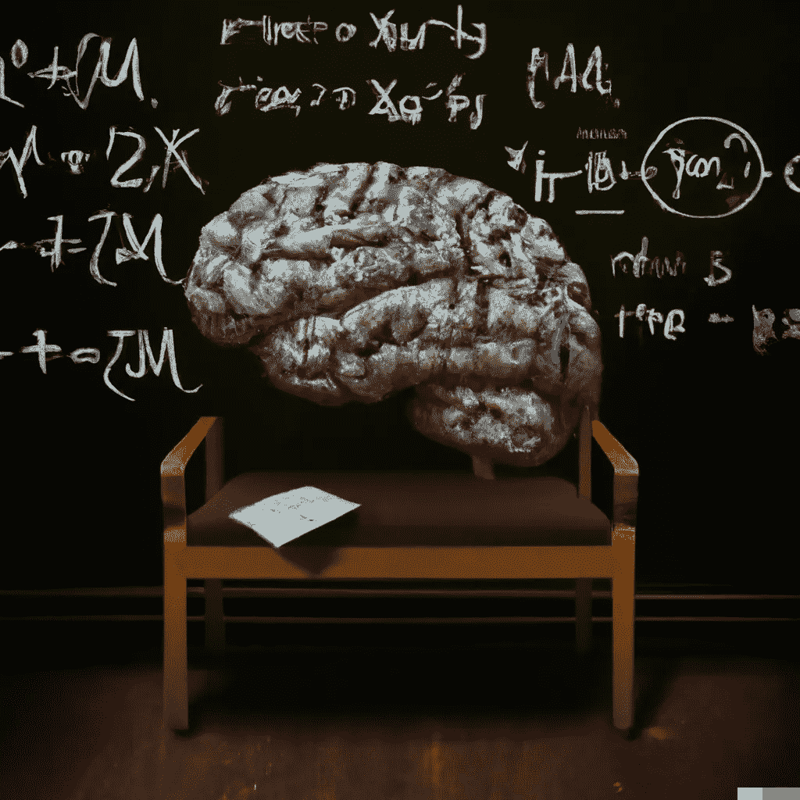
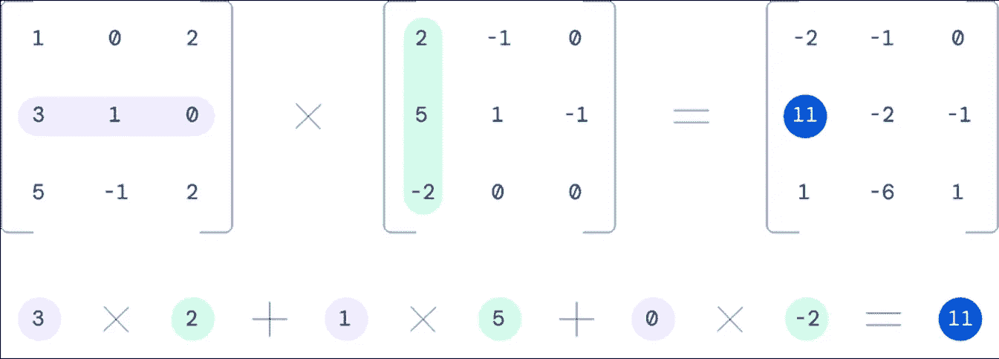
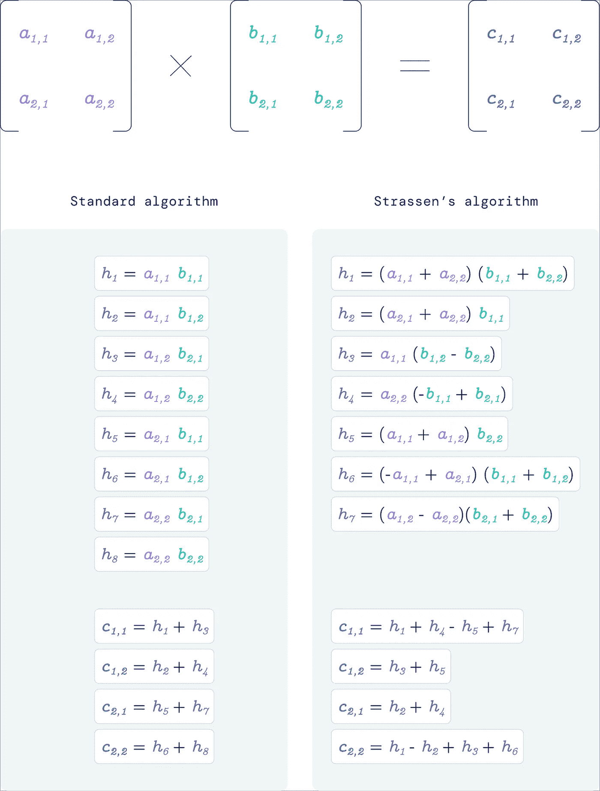
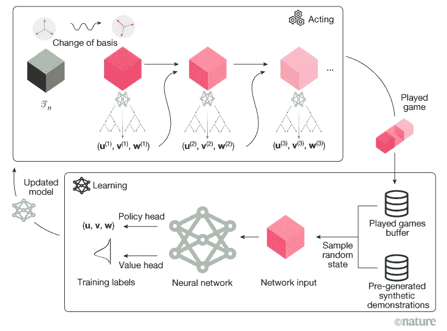
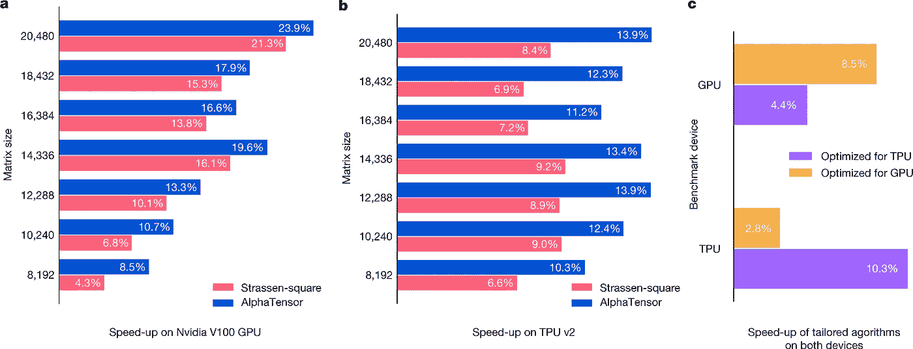
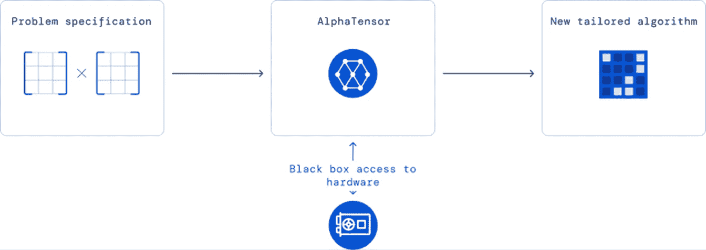

# DeepMind 的 AlphaTensor: Deepmind 的 AlphaTensor:正在重塑数学的人工智能

> 原文：<https://pub.towardsai.net/deepminds-alphatensor-deepmind-s-alphatensor-the-ai-that-is-reinventing-math-4e282e25da35?source=collection_archive---------1----------------------->

## DeepMind 的最新模型如何能彻底改变数学

使用 [OpenAI Dall-E 2](https://openai.com/dall-e-2/) 生成的图像

在没有意识到的情况下，我们的任何活动都以这样或那样的方式涉及矩阵乘法。整个计算都依赖于它们；能够提高效率才是根本。DeepMind(在[用 AlphaFold2](https://towardsdatascience.com/speaking-the-language-of-life-how-alphafold2-and-co-are-changing-biology-97cff7496221) 彻底改变生物学一年后)发表了一篇文章，其中使用强化学习，它设法提高矩阵乘法的效率。在本文中，我们将讨论它是如何以及为什么重要。

**我们仍然在矩阵中挣扎**

unsplash.com 的罗马法师拍摄的图片

自有史以来，算法就是基础。希腊人和埃及人都发明了算法，使他们能够在伟大的工作中取得成功。算法也是现代文明的基础，在没有意识到的情况下，它们支撑着几乎每个知识领域及其应用。

另一方面，发现新的算法也绝非易事(我们在研究算法和数据结构时都吃过苦，但发现新的就更难了)。当今最重要的算法之一是两个矩阵相乘。为什么？

因为实际上所有类型的数据都可以用矩阵来表示。事实上，图像可以表示为矩阵，可以用于求解线性方程，用于图形视频游戏、天气模拟等。此外，大多数人工智能算法可以简化为矩阵乘法(然后由 GPU 有效处理)。

矩阵乘法。图片来源: [DeepMind blogpost](https://www.deepmind.com/blog/discovering-novel-algorithms-with-alphatensor)

[矩阵乘法](https://en.wikipedia.org/wiki/Matrix_multiplication)看起来是一个非常简单的概念，但是考虑到它的重要性，能够稍微提高它的效率将会节省大量的计算。几个世纪以来，数学家们认为已知矩阵乘法是一种有效的方法。1969 年，正如 Volker Strassen 所证明的那样，效率实际上是次优的，这一事实震惊了整个社区。

矩阵乘法:比较两种算法，Strassen 的算法更有效，因为它少用了一个标量乘法。图片来源: [DeepMind 博文](https://www.deepmind.com/blog/discovering-novel-algorithms-with-alphatensor)

现在，少一个标量乘法似乎没什么大不了的。但是如果我们乘以 10 亿个矩阵，我们就节省了 10 亿个标量乘法。问题是 Strassen 的方法只适合两个 2x2 矩阵的乘法。

**deep mind 如何解决问题**

> Strassen 的工作表明，矩阵乘法算法可以通过寻找新的方法来将称为矩阵乘法张量的 3D 数字阵列分解为基本构建块的总和来发现。——[自然评论文章](https://www.nature.com/articles/d41586-022-03023-w)

DeepMind 的研究人员已经把矩阵乘法的问题变成了一种单人游戏(毕竟他们在 [AlphaZero](https://en.wikipedia.org/wiki/AlphaZero) 和 [AlphaGo](https://en.wikipedia.org/wiki/AlphaGo) 之后在该领域特别有经验)。事实上，在这种情况下，棋盘是一个三维张量(张量实际上是一个矩阵，3D 张量是一个 3D 矩阵)，玩家四处移动，试图达到最优解(修改张量并将其条目清零)。如果玩家成功了，他的移动的结果就是正确的矩阵乘法算法(效率是由将张量归零所用的步骤数给出的)。因此，目标是最小化将张量归零的移动(步骤)数量。很聪明，对吧？

图片来源:[此处](https://www.nature.com/articles/s41586-022-05172-4)

研究人员使用强化学习来“玩”。正如文章中所描述的，人们可以将这个系统视为 AlphaZero 的改编版本(其中代理人[的目标是在围棋、象棋和其他游戏](https://www.deepmind.com/research/highlighted-research/alphago)中获胜)。由于这个原因，这个模型被称为 AlphaZero。

这些术语描述的问题听起来很简单，但正如 DeepMind 研究人员所描述的那样，在现实中，有很多潜在的组合:

> 这个游戏具有难以置信的挑战性——要考虑的可能算法的数量远远大于宇宙中的原子数量，即使是矩阵乘法的小例子。与几十年来一直是人工智能挑战的围棋游戏相比，我们游戏中每一步可能的走法数量要多 30 个数量级(我们考虑的一个设置超过 1033 个)。— [DeepMind 博客](https://www.deepmind.com/blog/discovering-novel-algorithms-with-alphatensor)

图片来自 usplash.com 的[菲利克斯·米特迈尔](https://unsplash.com/@felix_mittermeier)

现在，为了成功，作者使用了一种新的架构，结合了特定问题的归纳偏见；他们还使用了合成数据和一些关于问题的信息(对称性)。更具体地说，研究人员使用了基于变压器的架构(使用交叉注意、因果自我注意等。、[这里](https://www.nature.com/articles/s41586-022-05172-4/figures/8)和[这里](https://www.nature.com/articles/s41586-022-05172-4/figures/9)是结构的详细图像)。然后使用[强化学习](https://en.wikipedia.org/wiki/Reinforcement_learning)训练该模型(输入实际上是当前状态和 3D 张量，以及之前的动作。

阿尔法张量的模型结构。图片来源:[原纸](https://www.nature.com/articles/s41586-022-05172-4)

在训练开始时，该模型不了解矩阵相乘的现有算法，但在训练过程中，它会变得更好。有趣的是，AlphaTensor 首先重新发现已知的算法，然后找到未知的算法(实际上超越了人类的直觉)

> 这导致了大矩阵乘法算法的发现，其速度比硬件上常用的算法快 10-20%。— [来源](https://www.nature.com/articles/d41586-022-03023-w)

为 GPU 量身定制的阿尔法张量发现算法的加速。图片来源:[此处](https://www.nature.com/articles/s41586-022-05172-4/figures/5)

另一个有趣的结果是，实际上矩阵乘法算法的空间比以前认为的更丰富。现在，这听起来像是数学术语，但它实际上意味着作者能够根据需要的情况来调整 AlphaTensor 以寻找更有效的算法:即 GPU 或 TPU 是否需要矩阵乘法算法。

图片来源:[此处](https://www.deepmind.com/blog/discovering-novel-algorithms-with-alphatensor)

**离别的思念**

DeepMind 用一条推文宣布了这篇文章的发表，科学界立即进行了炒作。

当然，这个结果本身是不可思议的，因为这是第一次，计算的基本算法之一变得更加有效(他们已经尝试了几个世纪)。此外，这一发现不是由于人类的直觉，而是由于一种算法(你可以在这里看到代码和算法)。

作者声称可以找到更快的算法。所以这只是一个开始，作者希望将研究扩展到其他相关问题，比如不涉及负元素的矩阵分解。

无论如何，这似乎也是一个新时代的开始，数学研究人员将得到算法的帮助。此外，更有效的算法使计算更有效，允许更大的模型，从而处于一种积极的循环中。此外，降低模型的计算成本允许没有最先进的基础设施的其他人使用具有许多参数的模型。

# 如果你觉得有趣:

你可以寻找我的其他文章，你也可以 [**订阅**](https://salvatore-raieli.medium.com/subscribe) 在我发表文章时获得通知，你也可以在**[**LinkedIn**](https://www.linkedin.com/in/salvatore-raieli/)**上连接或联系我。**感谢您的支持！**

**这是我的 GitHub 知识库的链接，我计划在这里收集代码和许多与机器学习、人工智能等相关的资源。**

** [## GitHub - SalvatoreRa/tutorial:关于机器学习、人工智能、数据科学的教程…

### 关于机器学习、人工智能、数据科学的教程，包括数学解释和可重复使用的代码(python…

github.com](https://github.com/SalvatoreRa/tutorial) 

或者随意查看我在 Medium 上的其他文章:

 [## 诺贝尔奖赛博朋克

### 科学发现中人工智能最重要奖项的计算视角

medium.com](https://medium.com/mlearning-ai/nobel-prize-cyberpunk-e1803aa0e087)  [## AlphaFold2 第一年:它改变了世界吗？

### DeepMind 向我们承诺了一场革命，它发生了吗？

towardsdatascience.com](https://towardsdatascience.com/alphafold2-year-1-did-it-change-the-world-499a5a38130a)  [## 说生命的语言:AlphaFold2 和公司如何改变生物学

### 人工智能正在重塑生物学研究，并开辟治疗的新领域

towardsdatascience.com](https://towardsdatascience.com/speaking-the-language-of-life-how-alphafold2-and-co-are-changing-biology-97cff7496221)  [## 对数据集的批判性分析

### 停止微调你的模型:你的模型已经很好了，但不是你的数据

towardsdatascience.com](https://towardsdatascience.com/a-critical-analysis-of-your-dataset-2b388e7ca01e)**