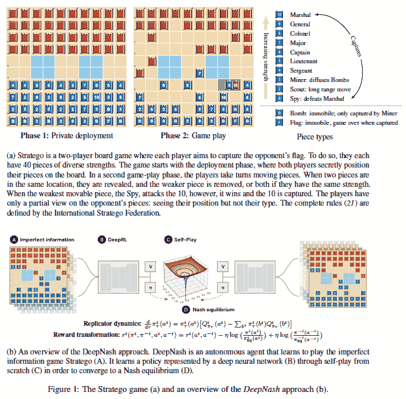
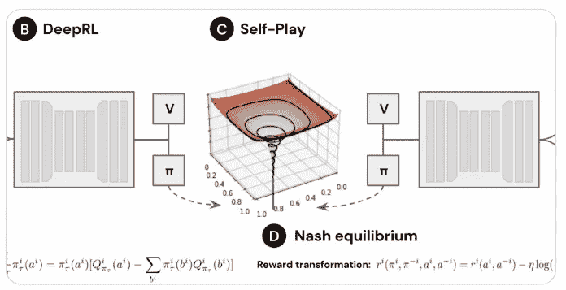

# DeepMind 的 DeepNash 玩游戏“Stratego”

> 原文：<https://pub.towardsai.net/deepminds-deepnash-plays-stratego-3e507e8ca7f6?source=collection_archive---------0----------------------->

## DeepMind 在 12 月初引起了轰动:DeepNash，一个玩游戏的人工智能

演职员表:[SAHMReviewws.com](http://www.sahmreviews.com/2017/09/playmonster-stratego.html)

在上周 Meta 的 CICERO AI 在策略游戏 Diplomacy 中表现出色的消息传出后，DeepMind 宣布他们的 AI 打来电话，DeepNash 在 Stratego 游戏中表现出色。这一点特别有趣，因为西塞罗在玩游戏时学会了与其他玩家“谈判”，而 DeepNash 可以理解不完美信息。鉴于这些人工智能在不完美世界中的进展，人们可以谨慎地得出结论，这一消息为现实世界的应用奠定了重要的基础。

> 那么我最终能从机器人聊天中得到答案吗？

 [## 谈判的艺术:西塞罗·艾

### 西塞罗·艾在外交的游戏中比人类更能谈判。就像深蓝代表国际象棋，五号代表…

pub.towardsai.net](/the-art-of-negotiation-cicero-ai-6e04354fe990) 

## 什么是 Stratego？

Stratego 是由 Jacques Johan Mogendorff 在荷兰开发的双人战略棋盘游戏。游戏的目标是找到并夺取你对手的旗帜，或者夺取如此多的棋子以至于你的对手不能再移动。玩家每人控制 40 个代表军队中各个军官级别的棋子。这个游戏包含战术、冒险和运气的元素。

【https://arxiv.org/pdf/2206.15378.pdf】来源:

## *有什么大不了的？*

*Stratego 每片 40 片起。但是，对手看不出哪个棋子是什么。想象下象棋，但是不知道对手的棋子。这是一个额外的复杂性的例子，对手有不完善的信息。这个游戏的可能性非常复杂。就规模而言，Stratego 可以考虑 10⁶⁶的可能性，而德克萨斯 Holdem 只能考虑 10⁶。*

## *什么是 DeepNash？*

*DeepNash 是由英国伦敦 DeepMind Technologies 的 Julien Perolat 及其团队开发的一种算法。科学出版物:“通过无模型多智能体强化学习掌握 Stratego 游戏”[https://www.science.org/doi/10.1126/science.add4679](https://www.science.org/doi/10.1126/science.add4679)。DeepNash 这个名字是向数学家小约翰·福布斯·纳什致敬，约翰发展了博弈论中的纳什均衡。博弈论中的纳什均衡是**一种**情况，在这种情况下，考虑到对手的策略后，参与者将继续他们选择的策略，没有动机偏离它。从决策的角度来看，这是一种均衡状态。*

**

**来源:*[*【https://arxiv.org/pdf/2206.15378.pdf】*](https://arxiv.org/pdf/2206.15378.pdf)*

*纳什均衡的现代概念是参与者/利益相关者在可能的纯策略上选择一个概率分布。策略的纯度可以从 100%到零。人们可能将 100%的概率放在一个纯策略上，或者将 100%的概率分布在多个策略上，这也被称为混合策略。纳什提出了这种均衡的数学证明，在这种均衡中，没有任何利益相关者可以通过单方面挑战战略而做得更好。*

## *对现实世界意味着什么？*

*现实世界是混乱的，现实世界不会投射真实的数据。意图、动机和议程往往难以理解。即使信息可用，人类的反应/行为也存在额外的不确定性。人类对同样的刺激不会有完全相同的反应。能够驾驭现实生活中我们周围的不确定性，并且仍然能够做出持续更好的决定，是“规定性”人工智能的重要组成部分。想象一下，如果我们能够在一个提高自动驾驶能力的人工智能系统中，解决繁忙高速公路上所有司机的不确定性。*

*限制*

*目前，这些人工智能实验是在非常有限的实验室环境中进行的。Stratego 的游戏有 10⁶⁶可计算的可能性，但生活目前在一个给定的实例中抛出了不可量化的可能性。人工智能能够驾驶它吗？这种模式有可能吗？如果每个人都得到 AI 的最佳建议，谁赢谁输？AI 的发展是一项伟大的运动，受限于人类自身。*

*支持我🔔 ***鼓掌*** | ***跟随|*** [***订阅***](https://ithinkbot.com/subscribe)***|***[***成为会员***](https://ithinkbot.com/membership) **🔔***

*检查我的其他作品—*

* [## 谈判的艺术:西塞罗·艾

### 西塞罗·艾在外交的游戏中比人类更能谈判。就像深蓝代表国际象棋，五号代表…

pub.towardsai.net](/the-art-of-negotiation-cicero-ai-6e04354fe990)  [## 玩概率

### 你是自己最好的朋友，也是最坏的敌人。结果偏差，一种认知偏差，会导致人们做出糟糕的决定

ithinkbot.com](https://ithinkbot.com/play-the-probability-4c0ed971aa41)  [## 世界上最贵的药物 350 万美元！

### 药品 Hemgenix 归 CSL Behring 所有。这是治疗 b 型血友病的一剂良药，治疗费用为 3.5 美元…

ithinkbot.com](https://ithinkbot.com/worlds-most-expensive-drug-3-5-million-1e46b5abf74f)  [## 人工智能中的领导力:你的领导力适合数据科学吗？

### 可能已经转变为数据科学领导的非技术人员领导通常不熟悉…

pub.towardsai.net](/leadership-in-ai-is-your-leadership-fit-for-datascience-d0e9296be2d6)  [## 什么是 GPT-4(什么时候？)

### GPT-4 是一个自然语言处理模型，由 openAI 作为 GPT-3 的继承者开发

pub.towardsai.net](/what-is-gpt-4-and-when-9f5073f25a6d)*