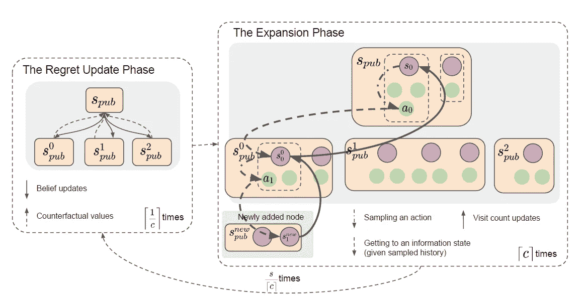
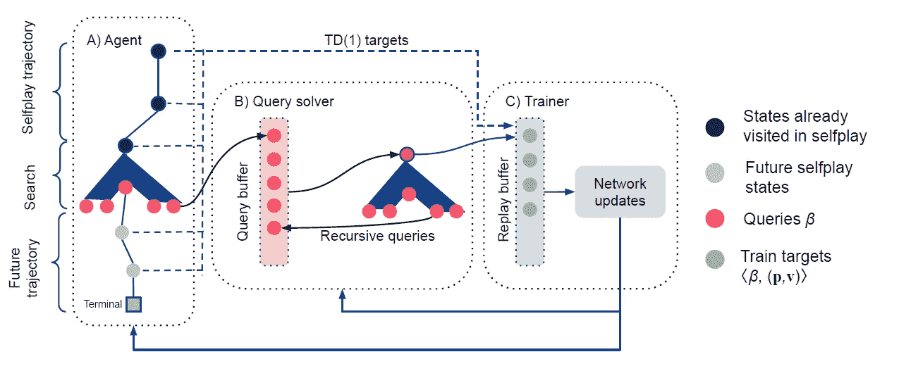

# DeepMind 的新算法能够掌握完美和不完美的信息游戏

> 原文：<https://pub.towardsai.net/deepminds-new-algorithm-is-able-to-master-perfect-and-imperfect-information-games-1872396ad9b2?source=collection_archive---------1----------------------->

## [深度学习](https://towardsai.net/p/category/machine-learning/deep-learning)

## 《游戏玩家》结合了几种深度学习技术，在完美和不完美的信息游戏中都实现了超人的表现。

来源:[https://data phoenix . info/deep mind-claims-the-player-of-games-is-the-first-ai-system-can-play-poker-chess-go-etc/](https://dataphoenix.info/deepmind-claims-that-player-of-games-is-the-first-ai-system-that-can-play-poker-chess-go-etc/)

游戏一直是过去几年深度学习复兴的中心领域之一。考虑到为了模仿真实世界的场景，游戏是相对容易复制的环境，这并不特别令人惊讶。尽管游戏的 ML 有所进步，但它一直专注于完美或不完美的信息游戏，但从未同时专注于两者。精通国际象棋和围棋的模型与扑克等不完美的游戏作斗争。甚至像 AlphaZero 这样学会同时玩多种游戏的模型也受到完美信息环境的限制。这样做的原因显然是基于两种类型的游戏环境的内在动力。像国际象棋和扑克这样的完美信息游戏非常适合像自我游戏学习和问题空间树搜索这样的 ML 技术，而像扑克这样的不完美信息游戏依赖于游戏推理技术。几周前，DeepMind 提出了一种能够掌握完美和不完美信息游戏的神经网络，挑战了这种传统方法。

游戏玩家(PoG)是一种算法，它结合了几种技术，以便在完美和不完美的信息环境中实现最先进的性能。毫不奇怪，PoG 利用了在完美信息环境下工作良好的自我游戏学习和搜索等技术，以及在不完美信息环境下工作良好的博弈论推理。本质上，PoG 能够将一个游戏分解成小的子游戏，这些子游戏能够以保持较大游戏的纳什均衡的方式来解决。

# 该算法

PoG 的核心组件是一种算法，它能够迭代计算最佳游戏策略，而不需要大量计算资源。该算法本身是基于反事实后悔最小化(CFR)，这是一种在不完美信息环境中流行的技术。在高层次上，CFR 关注于以最小化长期平均遗憾的方式定期计算每个玩家的策略。

PoG 扩展了 CFR 的传统思想，以适应完美和不完美的信息环境。PoG 的算法基于几个基本组件:

## CVPN

反事实价值和政策网络(CVPN)是一种神经网络，它计算游戏中每个国家信念的反事实。这是在任何给定时间评估游戏不同版本的关键。

## GT-CFT

成长树 CFR(GT-CFR)是 CFR 的一个变种，它是为游戏树而优化的，游戏树随着时间的推移而成长。GT-CFR 基于两个基本阶段:

**一、后悔更新阶段:**该阶段针对博弈树的不同部分运行多个 CFR 算法。在任何给定的时间，该阶段使用 CVPN 网络来计算信念反事实，并将它们传递到扩展阶段。

**二世。扩展阶段:**这个阶段从游戏树的根到叶子运行模拟，给游戏树添加新的状态。

图片来源:DeepMind

## 数据生成

PoG 使用一种基于称为声音自播放的自播放的数据生成算法。该算法在每个决策点运行 GT-CFR 搜索，并产生潜在的动作和历史。该数据用于训练 CVPN 网络。

## 培训过程

PoG 的一个关键组成部分是一个用于更新 CVPN 的巧妙培训流程。这个过程由许多使用声音自播放算法生成数据的并发参与者执行。数据由在分布式网络中运行的训练者收集，并定期重新训练 CVPN。

图片来源:DeepMind

# 结果呢

DeepMind 在完美和不完美的信息游戏中针对不同的基准对 PoG 进行了评估。该模型在国际象棋或围棋等完美游戏以及扑克或苏格兰场等不完美游戏中实现了超人的表现。除了在游戏中的应用，PoG 还在构建 ML 模型方面迈出了一大步，这些模型可以适应现实世界的领域，如天气预报或结合完美和不完美信息的能源优化。我们应该期待 PoG 成为 ML 游戏研究下一波浪潮中的开创性算法。