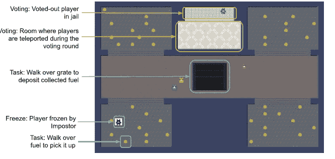
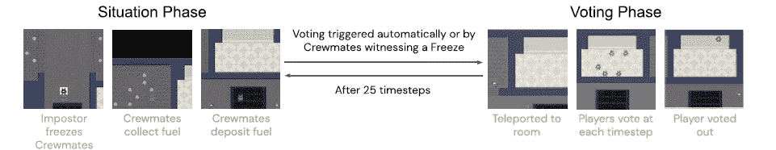

# DeepMind 改进多智能体模型合作的新游戏

> 原文：<https://pub.towardsai.net/deepminds-new-game-to-improve-cooperation-in-multi-agent-models-f4253bc2e376?source=collection_archive---------0----------------------->

## [人工智能](https://towardsai.net/p/category/artificial-intelligence)

## 隐藏议程是一个社会行为游戏，优化了强化学习模型中的合作行为。

图片来源:DeepMind

> 我最近创办了一份专注于人工智能的教育时事通讯，已经有超过 10 万名订户。《序列》是一份无废话(意思是没有炒作，没有新闻等)的 ML 导向时事通讯，需要 5 分钟阅读。目标是让你与机器学习项目、研究论文和概念保持同步。请通过订阅以下内容来尝试一下:

 [## 序列|子堆栈

### 订阅人工智能世界中最相关的项目和研究论文。受到 110，000+的信任…

thesequence.substack.com](https://thesequence.substack.com/) 

在多智能体模型中，合作是最难解决的问题之一，比如那些由强化学习技术驱动的模型。多智能体中有效的合作动态有两个主要方面:

*1)*

*2)* *与哪些代理商合作合适？*

虽然有许多定量技术可用于解决第一点，但第二点仍未得到充分探索。最近，来自 DeepMind 和哈佛大学[的研究人员发表了一篇论文，提出了隐藏议程](https://arxiv.org/abs/2201.01816)，这是一个 2D 社会演绎游戏，旨在改善多智能体模型中的合作动态。

多智能体模型中的合作挑战是非常复杂的，因为它取决于合作机制中每个智能体的机制。不同的 ML 代理可以共享目标，但是通常具有冲突的目标，这些目标对于环境是不可见的，因此难以量化。当在不完善的信息环境中运作时，这一挑战甚至更加突出。社会演绎游戏已经成为在不确定条件下模拟合作的流行机制。一个社交推演游戏的本质是帮助玩家推演对方隐藏的目标。

隐藏议程是一个基于两个基本群体的多个玩家的社会演绎游戏:

*一、* ***船员:*** *具有数量优势的队伍。他们的目标是使用分散在环境中的能源燃料电池为他们的飞船补充燃料。*

*二。* ***冒名顶替者:*** *具有信息优势的团队。他们的目标是通过短距离冷冻光束来阻止船员实现他们的目标。*

游戏被组织成包含能量燃料电池的房间和可以存放这些电池的中央房间。隐藏议程分为两个阶段:

*a)* ***情境阶段:*** *在此阶段，智能体可以在环境中移动收集燃料电池。*

*b)*

图片来源:DeepMind

图片来源:DeepMind

通过观察其余群体的投票，代理可以开始调整他们的合作行为。对于训练和评估，DeepMind 使用了标准的异步优势行动者-批评家(A3C)架构。该架构基于两层 CNN，之后是基于 MLP 模型的前馈网络。MLP 的输出被传递到 LSTM 层。此外，该架构还包括一个用于评估代理所使用的正确策略的层。

图片来源:DeepMind

隐藏议程是一个非常有趣的游戏环境，可以在多智能体模型中实现合作行为。根据定义，隐藏议程包括使用隐藏的动机(投票)和需要将该信息纳入代理的政策。我们应该看到隐藏议程已经成为 DeepMind 训练多智能体强化学习模型的重要组成部分。