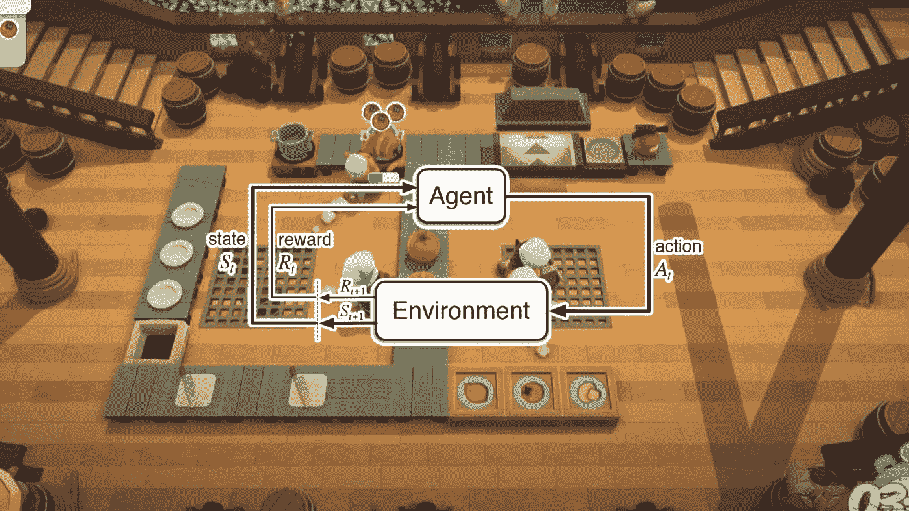
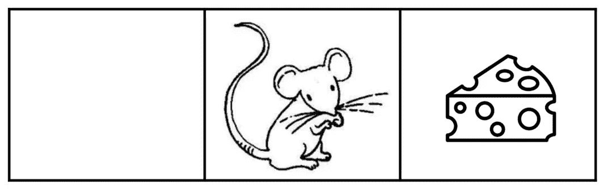
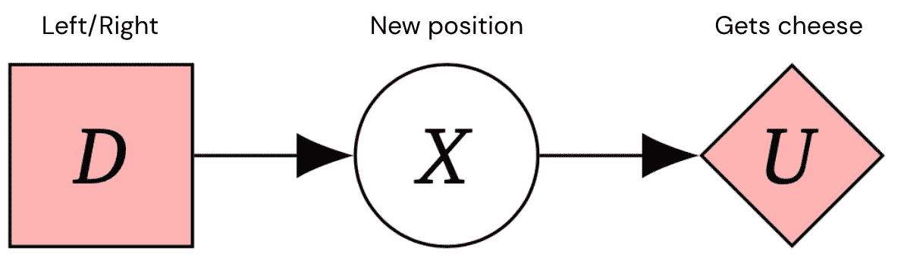
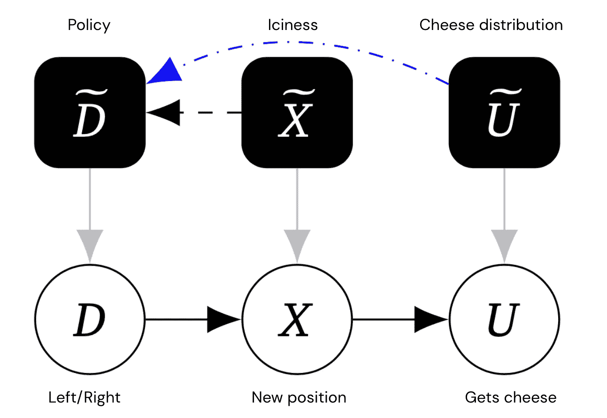
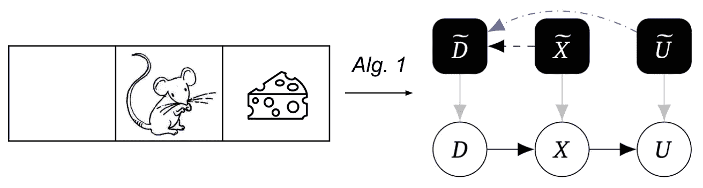
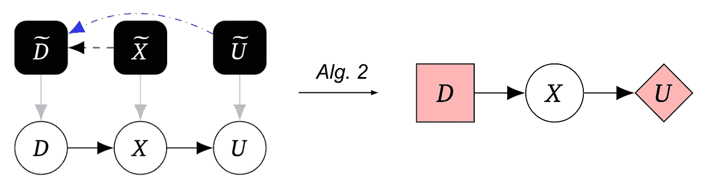

# DeepMind 发现系统中何时存在代理的新方法

> 原文：<https://pub.towardsai.net/deepminds-new-method-for-discovering-when-an-agent-is-present-in-a-system-38032c9f046d?source=collection_archive---------3----------------------->

## 该论文提出了第一种方法，用于在仅基于经验数据的系统中发现 AI 代理。

图片来源:TechTalks

> 我最近创办了一份专注于人工智能的教育时事通讯，已经有超过 125，000 名订户。《序列》是一份无废话(意思是没有炒作，没有新闻等)的 ML 导向时事通讯，需要 5 分钟阅读。目标是让你与机器学习项目、研究论文和概念保持同步。请通过订阅以下内容来尝试一下:

 [## 序列

### 与机器学习、人工智能和数据发展保持同步的最佳资源…

thesequence.substack.com](https://thesequence.substack.com/) 

在之前的一篇博文中，我探讨了代理和模型之间的区别，不幸的是，这两个术语在机器学习中可以互换使用。在那篇文章中，我概述了代理是一组模型的想法，它们主动地与环境交互并相应地修改它们的策略。根据这个定义，智能体建模中最重要的挑战之一是理解它们对生态相互作用的行为敏感性。最近， [DeepMind 发表了一篇新论文](https://arxiv.org/abs/2208.08345)提出了一个形式化的框架，量化了一个代理的代理或者代理的行为和来自环境的反馈之间的关系。

DeepMind 的工作核心是基于[因果影响图(CIDs)](https://deepmindsafetyresearch.medium.com/progress-on-causal-influence-diagrams-a7a32180b0d1#b09d) ，这是一个典型的决策问题框架。在这个特定的场景中，cid 被用来模拟一个代理的行为和推理其动机。DeepMind 的论文为将休闲模型转化为 cid 提供了一个清晰的框架。使用该框架，DeepMind 还提出了一种算法，能够通过查看经验数据来检测系统中代理的存在。

让我们以一个游戏为例，在这个游戏中，一只老鼠试图通过向左或向右移动来获得一些奶酪。“地板”是冰冷的，所以老鼠可能会在追逐奶酪时睡觉，这可能会改变它的政策。可以使用以下 CID 来表示交互:

图片来源:DeepMind

图片来源:DeepMind

类似地，基于冰或奶酪的存在而改变小鼠行为的与环境的相互作用可以使用以下因果图来捕捉，其中边表示因果推断，蓝色边是末端边:

图片来源:DeepMind

# 发现代理

到目前为止，我们所看到的都是建模技术来表示 AI 代理中的因果关系和激励。DeepMind 论文的真正贡献是结合了三种算法，能够从因果实验中发现代理。

1.  **机械化因果图发现:**该算法将介入数据集作为输入，并产生机械化因果图。

图片来源:DeepMind

2) **代理识别:该**算法以机械化因果图为输入，生成相应的 CID 图。

图片来源:DeepMind

3) **机制识别:**该算法取 CID 激励图，产生机械化图，包括所有影响和终端边。

图片来源:DeepMind

下图说明了三种算法之间关于介入分布 I、其相关博弈图 G 和因果对象机械化因果图 c 的关系

总之，这三种算法能够仅基于介入数据发现系统中的药剂。这个概念上微不足道的发现可能对人工智能系统的安全技术产生深远的影响。DeepMind 方法允许对人工智能代理如何适应环境变化的行为进行更有效的建模，这有利于创建更好的训练练习并提高人工智能代理的安全性。