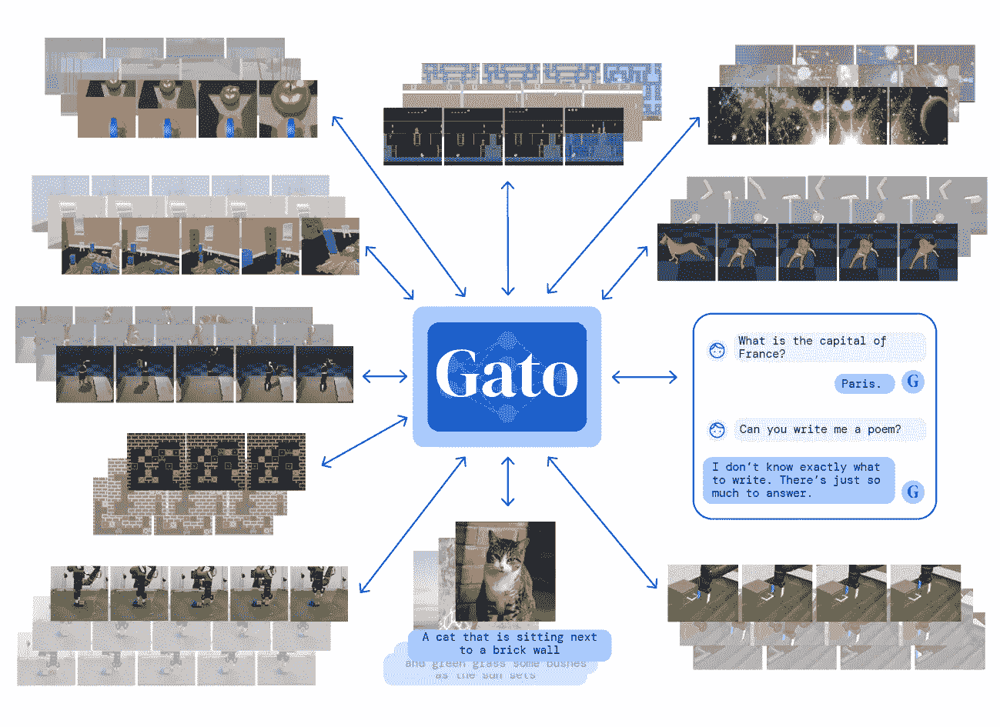
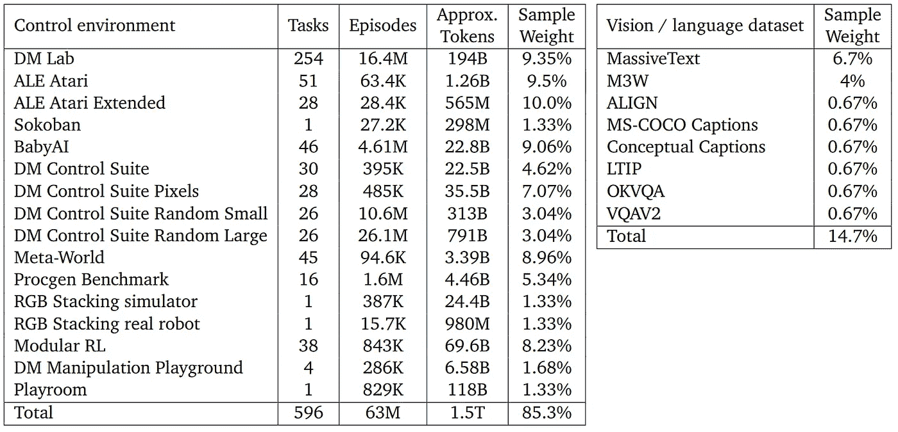
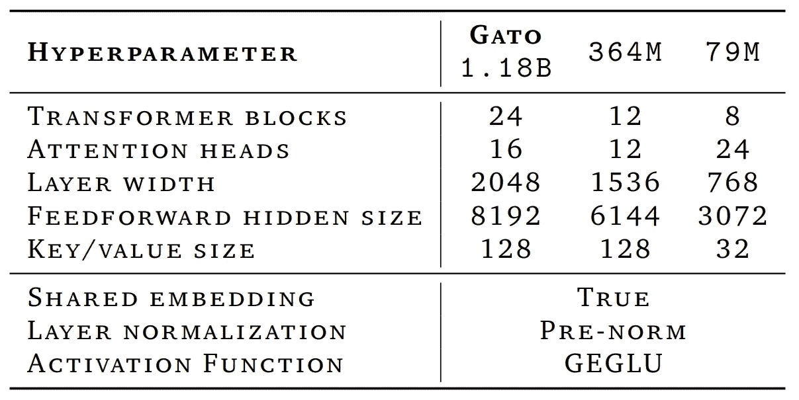
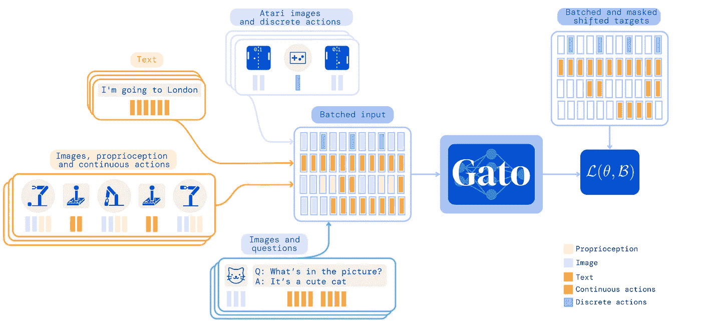
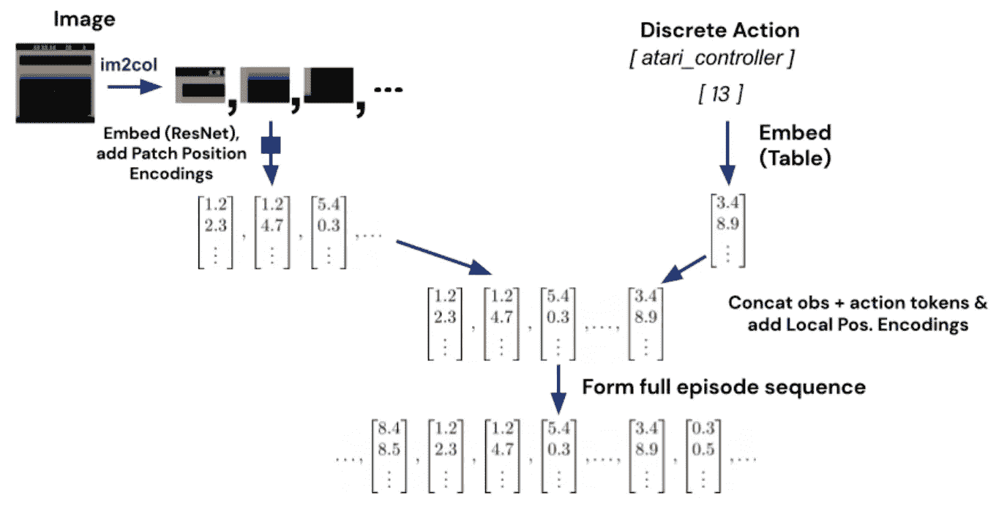
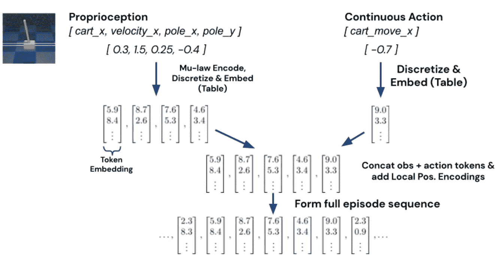
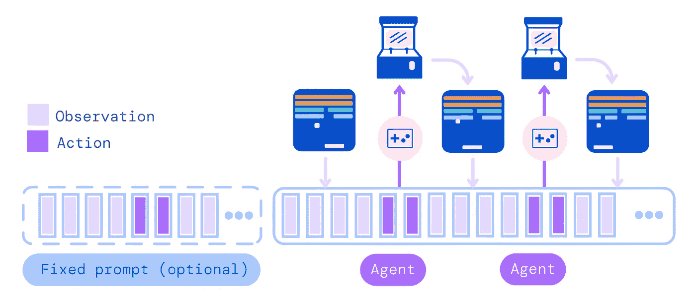

# Deepmind 的新模型加托太棒了！

> 原文：<https://pub.towardsai.net/deepminds-new-model-gato-is-amazing-57cc8ea48772?source=collection_archive---------0----------------------->

> 最初发表于 [louisbouchard.ai，](https://www.louisbouchard.ai/deepmind-gato/)两天前在[我的博客](https://www.louisbouchard.ai/deepmind-gato/)上读到了它！

图片来自 [Deepmind 的论文](https://storage.googleapis.com/deepmind-media/A%20Generalist%20Agent/Generalist%20Agent.pdf)。

## 看视频！

DeepMind 的加托刚刚出版！它是一个单一的变压器，可以玩雅达利游戏，字幕图像，与人聊天，控制一个真正的机械臂，等等！事实上，它只需接受一次训练，并使用相同的重量来完成所有这些任务。根据 Deepmind 的说法，这不仅是一个变形人，也是一个代理人。这就是当你把变形金刚和多任务强化学习代理的进程混合在一起时会发生的事情。

正如我们所说，加托是一个多模态代理。这意味着它可以为图像创建标题，或者像聊天机器人一样回答问题。你会说 GPT-3 已经可以做到这一点，但加托可以做得更多……多模态来自于这样一个事实，即加托也可以在人类层面上玩雅达利游戏，甚至可以做真实世界的任务，如控制机械臂精确移动物体。它理解文字，图像，甚至物理。

多面手特工。图片来自 [Deepmind 的论文](https://storage.googleapis.com/deepmind-media/A%20Generalist%20Agent/Generalist%20Agent.pdf)。

加托是第一个在这么多不同任务上表现如此出色的多面手型号，它在该领域非常有前途。它接受了 604 项不同任务的训练，这些任务具有不同的模式、观察和行动规范，使它成为完美的多面手。

用于训练代理的数据集。图片来自 [Deepmind 的论文](https://storage.googleapis.com/deepmind-media/A%20Generalist%20Agent/Generalist%20Agent.pdf)。

正如我所说，它使用相同的网络和权重完成所有这些工作(在你提问之前，它只需要 12 亿个参数，而 GPT-3 需要 1750 亿个参数！).这不是一个陷阱，你必须为所有任务重新训练或微调它。

加托的建筑。图片来自 [Deepmind 的论文](https://storage.googleapis.com/deepmind-media/A%20Generalist%20Agent/Generalist%20Agent.pdf)。

你可以同时发送图片和文本，这样就可以了。你甚至可以添加一些机器人手臂的动作！该模型可以基于其上下文来决定提供哪种类型的输出，从文本到环境中的离散动作。

加托的训练阶段。图片来自 [Deepmind 的论文](https://storage.googleapis.com/deepmind-media/A%20Generalist%20Agent/Generalist%20Agent.pdf)。

这是可能的，因为它们的标记化过程。标记化是指为模型准备输入，因为它们本身不理解文本或图像。语言模型和加托研究了子词的总数，例如 32000，每个词都有一个数字。

对于图像，它们遵循使用广泛使用的 ResNet 块的 ViT 补丁嵌入，正如我们在之前的视频中所述。对于 Atari 游戏，我们还将按键标记为整数或离散值。

图像和离散动作符号化过程。图片来自 [Deepmind 的论文](https://storage.googleapis.com/deepmind-media/A%20Generalist%20Agent/Generalist%20Agent.pdf)。

最后，对于像我们谈到的机器人手臂的本体感受输入这样的连续值，他们将不同的跟踪指标编码成浮点数，并将它们添加到文本标记之后。

本体感受和连续动作标记化过程。图片来自 [Deepmind 的论文](https://storage.googleapis.com/deepmind-media/A%20Generalist%20Agent/Generalist%20Agent.pdf)。

使用所有这些不同的输入，代理适应当前任务以生成适当的输出。在训练过程中，他们使用 GPT-3 中的即时条件反射，利用先前采样的动作和观察。

运行加托作为控制策略。图片来自 [Deepmind 的论文](https://storage.googleapis.com/deepmind-media/A%20Generalist%20Agent/Generalist%20Agent.pdf)。

过去几年里，通才 RL 特工的进步令人难以置信，主要来自 Deepmind。人们可以说，他们正在向人工智能(AGI)或人类智能(如果我们最终可以定义它的话)靠拢。我喜欢他们在论文中给出的许多细节。我很高兴看到他们会做什么，或者其他人会做什么，使用这个模型的架构！

关于这个模型的更多信息的链接在描述中。

我希望你喜欢这篇短文。我刚睡醒就看到了这条新闻，不得不在一天中做其他事情之前先报道它。这太令人兴奋了！

下周我会带着另一篇精彩的论文来看你！

## 参考

观看视频:[https://youtu.be/xZKSWNv6Esc](https://youtu.be/xZKSWNv6Esc)
deep mind 的博文:[https://www.deepmind.com/publications/a-generalist-agent](https://www.deepmind.com/publications/a-generalist-agent)
Paper，Reed S .等人，2022，Deemind:加托。[https://storage . Google APIs . com/deep mind-media/A % 20 general ist % 20 agent/generalit ist % 20 agent . pdf](https://storage.googleapis.com/deepmind-media/A%20Generalist%20Agent/Generalist%20Agent.pdf)
我的简讯(一个新的人工智能应用，每周向您的电子邮件解释！):[https://www.louisbouchard.ai/newsletter/](https://www.louisbouchard.ai/newsletter/)