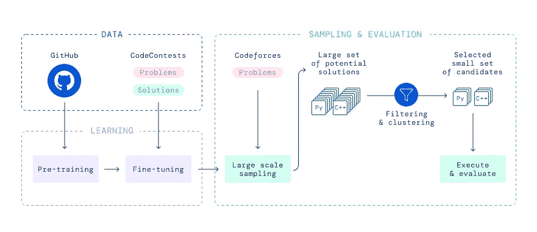
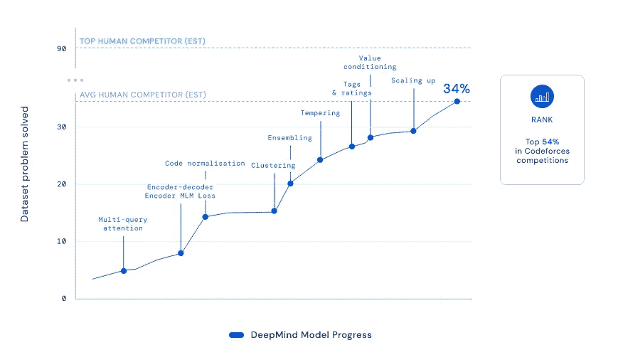
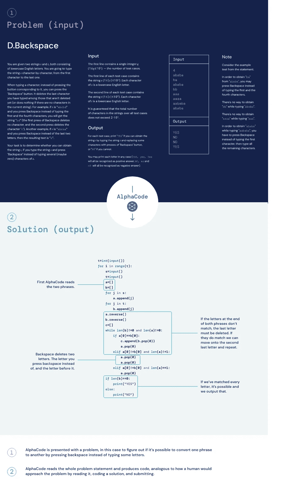

# DeepMind 的新超级模型:AlphaCode 可以生成竞技级别的编程代码

> 原文：<https://pub.towardsai.net/deepminds-new-super-model-alphacode-can-generate-programming-code-at-competitive-level-7cd38e87bfe?source=collection_archive---------0----------------------->

## [编程](https://towardsai.net/p/category/programming)

## 新模型能够生成代码来解决编程竞赛中难以置信的复杂问题。

来源:[https://neuro hive . io/en/state-of-art/alpha code-code-generation-model-as-described-by-deep mind/](https://neurohive.io/en/state-of-the-art/alphacode-code-generation-model-as-described-by-deepmind/)

几周前，OpenAI 通过推出 Codex 震惊了人工智能世界，Codex 是一种可以基于自然语言指令生成编程代码的模型。许多专家认为，在特别具有挑战性和难以捉摸的代码生成领域，Codex 是一个异常的例子。嗯，上周 DeepMind 跟随 OpenAI 的脚步，宣布了 [AlphaCode](https://storage.googleapis.com/deepmind-media/AlphaCode/competition_level_code_generation_with_alphacode.pdf) ，这是一个可以在编程竞赛级别生成代码的变形金刚模型。

竞争性编程是基于 ML 的代码生成的最大挑战之一。编程竞赛中的问题不仅需要很强的语言解释和常识推理能力，还需要几个小时来实现。并不像生成代码片段那么简单。显然，当前一代的 ML 系统远未展现出常识性推理，但是通过简单的过滤和采样，大型神经网络在不同的代码生成方面表现出色。从这个意义上说，DeepMind 决定利用大型变形金刚模型作为 AlphaCode 的基础。

遵循 transformer 模型的预训练和微调的一般工作流程，AlphaCode 在 GitHub 知识库的大数据集中进行训练，在竞争性编程问题的小数据集中进行微调。在评估阶段，AlphaCode 会生成大量的 C++和 Python 程序。这些方案经过筛选和重新排序，形成一小组候选方案，提交评估。这个过程模拟了传统编程竞赛中的调试和测试评估。

图片来源:DeepMind

DeepMind 利用流行的 Codeforces 网站的编程竞赛对 AlphaCode 进行了微调。这是一个几年前还不存在的数据集，它为基于 ML 的代码生成打开了一扇新的大门。通过严格的测试和微调过程(如下图所示)，AlphaCode 最终能够超过普通人类程序员的分数，尽管它的分数仍然低于不同竞赛的获胜者。

图片来源:DeepMind

AlphaCode 取得的进展令人难以置信，并展示了大型 transformer 模型自动化复杂编程任务的潜力。为了更好地理解这一点，请看下面由 AlphaCode 生成的挑战和解决方案。复杂程度令人吃惊。就像 AlphaGo 和 AlphaFold 这样的前辈一样，我们应该期待 DeepMind 在不久的将来会在 AlpahCode 上翻倍。

图片来源:DeepMind