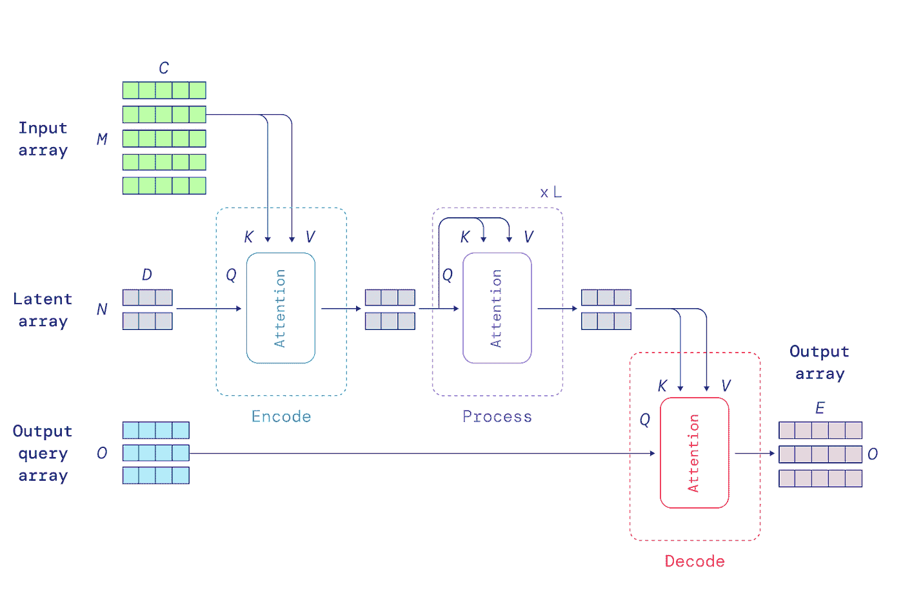

# DeepMind 的新超级模型:感知者 IO 是一个可以处理任何数据集的转换器

> 原文：<https://pub.towardsai.net/deepminds-new-super-model-perceiver-io-is-a-transformer-that-can-handle-any-dataset-dfcffa85fe61?source=collection_archive---------0----------------------->

## [人工智能](https://towardsai.net/p/category/artificial-intelligence)

## 新的基于 transformer 的架构可以使用单一模型处理音频、视频和图像。

来源:[https://www . zdnet . com/article/Google s-super model-deep mind-epider-is-a-step-on-a-ai-machine-that-can-process-everything/](https://www.zdnet.com/article/googles-supermodel-deepmind-perceiver-is-a-step-on-the-road-to-an-ai-machine-that-could-process-everything/)

> 我最近创办了一份专注于人工智能的教育时事通讯，已经有超过 10 万名订户。《序列》是一份无废话(意思是没有炒作，没有新闻等)的 ML 导向时事通讯，需要 5 分钟阅读。目标是让你与机器学习项目、研究论文和概念保持同步。请通过订阅以下内容来尝试一下:

 [## 序列

### 订阅人工智能世界中最相关的项目和研究论文。受到 85，000 多人的信任…

thesequence.substack.com](https://thesequence.substack.com/) 

我们目前构建的大多数深度学习模型都是针对特定类型的数据集进行了高度优化的。擅长处理文本数据的架构不能应用于计算机视觉或音频分析。这种专业化水平自然会影响模型的创建，这些模型在给定的任务中高度专业化，而不能适应其他任务。这种限制与人类认知形成强烈对比，在人类认知中，许多任务需要不同的输入，如视觉和听觉。最近，DeepMind 发表了两篇论文，揭示了可以处理不同类型的输入数据集的通用架构。

第一篇论文名为[“感知者:迭代注意力的一般感知”](https://arxiv.org/abs/2103.03206)介绍了感知者，一种转换器架构，可以处理包括图像、点云、音频、视频及其组合在内的数据，但仅限于分类等简单任务。在[“感知者 IO:结构化输入&输出的通用架构”](https://arxiv.org/abs/2107.14795)中，DeepMind 展示了感知者 IO，这是一个更通用的感知者模型版本，可以应用于复杂的多模态任务，如计算机游戏。

两种感知模型都基于变压器架构。尽管它在像 Google BERT 或 OpenAI GPT-3 这样的模型上取得了成功，但大多数 transformer 模型在输入最多几千个元素的场景中最为有效。图像、视频或书籍等数据类型可能包含数百万个元素，这使得使用转换器有点困难。为了解决这个问题，感知者依赖于一般的注意力层，它不对输入做出任何特定领域的假设。具体地，感知者注意力模型首先将输入编码成较小的潜在阵列，其处理成本与输入的大小无关。这允许感知者模型随着输入适度地缩放。

图片来源:DeepMind

除了可伸缩性优势之外，以前的架构允许感知者模型使用不同的数据集实现健壮的概括水平。请参见下面重建视频和音频输入的示例。

以下是原视频。

视频鸣谢:DeepMind

这是感知者产生的结果。

视频鸣谢:DeepMind

超级印象深刻！感知者是首批能够处理不同输入类型的大规模架构之一。在未来的研究中，我们很可能会看到 DeepMind 在这个概念上加倍努力。

在过去几年的深度学习中，变压器架构一直是最相关的里程碑的前沿和中心。变形金刚主要应用于谷歌 BERT 或 OpenAI GPT-3 等模型的自然语言场景，在计算机视觉等其他领域也取得了稳步进展。