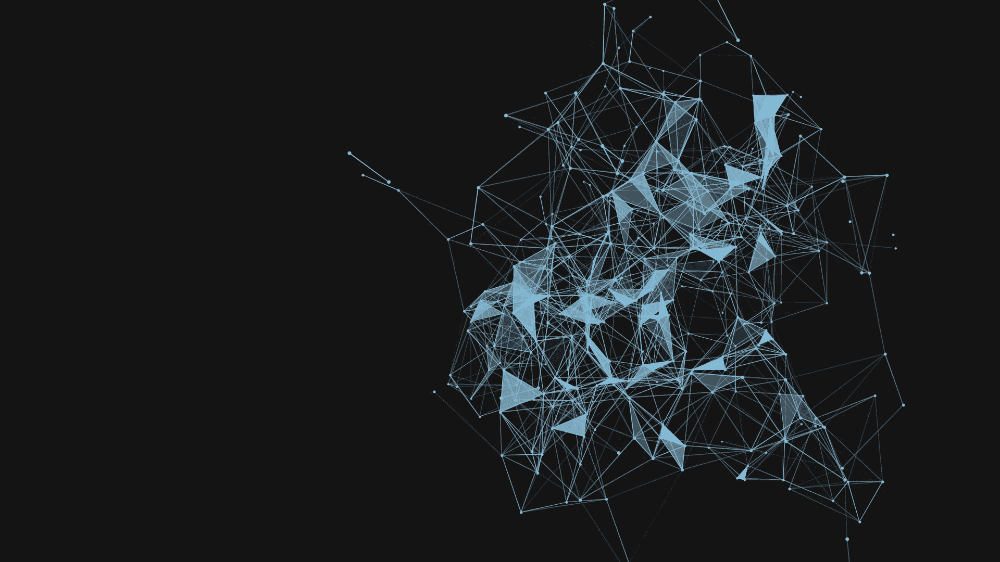
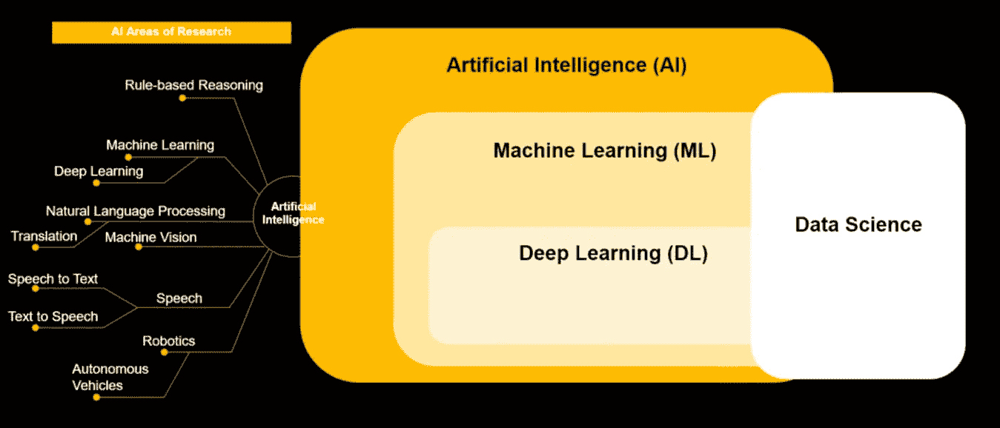
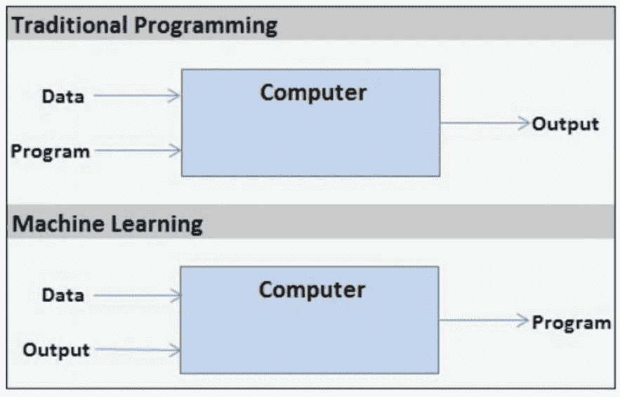
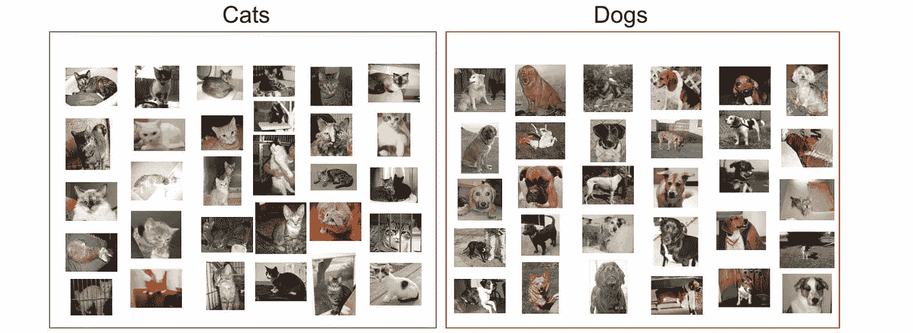
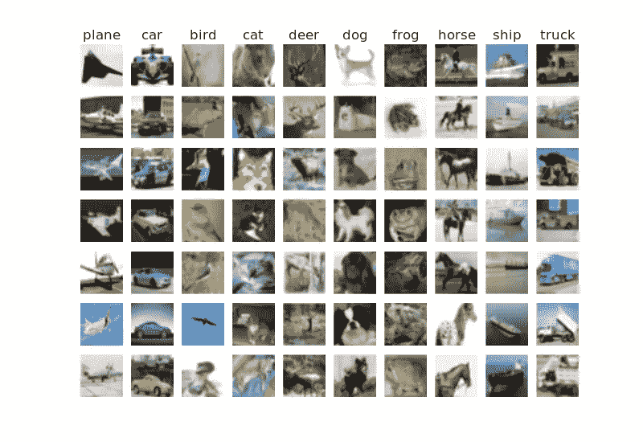
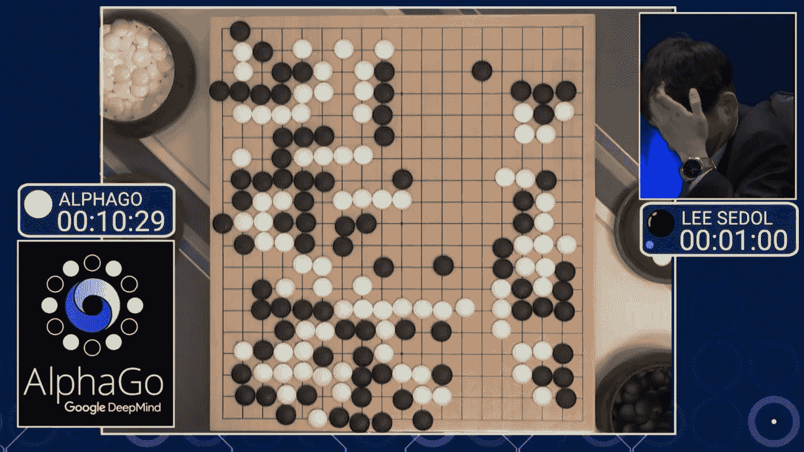

# 揭开机器学习的神秘面纱

> 原文：<https://pub.towardsai.net/demystifying-machine-learning-b03c281e348?source=collection_archive---------0----------------------->

## 机器学习入门，不涉及数学| [走向 AI](https://towardsai.net)

## 不涉及数学的机器学习科学领域的温和介绍

机器学习是 21 世纪描述最模糊的术语之一。对其模糊描述的最大原因是，它是一个多学科领域，它借用了各个领域的概念:统计、概率、线性代数、计算机编程等。

在这篇文章中，我将主要侧重于解释机器学习的基础知识。因此，如果你是机器学习领域的新手，或者只是好奇想知道机器学习是如何工作的，那么这篇文章就是为你准备的。

我将在本文中讨论的主题如下:

1.  人工智能导论
2.  机器学习导论
3.  机器学习的类型

# 人工智能

在理解机器学习的基础知识之前，最重要的是你要熟悉人工智能的概念。

人工智能通常被称为 AI，是一个总括术语，它涵盖了各种工具和技术。

人工智能谱

> 术语人工智能用于定义任何模拟与人类思维相关的认知功能(如学习和解决问题)的机器。

从上面的图像可以清楚地看出，人工智能实际上涵盖了各种领域，如机器学习、机器人等。所以我们可以说，AI 基本上是所有这些技术的超集。

希望你现在已经明白人工智能和机器学习是不一样的。机器学习基本上是 AI 的一个子集。所以现在，让我们来探索机器学习。

# 机器学习

让我们先来看一个充满术语的无聊的 ML 定义，之后，我会解释所有这些术语，这将有助于你更好地理解机器学习的概念。

## 枯燥的教科书定义—

> **机器学习**是对**算法**和统计模型的科学研究，计算机系统使用这些算法和统计模型在不使用明确指令的情况下有效地执行特定任务。机器学习算法建立样本数据的数学模型，称为“训练数据”，以便在没有明确编程执行任务的情况下进行预测或决策**。**

如果你没看懂上面的定义(前提是你看了)；**伟大的**。我也不指望你自己能理解它，这就是为什么我将简化上面的定义，以便你能容易地理解它。

## 枯燥的教科书定义的简化—

机器学习是对算法的研究；这意味着我们基本上编写了一组定义良好的指令(算法),我们的模型遵循这些指令，以便有效地执行特定的任务。这听起来像是传统的计算机编程任务，但实际上不是。

传统编程和机器学习的关键区别如下。

传统编程 v/s 机器学习

上图可能看起来有点混乱，因为输出是作为输入传递的，但这是机器学习的核心本质。我们获取训练数据和输出，在这两者的帮助下，我们创建了一个机器学习模型。

并非所有的机器学习算法都使用输出数据来创建模型。我们将在下一节详细讨论不同类型的机器学习。

# 机器学习的类型

机器学习可以分为三种类型

1.  监督机器学习
2.  无监督机器学习
3.  强化学习

## 监督学习

在这种类型的学习中，我们已经标记了数据，即我们基本上知道正确的输出是什么，因此如果我们的模型预测了错误的输出，那么我们可以在损失函数的帮助下纠正它。

损失函数基本上施加了一个惩罚，帮助模型理解它犯了一个错误。

监督学习可以大致分为两个子类型—

1.  **回归** —在这种技术中，我们基本上处理连续数据，即没有我们可以预测的确切类别标签。

**例子** —最常见的例子是计算房子的价格。在这种情况下，我们被赋予某些特征，如房子的位置、房间数量、房子的平方英尺大小等。而我们需要根据这些特征来预测房子的价格。因此，很明显，房子的价格将是连续的，也就是说，它可以是任何实际价值，如 12000 美元、12150 美元、15000 美元等。

2.**分类—** 在这项技术中，我们处理分类数据，即我们有需要预测的类别标签。

**例子** —一个很好的例子是预测一幅图像是包含一只猫还是一只狗。

二元分类

在这种情况下，我们只有两种可能的结果，即我们只能将图像分类为猫图像或狗图像。这种类型的任务被称为**二元分类**，因为我们只有两个类别标签。如果我们有多个类别标签，如猫、狗、鸟、马等。那么就变成了一个**多类分类问题**。

多类分类

## 无监督学习—

在这种类型的学习中，我们没有任何带标签的数据，也就是说，我们没有任何需要专门预测的类或标签。所以根据特征(比如身高、体重等)。)我们试图通过在数据点中寻找一个共同的模式来将这些值组合在一起。无监督学习中最常用的技术是**聚类**。

**例子** -假设我们得到一组由狗和猫的图像组成的图像，那么即使我们不知道类别标签，我们也可以查看和分析所有的猫图像，并说这些图像看起来相同，如果我们将它们与狗的图像进行比较，那么我们将意识到它们与猫的图像不同。所以基本上我们可以做的是，我们可以创建两个独立的猫和狗的图像集群。

使聚集

蓝色的是狗，红色的是猫。所以在这里，我们甚至在不知道类别标签的情况下分割这些图像，这是无监督学习的本质。

## 强化学习—

在这种学习形式中，我们遵循试错法；我们只是寻找能产生最佳结果的行动。

**强化学习的组成部分—**

1.  **Agent** —是系统的决策者。
2.  **环境** —代理与环境交互，以便采取所需的操作。
3.  **动作** —定义代理可以做什么。比如在游戏中按下某个特定的按钮等等。

所以，基本上，代理人选择最大化其回报的行动。

你最近听说的所有 AI 的 dope 应用都属于这一类。无论是 DeepMind 的 AlphaGo 还是像我一样的马斯克粉丝，那么他的 OpenAI 机器人也通过利用强化学习的力量打败了一堆职业 Dota 玩家。

说到这里，我们已经到了这篇文章的结尾。非常感谢你的阅读。

我的 [Twitter](https://twitter.com/DhairyaKumar16) 和 [LinkedIn](https://www.linkedin.com/in/dhairya-kumar-873a9615b/) 。