# 揭开主成分分析的神秘面纱

> 原文：<https://pub.towardsai.net/demystifying-principal-component-analysis-9f13f6f681e6?source=collection_archive---------1----------------------->

安托万·道特里在 [Unsplash](https://unsplash.com/s/photos/math?utm_source=unsplash&utm_medium=referral&utm_content=creditCopyText) 上拍摄的照片

## [数据科学](https://towardsai.net/p/category/data-science)

数据可视化一直是任何机器学习操作的重要部分。它有助于获得关于数据分布的非常清晰的直觉，这反过来有助于我们决定哪个模型最适合我们正在处理的问题。

目前，随着机器学习的进步，我们更经常需要处理大数据集。数据集具有大量的特征，并且只能使用大的特征空间来可视化。现在，我们只能可视化二维平面，但是，数据的可视化似乎也是非常必要的，正如我们在上面的讨论中看到的。这就是主成分分析的用武之地。

> 主成分分析(PCA)是一种降维方法，通常用于降低大型数据集的维数，方法是将一个大型变量集转换为一个较小的变量集，该变量集仍包含大型数据集中的大部分信息。

简而言之，它执行降维，即，它接受具有大量特征的大型数据集，并产生具有较少数量特征的数据集(如我们所指定的)，尽可能少地丢失信息。

现在，我们需要明确一些事情。

1.  主成分分析是一种无监督的技术。
2.  如果我们通过 PCA 传递一个具有 5 个特征的数据集，比如年龄、身高、体重、智商和性别，并告诉它使用 2 个特征来表示，PCA 会给我们两个分量，主分量 1 和主分量 2，这些不是来自我们的 5 个初始特征的任何特定特征，它们是包含最多信息的 5 个特征的组合。
3.  在数据集中，如果我们分别查看每个要素，我们会看到类似这样的内容。

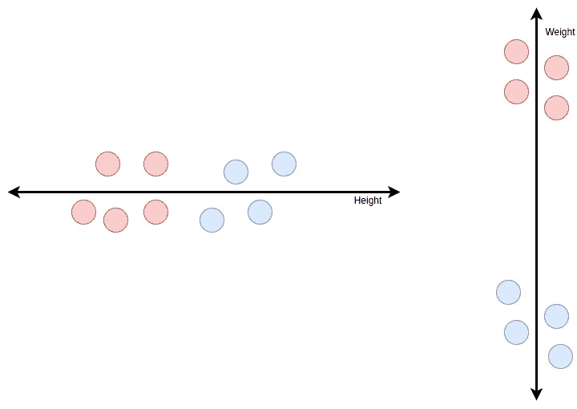

图一

如果我们查看上面的图表，并将红色的球视为第 1 类，蓝色的球视为第 2 类，我们可以看到这两个类可以根据特征进行划分。特征的这种特性有助于模型基于特征的行为在两个类之间进行分离。虽然我们可以看到“体重”特征比“身高”特征更好地划分了类别。我们可以说，因为我们可以看到“重量”,两个类之间的距离更大。

这个概念通过特征的变化来反映。方差由下式给出:

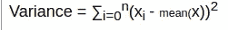

所以，它是距离平均值的平方的总和。点离得越远，方差就越大。所以这里体重的方差比身高大。这种差异可用于描述和比较某个特定要素为数据分布模型提供了多少信息。差异越大，提供的信息越多。

## 理论直觉

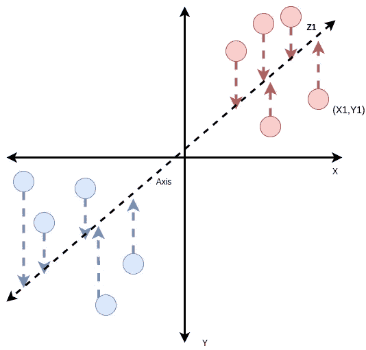

图 2

这张图准确地描述了主成分分析。比方说，我们有两个特征 X 和 y。我们将点分布在二维平面上，每个点可以由一个元组(X1，Y1)表示，其中它们是特征值。现在，我们想只用一个组件来表示它。所以需要找到如图所示的一个轴，并把位于 XY 平面上的点投影到这个轴上。现在，投影可以由单个值 Z1 表示，因为轴是一维的。符合我们目的的轴的标准是该轴上的点的方差必须是最大的，即，如果我们选择任何其他轴，将点投影到轴上，并找到方差，该值不应大于当前值。

但是现在，由于我们进行了降维，我们将丢失一些信息。我们的目标是最大限度地减少信息损失。现在，如果我们有 10 维数据，我们把它的维数减少到 2，它可能看起来像这样。

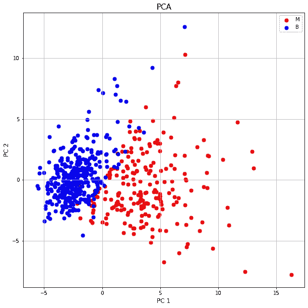

总的来说，我们试图找到沿着轴的方差最大的最佳可能轴，然后我们将 n 维点在由我们的轴形成的平面上的投影用于降维。

这里我们需要解决的一个问题是，有时我们可能无法使用 PCA 的组件保存很多信息。即使我们寻找具有最大方差的最佳轴，仍然不可能在我们的组件中捕获全部信息。在这些情况下，我们不应该完全依赖 PCA 来判断我们的数据，因为它可能会错过关于数据的重要直觉。据说，如果 PCA 的 n 个分量加在一起不能捕获至少 85%的信息，我们就不应该依赖于 PCA 的结果。

现在，让我们来看看数学直觉。

## PCA 背后的数学

主成分分析依赖于线性代数。为此，我们必须对本征向量和本征值有一个非常清楚的概念。

那么，**什么是特征向量和特征值？**

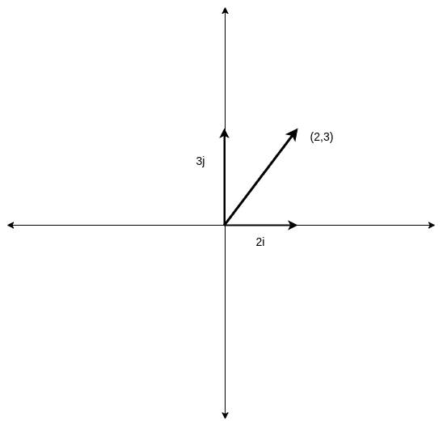

我们都知道一个点(2，3)，可以用一个向量表示为 2i + 3j。我们通常用 I 和 j 作为单位来表示平面上的每个矢量。他们被称为**基地**。但是，现在如果有人想用不同的向量作为基础，或者换句话说，有人想用其他的向量来表示所有的向量，而不是 I，j。

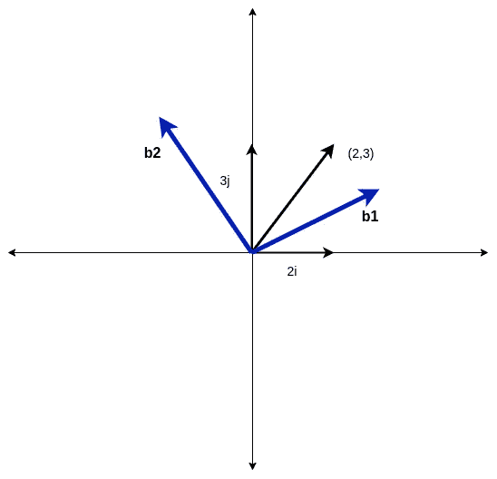

假设我们希望 b1 和 b2 是我们的基础。那么，我们应该如何关联这两个系统呢？

现在，我们将尝试看看 b1 和 b2 在我们的系统中实际上意味着什么。

比如说，我们发现 b1=2i+j，b2=-1i+1j

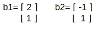

它们是 1x 2 矩阵或 2D 向量。对不起，我实际上没有找到一个合适的编辑器，不管怎样，让我们继续。

所以，我们可以用这种方式来表示我们关于 I 和 j 的基础。b1b2 系统中的向量在 ij 系统中意味着什么。

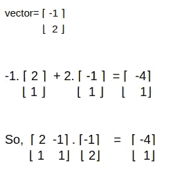

> 请注意，由于编辑器的问题，我把向量写成了 1 x 2 的矩阵。对于应用，我们需要找到 1×2 矩阵的转置，以获得 2D 向量，然后执行乘法。我用[x，y]来表示矢量 xi+yj。

假设我们需要将 b1b2 系统中的向量[-1，2]转换为 ij 系统，我们需要找到向量[-1，2]与给定矩阵的乘积。

现在，如果我们从 b1b2 系统中选取任意一个向量，并与这个向量相乘，我们就可以找到它在 ij 系统中的对应表示。

同样，我们找到这个矩阵的逆矩阵。我们将获得，

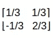

如果我们将 ij 平面上的任何向量与这个矩阵相乘，我们将得到它在 b1b2 平面上的对应向量。

如果我们开始从 ij 平面选取向量，并与这个矩阵相乘，我们将为 ij 平面中的每个向量获得 b1b2 平面中的一个向量。因此，我们可以将整个 ij 平面转换为 b1b2 平面。这叫做**转换。**

事实证明，变换改变系统的基的方式，它将以相同的方式改变系统的任何向量，即，如果变换将基向量缩放 2 倍，它将对该系统的其他向量产生类似的影响，因为系统的每个向量都依赖于基向量来表示。因此，我们将在此基础上检查转换的变化，以便清楚地了解。

有各种各样的变换，例如，我们可以旋转 ij 平面系统以获得新的平面系统。

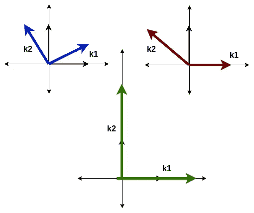

我们可以看到上面显示了三种类型的转换。尽管它们没有按比例绘制。首先是旋转，其次是剪切。第三个是通过将下面给出的矩阵与 ij 平面的向量相乘得到的变换

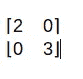

现在，要观察的一件事是，在第一种情况下，我们的 I 和 j 向量都改变了方向，或者说偏离了初始方向。在第二种情况下，I 向量(在变换 k1 之后)保持在相同的方向，尽管它的值或幅度作为单位向量可能改变。在第三种情况下，两个矢量保持它们的方向，但是幅度改变，I 矢量(现在是 k1)变成 2 倍，j 矢量(现在是 k2)变成 3 倍。

一个系统经过变换后不改变方向(简单来说就是避免复杂化)的**向量**称为特征向量。本征向量虽然没有改变方向，但在数量上是成比例的。例如，在第三种情况下，我被缩放了两次，j 被缩放了 3 次。这些值被称为向量的特征值，特征向量的大小通过这些值来缩放。需要注意的一点是，不仅是 I 和 j 向量，任何属于系统的向量，在变换后不改变方向的，都可以是特征向量。

**如何求特征值和向量？**

我们看到变换后的特征向量，被一个标量值缩放了。我们知道变换是矩阵乘法。所以，当乘以一个矩阵时，可以说是向量的标量变化。因此，这由下式给出:

> av =(λ)v

其中 A 是矩阵，v 是特征向量，T4λT5 是向量缩放的常数，因此特征值。

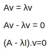

所以，我们最终得到了方程。现在的问题是，如果 v =0，方程就是 0，但这太明显了，而且我们希望 v 是非零向量。

我们设(A-(λ)I)= 0—(1)，所以，我们把它的行列式等价为 0。

实际上，这背后还有另一个直觉，即矩阵的行列式，实际上描述了单位矩形面积的变化，如果我们用矩阵变换一个向量系统，就会发生这种变化。例如，如果我们看我们的第三种情况，我们将单位向量缩放了 2 和 3 个单位。因此，单位矩形的当前面积是 6，最初是 1。如果我们找到了变换矩阵的行列式，

我们会发现行列式是 6。

回到等式 1，我们找到λ值，并相应地找到特征向量。

## 五氯苯甲醚有什么关系？

对于 PCA，假设我们有两个特征 X 和 y，我们首先计算 X 和 y 的协方差矩阵。

协方差由下式给出:

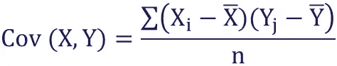

协方差矩阵由下式给出:

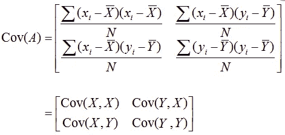

因此，协方差矩阵是从特征中获得的。现在我们初始化 XY 平面上的任何向量，比如说，[-1 1]。

我们不断把这个向量和协方差矩阵一次又一次相乘，向量的变化或变换慢慢收敛到一个特定的向量，这个向量不变。这就给出了该平面的特征向量。

例如，[-1 1]是我们取的向量，而

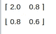

是协方差矩阵，得到的向量是[ x y] =[-2.5 -1.0]

y=-1.0

x=-2.5

所以，-2.5i -1.0j 是得到的向量。在这个向量方向上的单位向量是主分量 1 的特征向量。

现在，

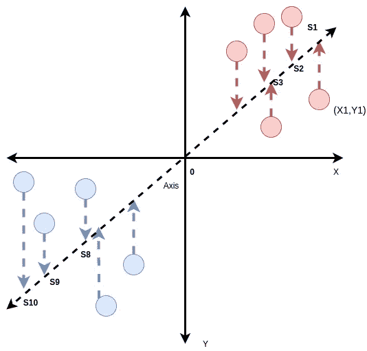

距离 S1、S2、S3 的平方之和……S8、S9、S10 与 0 等于 s

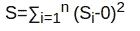

这个 S 叫做主分量 1 方向的方差。

现在，我们考虑与分量 1 的特征向量正交的另一个向量。它给出了主分量 2。

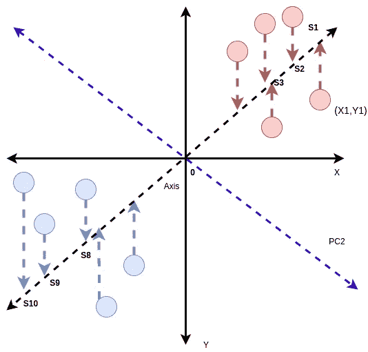

紫色线给出 PC2。我们发现 PC2 的 S 值与 PC1 的一样。

现在，假设我们的分布中有 N 个值。

*(PC1/N-1 的 S 值)*给出 PC1 的**变化。**同样，我们发现对于 PC2。

现在，如果 PC1 的变化量是 10，PC2 是 2。然后，

PC1 占所表示信息的 10/(10+2) x 100 =83%。

对于 10 维数据，这两个分量 PC1 和 PC2 可能不代表大部分信息，并且公式被修改，因为它将在分母中具有更多分量。

因此，如果我们想要使用 1 个主成分来表示 X-Y 特征分布，我们将表示 83%的信息。

## 结论

在本文中，我们讨论了 PCA 的工作原理。

希望这有所帮助。