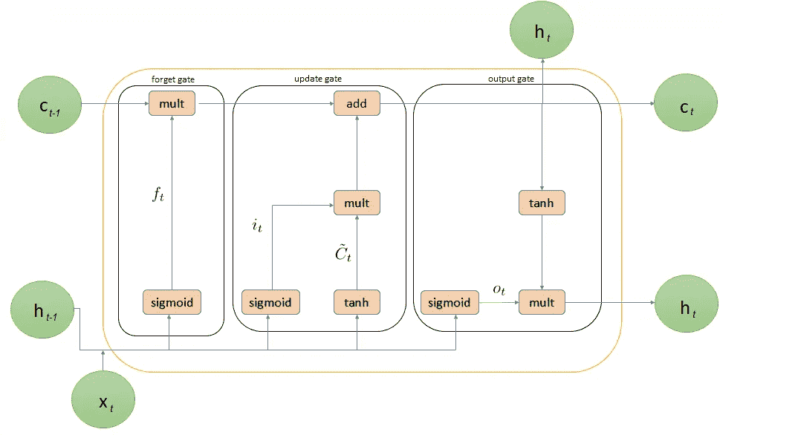
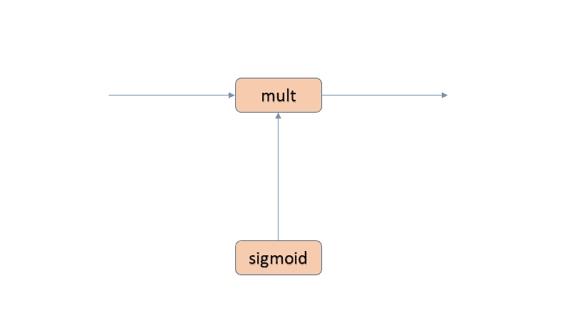
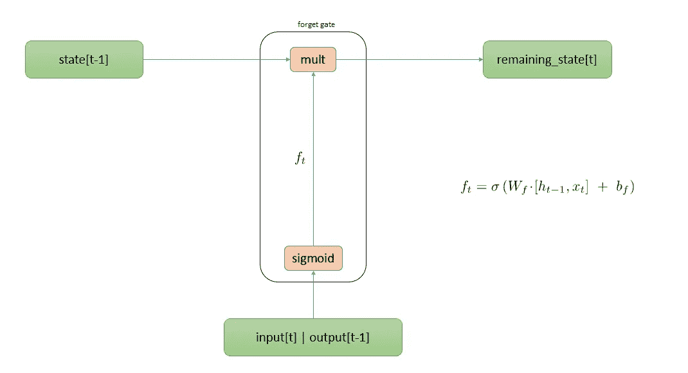
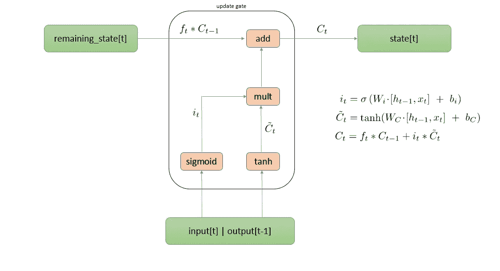
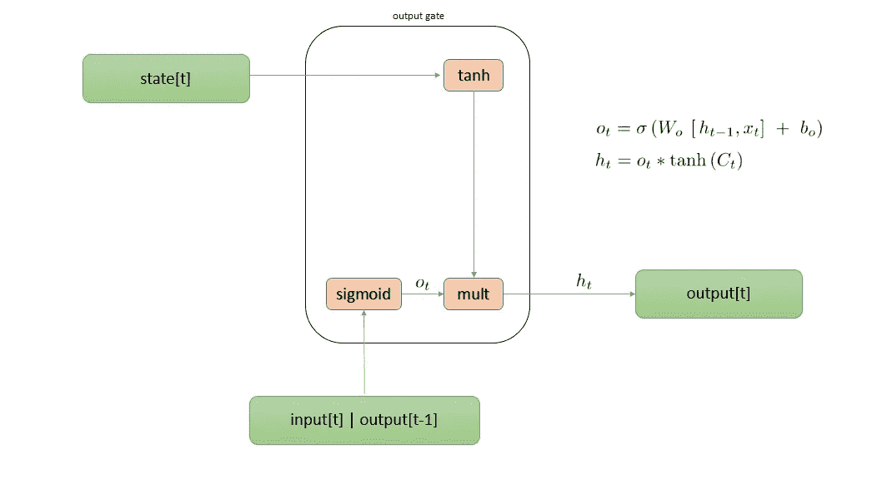
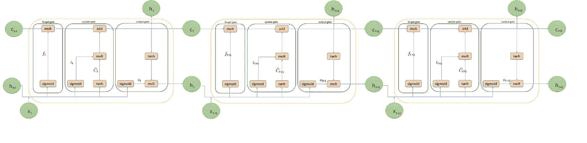

# 揭开长短期记忆(LSTM)网络结构的神秘面纱

> 原文：<https://pub.towardsai.net/demystifying-the-architecture-of-long-short-term-memory-lstm-networks-38163ade5aa2?source=collection_archive---------1----------------------->

## 面向人工智能的 LSTMs | [架构](https://towardsai.net)

# 介绍

在我之前的文章中，我解释了[**架构**](https://medium.com/towards-artificial-intelligence/introduction-to-the-architecture-of-recurrent-neural-networks-rnns-a277007984b7)**。**rnn**并不完美，主要有两大问题**爆炸渐变**和**消失渐变**。**爆炸渐变**更容易发现，但是**消失渐变**更难解决。我们使用**长短期记忆(LSTM)** 和**门控递归单元(GRU)** ，它们是解决**消失梯度**问题的非常有效的解决方案，并且它们允许神经网络捕获更长的范围相关性。**

## ****爆炸渐变****

**当通过时间反向传播( **BPTT** )算法赋予权重极大的重要性，权重的值变得非常大。这可能导致权重值溢出和 NaN 值。这导致网络不稳定。**

**在网络训练期间，我们可以通过观察以下迹象来检测**爆炸梯度**。**

*   **在训练期间，模型的权重值很快变得非常大。**
*   **模型的权重值在训练期间变为 NaN。**
*   **在训练期间，每个节点和层的误差梯度值始终高于 1.0。**

**我们可以用几种方法处理**爆炸渐变**问题。以下是流行的技术。**

*   **这个问题很容易解决。看看你的梯度向量，如果它大于某个阈值，重新缩放你的梯度向量，使它不要太大。这被称为**渐变剪辑**。**
*   **我们可以通过检查网络的权重值并对大权重值的网络损失函数应用惩罚来使用权重正则化。**
*   **我们可以用 **LSTMs** 或者 **GRUs** 代替 **RNNs** 。**
*   **我们可以使用 **Xavier** 初始化或 **He** 初始化进行权重初始化。**

## ****消失渐变****

****消失梯度**一般出现在激活函数的梯度很小时。在反向传播算法中，当权重与低梯度相乘时，它们变得非常小，并且随着它们进一步进入网络而消失。这使得神经网络忘记了**的长期依赖性**。**

**我们知道**长期依赖**对于 rnn 的正常运行非常重要。为了理解**长期依赖的重要性，**考虑下面两个语句，它们将一个字一个字地馈入 RNN 以预测接下来的单词。**

> **猫喜欢吃鱼，鱼很好吃，T9 渴望吃更多。**
> 
> **这些猫喜欢吃鱼，鱼很好吃，而且渴望吃更多。**

*   **网络必须在时间步骤 2 记住句子(cat)的主语(单数或复数),以便在时间步骤 12 预测两个语句的单词。**
*   **在训练中，误差随着时间反向传播。与较早时间步长的层权重相比，更接近当前时间步长的层权重受到的影响更大。**
*   **通常在每个时间步与这些偏导数成比例更新的递归层中的权重没有在正确的方向上被充分推动，这导致网络进一步学习。**
*   **该模型不能更新层权重以反映来自较早时间步骤的长期语法依赖性。**

**我们可以用几种方法处理渐变消失问题。以下是流行的技术。**

*   **初始化单位矩阵的网络权重，以便最小化消失梯度的可能性。**
*   **我们可以使用 **ReLU** 激活功能代替**s 形**或 **tanh** 。**
*   **我们可以用**lstm**或者 **GRUs** 代替 **RNNs** 。lstm 或 **GRUs** 被设计成捕获顺序数据中长期依赖关系。**

# **LSTM 建筑**

****LSTMs** 是 **RNNs** 的变体，能够学习长期依赖性。**

****

****LSTM 建筑****

*   ****LSTMs** 的关键是**单元状态(C)** 存储信息。**
*   ****LSTMs** 确实有能力删除或添加信息到**单元状态**。**
*   **移除或添加信息到由称为**门**的结构调节的**单元状态**的能力。**
*   **门由一个 sigmoid 神经网络层和一个逐点乘法运算组成。**

****

****门****

*   **sigmoid 层输出 0 到 1 之间的数字。**
*   **1 代表“完全保留这个”，0 代表“完全摆脱这个。”**
*   ****LSTMs** 单元由三个关键部件**忘记**、**更新**和**输出**门组成。**

****忘记门架构****

****

*****忘门建筑*****

*****遗忘门*** 是存储信息的 **LSTMs** 中的**单元状态**。它从**单元状态**中决定哪些信息需要保留，哪些信息需要丢弃。这个决定是由称为“**忘记门**”层的 s 形层做出的。**

*   **它采用先前隐藏的层激活 h <t>和当前输入 x <t>，并在其上应用 sigmoid 层，并输出值在 0 和 1 之间的张量</t></t>**
*   **将这个张量与之前的**细胞状态**C<t1>相乘，以保留相关信息，丢弃不相关信息。**

**让我们回到之前的例子**

> **这只猫很喜欢吃鱼，鱼很好吃，T33 渴望吃更多。**
> 
> **猫喜欢吃鱼，鱼很好吃，T37 渴望吃更多。**

**为了预测每个序列中第 12 个时间步的单词，网络必须记住在时间步 2 看到的句子的主语(猫)是单数还是复数。**

**该模型将基于所有先前的输入，尝试预测两个语句在时间步骤 12 的下一个单词。**单元格状态**必须包括在时间步骤 2 中看到的句子的主语(cats ),它是单数或复数。**

**当它看到一个主题(猫)时，它希望保留关于该主题的信息，无论它是单数还是复数。**

****更新星门架构****

****

*****更新门架构*****

*****更新门*** 决定单元状态中需要存储什么新信息。**

*   **名为“**输入门**”层的 sigmoid 函数决定哪些值需要更新。它给输出一个值在 0 和 1 之间的张量**
*   **一个 **tanh** 函数创建一个新的候选值向量，C~ < t >，它可以被添加到状态中。它也是一个张量。**
*   **将这两个张量相乘，并创建状态更新。**
*   **此更新将被添加到**单元状态**。**

**在我们之前的语言模型示例中，它想要将句子的主题添加到**单元格状态**。**

****输出门架构****

****

*****输出门架构*****

*****输出门*** 决定要输出什么。该输出将基于**单元状态**，但将是过滤后的版本。**

*   **决定**单元状态**将要输出的部分的 sigmoid 层。**
*   **通过 **tanh** 层传递**单元状态**(将值推到 1 和 1 之间)。**
*   **将它乘以 sigmoid 门的输出，以便它只输出它决定的部分。**

**在我们前面的语言模型的例子中，由于它只看到一个主题，它可能想要输出与一个动词相关的信息。例如，它可能输出主语是单数还是复数，以便知道接下来应该预测动词的什么形式。**

****

****展开图*一个 LSTM 单位穿越时间*T21****

****伴随 jupyter 本帖的笔记本可以在**[**Github**](https://github.com/nitwmanish/Demystifying-Architecture-Of-Long-Short-Term-Memory-LSTM)**上找到。****

# **结论**

****rnn**用于处理顺序数据。但是 **RNNs** 遭遇两大问题**爆炸渐变**和**消失渐变**。 **RNNs** 忘记**长期依赖**。 **LSTMs** 是 **RNNs** 的变体，能够学习**长期依赖性**。**

*****我希望这篇文章能帮助你理解* LSTMs，以及它如何能够学习长期依赖关系。它也很好地*解释了 lstm 的关键组件*，以及为什么我们使用 lstm 来处理爆炸渐变和消失渐变问题。****

# **参考**

**克里斯多夫·奥拉赫，了解 LSTM 网络公司。[https://colah.github.io/posts/2015-08-Understanding-LSTMs/](https://colah.github.io/posts/2015-08-Understanding-LSTMs/)**