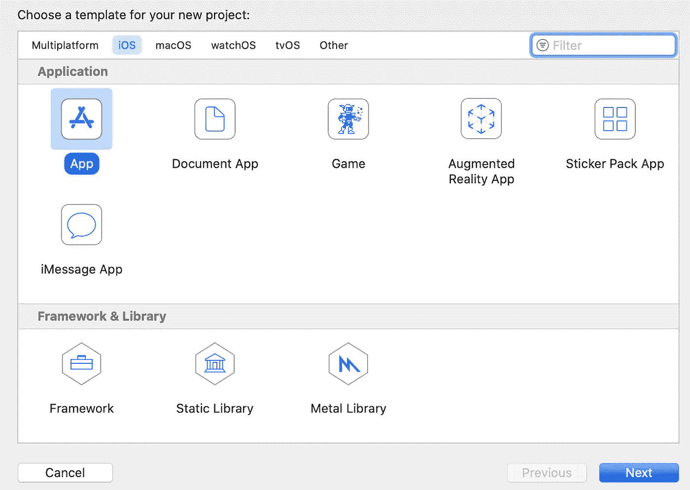
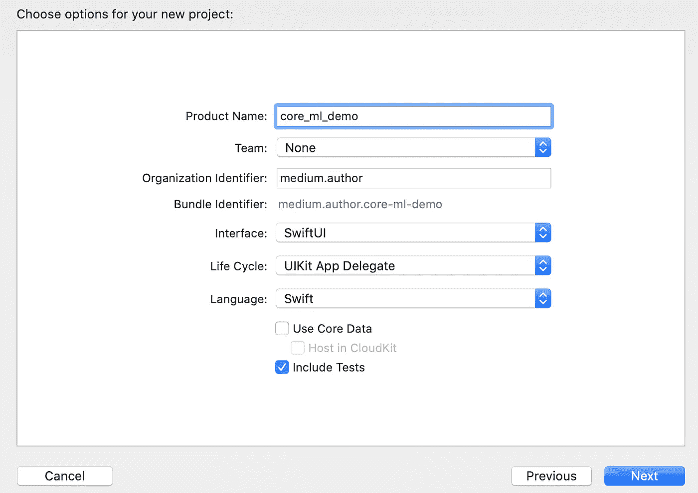
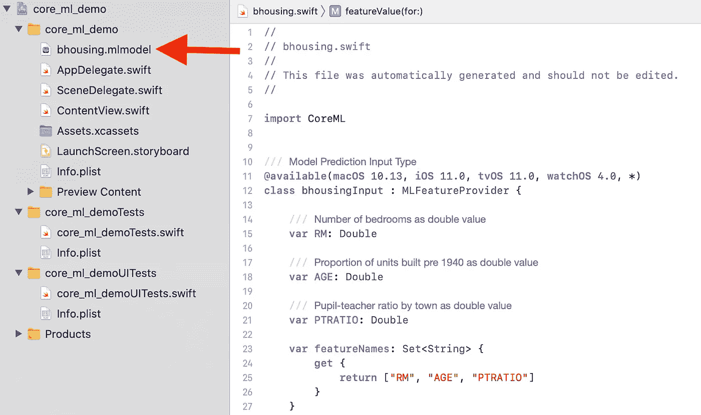
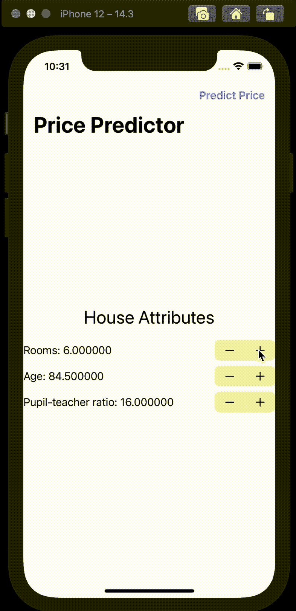

# 在你的 iPhone 上部署一个 Python 机器学习模型

> 原文：<https://pub.towardsai.net/deploy-a-python-machine-learning-model-on-your-iphone-d006b1e04bc4?source=collection_archive---------1----------------------->

## [机器学习](https://towardsai.net/p/category/machine-learning)、[编程](https://towardsai.net/p/category/programming)

## 简约指南

由 [Unsplash](https://unsplash.com/s/photos/machine-learning-iphone?utm_source=unsplash&utm_medium=referral&utm_content=creditCopyText) 上的 [AltumCode](https://unsplash.com/@altumcode?utm_source=unsplash&utm_medium=referral&utm_content=creditCopyText) 拍摄的照片

本文描述了从训练 python 机器学习模型到可以在 iPhone 上部署的概念验证 iOS 应用程序的最短路径。我们的目标是提供基本的搭建，同时为适合特定用例的进一步定制留出空间。本着简单的精神，我们将忽略一些任务，比如模型验证和构建一个完美的用户界面(UI)。本教程结束时，您将拥有一个在 iOS 上运行的经过训练的模型，您可以将其作为原型展示并加载到您的设备上。

## **第一步。设置您的环境**

首先，让我们创建一个名为`.core_ml_demo`的 python 虚拟环境，然后安装必要的库，即`pandas` `scikit-learn` 和`coremltools`。从您的终端运行:

创建 python 虚拟环境

接下来我们将安装 **Xcode** 。Xcode 是苹果产品的开发工具包。注意 Xcode 相当大(> 10 Gb)。我建议你喝杯咖啡或者通宵运行你的安装程序。- *注意，本指南在 macOS Catalina 10.15.5 上使用 Xcode 版本 12.3 (12C33)。*

 [## Xcode

### Xcode 包括开发人员为 Mac、iPhone、iPad、Apple TV 和 Apple 创建优秀应用程序所需的一切

apps . apple . com 训练模型](https://apps.apple.com/us/app/xcode/id497799835?mt=12) 

## **第二步。训练一个模型**

我们将使用 scikit-learn 的波士顿房价 [**玩具数据集**](https://scikit-learn.org/stable/modules/generated/sklearn.datasets.load_boston.html) 来训练一个线性回归模型，以根据房产和社会经济属性来预测房价。因为我们的目标是简单，我们将特征空间限制为 3 个预测值，并使用房价作为我们的目标变量。

为概念验证训练一个基本的 python 模型

## **第三步。将模型转换为核心 ML**

苹果提供了两种为 iOS 开发模型的途径。第一个是 [Create ML](https://developer.apple.com/documentation/createml) ，允许人们完全在苹果生态系统内生产模型。第二个是 [Core ML](https://coremltools.readme.io/) ，允许用户将第三方的模型转换成 Core ML 格式，集成到苹果平台上。由于我们对在 iOS 上运行 python 训练的模型感兴趣，我们将使用后者。

在导入 Xcode 之前，我们将使用 python 的`coremltools`包将我们的 sklearn 模型转换为核心 ML 格式(`.mlmodel`)。`coremltools` 允许用户向模型对象分配元数据，如作者信息、模型特征和结果描述。

将训练好的 python 模型保存到。coreml 格式

## **第四步。开始一个新的 Xcode 项目**

这就是 python 的全部内容。从此，我们可以只用 Xcode 和 Swift 完成一个原型 app。这可以通过下面的设置来完成。

*   打开 Xcode 并创建一个新的 Xcode 项目
*   选择“iOS”作为多平台类型
*   选择“App”作为应用程序类型

为 iOS 创建新的 Xcode 项目

*   接下来，命名您的项目并选择“SwiftUI”界面。

命名您的 Xcode 项目

*   现在只需将`.mlmodel`文件(保存在上面的步骤 3 中)拖放到 Xcode 目录中。Xcode 会自动为您的模型生成一个 Swift 类，如下图编辑器所示。如果您检查您的模型类，您会注意到它包含了我们在使用`coremltools`保存 python 模型时输入的细节，比如特征和目标字段描述。这对于模型管理来说很方便。

正在导入您的。coreml 文件到您的 Xcode 项目中

## **第五步。构建模型用户界面**

接下来，我们将通过修改 Xcode 项目中的`ContentView.swift`文件来构建一个基本的 UI。下面的 Swift 代码设置了一个 UI，允许用户调整房屋属性，然后预测房价。这里我们可以回顾几个要素。

`NavigationView`包含了我们的基本 UI。它包括:

*   `[Stepper](https://developer.apple.com/documentation/swiftui/stepper)`结构(*第 19–30 行*)，用于我们的三个特性中的每一个，使用户能够修改特性值。步进器基本上是修改我们房子属性变量的`[@State](https://developer.apple.com/documentation/swiftui/state)`(第 6–8 行)的小部件。
*   导航栏上的`[Button](https://www.simpleswiftguide.com/how-to-add-button-to-navigation-bar-in-swiftui/)`(*第 31–40 行*)从`predictPrice`功能(*第 46 行*)中调用我们的模型。这就在屏幕上产生了一条`[Alert](https://www.hackingwithswift.com/quick-start/swiftui/how-to-show-an-alert)`消息，显示预测价格。

在`NavigationView`之外，我们有自己的`predictPrice`函数(*第 46–62 行*)。`predictPrice`函数实例化我们的 Swift 核心 ML 模型类，并根据存储在我们的特征状态中的值生成预测。

如上修改 ContentView.swift

最后是有趣的部分。我们可以在 Xcode 中构建并运行我们的应用程序的 [**模拟**](https://developer.apple.com/documentation/xcode/running_your_app_in_the_simulator_or_on_a_device) 来查看我们的模型的运行情况。在下面的例子中，我用 iPhone 12 创建了一个模拟。

模拟您的模型在 iOS 上运行

## **结论**

就是这样！我们最初的原型已经完成。还有很多工作要做，例如模型验证，测试以确认导入 iOS 后的预期性能，以及更时尚/更友好的用户界面。尽管如此，我希望这能为您的移动机器学习部署工作提供有用的参考。

新的和改进的工具继续使移动追求更广泛地为数据科学社区所接受，并且在移动空间中有许多创造性的机会等待被要求。由于移动技术本质上是多媒体，它提供了丰富的数据类型(例如音频、视频、移动和位置)以及独特的使用点应用程序，以扩展个人的数据科学工具包。

一如既往，我欢迎任何反馈或建议。

感谢阅读！

## 资源

CoreML

 [## 模型——机器学习——苹果开发者

### 使用来自为 Core ML 设计的研究社区的机器学习模型，将智能构建到您的应用中。

developer.apple.com](https://developer.apple.com/machine-learning/models/)  [## 快速入门示例

### 核心 ML 工具可以将来自其他框架的训练模型转换成核心 ML 模型的内存表示。…

coremltools.readme.io](https://coremltools.readme.io/docs/introductory-quickstart) 

*iOS 部署*

 [## Apple 开发者文档

### 在设备上部署您的应用

developer.apple.com](https://developer.apple.com/documentation/xcode/distributing_your_app_to_registered_devices) 

*SwiftUI*

 [## SwiftUI 示例

### SwiftUI by Example 是世界上最大的 SwiftUI 示例、技巧和技术的集合，有 400 多页…

www.hackingwithswift.co](https://www.hackingwithswift.com/quick-start/swiftui)