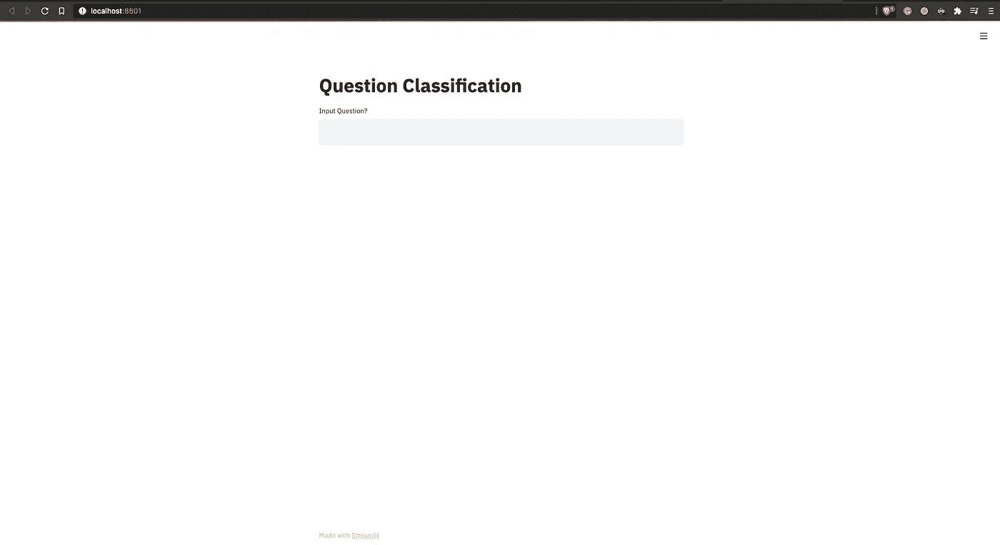
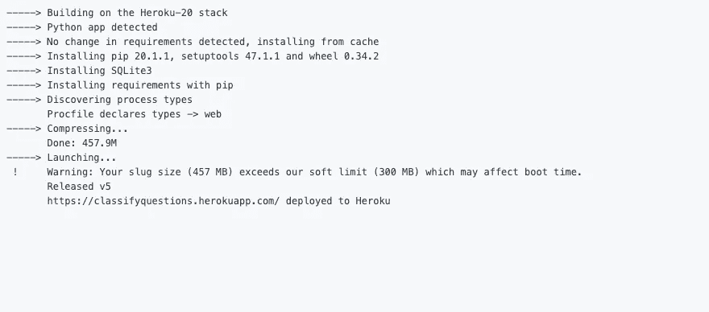

# 使用 Streamlit 和 Heroku 部署深度学习模型

> 原文：<https://pub.towardsai.net/deploy-deep-learning-models-using-streamlit-and-heroku-22f6efae9141?source=collection_archive---------1----------------------->

## [深度学习](https://towardsai.net/p/category/machine-learning/deep-learning)、[编程](https://towardsai.net/p/category/programming)

## 将数据应用程序发布到互联网的便捷方式。


来源:[freepik.com](https://www.freepik.com/free-photo/conceptual-cloud-server-business-with-wooden-blocks-with-icons-dark-color-table-flat-lay_10183680.htm#page=1&query=servers&position=40)

许多数据专业人士训练的深度学习和机器学习模型要么以`inference.ipynb`笔记本或`app.py`文件告终😅。那些能够在现实世界中制造敬畏的一丝不苟的模型架构永远见不到天日。这些模型只是坐在后台，通过 API 网关处理请求，默默地完成它们的工作，使系统更加智能。

使用这些智能系统的人并不总是信任花费数小时、数周或数月收集数据、清理收集的数据、格式化数据以正确使用数据、编写模型架构、培训模型架构并验证它的数据专业人员。如果验证指标不是很好，再次回到起点并重复循环。这些人没有看到数据专业人员无法在预训练的 ResNet 上使用 *4 通道图像*来获得图像特征的努力，他们没有意识到数据专业人员花费了日日夜夜来优化训练参数以使模型收敛到更好的精度或达到更低的损失值， 他们看不到数据专家选择最佳层组合中的最佳层来预测最终输出的辛苦，也不知道当验证分数很低时的痛苦感觉，因为模型权重没有正确加载或在开始时使用了不同的种子值。

他们唯一看到的是漂亮的前端显示一个非常酷的进度条，同时 API 调用后端模型 API 并获得响应。有时，在组织中工作的人也会发生同样的事情，在一些地方，数据专业人员只是从互联网上的不同地方收集一堆数据，组合收集的数据，获取某人训练的一些预训练模型，用他们收集的数据复制训练过程，并等待一些 *n* 天完成训练并检查验证分数。如果这种预先训练好的模式不起作用，他们就会再次搜索网络，尝试其他方法。这并不能完全概括整个过程，对于数据科学团队之外的人来说，这是一个非常刻板的观点*(而且，在某些地方这是正确的*😅 *)* 。

*很抱歉咆哮*，只是人们通常会以居高临下的观点来看待深度学习工程师或数据科学家，比如“数据科学怎么会是最性感的工作？你们只是坐在那里，日复一日地观察那些从左到右的进度条，如果不起作用，就再做一次！”。对于这些，我们通常会说你是对的，不要进入所有的细节，因为我们正忙于让机器学习，并不关心任何不愿意或不能够通过反向传播从他们之前的讨论失败中学习的人。

现在，让我们从所有的夸夸其谈转移到一个数据专业人员在以独立的方式发布他们的模型时所面临的困难。在数据科学和深度学习领域工作的每个人都非常适应以多种方式部署 API，并优化请求-响应时间。他们中的大多数人唯一缺乏的是编写前端代码并将其与他们的 API/s 集成并拥有一个漂亮的 web 应用程序的技能。学习 web 开发的概念是非常困难的，人们需要从基本的 HTML 开始，然后转向 CSS 以使 web 应用程序更有吸引力，比如添加很酷的进度条😅(没有冒犯 web 开发者的意思)。

因此，对于数据专业人员来说，浏览所有这些内容是一项艰巨的任务。我们通常认为，最好把这些精力放在下一个任务的背景研究上。除了用独立的 UI 界面来吸引最终用户进行模型推理，数据专家也有必要学习更进一步，将他们的模型放到互联网上，因为这将有助于他们和他们的同事。

一旦模型出现在互联网上，任何人都可以通过极简但有吸引力的界面使用它；一个人的同事可以去检查模型性能，并指出被训练的模型缺乏预测性能的区域。他们不需要浏览 jupyter 笔记本并按顺序运行所有单元来检查模型性能，甚至不需要盯着一个绿色和黑色的终端窗口并进行 API 调用来检查性能。

任何对深度学习或数据建模没有任何想法的非数据科学专业人士都可以进入界面，尝试一些输入并检查性能，在大多数情况下，这些面向客户的人可以提供关于模型在现实世界数据中的表现以及它在生产中是否成功的最佳反馈。

我意识到这样一个事实，即对于数据专业人员来说，创建一个带有 API 的接口并使用一个网关来接收来自接口的请求以使机器不容易受到攻击并保护存储的数据免受外部威胁是一件非常麻烦的事情。但在博客的下一部分，我们将看到一种非常快速和简单的方法来构建或部署并在团队中共享数据应用程序，甚至通过互联网与最终用户共享。我们将关注 Streamlit，它允许任何没有前端经验的人为他们的模型制作一个界面。

这将是一个动手操作的博客，我们将在其中部署我以前的[系列博客](https://medium.com/nerd-for-tech/question-classification-using-self-attention-transformer-part-1-33e990636e76)中讨论和训练的基于文本的模型之一。如果你想浏览数据收集、模型架构开发和模型训练的整个过程，请浏览那个系列的博客，然后来看这个。如果你不想尝试整个过程，你可以从这里开始。

## 🔵创建虚拟环境并安装 Streamlit

*此处* 提供 [*的简化文档*](https://docs.streamlit.io/en/stable/)

转到您的终端并执行以下命令

```
# creating conda env
$ conda create -n envname python=python_version
$ conda activate envname # install streamlit 
$ /path/to/anaconda3/envs/envname/bin/pip install streamlit pipreqs tqdm
```

*   *对于 macOS 来说，anaconda3 文件夹的路径是* `*/Users/username/anaconda3/envs/envname/bin/pip*`
*   *对于 Linux 来说，anaconda 文件夹的路径是* `*/home/username/anaconda3/envs/envname/bin/pip*`
*   *对于 Windows，可以打开* `*conda prompt*` *并激活环境，使用* `*pip*` *或* `*conda*` *命令安装依赖项*

## 🔵使用 Streamlit 进行推理文件和模型缓存

我们将创建一个文件`streamlitinf.py`并将推理代码放入其中

*   模型推理的导入

```
from tokenizers import BertWordPieceTokenizer 
from TwoClassHeadClassificationTransformer import * 
import pickle  
import torch  
import torch.nn as nn  
import numpy as np  
import streamlit as st  
SEED = 3007 
torch.manual_seed(SEED) 
torch.cuda.manual_seed(SEED)
```

*   公用事业

```
def save_pickle(obj, filepath):
    with open(filepath, 'wb') as fp:
        pickle.dump(obj, fp)

def load_pickle(filepath):
    with open(filepath, 'rb') as fp:
        return pickle.load(fp)
```

*   模型负载函数

```
@st.cache
def load_model():
		'''Initialize the model parameters and load model weights'''
    tokenizer = BertWordPieceTokenizer('bert-word-piece-custom-wikitext-vocab-10k-vocab.txt', lowercase = True, strip_accents = True)
    vocab_size = tokenizer.get_vocab_size()
    pad_id = 0
    CLS_label_id = 2
    num_class_heads = 2
    lst_num_cat_in_classes = [6, 47]
    seq_len = 100
    batch_size = 256
    num_workers = 3

    model = TwoClassHeadClassificationTransformer(
        vocab_size=vocab_size, pad_id=pad_id, CLS_label_id=CLS_label_id,
        num_class_heads=num_class_heads, 
        lst_num_cat_in_classes=lst_num_cat_in_classes, num_pos=seq_len
    )
    model = torch.load('classification_model_best.pt', map_location = 'cpu')
    model = model.to('cpu')
    model = model.eval()

    return model
```

*   推理功能

```
@st.cache
def inf(text, model):
		'''Tokenize the input text convert it to tensor and predict using the 
			trained model
		'''
    class2names = {
    "DESC": "DESCRIPTION",
    "ENTY": "ENTITY",
    "ABBR": "ABBREVIATION",
    "HUM": "HUMAN",
    "NUM": "NUMERIC",
    "LOC": "LOCATION"
    }

    class2names = load_pickle('class2names.pkl')
    subclass2names = load_pickle('subclass2names.pkl')
    idx2class = load_pickle('idx2class.pkl')
    idx2subclass = load_pickle('idx2subclass.pkl')

    tokenizer = BertWordPieceTokenizer('bert-word-piece-custom-wikitext-vocab-10k-vocab.txt', lowercase = True, strip_accents = True)

    tokens = torch.FloatTensor(tokenizer.encode(text).ids).unsqueeze(0).to('cpu')
    cls_, subcls = model(tokens)
    clsIdx = cls_.max(1)[-1].item()
    subclsIdx = subcls.max(1)[-1].item()

    return {
        "class": class2names[idx2class[clsIdx]],
        "subclass": subclass2names[idx2subclass[subclsIdx]]
    }
```

`load_model`函数上的`@st.cache`装饰器缓存模型，因此，对于每个请求，模型加载过程不会重复。对于 Flask 和 FastAPI 服务器，可以将它们设置为全局变量，以避免每次请求都加载模型。

上面的片段基本上类似于在`inference.ipynb`文件中准备的推理脚本😅。

## 🔵带 Streamlit 的用户界面

这是创建一个界面来部署您的模型并让最终用户或互联网上的任何人与之交互的最简单的方法之一。这里，我们将创建`streamlitapp.py`文件，并将下面的代码放入其中，它将创建 UI 并与上面的推理脚本`streamlitinf.py`交互。

*   进口

```
import streamlit as st
import time
from streamlitinf import load_model, inf
```

*   页面配置

```
st.set_page_config(
    page_title = 'Question Classification',
    page_icon = '❓',
)
```

*   应用程序的标题和输入字段

```
st.title("Question Classification")
questionText = st.text_input("Input Question?")
```

*   放置预测的占位符

```
classPlaceHolder = st.empty()
subclassPlaceHolder = st.empty()
```

*   对文本提交的预测

```
if questionText:
    with st.spinner(text = 'Inference in Progress...'):
        model = load_model()
        op = inf(questionText, model)
    st.balloons()
    classPlaceHolder.header(f"Class: {op['class']}")
    subclassPlaceHolder.header(f"Subclass: {op['subclass']}")
```

这样，我们就完成了 UI 的创建。很简单，对吧？没有 HTML、CSS 和 JavaScript `onClick`方法来调用 API 调用。

现在，让我们运行应用程序，试试它是否有效，看看它看起来有多好。转到包含`streamlitapp.py`文件的文件夹，使用以下命令。

```
$ streamlit run streamlitapp.py
```

该命令一执行，您就会看到以下屏幕



作者图片

让我们尝试一些问题，看看它的表现如何

作者提供的视频

*这是您的本地系统，现在让我们看看如何将它发布到互联网上供人们尝试。*

## 🔵与 Heroku 一起部署

*此处* *代码库可用* [*。*](https://github.com/vatsalsaglani/StreamlitQuestionClassification)

如果你没有 Heroku 账号，你可以在这里创建一个(这是免费的)。注册 Heroku 后，您需要下载`Heroku CLI`，下载步骤[请点击](https://devcenter.heroku.com/articles/heroku-cli#download-and-install)。下载完 CLI 后，您就可以继续学习了。

*   通过终端登录 Heroku

```
$ heroku login
```

执行该命令时，将要求您按任意键，并带您到浏览器，在那里您可以使用您的凭证登录。登录后，您可以返回到终端并遵循其余步骤。

*   添加一个`requirements.txt`文件

Heroku 服务器在构建应用程序时将下载这个文件中列出的需求。我们使用 PyTorch GPU 来训练我们的模型，但 Heroku 只有 CPU 实例和您的 **slug** 的最大大小，即 *slug size* ，这意味着—所有依赖项的总大小、模型的大小以及我们为 UI 和推理部分编写的每个脚本的大小不应超过 **500 MBs** 。但是 GPU 和 CPU PyTorch 包本身的大小约为 650 到 700 MBs，因此我们需要提供 PyTorch 包的 CPU 轮文件，它约为 125 MBs，因此小于阈值段大小。这个`requirements.txt`文件看起来会像这样。

```
<https://download.pytorch.org/whl/cpu/torch-1.5.0%2Bcpu-cp36-cp36m-linux_x86_64.whl>
streamlit==0.74.1
tokenizers==0.10.0
numpy
tqdm
```

*   添加`setup.sh`和`Procfile`

```
mkdir -p ~/.streamlit/echo "\\
[general]\\n\\
email = \\"your-email@domain.com\\"\\n\\
" > ~/.streamlit/credentials.tomlecho "\\
[server]\\n\\
headless = true\\n\\
enableCORS=false\\n\\
port = $PORT\\n\\
" > ~/.streamlit/config.toml
```

*过程文件*

```
web: sh setup.sh && streamlit run streamlitapp.py
```

*   用`git`初始化你的文件夹

移动到包含`streamlitapp.py`文件的文件夹，执行下面的命令

```
$ git init
$ git add .
$ git commit -m "some message"
```

*   创建 Heroku 应用程序

```
$ heroku create
```

*这将为您的应用创建一个* `*URL*` *以托管在*上

*   推动和构建

```
$ git push heroku master
```

这个命令将把所有的模型文件推送到 Heroku 存储库，并开始构建过程。它会自动检测它是一个 python 应用程序，并安装 python、pip 和设置工具。它将安装依赖项，并从`Procfile`知道启动 Streamlit 应用程序的入口点命令。

构建日志看起来会像这样



作者图片

要检查 web 应用程序是否已部署并正在运行，请在您的终端上使用以下命令

```
$ heroku ps:scale web=1
```

就这样，我们结束了这篇博客。总结这篇博客，它以一个咆哮开始(这本来是可以避免的)，接着谈到了数据专业人员编写前端代码所面临的一些困难，然后谈到了博客的关键，即零前端体验的交互式 UI 的模型部署的简化方式，最后，我们将 [localhost](http://localhost) 上的内容部署到 Heroku。总之，我写这个博客很开心，希望你也喜欢。

*我们在 Heroku 上部署的真人版在这里*[](https://classifyquestions.herokuapp.com/)**。如果你喜欢 NLP 并想了解自我注意力变形金刚，可以看看这个* [*博客*](https://medium.com/nerd-for-tech/question-classification-using-self-attention-transformer-part-1-33e990636e76) *。**