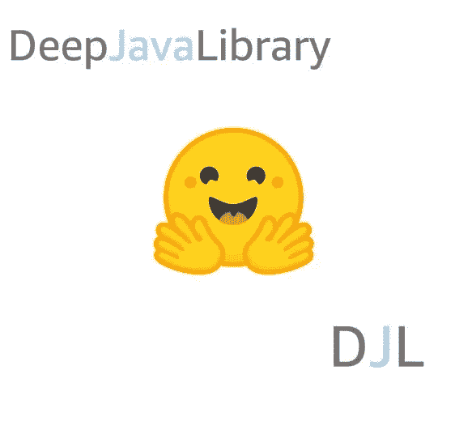

# 使用深度 Java 库在 Java 中部署 HuggingFace NLP 模型

> 原文：<https://pub.towardsai.net/deploy-huggingface-nlp-models-in-java-with-deep-java-library-e36c635b2053?source=collection_archive---------1----------------------->

## 用 HuggingFace 问答模型一步步演示。

作者:冯可欣，李正哲



[HuggingFace](https://huggingface.co/) 是基于 PyTorch 和 TensorFlow 构建的最流行的自然语言处理(NLP)工具包之一。它有各种预训练的 Python 模型用于 NLP 任务，如问题回答和令牌分类。它还提供了强大的记号赋予器工具来处理现成的输入。

HuggingFace 的 API 使初学者只需几行代码就能实现机器学习模型。此外，它为高级用户提供了定制和微调基于变压器的模型的灵活性。然而，由于这个工具包是用 Python 实现的，机器学习(ML)工程师很少有机会将这些模型集成到生产 Java 环境中。今天，如果 ML 工程师要从零开始重构 Java 代码，他们将需要实现数据处理，如超过 10 行代码的图像到数组的转换，以及性能很差的 N 维数组操作。现在有了 Deep Java Library (DJL)，他们只需要一个 line 函数`Image.toNDArray`来转换图像，并利用高性能的阵列操作，这些操作利用了多个 CPU 内核和 GPU。

DJL 为 Java 开发人员提供了一个易于使用的模型加载 API。它为用户提供了从各种来源访问模型工件的灵活性，包括我们预加载的模型动物园、 [HDFS](https://hadoop.apache.org/docs/r1.2.1/hdfs_user_guide.html) 、S3 桶和您的本地文件系统。DJL 还通过捆绑实现所需的标记器和词汇工具来简化数据处理，以实现 HuggingFace 模型。配备了这些功能，HuggingFace 用户可以在 10 分钟内使用 HuggingFace 工具包带来自己的问题回答模型。在这篇博文中，我们一步一步地介绍了如何部署你自己的 HuggingFace 问答模型。

**完整源代码**可在 [**这里**](https://gist.github.com/KexinFeng/97e6344556f88822650d023acfbdf4f5) **。**

## 设置

要开始使用 DJL，请将下面的代码片段添加到您的`build.gradle`文件中，该代码片段定义了必要的依赖关系。

```
plugins {
  id 'java'
}
repositories {                           
  mavenCentral()
}
dependencies {
  implementation "org.apache.logging.log4j:log4j-slf4j-impl:2.17.1"
  implementation platform("ai.djl:bom:0.21.0")
  implementation "ai.djl:api"
  runtimeOnly "ai.djl.pytorch:pytorch-engine"
  runtimeOnly "ai.djl.pytorch:pytorch-model-zoo"
}
```

还要注意，在运行这段代码时，可能还需要用 VM 选项指定默认引擎:`-Dai.djl.default_engine=PyTorch`，它与模型和标记器兼容。

## 把你自己的问答模式带到 DJL

推理工作流与输入预处理、模型前向和输出后处理相结合。DJL 将输入和输出处理封装到翻译器中，并使用预测器进行模型转发。要使用 HuggingFace API 运行问答任务，以 BERT 为例，您需要创建一个`BertTokenizer`来将您的文本输入转换为机器可理解的张量，这是数据预处理的一部分。后期处理主要包括结果索引的转换。DJL 引入了`Translator`结构来封装预处理和后处理数据的工作流。这个例子`Translator`是由`BertTranslator`实现的。

然后你可以加载一个特定的模型，例如`BertForQuestionAnswering`，来运行推理。然后在 logits 的顶部应用`argmax()`来获得结果索引。

## 翻译器概述

`Translator`用于组织预处理和后处理。您定义输入和输出对象。它包含以下两个覆盖类:

*   `public NDList processInput(TranslatorContext ctx, I)`
*   `public String processOutput(TranslatorContext ctx, O)`

每个翻译器接受输入，并以通用对象的形式返回输出。在这种情况下，翻译器以`QAInput` (I)的形式接受输入，并以`String` (O)的形式返回输出。`QAInput`只是一个保存问题和答案的对象。我们为您准备了输入类。输出`String`是您期望从模型中得到的答案。在实现我们的第一个翻译器之前，您需要样本输入。

## 创建一个样本输入

以下代码示例使用`QAInput`为问答任务创建了一个示例输入:

```
String question = "When did BBC Japan start broadcasting?";
String resourceDocument = 
  "BBC Japan was a general entertainment Channel.\n" + 
  "Which operated between December 2004 and April 2006.\n" + 
  "It ceased operations after its Japanese distributor folded.";
QAInput input = new QAInput(question, resourceDocument);
```

## 标记你的输入

DJL 提供了一个内置的`BertTokenizer`来把你的字符串分割成令牌。这个记号赋予器实现如下:

```
BertTokenizer tokenizer = new BertTokenizer();
List<String> tokenQ = tokenizer.tokenize(question.toLowerCase());
List<String> tokenA = tokenizer.tokenize(resourceDocument.toLowerCase());
```

那么输出将是:

```
// tokenQ: [when, did, bbc, japan, start, broadcasting, ?]

// tokenA: [bbc, japan, was, a, general, entertainment, channel, ., which, operated, between, december, 2004, and, april, 2006, ., it, ceased, operations, after, its, japanese, distributor, folded, .]
```

tokenizer 还可以用于将问题和资源文档编码在一起，这增加了用于训练 BERT 模型的特殊标记。您获得了 BERT 模型输入所需的所有元数据。下面的代码示例演示了用于 BERT 模型的三种类型的输入:编码标记、标记类型和 attentionMask。

```
BertToken token = tokenizer.encode(question.toLowerCase(), resourceDocument.toLowerCase());
List<String> tokens = token.getTokens();
List<Long> tokenTypes = token.getTokenTypes();
List<Long> attentionMask = token.getAttentionMask();
```

那么输出将是:

```
tokens: [[CLS], when, did, bbc, japan, start, broadcasting, ?, [SEP], bbc, japan, was, a, general, entertainment, channel, ., which, operated, between, december, 2004, and, april, 2006, ., it, ceased, operations, after, its, japanese, distributor, folded, ., [SEP]]
toeknTypes: [0, 0, 0, 0, 0, 0, 0, 0, 0, 1, 1, 1, 1, 1, 1, 1, 1, 1, 1, 1, 1, 1, 1, 1, 1, 1, 1, 1, 1, 1, 1, 1, 1, 1, 1, 1]
attentionMask: [1, 1, 1, 1, 1, 1, 1, 1, 1, 1, 1, 1, 1, 1, 1, 1, 1, 1, 1, 1, 1, 1, 1, 1, 1, 1, 1, 1, 1, 1, 1, 1, 1, 1, 1, 1]
```

当你使用 hugging face[bertokenizer](https://huggingface.co/transformers/model_doc/bert.html#berttokenizer)时，它会下载词汇表。您可以通过在`from_pretrained`方法中指定`cache_dir`来轻松找到该文件。呼叫`PtBertVocabulary.parse(InputStream)`得到`BertVocabulary`。然后，用`getIndex(token)`将令牌转换为索引，用`getToken(index)`将令牌转换为索引，如下所示。在这个例子中，文件`vocab.txt`可以从我们的公共图片 [**这里**](https://mlrepo.djl.ai/model/nlp/question_answer/ai/djl/pytorch/bertqa/trace_cased_bertqa/0.0.1/bert-base-cased-vocab.txt.gz) 或者 HuggingFace repo [这里](https://huggingface.co/bert-base-uncased/tree/main)下载。

```
Path file = Paths.get("/YOUR PATH/vocab.txt");
Vocabulary vocabulary = DefaultVocabulary.builder()
                        .optMinFrequency(1)
                        .addFromTextFile(file)
                        .optUnknownToken("[UNK]")
                        .build();

// index: 2482
long index = vocabulary.getIndex("car");

// token: car
String token = vocabulary.getToken(2482);
```

## 对输出进行后处理

在模型前向调用之后，您会得到一系列 NDArrays 作为输出。我们将这些打包成一个对象:`NDList`。您可以使用`get(index)`从`NDList`中提取 NDArray。要获得概率最高的索引，您可以应用 argMax，后跟`getLong`，这将标量 NDArray 转换为 Java 原语类型，如下所示:

```
// list is NDList which is the output from the model
NDArray startLogits = list.get(0);
NDArray endLogits = list.get(1);
int startIdx = (int) startLogits.argMax().getLong();
int endIdx = (int) endLogits.argMax().getLong();

// token(BertToken) is generated by the encode method.
List<String> tokens = token.getTokens();

// get the answer
tokens.subList(startIdx, endIdx + 1).toString();
```

## 实现 BertTranslator

现在，您可以将上述预处理和后处理结合在一起，创建自己的翻译器`BertTranslator`。接下来，它将用于构建`Criteria`和`predictor`。

```
public class BertTranslator implements Translator<QAInput, String> {
  private List<String> tokens;
  private Vocabulary vocabulary;
  private BertTokenizer tokenizer;

  @Override
  public void prepare(TranslatorContext ctx) {
    Path path = Paths.get("/YOUR PATH/vocab.txt");
    vocabulary = DefaultVocabulary.builder()
                .optMinFrequency(1)
                .addFromTextFile(path)
                .optUnknownToken("[UNK]")
                .build();
    tokenizer = new BertTokenizer();
  }

  @Override
  public NDList processInput(TranslatorContext ctx, QAInput input){
    BertToken token =
      tokenizer.encode(
        input.getQuestion().toLowerCase(),
        input.getParagraph().toLowerCase()
      );
    // get the encoded tokens used in precessOutput
    tokens = token.getTokens();
    NDManager manager = ctx.getNDManager();
    // map the tokens(String) to indices(long)
    long[] indices =
      tokens.stream().mapToLong(vocabulary::getIndex).toArray();
    long[] attentionMask = 
      token.getAttentionMask().stream().mapToLong(i -> i).toArray();
    long[] tokenType = token.getTokenTypes().stream()
      .mapToLong(i -> i).toArray();
    NDArray indicesArray = manager.create(indices);
    NDArray attentionMaskArray =
      manager.create(attentionMask);
    NDArray tokenTypeArray = manager.create(tokenType);
    // The order matters
    return new NDList(indicesArray, attentionMaskArray,
      tokenTypeArray);
  }

  @Override
  public String processOutput(TranslatorContext ctx, NDList list) {
    NDArray startLogits = list.get(0);
    NDArray endLogits = list.get(1);
    int startIdx = (int) startLogits.argMax().getLong();
    int endIdx = (int) endLogits.argMax().getLong();
    return tokenizer.tokenToString(tokens.subList(startIdx, endIdx + 1));
  }

  @Override
  public Batchifier getBatchifier() {
    return Batchifier.STACK;
  }
}
```

## 从本地文件系统加载您自己的模型

在这一步，我们将构建`Criteria` API，它被用作搜索 ZooModel 的搜索标准。在这个应用程序中，将指定本地 TorchScript 模型的目录，以便相应地加载 ZooModel，使用`.optModelPath()`。下面的代码片段用文件路径加载模型:`/YOUR PATH/trace_cased_bertqa.pt`。这个 TorchScript 的模型文件可以在我们的 [**公众号这里**](https://mlrepo.djl.ai/model/nlp/question_answer/ai/djl/pytorch/bertqa/trace_cased_bertqa/0.0.1/trace_cased_bertqa.pt.gz) 找到。也可以从 [HuggingFace](https://huggingface.co/transformers/model_doc/bert.html#bertforquestionanswering) 下载然后按照 [djl 教程](https://docs.djl.ai/docs/pytorch/how_to_convert_your_model_to_torchscript.html)或者[官方教程](https://huggingface.co/transformers/torchscript.html)用 TorchScript 格式保存模型。

```
BertTranslator translator = new BertTranslator();
Criteria<QAInput, String> criteria = Criteria.builder()
  .setTypes(QAInput.class, String.class)
  .optModelPath(Paths.get("/YOUR PATH/trace_cased_bertqa.pt"))
  .optTranslator(translator)
  .optProgress(new ProgressBar()).build();
ZooModel<QAInput, String> model = criteria.loadModel();
Predictor<QAInput, String> predictor = model.newPredictor(tranlator));
return predictor.predict(input);
```

Criteria API 之前在[在 5 分钟内用 PyTorch 在 Java 中实现对象检测的博文](https://towardsdatascience.com/implement-object-detection-with-pytorch-in-java-in-5-minutes-c3ba5769e7aa)中介绍过，它用于从预先上传的模型动物园中加载模型。对于问答模型，我们将 BERT 模型上传到我们的模型动物园，该模型通过[拥抱脸](https://huggingface.co/transformers/model_doc/bert.html#bertforquestionanswering)的小队进行了微调。有关该型号的更多信息，请参见 [BERT QA 示例](https://github.com/awslabs/djl/blob/master/examples/docs/BERT_question_and_answer.md)。

## 把所有东西放在一起

现在，将所有东西放在一起，您就可以使用与上面创建的翻译器捆绑在一起的模型来运行推理了。

```
public static void main(String[] args) {
  String question = "When did BBC Japan start broadcasting?";
  String paragraph =
    "BBC Japan was a general entertainment Channel. "
    + "Which operated between December 2004 and April 2006\. "
    + "It ceased operations after its Japanese distributor folded.";
  QAInput input = new QAInput(question, paragraph);

  String answer = HuggingFaceQaInference.qa_predict(input);
  System.out.println("The answer is: \n" + answer);
}
```

下面是演示输入和输出:

```
String paragraph =
  "BBC Japan was a general entertainment Channel. "
  + "Which operated between December 2004 and April 2006\. "
  + "It ceased operations after its Japanese distributor folded.";

String question = "When did BBC Japan start broadcasting?";
// The answer is:
// december 2004
String question = "What is BBC Japan?"
// The answer is:
// a general entertainment channel
String question = "When did it cease operations?"
// The answer is: 
// april 2006
```

如果你是 Java 程序员，恭喜你！现在，您可以轻松访问 HuggingFace QA 模型。点击 [**此处**](https://gist.github.com/KexinFeng/97e6344556f88822650d023acfbdf4f5) 查看**完整源代码**。

您还可以轻松地将推理代码片段与 [Apache Spark](https://github.com/deepjavalibrary/djl-demo/tree/master/apache-spark/image-classification) 、 [Apache Flink](https://github.com/deepjavalibrary/djl-demo/tree/master/apache-flink/sentiment-analysis) 和 [Quarkus](https://github.com/aws-samples/djl-demo/tree/master/quarkus/example) 集成。

## 结论

在这篇博文中，我们展示了如何使用 Deep Java 库实现自己的拥抱脸翻译器，以及如何对更复杂的模型进行推理的示例。有了这些知识，您应该能够在 Java 应用程序上从 HuggingFace 部署自己的基于 transformer 的模型，包括 SpringBoot 和 Apache Spark。

如果你是 Python 用户，AWS SageMaker 最近宣布与 HuggingFace 合作，推出一种新的拥抱脸深度学习容器(DLCs)。它提供了一个强大的 Python SDK，以减少在 API 可用性和性能方面最先进的 HuggingFace 模型从科学到生产的差距。你可以找到更多关于合作关系的细节:亚马逊 SageMaker 和拥抱脸和[使用亚马逊 SageMaker 的拥抱脸——亚马逊 SageMaker](https://docs.aws.amazon.com/sagemaker/latest/dg/hugging-face.html) 。

免责声明—本文仅代表作者个人观点。这不是该组织的正式文件。