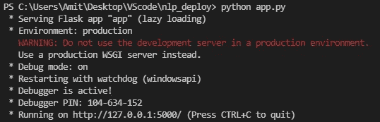
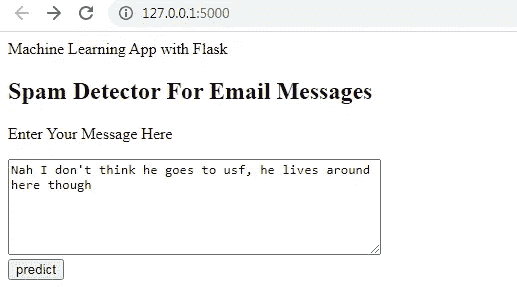
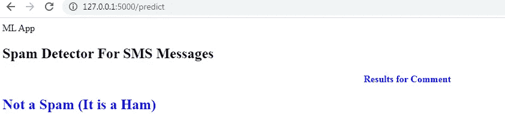

# 使用 Flask 部署 NLP 模型

> 原文：<https://pub.towardsai.net/deploy-nlp-model-using-flask-7be1350e6ebe?source=collection_archive---------0----------------------->

## [自然语言处理](https://towardsai.net/p/category/nlp)

## 基于 HTML 静态页面的机器学习模型部署


由 [Artem Sapegin](https://unsplash.com/@sapegin?utm_source=medium&utm_medium=referral) 在 [Unsplash](https://unsplash.com?utm_source=medium&utm_medium=referral) 上拍摄

本文将带您进入使用 flask 和静态 HTML 页面进行部署的奇妙旅程。这两个工具的作用对于制作数据科学和机器学习领域的 web app 非常重要。

机器学习领域在把模型部署到他们自己身上，做了 web app 之后，变得更加有趣。使用这种新方法，学习过程变得更快。

用于部署的文件结构如下所示:

```
/web-app
|
|--static/
|   |--style.css
|--templates/
|   |--home.html
|   |--result.html
|--app.py
|--spam.csv
```

在这里，我们将讨论以下主题:

```
1\. Flask
2\. HTML page design
3\. CSS page
4\. Deploy in local machine
5\. VScode IDE
```

> ***烧瓶***

我们将只在 flask 应用程序文件中创建一个模型，而不是在 jupyter 或 spyder IDE 中创建。这也是了解 app 文件本身模型制作的有趣之处。

烧瓶的导入方法:

*   Flask: Flask 是一个简单易用的 web 框架解决方案，轻量级，适合数据科学和机器学习项目。
*   **Render_Template:** 与 HTML 页面一起使用，从模板文件夹中的 HTML 生成输出。
*   **请求:**以键值对的形式作为字典，包含客户端发送给服务器的数据。

从 sklearn 导入库:

*   **计数矢量器:**用于将文本转换为文本中单词的向量计数(频率)。
*   **MultinomialNB:** 用于提供训练向量生成离散分类后计数的概率。

[](/types-of-kernels-in-machine-learning-291cf85fcdd0) [## 机器学习中的核类型

### 使用线性函数解决非线性问题

pub.towardsai.net](/types-of-kernels-in-machine-learning-291cf85fcdd0) [](https://medium.com/pythoneers/forget-html-and-flask-start-using-streamlit-1b394cfe4595) [## 忘记 HTML 和 Flask，开始使用 Streamlit

### 数据科学和机器学习的 WebApp 框架

medium.com](https://medium.com/pythoneers/forget-html-and-flask-start-using-streamlit-1b394cfe4595) 

应用程序文件 python 代码如下所示:

```
from flask import Flask,render_template,url_for,request
import pandas as pd
import pickle
from sklearn.feature_extraction.text import CountVectorizer
from sklearn.naive_bayes import MultinomialNB
import pickleapp = Flask(__name__)@app.route('/')
def home():
    return render_template('home.html')@app.route('/predict',methods=['POST'])
def predict():
    df= pd.read_csv("spam.csv", encoding="latin-1") # Features and Labels
    df['label'] = df['class'].map({'ham': 0, 'spam': 1})
    X = df['message']
    y = df['label']

    # Extract Feature With CountVectorizer
    cv = CountVectorizer()
    X = cv.fit_transform(X)    from sklearn.model_selection import train_test_split
    Xtrain, Xtest, ytrain, ytest = train_test_split(X, y,
                                  test_size=0.25, random_state=42) #Naive Bayes Classifier
    from sklearn.naive_bayes import MultinomialNB clf = MultinomialNB()
    clf.fit(Xtrain,ytrain)
    clf.score(Xtest,ytest) if request.method == 'POST':
        message = request.form['message']
        data = [message]
        vect = cv.transform(data).toarray()
        my_prediction = clf.predict(vect)
    return render_template('result.html',prediction = my_prediction)if __name__ == '__main__':
    app.run(debug=True)
```

> ***HTML 页面设计***

在这个页面上，我们设计了两个 HTML 页面来预测文本。

带有 home.html 的第一张纸用于从用户那里获取信息。

home.HTML 的代码如下所示:

```
<!DOCTYPE html>
<html>
<head>
    <title>Home</title>

    <link rel="stylesheet" type="text/css" href="{{
                  url_for('static', filename='css/styles.css') }}">
</head>
<body>
    <header>
       <div class="container">
        <div id="brandname">
              Machine Learning App with Flask
        </div>
        <h2>Spam Detector For Email Messages</h2>
       </div> </header>

       <div class="ml-container">
           <form action="{{ url_for('predict')}}" method="POST">
            <p>Enter Your Message Here</p>
            <!-- <input type="text" name="comment"/> -->
            <textarea name="message" rows="6" cols="50"></textarea>
            <br/>
            <input type="submit" class="btn-info" value="predict">
         </form>
       </div></body>
</html>
```

带有 result.html 的第二张表用于从主页获得预测结果。

result.HTML 的代码如下所示:

```
<!DOCTYPE html>
<html>
<head>
    <title></title>
    <link rel="stylesheet" type="text/css" href="{{ 
                url_for('static', filename='css/styles.css') }}">
</head>
<body>
    <header>
      <div class="container">
        <div id="brandname">
            ML App
        </div>
        <h2>Spam Detector For SMS Messages</h2>
      </div> </header>
    <p style="color:blue;font-size:20;text-align: center;"
    <b>Results for Comment</b></p>
       <div class="results">
          
          <h2 style="color:red;">Spam</h2>
          
          <h2 style="color:blue;">Not a Spam (It is a Ham)</h2>
          
       </div>
</body>
</html>
```

> ***CSS 页面***

CSS 是一个级联样式表，用于增强 HTML 页面的外观。

CSS 代码如下所示:

```
body{
     font:15px/1.5 Arial, Helvetica,sans-serif;
     padding: 0px;
     background-color:#f4f3f3;
}.container{
     width:100%;
     margin: auto;
     overflow: hidden;
}header{
     background:#03A9F4;#35434a;
     border-bottom:#448AFF 3px solid;
     height:120px;
     width:100%;
     padding-top:30px;
}.main-header{
     text-align:center;
     background-color: blue;
     height:100px;
     width:100%;
     margin:0px;
}#brandname{
    float:left;
    font-size:30px;
    color: #fff;
    margin: 10px;
}header h2{
    text-align:center;
    color:#fff;
}.btn-info {
    background-color: #2196F3;
    height:40px;
    width:100px;} /* Blue */

.btn-info:hover {background: #0b7dda;}.resultss{
    border-radius: 15px 50px;
    background: #345fe4;
    padding: 20px;
    width: 200px;
    height: 150px;
}
```

[](https://medium.com/pythoneers/word-cloud-app-with-streamlit-framework-in-python-4b9b440d485) [## Python 中带有 Streamlit 框架的 Word Cloud 应用程序

### 使用 streamlit WebApp 框架的频繁出现词的 NLP 任务

medium.com](https://medium.com/pythoneers/word-cloud-app-with-streamlit-framework-in-python-4b9b440d485) 

> ***部署在本地机***

为了在本地机器上部署，我们使用了 visual studio 代码编辑器。运行应用程序文件的命令如下所示:

```
python app.py
```



作者的照片

获得如上图所示的链接后，将其粘贴到浏览器中。然后页面会像这样打开，如下所示:



作者的照片

现在，写出句子知道它是垃圾邮件还是火腿，然后点击预测按钮。



作者的照片

result.html 文件将打开，结果是它是一个火腿。

> ***结论***

本文给出了在本地机器上部署机器学习模型的基本思想。

我希望你喜欢这篇文章。通过我的 [LinkedIn](https://www.linkedin.com/in/data-scientist-95040a1ab/) 和 [twitter](https://twitter.com/amitprius) 联系我。

# 推荐文章

1.[8 Python 的主动学习见解收集模块](/8-active-learning-insights-of-python-collection-module-6c9e0cc16f6b?source=friends_link&sk=4a5c9f9ad552005636ae720a658281b1)
2。 [NumPy:图像上的线性代数](/numpy-linear-algebra-on-images-ed3180978cdb?source=friends_link&sk=d9afa4a1206971f9b1f64862f6291ac0)3。[Python 中的异常处理概念](/exception-handling-concepts-in-python-4d5116decac3?source=friends_link&sk=a0ed49d9fdeaa67925eac34ecb55ea30)
4。[熊猫:处理分类数据](/pandas-dealing-with-categorical-data-7547305582ff?source=friends_link&sk=11c6809f6623dd4f6dd74d43727297cf)
5。[超参数:机器学习中的 RandomSeachCV 和 GridSearchCV](/hyper-parameters-randomseachcv-and-gridsearchcv-in-machine-learning-b7d091cf56f4?source=friends_link&sk=cab337083fb09601114a6e466ec59689)
6。[用 Python](https://medium.com/towards-artificial-intelligence/fully-explained-linear-regression-with-python-fe2b313f32f3?source=friends_link&sk=53c91a2a51347ec2d93f8222c0e06402)
7 全面讲解了线性回归。[用 Python](https://medium.com/towards-artificial-intelligence/fully-explained-logistic-regression-with-python-f4a16413ddcd?source=friends_link&sk=528181f15a44e48ea38fdd9579241a78)
充分解释了 Logistic 回归 8。[数据分发使用 Numpy 与 Python](/data-distribution-using-numpy-with-python-3b64aae6f9d6?source=friends_link&sk=809e75802cbd25ddceb5f0f6496c9803)
9。[机器学习中的决策树 vs 随机森林](/decision-trees-vs-random-forests-in-machine-learning-be56c093b0f?source=friends_link&sk=91377248a43b62fe7aeb89a69e590860)
10。[用 Python 实现数据预处理的标准化](/standardization-in-data-preprocessing-with-python-96ae89d2f658?source=friends_link&sk=f348435582e8fbb47407e9b359787e41)