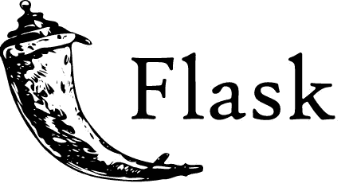
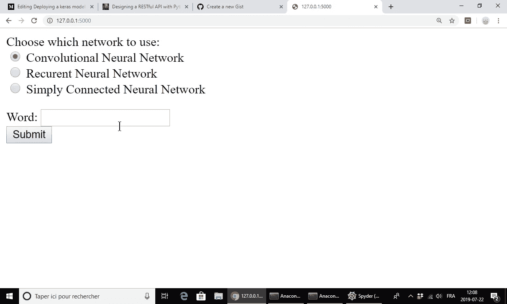
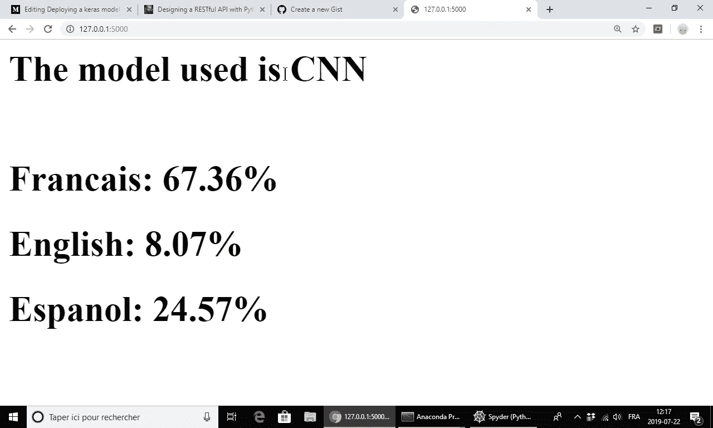
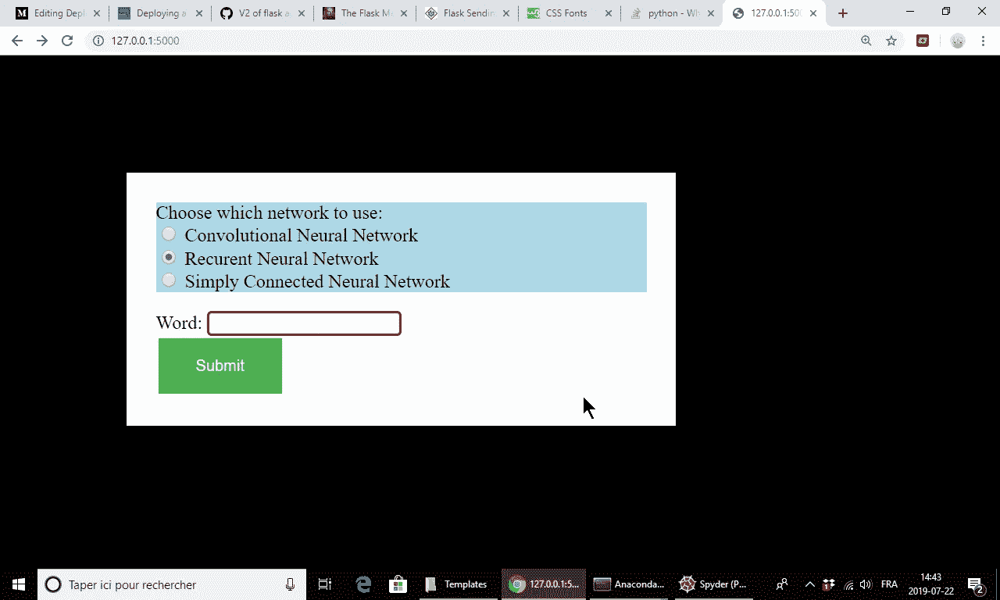
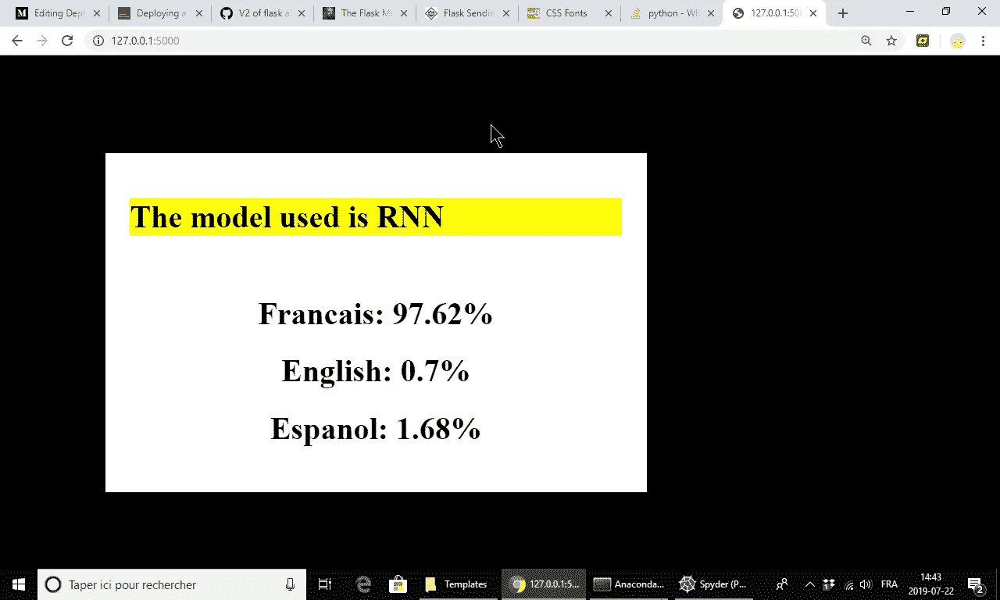

# 使用 Flask 将 Keras 模型部署为 API

> 原文：<https://pub.towardsai.net/deploying-a-keras-model-as-an-api-using-flask-177583300073?source=collection_archive---------0----------------------->



## [机器学习](https://towardsai.net/p/category/machine-learning)

## 使用 flask 库将语言标识符 Keras 模型部署到 web 应用程序和基于 URL 的 API 中。

训练一个神经网络来完成一项特定的任务非常有趣，但是当你对模型的表现感到满意时，这项工作不会停止。能够与其他可能想要使用它的人共享您构建的模型是非常有用的。这对个人项目和行业工作都很重要。这就是为什么我想学习如何部署我建立的模型来识别一个单词是用哪种语言写的。我在[之前的一篇博文](https://medium.com/towards-artificial-intelligence/comparing-neural-network-architectures-through-language-classifier-using-google-colab-63167c18b919?source=post_page---------------------------)中解释了训练的细节，但是理解这篇文章后面的所有内容并不一定重要。

我选择从我认为最简单的部署模型的方式开始。我发现在 python 中使用 Flask 库非常简单，并且提供了许多选项。这允许我将我的模型部署到 API 中。API 是一个*应用程序编程接口*，它在不同的软件之间建立链接。例如，当开发人员想要制作一个用户可以拍照的手机应用程序时，他不必进行任何硬编码来访问手机的摄像头。有一个 API 在应用程序和相机之间建立连接。在数据科学领域，我们经常在网站上遇到 API，它们允许我们以简单的方式访问网站的数据。

在我的例子中，使用这样的 API 部署模型还有另一个非常重要的原因。用户不需要了解任何关于深度学习的知识就可以使用该模型。他只需要最低限度地指定要分类的单词，API 在后台调用模型，并只将结果发送给用户。这使得该模型可被广泛访问，更私密且易于修改。基本上可以使用任何编程语言访问 API，所以没有什么真正取决于我的实现。

我在这里讨论的一切都是为了使 API 在本地可用，这样拥有该文件的人就可以使用它。当然，在现实生活中，下一步是让这个 API 在线可用。有各种方法可以做到这一点，但我还没有把重点放在这一点上。也许这将是未来博客的主题，或者是这篇博客的更新。

API 的代码可以在项目的 [GitHub 库](https://github.com/yangobeil/language-identifier?source=post_page---------------------------)上的文件‘app _ v1 . py’，‘app _ v1 _ 1 . py’和‘app _ v2 . py’中找到。

# 设置和背景

对于这个特殊的项目，我决定部署我以前训练过的模型来分类英语、法语或西班牙语单词。输入只是一个单词，它需要被转换成一个数组，以便输入到神经网络中。我已经为此创建了一个简单导入的函数“word_to_array”。事实上，我训练了四个不同的模型来完成这项任务，因此 API 可以选择使用哪一个来进行预测。使用的模型是简单连接网络(称为 FF)、卷积神经网络(称为 CNN)和递归神经网络(称为 RNN)。每个模型都用 Keras 保存到名为“model？？？. hdf5 '。网络的输出是每种语言的概率。

除了上面提到的文件及其依赖项 NumPy 和 Keras，唯一需要安装的额外包是 Flask，使用 pip 可以很容易地完成。Tensorflow 本身也是有必要的，原因很蠢。

我实现了一个 API 版本，它为用户创建了一个 web 表单，用户可以输入他们的单词并获得预测。我还做了一个更漂亮的版本。我终于做出了一个可以从编码环境直接访问的版本。

# 烧瓶基础

首先要了解 Flask 是如何工作的，至少在这个项目的上下文中是这样的。当然，第一步是导入项目所需的方法。然后必须定义并启动 Flask app。

“请求”方法用于与应用程序通信，“jsonify”方法用于将 python 字典转换为 JSON 格式，“渲染模板”用于包含 HTML 模板。下一步是简单地定义应用程序要使用的功能。

这是一个简单的函数，用于加载要使用的 Keras 模型并将它们存储在字典中。它们被定义为全局变量，因为该函数只被调用一次来加载模型。根据代码的结构方式，将模型作为输出并使用该输出会使应用程序在每次使用时加载模型，这是非常低效的。最后两行是为将来运行模型所必需的步骤准备的，因为 Keras 在与 Flask 结合使用时存在兼容性问题。

现在是应用程序的关键部分。

第一行定义了以下函数在 web 应用程序中的发布位置。路径可以是任何东西('/'只是指主页)，在一个应用程序中可以有许多不同的路径。“方法”选项用于指定路由作为请求应该期望得到什么。这个帖子最常见的是 GET 和 post，GET 表示用户从应用程序获取信息，POST 表示用户向应用程序发送信息。还存在更新数据的 PUT 和删除数据的 DELETE。定义了路由之后，就有了在该路由中使用的功能。其内容在很大程度上取决于上下文，这是我在下面详细描述的。最后，最后一点代码是 API 实际运行的地方。首先加载模型，然后启动应用程序。在应用程序之外加载模型是我在上面将它们定义为全局变量的原因。将它们放在应用程序中会导致每次加载页面时额外的加载时间。

# 基本 HTML

为了理解 API 的第一个版本，其中涉及到网页，有必要对 HTML 有一个基本的了解。我试图在这里涵盖非常基本的内容，很多额外的信息可以在网上找到，例如在[https://www.w3schools.com/html/](https://www.w3schools.com/html/?source=post_page---------------------------)。

HTML 是网络浏览器用来制作网页的语言。在 HTML 中，每个对象都是由以下形式的标签组成的

```
<tagname option=...> text </tagname>
```

最常见的标签在开头包含一个开始标签<name>，在结尾包含一个结束标签</name>。其中一些最重要的是:

*   标题

    # ，…，

    ###### :h1 标签是最重要的一个，然后它的尺寸就变小了。

*   段落

    :正文由段落组成。

*   超链接:选项‘href’指定了链接，标签之间的文本就是链接的文本。
*   :整个代码必须包含在 HTML 标签之间。
*   :经常出现在顶部，包含元数据。
*   :网页本身的代码包含在 body 标签之间。
*   换行符
    :在文本中创建一个换行符，以便在任何地方插入新的一行。它是单独的，所以不需要结束标签。

这个项目需要的最后一种标签是**表单**。这些通常不是最重要的，但在这里它们变得非常有用。整个表单包含在<表单>标签之间。然后使用带有各种选项的<输入>标签编写表单的交互部分。每个输入都必须有一个“名称”选项值来标识它。“type”选项显然决定了标签是什么类型的输入。我用的三个是:

*   文本:制作一个框来写文本。
*   收音机:多项选择选择器。每个选项必须有一个“值”选项来标识它们，同一组中的每个选择器必须有相同的“名称”选项。
*   提交:带有文本的按钮。使用“值”选项定义文本。

表单的其余部分是纯文本，用于填充交互部分之间的空隙。所有这些概念的例子将在后面的代码中给出。

# 版本 1:在网页上

我用来部署我的模型的第一种方法是构建一个简单的 web 应用程序，它接受用户的一些输入，调用 Keras 模型，并在浏览器中直接发送回结果。要使用的函数如下。

那里发生了一些事情。首先，web 浏览器发出 GET 请求，从 API 获取信息。这意味着第一个代码块被忽略，因为它仅在发出 POST 请求时使用，如函数“request.method”所示。然后，该函数返回向用户显示以下表单的 HTML 代码。



form 标记中的“method”选项用于确保一旦按钮被单击，就会发出 POST 请求。然后执行代码的第一部分。“request.form.get()”函数通过名称在表单中查找元素并返回其值。这用于存储要使用的模型的单词和名称，然后从字典中选择。下一步是将单词转换成一个数组，该数组将被输入神经网络。不同的模型接受不同的形状，所以需要有条件。最后，使用该模型进行预测。这就是 Keras 的问题所在，使用 TensorFlow 命令可以解决这个问题。然后，该函数返回 HTML 代码，以下面的方式显示结果。



要运行这个应用程序，只需在命令行中键入

```
python app_v1.py
```

将显示一些信息，包括用于访问应用程序的链接(类似于“ [http://127.0.0.1:5000/](http://127.0.0.1:5000/) ”)。在 web 浏览器中复制它，结果将是上面显示的表单，您可以与之交互。调试模式在这个版本中是关闭的，因为它已经被测试过了，但是在 app.run()部分中打开它可以访问一个不错的控制台，当错误发生时它会报告错误。

## 1.1 版:使用模板

令人印象深刻的是网页的 HTML 代码可以变得很大很快，所以以前的方法对更复杂的页面不是很有用。这就是为什么在 Flask 中调用预制模板并使用应用程序修改一些值是可能的。较大的网页也涉及 CSS(可能还有 javascript)代码，所以我们也需要知道如何处理。模板需要包含在一个名为“templates”的文件夹中，CSS 和 JS 在一个“static”文件夹中。HTML 模板只是普通的页面，但是在括号{{ }}之间定义了外部变量。我在结果页面中使用的例子如下。

```
<!DOCTYPE html>
<html><header>
 <link rel="stylesheet" href="static/style.css">
</header><body>
    <div class="container">
                 <h1 class="word"> The model used is {{ model }}</h1><br>
          <div class="results">
                 <h1 class="result"> Francais: {{ fr }}%</h1>
                 <h1 class="result"> English: {{ en }}%</h1>
                 <h1 class="result"> Espanol: {{ es }}%</h1>
          </div>
    </div>
</body></html>
```

主页的代码大部分和以前一样，但是在一个单独的文件中。我还包含了一些基本的 CSS，但这并不相关，所以你可以在 GitHub 库的 style.css 文件中看到它。实际 python 脚本中的代码现在非常简单，因为我只需要加载模板。

唯一的新东西是我使用了函数“render_templates”来包含模板。我只需要根据变量在 HTML 文件中的名字给它参数。

现在，生成的 web 应用程序看起来更好了。(其实不算太漂亮，但是比以前好多了。通过更多的工作，它可以做得更好。)



对于更复杂的网页，知道可以访问输入方法、执行循环和在模板中定义变量可能是有用的。能够为页面创建一个框架并为站点上的每个网页继承它也是非常有用的。

# 版本 2:在 URL 中

共享我的模型的第二种方式是通过使用 URL 的查询。这对于希望从自己的代码中调用模型的开发人员来说非常有用。他们只需使用像 python 中的 urllib 请求这样的库来调用 API 并返回结果，而无需使用 Keras。这种情况下使用的函数定义如下。

这一次没有在应用程序路由中指定方法，因为不涉及浏览器。用户通过修改他所请求的链接来指定选项，并且使用“request.args.get()”来获取选项的值。这里使用它来获取模型的单词和名称。然后选择模型并进行预测。所有的结果都保存在一个字典中，这个字典被转换成 JSON 格式返回，因为这是 API 要处理的事情。

要访问 API，只需像以前一样运行代码，并使用提供的链接发出 GET 请求。下面是一个使用请求库的例子

这个请求的输出是一个包含所请求信息的字典。

```
{'English': 28.93,
 'Espanol': 4.5,
 'Francais': 66.57,
 'model': 'RNN',
 'word': 'orignal'}
```

这种通用选项请求的一般格式是

```
[www.api.com/page?option1=value1&option2=value2](http://www.api.com/page?option1=value1&option2=value2)
```

希望有些人会对此感兴趣。这是 ML/DL 中不太光彩的一部分，但是当人们真正使用你的模型时，这是非常重要的。我会试着写一些关于把 API 放到网上的东西。即使完成了这一步，知道这不一定是结束也是好的。例如，需要采取一些步骤从用户那里获取反馈，并进行自动测试以防止崩溃。