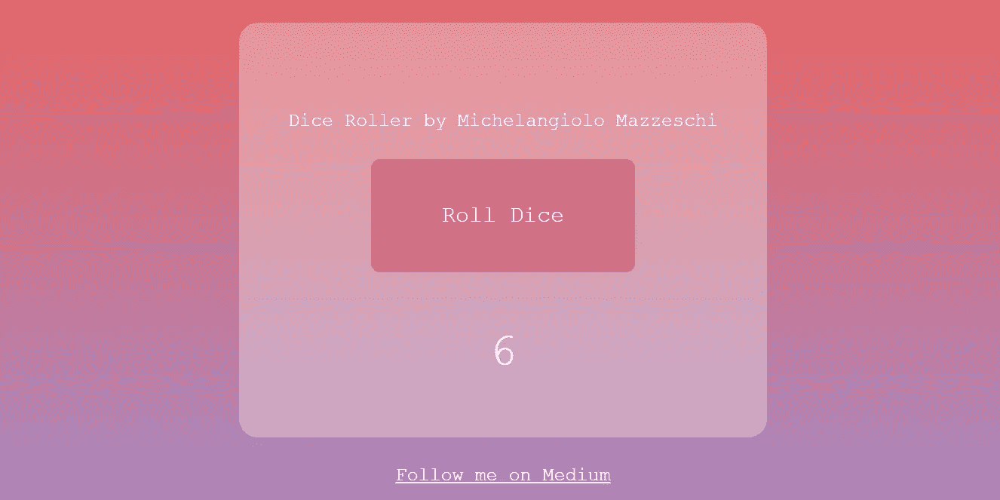
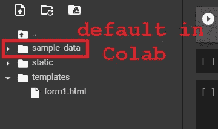
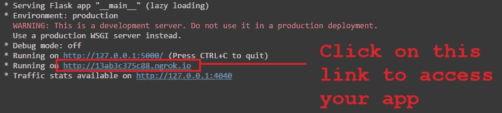
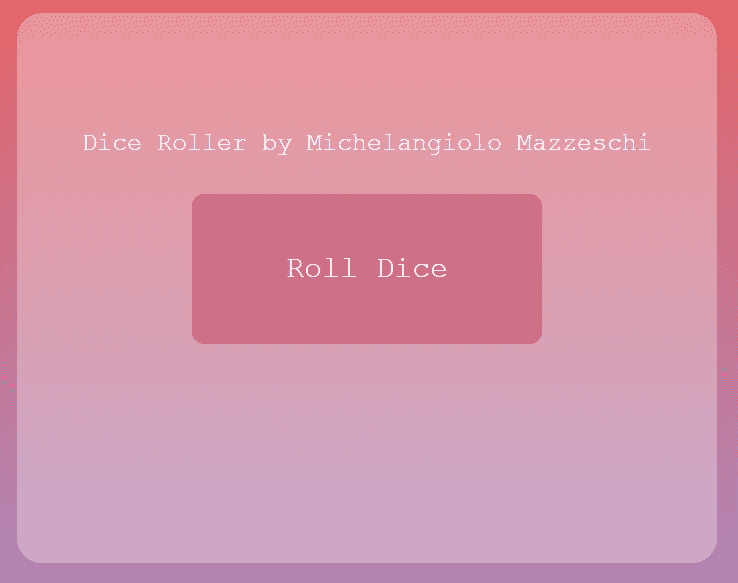
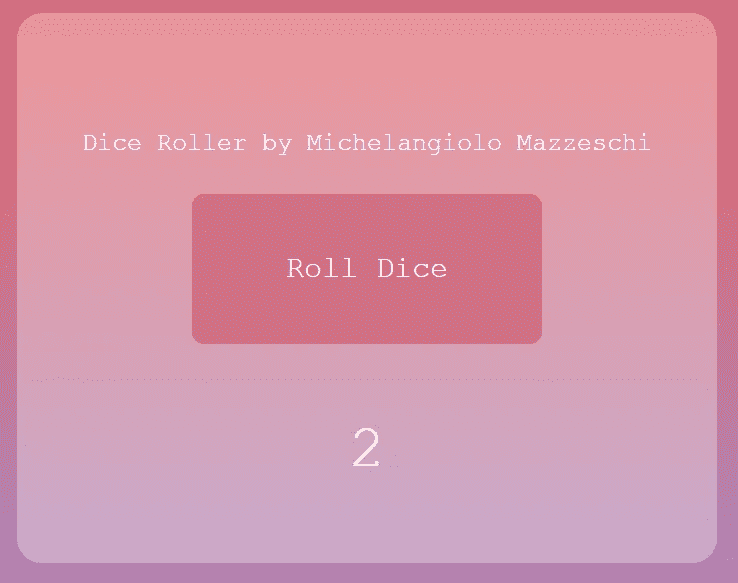
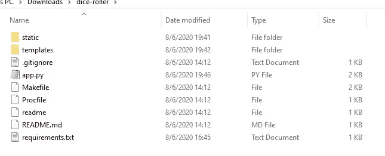
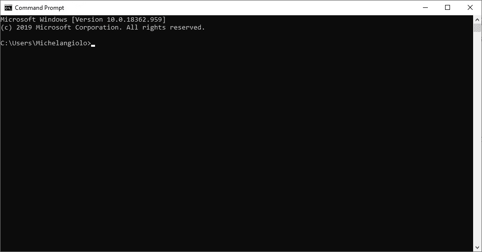

# 用 Flask 和 Heroku 在网上部署算法(免费)

> 原文：<https://pub.towardsai.net/deploying-algorithms-on-the-web-with-flask-and-heroku-for-free-4964fc010a52?source=collection_archive---------0----------------------->

## [人工智能](https://towardsai.net/p/category/artificial-intelligence)，[编程](https://towardsai.net/p/category/programming)

## 在部署一个人工智能模型之前，让我们从部署一个算法开始

在本文中，我将指导您使用 Heroku 在 web 上部署一个简单的算法。部署是完全免费的，你只需要下载一些软件包。你的应用程序部署到网络上后，每个人都可以使用它。

**注:**原谅我算法的简单，AI 模型的部署需要额外的库，这可能会在开发应用程序时导致更大的问题。现在，我想把重点放在最简单的问题上。



这是最终版本，[试试吧！](https://dice-roller-ardito-bryan.herokuapp.com/)

本教程的整个步骤将是:

1.  算法的创建
2.  创建一个简单的图形界面
3.  使用 Flask 连接两者:远程测试
4.  安装工具以在 Windows 10 上部署应用程序
5.  部署应用程序

# 1.算法的创建

为了随机掷骰子，我将使用这个随机数发生器。当这个函数被调用时，它将返回一个介于 1 和 6 之间的随机数。

```
def dice_roller():
  import random
  #roll dice
  return int(random.random()*6)+1
```

# 2.图形界面的创建

不幸的是，如果您是后端程序员，您可能不愿意涉足前端编程的奇迹和奥秘。最难做的事情之一是计算机图形，包括网页界面和网页设计。这和一般的 AI 或者算法相比是完全不同的。事实上，我发现 HTML 比任何回溯算法都难。下面的代码创建 web 应用程序的图形。这将允许用户与应用程序背后的后端算法进行通信。

## CSS 部分

通常，CSS 和 HTML 被分成两个文档。然而，为了简单起见，我决定将它们合并到一个页面中。每当我需要编辑一些东西时(当我在使用网络应用程序时，一天要编辑 10-15 次)，我可以通过打开一个页面来完成。

你可以立即在[www.w3schools.com 上试用代码。我](http://www.w3schools.com,)发现它是[使用起来最简单的界面](https://www.w3schools.com/tryit/tryit.asp?filename=tryhtml_default)。在这段代码中，当你在 tryitEditor 上运行代码时，CSS 和 HTML **不是分开的文档**在同一个编辑器中复制两个分区。


确保您在编辑器中正确地复制并粘贴了它们，然后单击 Run 以查看页面的外观。

```
<!DOCTYPE html>
<html><style>
  html {
    height: 100%;} 
  .wrapper {
    margin-right: auto; /* 1 */
    margin-left: auto; /* 1 */
    max-width:700px; /* 2 */
    height: 550px;
    padding-right: 0px; /* 3 */
    padding-left: 0px; /* 3 */
    background-color: rgb(38, 38, 38);
    border-radius: 25px;
    text-align: center;
  }
  .text {
    font-family: "Courier New";
    #font-weight: bold;
    #font-weight: 90;
    font-size: 25px;
    color: white;
  }
  .button{
   margin:auto;
    text-align: center;
   display:block;
    border-radius: 12px;
    border-style: none;
    font-size: 20px;
    height: 50px;
    width: 100px;
  }
  .submit{
   margin:auto;
   display:block;
    border-radius: 12px;
    border-style: none;
    height:  150px;
    width: 350px;
    vertical-align: top;
   text-align: center;
    font-family: "Courier New";
    font-size: 20px;
    cursor: pointer;
  }
     /**
     .
 */
  }
}
</style>
```

## HTML 部件

```
<br></br>

<body class="wrapper" style="background: linear-gradient(#e66465, #9198e5)">
  <div class="wrapper" style="background-color:rgb(255, 255, 255, 0.3)">
      <div class="text">
      <br></br>
      <br></br>
   Dice Roller by Michelangiolo Mazzeschi
      </div>
      <br></br>

      <form>
     <input class="submit" type="submit" value="Roll Dice" formmethod="post" style="background-color:rgb(208, 113, 133, 1); color: white; font-size: 30px;">
      </form>

      <br></br>
      <br></br>
      <div class="text" style="font-size: 60px;">
   {{coin_output}}
      </div></div>
</body><br></br>
<a href="[https://medium.com/@ardito.bryan](https://medium.com/@ardito.bryan)" class="text" >
   Follow me on Medium
</a></html>
```

*   在结束这一部分之前，请注意{{coin_output}}，这是一个可以使用 python 代码传入的变量，它将作为代码和接口之间的一种通信方式。
*   第二个需要强调的是“掷骰子”按钮被放在两个括号中。这将允许您的页面执行 POST 请求。

* * *记住将您的代码保存在 pc 中的 HTML 文档中。你可以把这个文件夹叫做 form1.html。稍后我会提供进一步的指示。

# 3.创建您自己的应用程序界面

在这种情况下，您有两种选择:

*   自己写 HTML + CSS 代码
*   使用在线编辑器

虽然最显而易见的选择是使用在线编辑器，因为简单，但是有一个**意想不到的问题**。经过几次令人沮丧的尝试后，我发现任何编辑都会在你的页面中添加大量的代码…

我的意思是，它在你的源代码中嵌入了函数、预置、预制样式，甚至一些 CSS 引用和 Javascript 代码。在这种情况下，我决定从头开始制作整个东西的原因是，我想要:

*   清晰的设计
*   清晰的代码

我向你保证，我有点纠结，但是在做了结构化笔记后，结果让我比使用我在网上找到的任何预制样本更有效率。

## 正在创建 app.py

现在是时候创建应用程序背后的代码了。本质上，您正在将您的算法连接到一个 web 应用程序，并且您需要非常特定的工具来完成这一点。主要是，您有两种选择(还有其他工具，但这些是开发人员中使用最多的):

*   瓶
*   姜戈

虽然 Django 用于大型 web 应用程序(相信我，除非你真的知道自己在做什么，否则不要开始学习 Django，因为它看起来很酷，是通往**地狱深处**的门户)，但对于较小的应用，我可以简单地使用 Flask。所需的代码被简化，作为程序的架构。

我现在要做的是在 Google Colab 中运行代码(你也可以使用其他 IDE，我选择这个是为了方便)。我将解释部署所需的额外步骤。目前，我们仍处于开发阶段，所以要有耐心。

注意事项:

*   要在 Google Colab 上运行，首先必须安装 flask-ngrok 库。跑完了！pip install flask-ngrok，您可以简单地注释它，因为安装必须发生一次。
*   任何应用程序都必须遵循自己的结构和自己的文件夹。我将在您的文件中创建文件夹模板和静态。在它们出现之后，把你已经创建的 HTML 文件 form1.html 放在这个文件夹中。(在 Google Colab 的情况下，只需将它拖到 templates 文件夹中)。

```
!mkdir templates
!mkdir static
#place your .html files in /content/templates
```



这是您的文件夹在 IDE 中的样子。

这将是整个代码的核心。

```
#we cannot break the following paragraph
from flask import Flask, request, render_templateapp = Flask(__name__)#questo è per runnarla su colab, nel deployment ricordarsi di commentarla altrimenti da errore immagino
!pip install flask-ngrok #only run the first time
from flask_ngrok import run_with_ngrok
run_with_ngrok(app)   #starts ngrok when the app is running[@app](http://twitter.com/app).route("/", methods=['GET', 'POST'])
def home():
  if request.method == 'POST':

    def dice_roller():
      import random
      #roll dice
      return int(random.random()*6)+1#ad ogni refresh
    #***l'html deve essere dentro la cartella templates per funzionare /content/templates/form1.html
    return render_template('form1.html',
                           coin_output=dice_roller()
                            )else:
    #WE BEGIN FROM HERE
    #***l'html has to be into the folder templates to start correctly /content/templates/form1.htmlreturn render_template('form1.html',
                           coin_output='')if __name__ == "__main__":
  app.run()#to export requirements.txt
#!pip freeze > requirements.txt
#!pip freeze
```

## 解释代码

* * *我不能解释代码片段，请参考上面的代码作为参考

我只用了一页来简化事情:

```
[@app](http://twitter.com/app).route("/", methods=['GET', 'POST'])
```

正如方法声明中所指定的，它可以同时支持 GET 和 POST 方法。

当您运行以下代码时，应用程序将检查 run: if request.method == 'POST'…它将检查您是在执行 GET 请求还是 POST 请求。在第一种情况下，用户试图从页面获取信息(访问它属于这一类)，而如果它试图与页面交互并必须将信息发送到后端算法，它将使用 POST 函数。这段代码会立即将编译器重定向到 **else** ，因为访问页面是一个简单的 GET 请求。

第一次访问页面时，算法将运行 return:

```
render_template(‘form1.html’,
                coin_output=’’)
```

只需呈现整个页面，并将“”作为变量 coin_output 传递。

## 运行代码并查看

即使不掷骰子(我还没到那一步)，我也会试着运行代码看看会发生什么。



输出应该是这样的

不幸的是，ngrok 有点问题，你甚至可以说下面的错误是不可避免的…

## 在出错的情况下

```
Exception in thread Thread-4:
Traceback (most recent call last):
  File "/usr/lib/python3.6/threading.py", line 916, in _bootstrap_inner
    self.run()
  File "/usr/lib/python3.6/threading.py", line 1182, in run
    self.function(*self.args, **self.kwargs)
  File "/usr/local/lib/python3.6/dist-packages/flask_ngrok.py", line 70, in start_ngrok
    ngrok_address = _run_ngrok()
  File "/usr/local/lib/python3.6/dist-packages/flask_ngrok.py", line 38, in _run_ngrok
    tunnel_url = j['tunnels'][0]['public_url']  # Do the parsing of the get
IndexError: list index out of range
```

不要惊慌，有时，我仍然需要了解原因，尝试崩溃，但这不是错误代码的过错。尝试运行代码，直到成功。

## 几次尝试后…



任何用户首次访问网页

到目前为止，无论你在代码的 **if 语句**中放入什么，算法的这一部分都是完全起作用的。只有当用户开始与 web 应用程序交互时，POST 请求才会激活它。

现在我必须关注代码中 if 语句的核心。如果用户与界面中的按钮(掷骰子)交互，将触发 POST 请求:

```
if request.method == 'POST':
```

此时，我可以调用 dice_roller 函数并获得掷骰子的值。用下面的代码，我会把它作为一个变量传递给网页，所以会显示在界面里。

```
return render_template('form1.html',
                           coin_output=dice_roller()
                            )
```



按下滚动按钮后

在完成之前，现在您已经成功地测试了您的应用程序，请对以下行进行注释:

```
#!pip install flask-ngrok
#from flask_ngrok import run_with_ngrok
#run_with_ngrok(app)
```

Flask-ngrok 只在 Google Colab 中工作，在 web 应用程序中不受支持，所以现在应该忽略它。

## 下载你的作品

现在您的代码已经完成，请确保下载您的:

*   HTML 表单
*   Python 代码

因为 Flask 应用程序需要非常精确的结构，所以请确保从我的 repo 下载了 [flask-skeleton](https://github.com/arditoibryan/Projects/tree/master/20200803_flask_skeleton) 。

* * *从网上选择随机结构时要非常小心。它们可能看起来和这个一样，但是，例如，我一直在尝试的一个有一个错误，阻止了 requirements.txt 被读取，浪费了我一个小时的时间。我一直和你分享的文件都是我自己测试过的。



将该文件下载到您电脑中的一个新文件夹中(我将称之为 dice-roller，只要您知道如何访问它，名称并不重要)。如果你想避免整个过程，从我的回购下载已经设置的。然后:

1.  将 HTML 代码放在模板中。
2.  删除 app.py 并放置您在本教程中开发的 Flask 代码，将其重命名为 app.py

您应该准备好了:准备部署！

# 4.安装工具:git 和 Heroku

现在是事情变得艰难的时候了！！！到目前为止，我一直专注于简单的部分。如果这是您的第一次部署，并且您不熟悉 git 和 cmd 的工作方式，请不要担心！

我还没有找到一种简单地通过互联网部署 web 应用程序的方法。您需要下载两个简单的工具，这样您就可以从 cmd 界面进行操作:

*   Git ( [此处下载](https://git-scm.com/downloads))
*   Heroku ( [此处下载](https://devcenter.heroku.com/articles/heroku-cli#download-and-install))

确保您在这两个工具上都有一个帐户，并且拥有自己的用户名和密码。首次进行部署时，您可能需要使用您的凭据进行访问。



在您的中打开 cmd

要检查 Heroku 和 git 是否正确安装，只需在 cmd 中键入它们:

```
C:\Users\Michelangiolo>git
C:\Users\Michelangiolo>heroku
```

如果他们没有运行任何错误或报告缺少库，那么到目前为止，一切都很好。

# 5.使用命令提示符部署应用程序

现在，在 cmd 中转到 dice_roller 文件夹的位置并输入。您可以使用以下命令在文件夹之间移动:

```
cd ..
```

…退出文件夹。

```
cd 'Folder Name'
```

…从您的位置访问任何可访问的文件夹。例如，我在 C:\Users\Michelangiolo 文件夹中。因为 Downloads 在 Michelangiolo 文件夹中，所以我只需编写 cd Downloads，然后是 cd dice_roller(它在 Downloads 文件夹中)。因此，我可以从 cmd 中看到我在文件夹内。

```
C:\Users\Michelangiolo\Downloads\dice-roller>git init
C:\Users\Michelangiolo\Downloads\dice-roller>git add .
C:\Users\Michelangiolo\Downloads\dice-roller>git commit -m "X"
C:\Users\Michelangiolo\Downloads\dice-roller>heroku create dice-roller-ardito-bryan
```

最后一行，Heroku 用上面的名字创建了一个空的应用空间。如果你把名字留空，Heroku 会用一个随机的名字创建一个应用程序，这是一个非常有用的应用程序。

```
C:\Users\Michelangiolo\Downloads\dice-roller>heroku git:remote -a dice-roller-ardito-bryan
>>> set git remote heroku to [https://git.heroku.com/dice-roller-ardito-bryan.git](https://git.heroku.com/dice-roller-ardito-bryan.git)
```

现在，您已经设置了 git 文件夹，可以在 Heroku 应用程序中部署了。

```
C:\Users\Michelangiolo\Downloads\dice-roller>git push heroku master
...
remote: -----> Launching...
remote:        Released v3
remote:        [https://dice-roller-ardito-bryan.herokuapp.com/](https://dice-roller-ardito-bryan.herokuapp.com/) deployed to Heroku
remote:
remote: Verifying deploy... done.
To [https://git.heroku.com/dice-roller-ardito-bryan.git](https://git.heroku.com/dice-roller-ardito-bryan.git)
 * [new branch]      master -> master
```


【https://dice-roller-ardito-bryan.herokuapp.com/ 

链接[已经部署了应用](https://dice-roller-ardito-bryan.herokuapp.com/)在描述中可用。我希望你觉得这个教程有用，如果是这样，请留下掌声。

## 在致命错误的情况下

如果出于某种原因，您遇到一些错误或应用程序在访问时无法正确呈现，只需在 cmd 中键入:

```
heroku logs
```

Heroku 会告诉你错误在哪里。