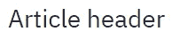
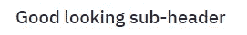
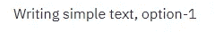
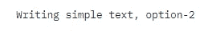
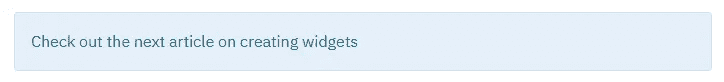
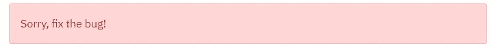
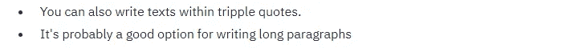
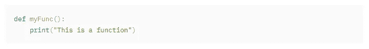

# 使用 Streamlit 部署数据科学 Web 应用程序:文本显示

> 原文：<https://pub.towardsai.net/deploying-data-science-web-apps-with-streamlit-text-display-8b39a0788bee?source=collection_archive---------5----------------------->


在 [Unsplash](https://unsplash.com?utm_source=medium&utm_medium=referral) 上由 [Thiébaud Faix](https://unsplash.com/@thips?utm_source=medium&utm_medium=referral) 拍照

## [数据科学](https://towardsai.net/p/category/data-science)，[编程](https://towardsai.net/p/category/programming)

## 关于部署数据科学应用程序的系列文章

这是我在 Streamlit 上撰写的系列文章的第二篇，Streamlit 是一个开源 Python 库，可以将您的桌面程序变成一个漂亮的 web 应用程序。我正在写一个由 10 部分组成的小系列，每一部分都涵盖了这个库的不同方面。这是我的计划:

**01)**T10**入门**

**02)显示文本(今天)**

03)创建交互式小部件

04)描述性统计/EDA

05)数据可视化

06)时间序列分析

07)创建应用程序— I(回归问题)

08)创建应用程序— II(分类问题)

09)在 Heroku 上部署应用程序

10)进一步学习和实践的资源

在今天的文章中，我将重点介绍使用一行代码显示文本的许多不同方式。但是，如果您需要关于如何设置 Streamlit 环境的提示，请继续阅读关于[入门](https://medium.com/towards-artificial-intelligence/creating-a-web-app-with-streamlit-getting-started-c73a9608d0aa)的第一篇文章。

请注意，代码和输出是不言自明的，所以我不打算解释任何内容，也不打算让文章变得冗长。所以让我们开始吧！

**1。标题**

```
import streamlit as st 
st.title("A Beautiful Title")
```


**2。文本标题**

```
st.header("Article header")
```



**3。副标题**

```
st.subheader("Good looking sub-header")
```



**4。简单文本(选项 1)**

```
st.write("Writing simple text, option-1")
```



**5。简单文本(选项 2)**

```
st.text("Writing simple text, option-2")
```



6。降价样式文本

```
st.markdown(" **This is a markdown style text** ")
```


**7。信息消息**

```
st.info('Check out the next article on creating widgets')
```



**8。乳胶**

```
st.latex('\sum a+b')
```


**9。成功消息**

```
st.success('Success!')
```


**10。错误信息**

```
st.error("Sorry, fix the bug!")
```



**11。警告信息**

```
st.warning("Are you sure you want to run this code?")
```


**12。写一个很长的段落**

```
"""
* You can also write texts within tripple quotes. 
* It's probably a good option for writing long paragraphs
"""
```



**13。代码显示**

```
myCode = '''def myFunc():
    print("This is a function") '''st.code(myCode)
```



希望这是本系列中的一篇有用的文章，有助于理解如何在 Streamlit 中显示各种类型的文本——从“标题”和“副标题”到显示专门的文本，如“成功”和“错误”消息。期待下一篇关于如何使用这个库创建漂亮的交互式小部件的文章。

如果你有任何意见或问题，请在下面留下你的评论，或者通过[的](https://www.linkedin.com/in/mab-alam/)[Twitter](https://twitter.com/DataEnthus)LinkedIn联系我们。

直到下一次…