# 使用 AWS EC2 将机器学习模型部署为服务

> 原文：<https://pub.towardsai.net/deploying-machine-learning-models-as-a-service-using-aws-ec2-97a6434194ca?source=collection_archive---------1----------------------->

## [云计算](https://towardsai.net/p/category/cloud-computing)，[机器学习](https://towardsai.net/p/category/machine-learning)

## 使用 Flask 和 Nginx 在 EC2 上将 ML 模型部署为 Web 应用程序的概述

当 ML 模型是我们的应用程序中唯一的用例时，我们将它作为服务来部署。

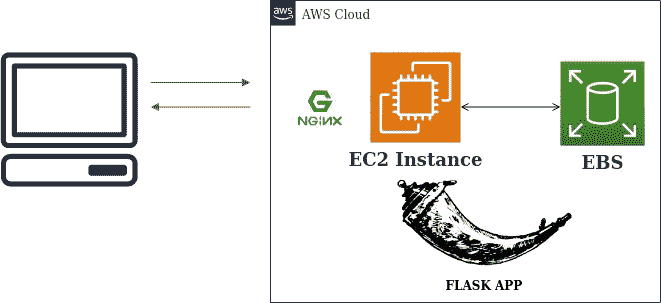

建筑(使用 apps.diagrams.net 设计)

> 在 EC2 上部署为服务的优势
> 
> 1.我们可以创建自定义存储并存储数据(当我们使用 PAAS 将模型部署为 Web 应用程序时，这是做不到的。
> 
> 2.性能(我们可以根据需要自动缩放实例)
> 
> 3.安全性(我们可以通过添加安全组和 VPC 来控制谁可以使用服务)

在本文中，我们将讨论

1 .在 EC2 上部署 ML 模型

2 .将 it 作为服务运行

# 在 EC2 上部署 ML 模型

## 1.启动 EC2 实例

*   选择你需要的操作系统镜像(我用的是 ubuntu 18.04)。
*   配置自动缩放的实例数量(我选择了 2 个自动缩放的实例)

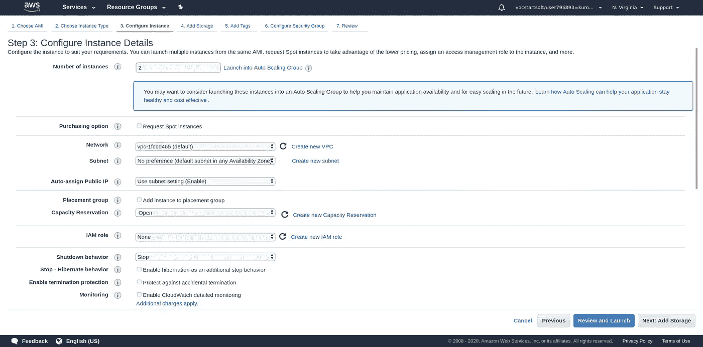

配置实例(按作者排列的图片)

*   向 EC2 添加所需的 EBS 存储容量(Amazon Elastic Block Store 提供原始块级存储，可以附加到 Amazon EC2 实例，并由 Amazon 关系数据库服务使用)。

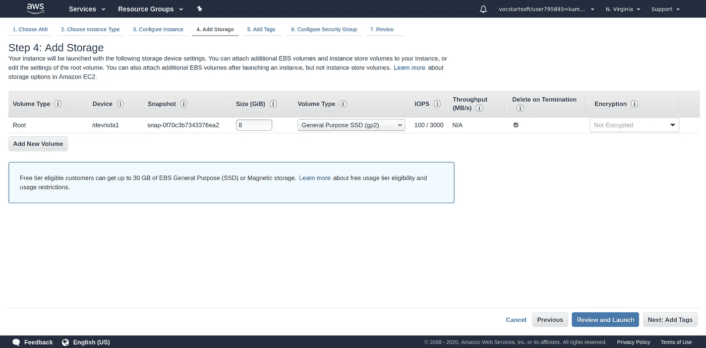

将 Storgae 添加到 EC2(图片由作者提供)

*   添加标记以将该实例与其他实例区分开来。
*   配置安全组(这些可以用来限制我们的实例的访问)。默认的是在端口 22 运行的 SSH(这允许从我们的计算机访问 connect EC2 实例)。然而，我们将在以后添加 http 到安全组中(以方便从互联网访问服务)。

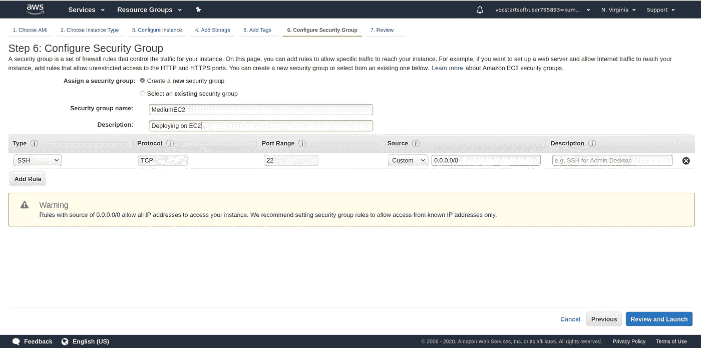

为 EC2 实例配置安全组(图片由作者提供)

*   点击查看并启动。

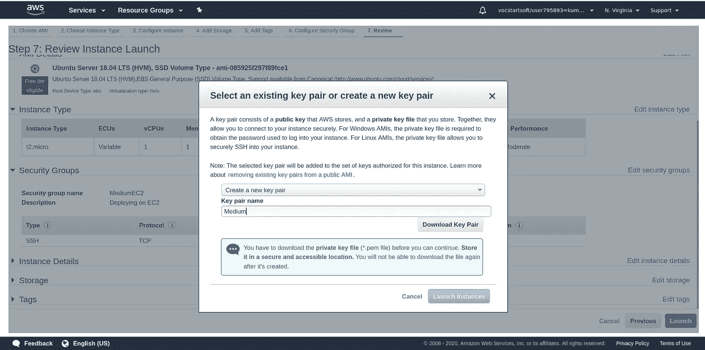

正在下载密钥对以访问实例(图片由作者提供)

*   创建新的密钥对(该 pem 文件存储访问 EC2 实例的凭据)。在启动实例之前，下载密钥对并单击启动实例。

# 2.正在连接到实例

*   转到实例并单击连接。

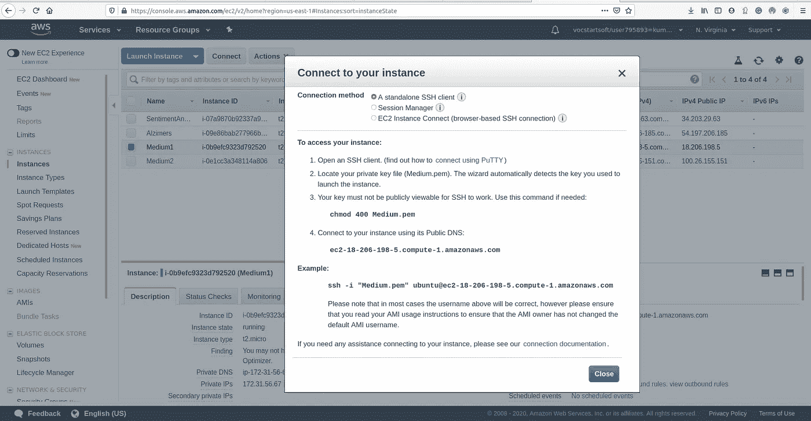

连接到 EC2 实例(图片由作者提供)

*   我使用 Linux 操作系统连接到实例(如果您使用 windows，请创建 Virtalbox 或安装 putty)。
*   转到您下载 pem 文件的文件夹。打开命令提示符并运行下面的代码。

```
chmod 400 Medium.pem
```

*   使用 SSH 连接到实例。

```
sudo ssh -i "Medium.pem" ubuntu@ec2-18-206-198-5.compute-1.amazonaws.com
```

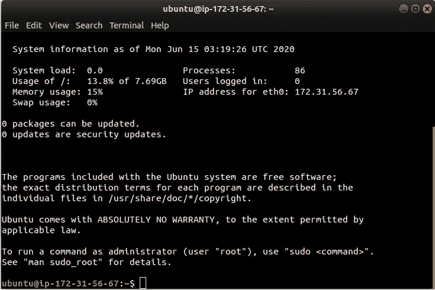

SSH 连接

*   我们已成功连接到 EC2 实例。我们需要安装基本的软件包。

```
sudo apt-get update
sudo apt-get install python3-pip
```

*   这里我们使用 nginx 作为服务器，flask 作为 web 框架，gunicorn(用于互联网网关)。

```
sudo apt-get install nginx
sudo apt-get install gunicorn3
```

*   转到安全组并在入站规则中添加 http。(这允许从互联网连接到 EC2)。

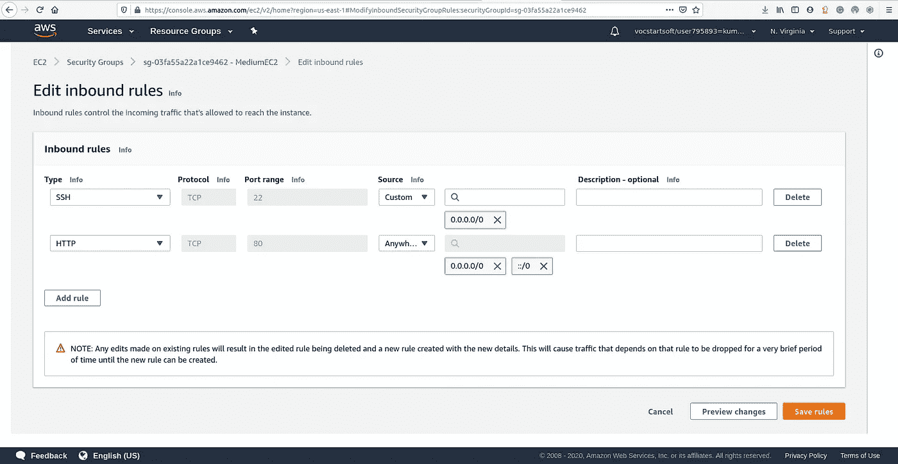

添加入站规则。(图片由作者提供)

*   在浏览器中输入 EC2 实例公共 DNS(我们的实例 DNS 是[http://ec2-18-206-198-5.compute-1.amazonaws.com/](http://ec2-18-206-198-5.compute-1.amazonaws.com/))。我们可以看到 nginx 服务器正在成功运行。

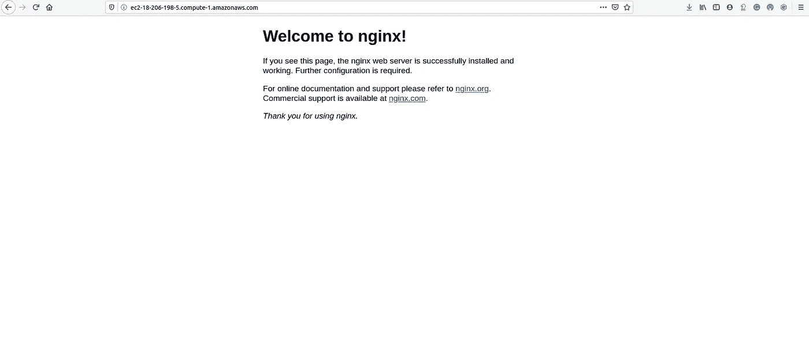

nginx 服务器(图片由作者提供)

*   克隆包含文件的存储库或在 EC2 上创建文件。文件夹结构应该是这样的。文件夹名是*弗拉斯卡普。检查我的* [*回购*](https://github.com/developers-cosmos/DeployMachineLearningModels/tree/master/Deploy-As-Service-Using-AWS-EC2) *如果你想部署我的模型。*

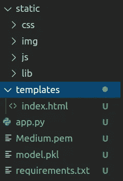

文件夹结构

*   Nginx 运行在端口 80 上。我们需要在其他端口上运行我们的 flask 应用程序。在本例中，我将在端口 8080 上运行。

## 配置 nginx 服务器

*   转到 nginx 配置文件。我们可以看到名为“deafult”的默认配置文件。

```
cd /etc/nginx/sites-enabled/
```

*   我们需要在(/etc/nginx/sites-enabled)文件夹中编写自己的配置文件，以便在所需的端口上运行 flask 应用程序。

```
sudo vim FlaskApp
```

*   这里我们设置服务器监听端口 8080。

```
server 
{
listen 8080;server_name ec2-18-206-198-5.compute-1.amazonaws.com;location / {proxy_pass [http://127.0.0.1:8000;](http://127.0.0.1:8000;)}}
```

*   重启 nginx 服务器。

```
sudo service nginx restart
```

*   转到主目录中的 Flaskapp 文件夹。安装应用程序所需的所有依赖项。

```
pip3 install -r requirements.txt
```

在 EC2 实例安全组的入站规则中添加 8080 端口。

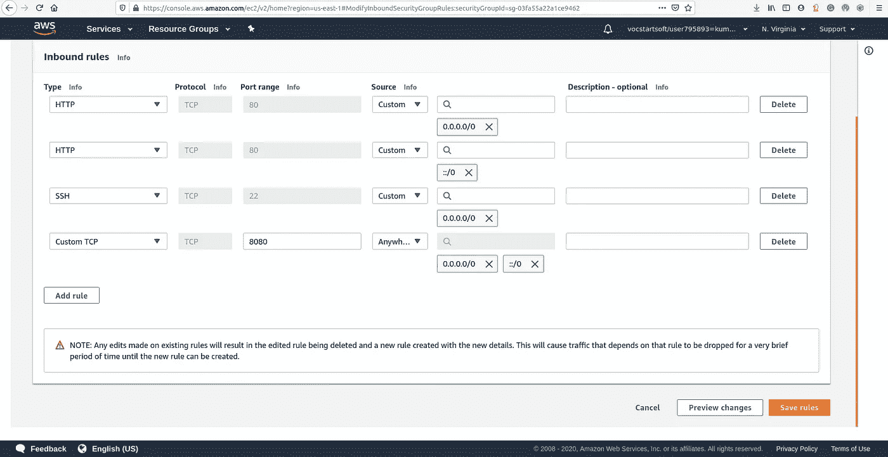

入站规则(作者图片)

*   现在使用 gunicorn3 运行 FlaskApp。

```
gunicorn3 app:app
```

*   现在键入带有公共 DNS 的端口 8080。您可以看到 Web 应用程序正在运行。

[http://ec2-18-206-198-5.compute-1.amazonaws.com:8080/](http://ec2-18-206-198-5.compute-1.amazonaws.com:8080/)

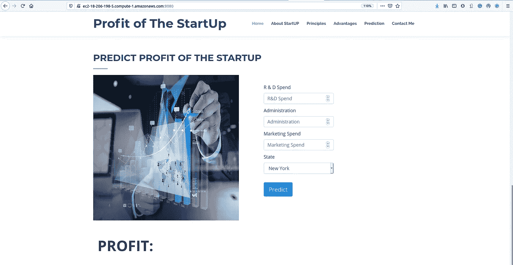

部署的 Web 应用程序(图片由作者提供)

*   我们现在已经准备好了我们的应用程序，它已经启动并向全世界展示！ ***但是每当你关闭 SSH 终端窗口，这个过程就会停止，你的应用程序也会停止。那我们该怎么办？***

# 使 it 成为服务

*   我们需要将实例作为服务运行，这样它就可以全天候运行，而无需您的干预。
*   TMUX 是这种情况下的最佳选择。TMUX 会话是持久的，这意味着即使断开连接，在 TMUX 运行的程序也会继续运行。
*   首先，我们使用 Ctrl+C 停止我们的应用程序，并安装 *tmux* 。

```
sudo apt-get install tmux
sudo apt-get update
```

*   我们使用下面的命令启动一个新的 tmux 会话。

```
tmux new -s new_session
```

*   在这个 tmux 会话中使用 gunicorn3 运行我们的应用程序。

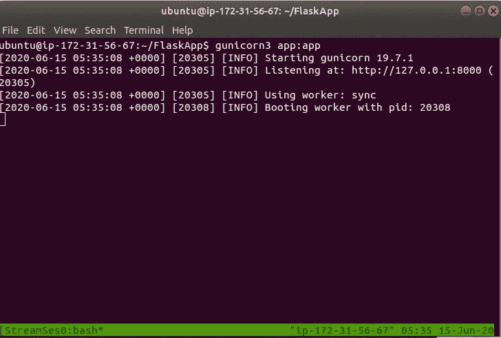

Timux 会话(图片由作者提供)

***下一步是分离我们的 TMUX 会话*** ，这样当您离开 SSH shell 时，它将继续在后台运行。为此，只需按 Ctrl+B，然后按 D(不要在按 D 的同时按 Ctrl)。

# 结论

现在，我们已经使用 EC2 实例成功地将机器学习模型部署为服务。我们可以根据需要增加或减少自动扩展和存储容量。部署的应用程序可以在这里看到[。](http://ec2-18-206-198-5.compute-1.amazonaws.com:8080/)

# 最后的想法

我将使用 ElasticBeanStalk 将 ML 模型部署为 Web 应用程序。在那之前，呆在家里，保持安全，继续探索！

# 取得联系

我希望你觉得这篇文章很有见地。我很乐意听到你的反馈，以便更好地即兴发挥和回来！如果您想联系，**请在** [**LinkedIn**](https://www.linkedin.com/in/findtharun/) 上联系我。感谢阅读！

# 参考

[1]Linuxize:[https://linuxize.com/post/getting-started-with-tmux/](https://linuxize.com/post/getting-started-with-tmux/)