# 使用 AWS 将机器学习模型部署为 API

> 原文：<https://pub.towardsai.net/deploying-machine-learning-models-as-api-using-aws-a25d05518084?source=collection_archive---------1----------------------->

## [机器学习](https://towardsai.net/p/category/machine-learning)，[云计算](https://towardsai.net/p/category/cloud-computing)

## 使用 Lambda 函数通过 API 访问 SageMaker 机器学习模型端点的指南。

作为一个机器学习从业者，我以前是做模型的。但是仅仅建立模型对于实时产品来说是远远不够的。ML 模型需要与 web 或移动应用程序集成。解决这个问题的最好方法之一是将模型部署为 API，并在需要时推断结果。

> 将模型部署为 API 的主要优势在于，ML 工程师可以将代码与其他开发人员分开，并在不对 Web 或应用程序开发人员造成干扰的情况下更新模型。

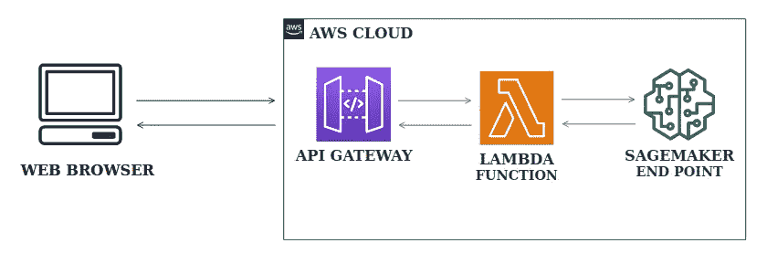

建筑(使用 apps.diagrams.net 设计)

**工作流程**:客户端向 API 发送请求。API 触发器被添加到 Lambda 函数中，这导致调用 SageMaker 端点并通过 API 将预测返回给客户端。

在本文中，我将构建一个简单的分类模型，并使用 **Postman** 测试部署的模型 API。

## 我们开始吧！我们将遵循的步骤是:

1.  构建 SageMaker 模型端点。
2.  创建 Lambda 函数。
3.  作为 API 部署。
4.  与邮递员一起测试。

# 构建 SageMaker 模型端点

让我们建立一个鸢尾物种预测模型。

**注**:训练 SageMaker 分类模型时，目标变量应该是第一列，如果是连续的，则将其转换为离散的。

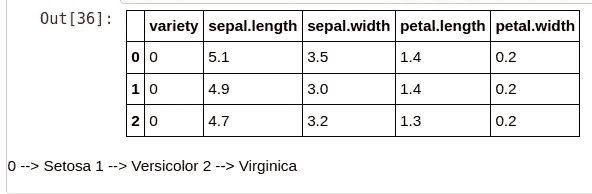

数据集结构

**1。**创建、训练和验证数据，以训练和测试模型。

**2。**对模型进行训练，得到该模型在当前区域的图像 URI。

创建 xgboost 模型估计器。

**3。**设置模型的超参数(您可以使用 SageMaker Auto-Pilot 实验为您的模型获取最佳超参数，也可以手动设置您自己的超参数)。

超参数调谐。

**4。**用训练和验证数据拟合模型。

模型拟合。

**5。**现在为模型创建一个端点。

端点创建。

您可以在 SageMaker UI 中查看端点配置。

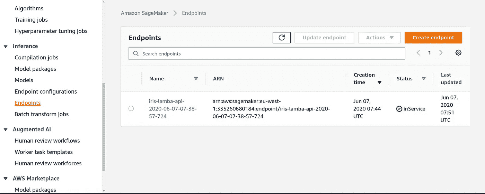

SageMaker 端点

# 创建 Lambda 函数

现在我们有了一个 SageMaker 模型端点。让我们看看如何从 Lambda 调用它。有一个 API 动作叫做 SageMaker Runtime，我们使用*boto 3*[*SageMaker-Runtime . invoke _ endpoint()*。](https://boto3.amazonaws.com/v1/documentation/api/latest/reference/services/sagemaker-runtime.html)从 AWS Lambda 控制台中，选择**创建功能**。

1.  创建一个新角色，以便 Lambda 函数有权调用 SageMaker 端点。

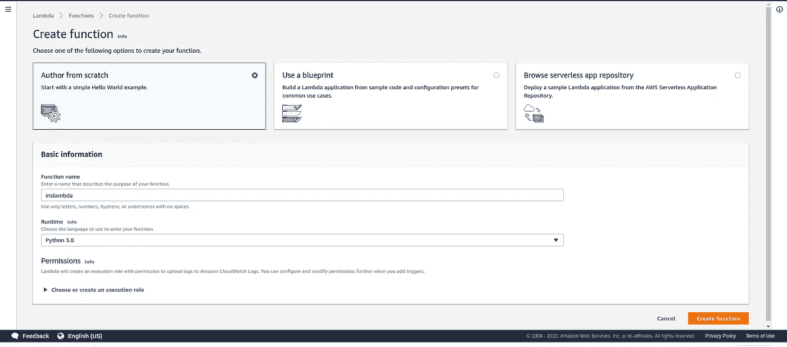

Lambda 函数初始设置(图片由作者提供)

Lambda 函数(作者供图)

`**2.** ENDPOINT_NAME`是一个环境变量，保存我们刚刚部署的 SageMaker 模型端点的名称。

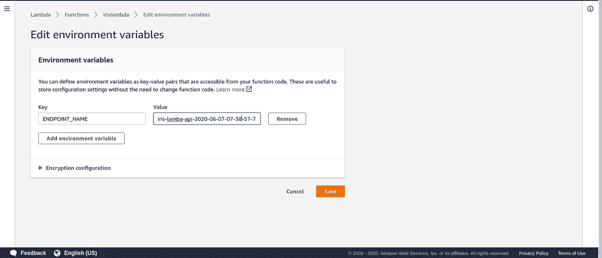

环境变量(作者提供照片)

# 部署 API

**1。**打开亚马逊 API 网关控制台。选择 **Create API，**选择 REST API(当我们发送 post 请求并得到响应时)。

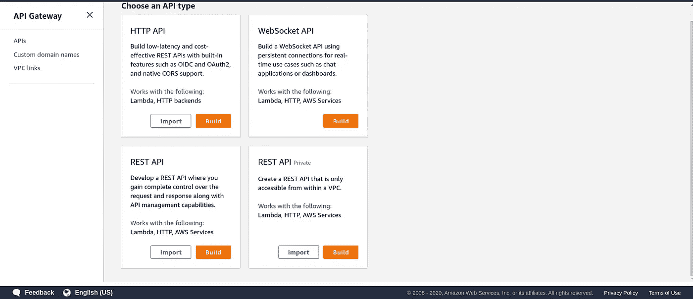

(作者供图)

**2** 。将您的 API 命名为，并将端点类型选择为 Regional(因为它应该在您的区域内被访问)。

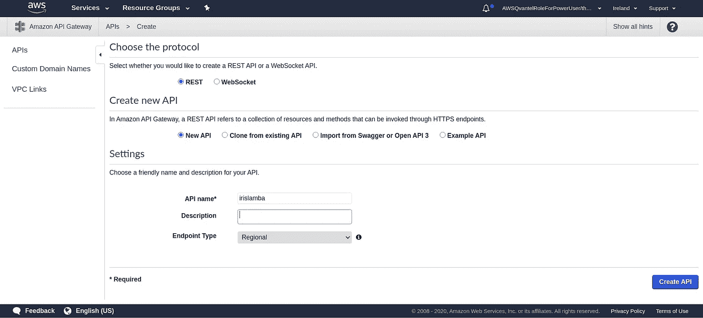

创建 REST API(作者提供图片)

**3。**从**动作**下拉列表中选择，创建一个**资源**，命名为“irispredict”。单击以创建资源。

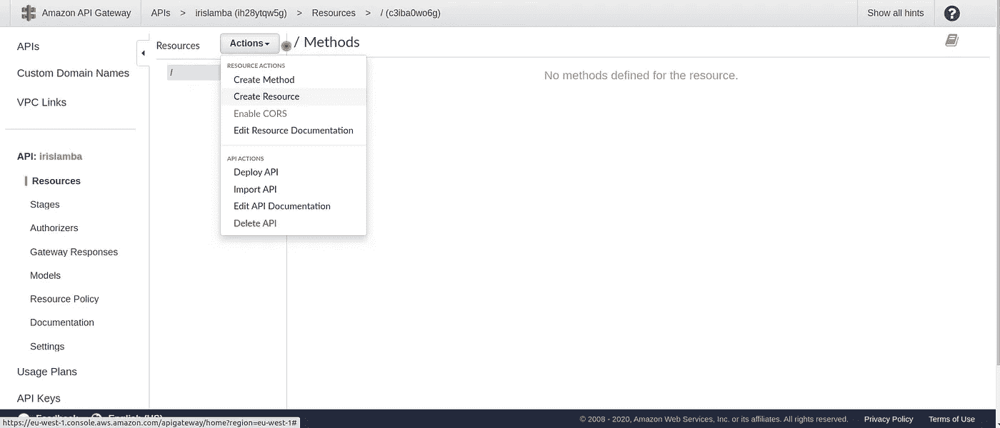

创建资源(作者照片)

**4。**创建资源后，从同一个下拉列表中选择“创建方法”来创建发布方法。

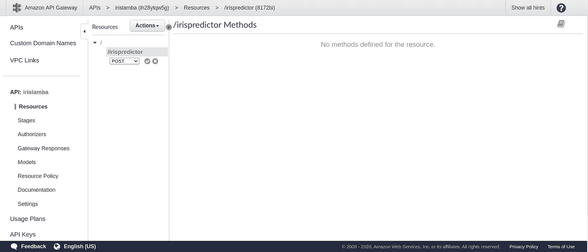

添加帖子方法(作者供图)

**5。**在出现的屏幕上，执行以下操作:

*   对于集成类型，选择 Lambda 函数。
*   对于 Lambda 函数，输入所创建函数的名称。

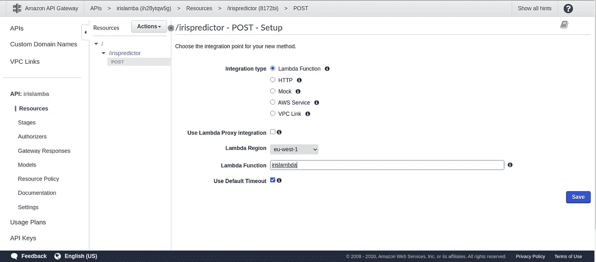

用 API 网关连接 Lamda 函数(作者供图)

6。 API 结构看起来类似下图:

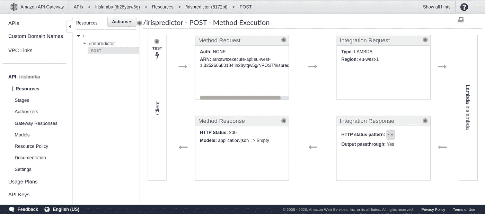

(作者供图)

7。从*动作*中选择*部署 API* 。在出现的页面上，创建一个新阶段。称之为“物种”，点击**部署**。

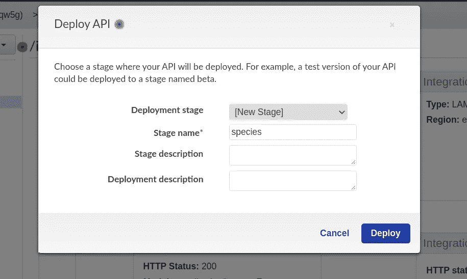

部署 API(作者提供图片)

**8。**出现一个窗口，显示已创建的阶段。转到 post 方法，将生成调用 URL，这是最终的 API 端点。

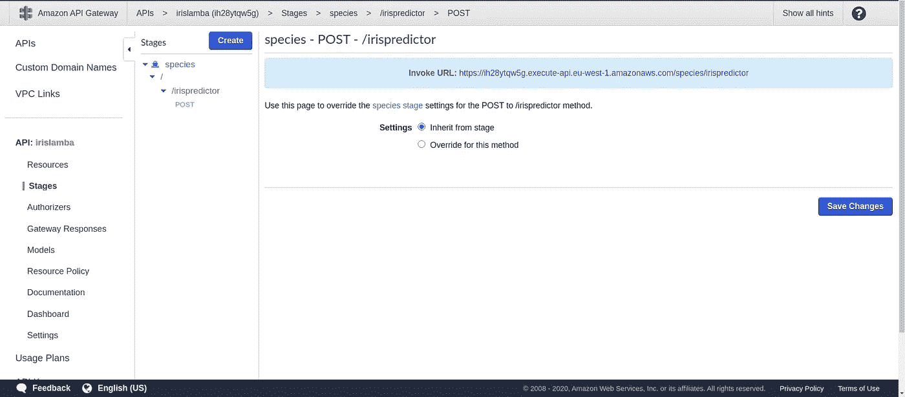

API URL(作者提供图片)

# 邮递员测试

**Postman** 是一个流行的 API 客户端，让开发者可以轻松地创建、共享、测试和记录 API。

**1。**在通过 Postman 调用 API 之前，在授权部分添加您的 AWS 密钥和访问密钥。

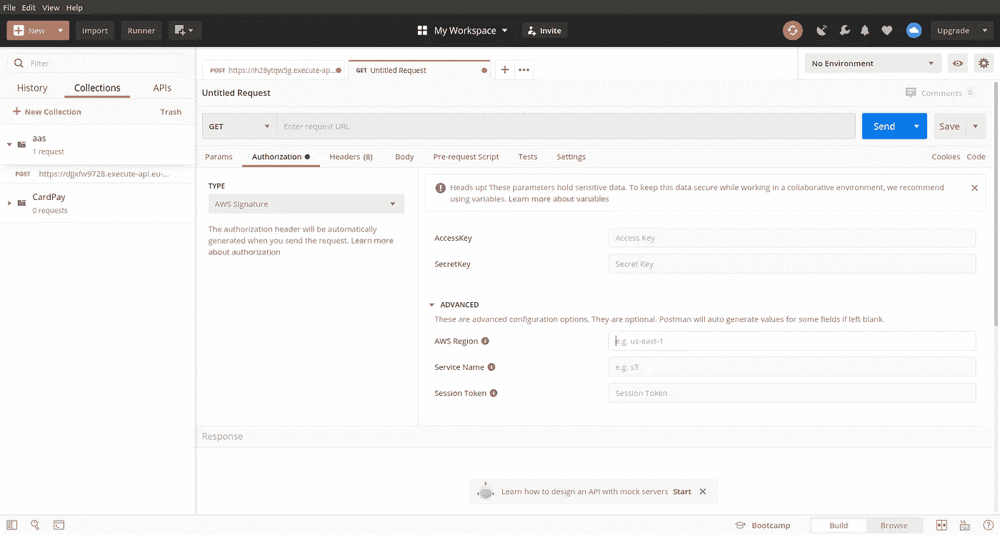

(作者供图)

**2。**考验邮递员。在正文中以 JSON 的形式给出输入。当您点击*发送*请求到 API 时，输出会相应显示。

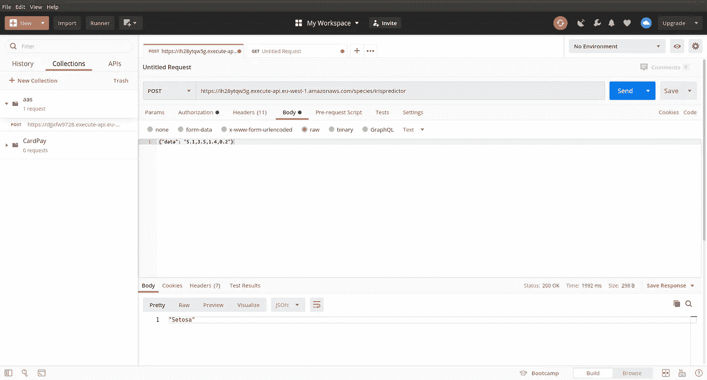

与邮递员一起测试(作者提供照片)

# 结论

现在我们已经使用 Lambda(无服务器组件)成功地将机器学习模型部署为 API。只需一次点击就可以调用这个 API，用户和开发人员可以很容易地进行推断。

# 最后的想法

我将使用 ElasticBeanStalk 和其他 AWS 服务将 ML 模型部署为 Web 应用程序。在那之前，呆在家里，保持安全，继续探索！

# 取得联系

我希望你觉得这篇文章很有见地。我很乐意听到你的反馈，以便更好地即兴发挥和回来！如果你想联系，请在 [**LinkedIn**](https://www.linkedin.com/in/findtharun/) 上**联系我。感谢阅读！**

# 参考

[1] : AWS 文档[https://docs . AWS . Amazon . com/sage maker/latest/DG/getting-started-client-app . html](https://docs.aws.amazon.com/sagemaker/latest/dg/getting-started-client-app.html)