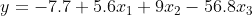
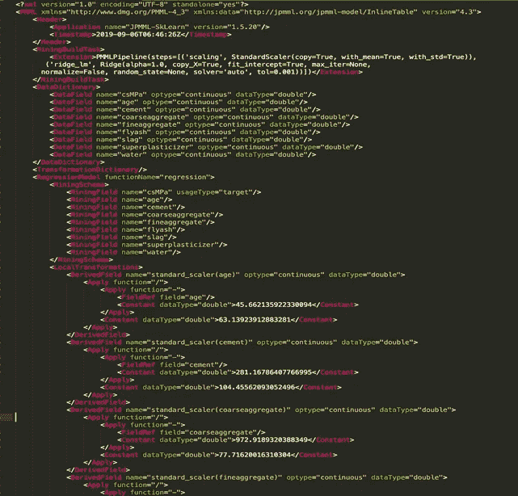
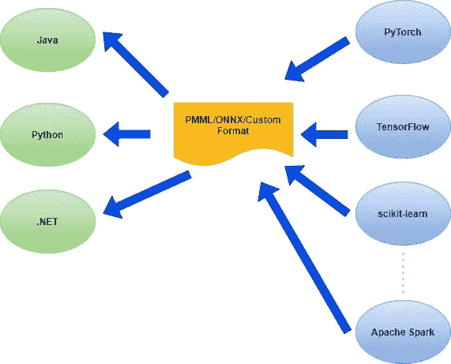
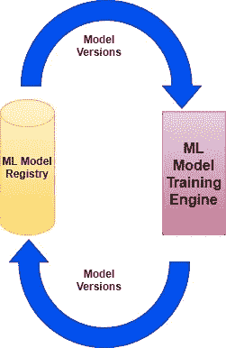
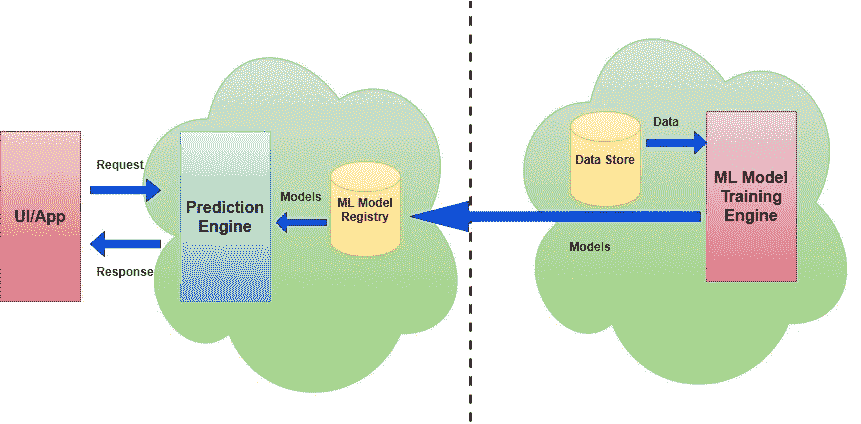
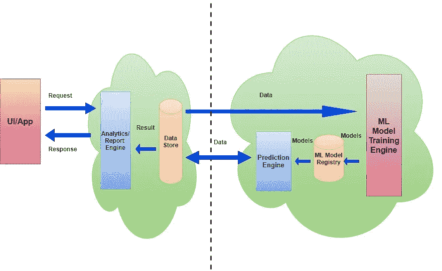
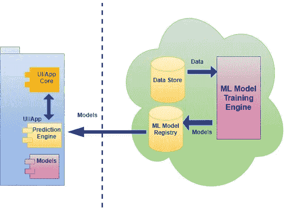

# 在生产中部署 ML 模型:模型导出和系统架构

> 原文：<https://pub.towardsai.net/deploying-ml-models-in-production-model-export-system-architecture-e64acb3b6e6d?source=collection_archive---------1----------------------->

## [机器学习](https://towardsai.net/p/category/machine-learning)

## 理解模型导出机制、轻量级集成、离线和在线模型托管技术

由[马库斯·斯皮斯克](https://unsplash.com/@markusspiske?utm_source=medium&utm_medium=referral)在 [Unsplash](https://unsplash.com?utm_source=medium&utm_medium=referral) 上拍摄的照片

我们经常看到这里讨论的许多技术&关于用 ML 解决问题。但当涉及到将它们全部投入生产时，我们看不到太大的吸引力，人们仍然需要依赖一些公共云提供商或开源软件。在本文中，我们将讨论在生产中使用的 ML 模型，以及支持它的系统架构。我们将了解如何在没有任何公共云提供商的情况下做到这一点。

# 模型导出

几乎所有的 ML 模型都是数学表达式、方程或数据结构(树或图)。数学表达式有系数、一些变量、一些常数、一些概率分布的参数(特定于分布的参数、标准偏差或平均值)。让我们举一个简单的线性回归模型的例子:

它有多少信息？3 对系数值&特征名称和一个常数。这七个值肯定可以写在一个文件中。

因此，模型导出只不过是将模型的元数据信息写入文件或数据存储中。这是保存模型以备将来使用所必需的。

## **平台独立模型导出**

ML 模型使用不同的技术栈进行训练，如 Python、Java、.网等。在 Python 中，有不同的框架，如 sci-kit-learn、PyTorch、TensorFlow 等等。显然需要一种独立于平台的模型导出机制。大多数时候，模型的典型用法是跨平台的。模型可以在 Python 平台中设计，但是出于高可用性的原因，它可以由 Java 平台提供。我们将在后面的章节中详细讨论这一点。在此之前，让我们讨论两种不同的模型导出格式。

**PMML:** PMML 代表*预测模型标记语言*。这是一个基于 XML 的标准，它有一个预定义的[模式](http://dmg.org/pmml/v4-1/GeneralStructure.html)。模型被导出为 XML 文件。

PMML 文件的示例部分

以上 PMML 内容是针对线性回归模型的。我们可以看到，它包含了模型类型(在上面的例子中为*回归*)、预处理步骤(在上面的例子中为*标准缩放器*)、特征名称以及许多其他信息。

> PMML 饱受规模问题的困扰。太多的特性会产生非常大的 XML，特别是对于 NLP 模型。

因此，有时将 PMML 内容转换成 JSON 很方便。

**ONNX:** 代表 [*开放式神经网络交换*](https://onnx.ai/) *。*非常适合深度学习模型。它生成一个以二进制文件序列化的网络图。像往常一样，图表包含隐藏和输出层权重和连接信息。与 PMML 不同，它不生成 XML。

这两种格式都可以跨平台移植(尤其是 PMML)。

## 模型消费和便携性

使用上述格式导出的模型可以在实际使用中使用。模型训练包括确定其参数&超参数的迭代过程。但是，一旦训练好了，模型消费就是一步到位的过程。比方说，我们在高性能机器中使用随机梯度下降训练了一个线性回归模型。产生的模型是系数、特征名称和预处理信息的集合。它必须使用任何格式保存在某个地方，以便我们可以在以后加载和使用它。

> 要使用该模型，我们只需将来自输入数据实例的特征与系数相乘，加上截距并返回结果。

因此，模型是在哪个平台上设计和构建的并不重要。在基于 ML 的生产系统中，开发的组件可以在不同的平台上使用是很自然的。有了适当的模型导出支持，用 Python 设计的模型可以在 Android 应用程序中使用。

> 一般来说，ML 模型消费逻辑必须在消费平台内部开发。我们可以称之为存根。

下图解释了这种情况

跨平台模型导出

在不同的 Python 框架(scikit-learn、PyTorch、TensorFlow)或 Apache Spark/Flink 等大数据堆栈中设计的模型可以以任何定义的格式(PMML/ONNX)导出，并且可以由不同的客户端应用程序(Java、Python 或。网)。所以，这是一个多对多的情况。

> 客户端应用程序解析模型文件，并提取必要的参数来构建模型的内存版本。

除了依赖 PMML/ONNX 或任何标准格式，还可以为一些非常具体的要求定义用户定义的自定义格式(如图所示)。在任何情况下，目标都是“*让模型可以跨平台移植*

# 模型部署和系统架构

大多数时候，数据科学活动是使用上面讨论的标准库在 Python 中完成的。但是，它不是一个非常可扩展的选项。我们需要一个强大的数据工程和生产级系统部署平台。大数据在这里发挥了很大的作用。模型可以用 Spark、Hadoop、Flink 等大数据平台中的 Pb 级数据进行训练。事实上，这些在生产系统中总是首选的。

设计架构有两个挑战。关于 Python，上面已经提到了一个挑战。另一个是大数据平台本身。

> Apache Spark/Flink 不适合同步集成，它们以离线/批处理/异步模式运行。

因此，通过 REST 直接公开 Spark/Hadoop 层预测 API 对于具有高/中等吞吐量预期的面向客户端的系统来说是非常危险的。即使吞吐量要求很低，也不建议使用同步集成。使用 PMML/ONNX 或其他格式的模型导出机制解决了这个问题。

该模型应使用大数据堆栈进行训练，然后导出并存储在模型注册表中。它应该支持增量/迭代培训过程的版本化和历史机制。该流程本质上是循环的，如下所示:

模型版本控制

然后，一个预测引擎应该使用该模型并返回结果。这个引擎应该精通模型导出格式。这样，预测和训练过程变得完全脱节和松散耦合。

> 即使在一些假设的情况下，如果使用 Python 框架为小数据集而不是大数据堆栈训练模型，预测引擎也不需要更新。这是这种设计的一大优点。

现在，我们将使用上面描述的概念来讨论模型部署的三种不同的系统架构。

## 按需云(模型即服务)部署

按需云(模型即服务)部署

从上图中，我们可以看到模型以离线的方式被训练并被推送到模型注册中心(虚线表示*离线过程*)。这种训练是一个周期性的&异步过程。预测引擎接受来自面向客户端的 UI/App 的请求，并执行模型以获得结果。这是一个按需同步过程，与模型训练引擎无关。

> 模型在这里作为服务托管(通过 REST API ),并给出实时预测。大多数公共云 ML 提供商都遵循这种架构。

## 离线云部署

离线云部署

这里，预测引擎在模型训练引擎的范围内工作，并且预测过程也与训练一起以离线方式工作。预测存储在数据存储中。一个分析引擎处理来自 UI/App 的同步请求，并返回预存的预测。这里，模型注册不必支持所有相关的模型导出格式，因为预测是在大数据引擎的范围内完成的。

> 这种架构在利用模型以离线方式生成分析报告或一组建议的情况下非常有用。

## 打包部署

打包部署

这适用于典型的移动应用程序或没有公共/私有云连接的情况。预测引擎打包在面向客户端的 UI/App/设备中。它必须非常轻便，因为许多设备上可能存在内存限制。模型训练和注册应该作为一个离线过程。即使没有互联网连接，这种架构也应该可以工作，因为预测是在应用程序/设备中进行的。

> 它也非常适合在断开连接的服务器或基于机器人的应用程序中运行。

上述架构可能是昂贵的公共云 ML 服务提供商的内部替代方案。我们所需要的是系统设计和机器学习的良好知识。

> 注意:最近我写了一本关于 ML([https://twitter.com/bpbonline/status/1256146448346988546](https://twitter.com/bpbonline/status/1256146448346988546))的书