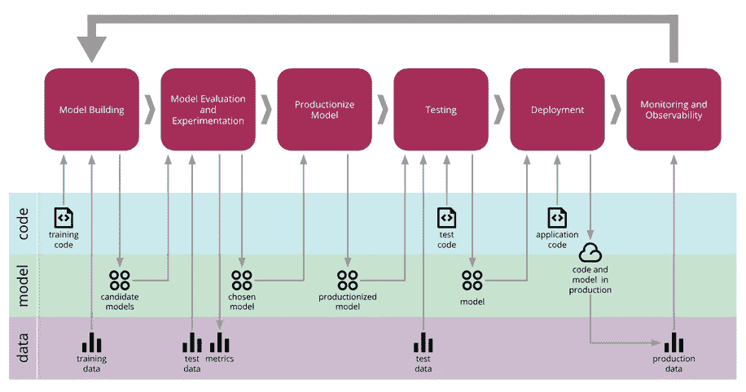
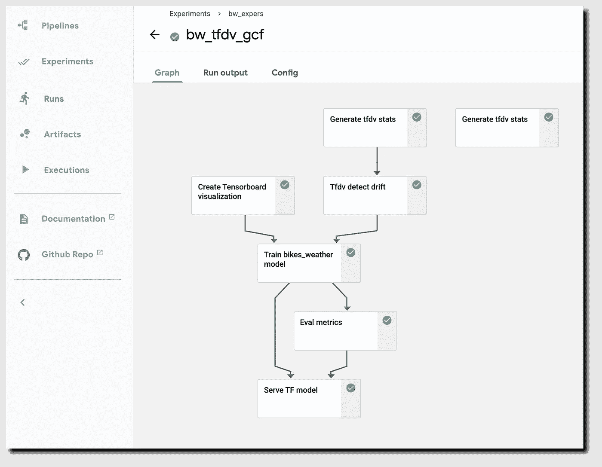
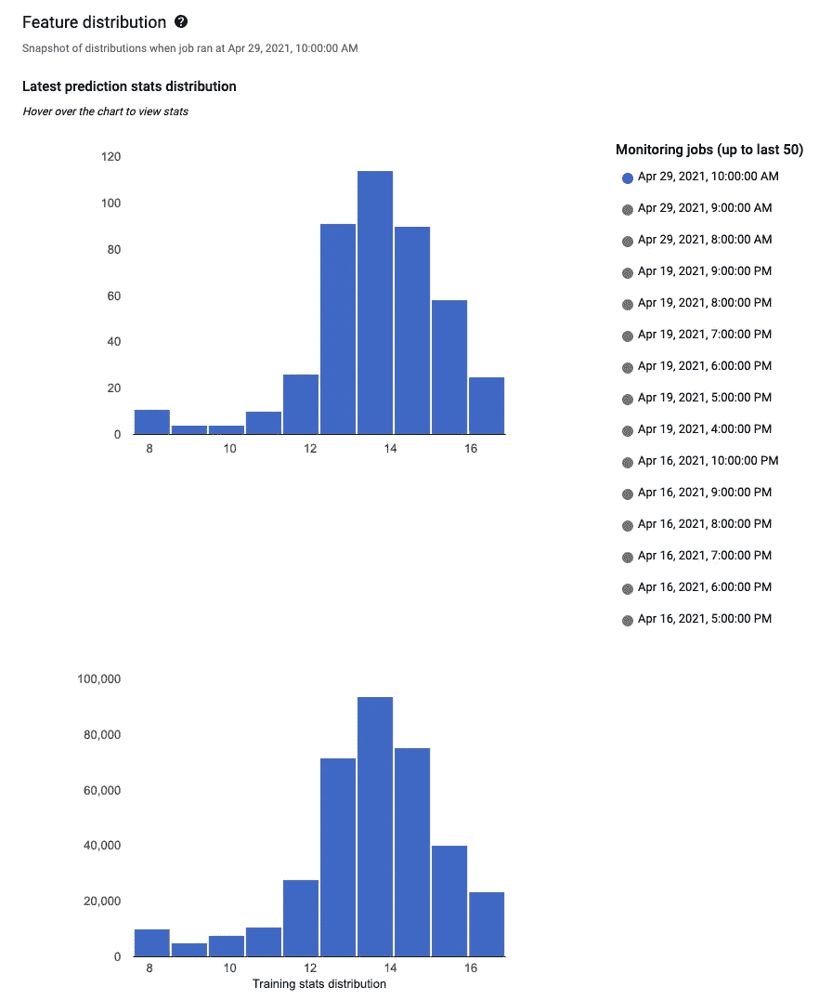
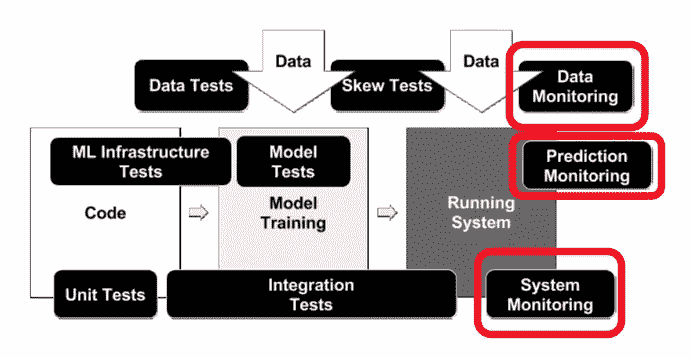

# 2:监控洗钱活动指南系列

> 原文：<https://pub.towardsai.net/deployment-ml-ops-guide-series-2-69d4a13b0dcf?source=collection_archive---------2----------------------->

## [机器学习](https://towardsai.net/p/category/machine-learning)

*概念漂移、数据漂移&监控*

图:【https://martinfowler.com/】ML 系统生命周期

任何机器学习系统最令人兴奋的时刻是当您开始部署您的模型时，但是由于统计问题，部署变得很困难，例如“当过去的模型性能不再保证用于未来，并且当模型被部署在具有频繁数据变化的云中时，由于数据的变化，模型性能在一段时间内下降”，以及系统引擎(例如系统)需要监控 ML 系统，这通常本质上是手动的并且乏味的，需要尽可能通过自动化来处理。

**现在，如何处理模型的统计问题或降低性能？。一旦部署了模型，如何处理数据变更？**

这就是概念和数据漂移的由来。

图:cloud.google.com TFDV 检测数据漂移的工作流程

**概念漂移**是指如果从 x 到 y 的期望映射发生变化，并且由于产品化模型中巨大的数据分布变化而导致预测不准确。

**例如**，假设对于一个给定的用户，有许多令人惊讶的在线购买，这应该已经标记了该帐户的欺诈行为。但由于新冠肺炎，这些相同的购买不会真的引起任何恐慌，该系统未能归类为欺诈，因为新的在线购买的数量由于疫情而增加。那张信用卡可能被偷了。

**另一个概念漂移的例子，**假设 x 是一套房产的大小，y 是一套房产的价格，因为市场的变化，随着时间的推移，房子可能会变得更贵。同样大小的房子最终会有更高的价格，这是概念漂移。

图:cloud.google.com 数据分布直方图允许您快速发现数据中发生的变化，然后确定如何修复它

**数据漂移**是指如果 x 的分布发生变化，即使从 x 或 y 的映射没有变化。除了管理这些数据更改之外，这还会导致第二组软件引擎问题，即您必须管理/自动化作业流程才能成功部署系统。

**例如**，我们再来看看房产用例。比方说，人们开始建造更大的房子或更小的房子，因此房子大小的投入分布实际上会随着时间而变化。当您部署机器学习系统时，最重要的任务之一通常是确保您可以检测和管理任何变化。您正在实现一个预测服务，它的工作是接受查询 x 并输出预测 y，对于如何实现这个软件，您有很多设计选择。

**这里有一个问题清单，可能会帮助你做出适当的决定来处理软件工程问题**。

比如说问题/清单，

1.  需要实时预测还是批量预测？例如，实时预测包括获取一个序列并进行预测，比如说对于语音识别。批量预测主要用于医院，比方说，利用电子健康记录，运行一个通宵批量流程，看看是否有与患者相关的东西，我们可以发现。
2.  你的预测服务是运行在云端还是运行在边缘，或者甚至是在网络浏览器中？
3.  你有多少计算资源或者可以分配给一个给定的 ML 系统？
4.  需要什么类型的安全和隐私设置来支持生产中的 ML 系统？
5.  给定每秒查询数，需要支持多少查询和吞吐量？
6.  需要实施何种类型的记录来回溯 ML 系统故障并支持再现性？

您需要做的是监控系统性能并继续维护它，尤其是在面临概念漂移和数据漂移时。当您为第一次部署构建机器学习系统时，与您更新或维护之前已经部署的系统时相比，会有很大不同。

因为不幸的是，大多数第一次部署意味着你可能只完成了一半，而你工作的后一半只是在你第一次部署之后才开始，因为即使在你已经部署之后，还有大量的工作要反馈数据，可能还要更新模型，在数据发生变化时继续维护模型。

图:https://research.google/pubs/pub46555/

**如何在部署后自动监控 ML 系统？。**

除了少数开创性的例外，大多数科技公司只是在几年内大规模地做了 ML/AI，许多公司才刚刚开始漫长的旅程。这意味着:

*   这些挑战经常被误解或完全忽视
*   框架和工具正在快速变化(对于数据科学和 MLOps 都是如此)
*   最佳实践往往是灰色的

**处理监控洗钱系统的清单/策略包括，例如，**

*1。依赖关系的改变会导致通知吗？*

2.数据不变量在训练和服务输入中成立吗，即监控训练/服务偏差？

3.培训和服务功能是否总是计算相同的值？

4.部署的模型在数值上稳定吗？

5.模型在训练速度、服务延迟、吞吐量或 RAM 使用方面没有经历过剧烈或缓慢的倒退吗？

6.模型在服务数据的预测质量上没有经历回归吗？

*在下一个系列中，将会看到实际的实现和各种处理数据漂移和概念漂移的技术，如何在开发阶段实践它，以便在将模型部署到产品中之后维护变得更容易。*