# 使用 Python 进行数据驱动决策的描述性统计

> 原文：<https://pub.towardsai.net/descriptive-statistics-21fc0196c1df?source=collection_archive---------0----------------------->

[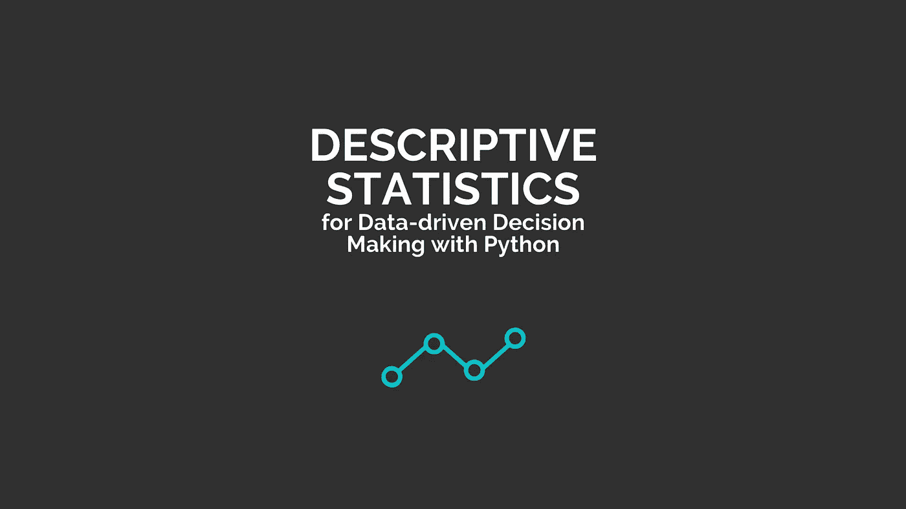](https://news.towardsai.net/descriptive-statistics)

来源:图片由作者提供，用 [Canva](https://www.canva.com/) 创作

## [统计](https://towardsai.net/p/category/statistics)、[编辑](https://towardsai.net/p/category/editorial)、[编程](https://towardsai.net/p/category/programming)

## 这篇文章提供了我们的书的一个样本:“使用 Python 进行数据驱动决策的描述性统计”

**作者:**普拉蒂克·舒克拉，[罗伯特·伊里翁多](https://mktg.best/vguzs)

最后更新于 2021 年 7 月 19 日

 [## 获取我们这本书的完整副本↓

### 使用 Python 进行数据驱动决策的描述性统计。这不是一本典型的描述统计学参考书。相反，我们会深入研究这些方法…

news.towardsai.net](https://news.towardsai.net/shop) 

D ata 科学和 [**机器学习**](https://mld.ai/mldcmu) 是由编程和数学统治的科学学科。如今，全球大多数公司都会生成大量数据，专家可以进一步分析和可视化这些数据，以了解趋势和预测。例如，只有当我们的数据清晰易懂时，我们才能进行精确的数据可视化。

然而，组织的数据(经常)太乱，无法修补——因此，发现数据中的结构和重要模式是数据科学的一项关键任务。统计学提供了发现数据中隐藏的结构和模式的方法和工具，以便专家可以从中做出预测，从而使统计学成为数据科学和机器学习领域中最基本的一步。我们需要统计学将观察结果转化为信息。在机器学习中，我们使用各种 [**算法**](https://news.towardsai.net/mla) 进行预测、分类和聚类。虽然，有许多有用的库可以为我们执行数学计算。

然而，我们需要知道我们使用的每种算法和统计方法背后的数学原理。了解这些可以让我们深入了解我们在做什么，并最终找到我们数据驱动的决策背后的原因。

这项工作旨在理解构成数据科学、机器学习和相关分析领域基础的核心概念。我们的主要目标是向我们的读者展示如何进行计算，以及为什么我们需要这样一种方法。在本书中，我们尽力展示几种核心统计方法及其理论和 python 代码示例。

请注意，在某些情况下，python 程序的输出可能与我们通过应用理论概念得到的输出不同——其背后的原因是我们将使用 python 库来显示输出。在某些情况下，创建这种库的程序员使用不同的逻辑来创建他们的方法。因此，我们认为理解我们在理论概念中解释的核心逻辑是至关重要的。一旦我们理解了这个概念，为手头的任务编写伪代码和代码就相对容易了。

 [## 加入我们吧↓ |面向人工智能成员|数据驱动的社区

### 加入人工智能，成为会员，你将不仅支持人工智能，但你将有机会…

members.towardsai.net](https://members.towardsai.net/) 

> “沉默的统计学家改变了我们的世界；不是通过发现新的事实或技术发展，而是通过改变我们推理、实验和形成观点的方式……”~伊恩·哈金

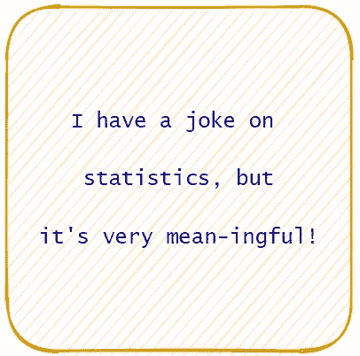

作者图片

## 介绍

在这项工作中，我们将看看描述性统计。然而，在进入统计学之前，了解我们将需要的基本东西是至关重要的。首先，统计学是对数据起作用的。如果我们没有数据，那么统计学就不可能起作用。我们使用数据对它们执行各种操作，从中得出一些有用的结论。

然而，有时不可能收集到与研究相关的每个人的数据。例如:如果我们想测量地球上所有人的体重，不可能得到所有人的数据。这就是为什么我们采集数据样本，然后对它们进行运算。

首先我们会看到总体和样本，然后我们会讨论几种抽样技术。

## 人口和样本:

在统计学的研究中，我们的主要焦点是数据。让我们来看两种关键类型的数据集:

1.  人口
2.  样品

总体和样本之间的主要区别可以通过每个数据集中的观察次数来观察。

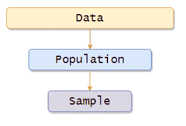

作者图片

总体包括与我们的研究相关的所有元素或观察值。总体通常用(N)表示，我们在处理总体时获得的数字称为参数。

样本包括来自总体的一个或多个观察值。样本通常用(n)表示，而

通过处理样本获得的数字称为统计数据。现在有几种方法可以从总体中提取样本。在本书中，我们将会看到其中的一些。

## 取样技术:

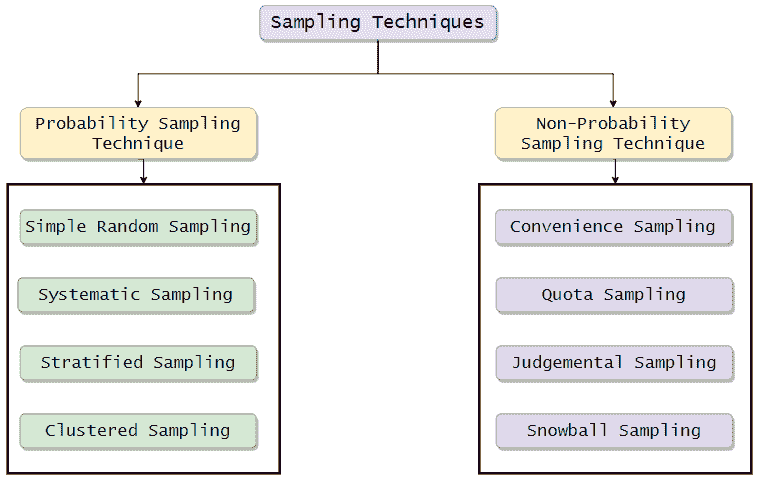

作者图片

## 概率抽样技术:

当每一个主体或实体都有同等的、非零的机会被选入样本时，这种技术被称为概率抽样技术。这些样本通常代表更大的群体。它们提供了可信的结果，因为抽样中出现偏差的可能性很低。

## 简单随机抽样

在这种方法中，群体中的每个个体都是随机选择的，群体中的每个成员被选中的概率相等。换句话说，我们可以说整个群体中的每个成员都有平等的机会被选中。一个简单的随机样本将是整个人口的无偏代表。

例如:

假设我们想从 10000 名学生中随机选择 10 名学生。首先，我们需要给每个学生分配标签。由于有 10000 名学生，标签将从 0 开始，以 9999 结尾。这是标记学生的直观表示。

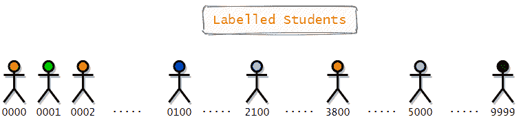

作者图片

现在我们将使用简单的随机抽样从总共 10，000 名学生中随机选择 10 名学生。为了做到这一点，我们将使用 4 个盒子，每个盒子都有从 0 到 9 标记的球。请记住，所有的盒子都是不透明的。所以每个学生都有平等的机会。

作者图片

接下来，我们会叫一个小孩，让他从每个盒子里抽出一个球。现在，我们将记下印在球上的数字。举个例子，如果孩子从第一个盒子里抽出一个标为 2 的球，从第二个盒子里抽出一个标为 5 的球，从第三个盒子里抽出一个标为 9 的球，从第四个盒子里抽出一个标为 0 的球，那么我们会选择这个标为 2590 的学生。

我们将重复同样的过程，直到我们有十个学生的标签。此后记下数字，球将放回原来的盒子里。所以在任何时间点，都会有十个球可供选择。这是孩子选择的学生名单。

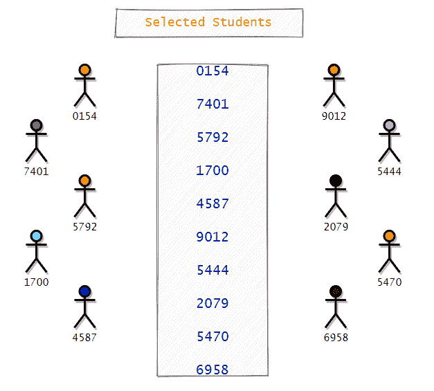

作者图片

这是我们从所有学生中随机选择学生的一种方法。现在请注意，在这种情况下，我们将球放回了各自的盒子中。接下来，我们将看到另一种方法，我们可以在其中实现简单的随机抽样。但是，这里我们将在不替换的情况下进行。所以在这个方法中，我们将把每个数字写在一张纸条上，把这些纸条放在一个大盒子里，然后我们将从中抽取 10 张纸条。现在，我们不必把这些票据放回盒子里。所以这是没有替换的。

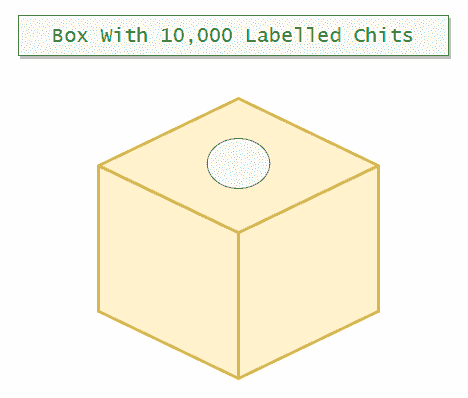

作者图片

**优点:**

1.  简单的随机抽样减少了抽样偏差。
2.  易用性。

**缺点:**

1.  这需要对人口有一点了解。
2.  它可能会产生采样误差。
3.  不适合人群多。

例如，如果我们调查一万名学生，看看他们中有多少人是左撇子。如果我们选取 50 名学生作为样本，左撇子学生可能都不会被选中。所以这是这种方法的一个显著缺点。

## 系统抽样

在这种方法中，我们将定期选择个人。我们可以创建我们想要的任何大小的间隔，但是它应该适合样本大小。一般用在大多数人的意见逻辑同质的时候。

例如:

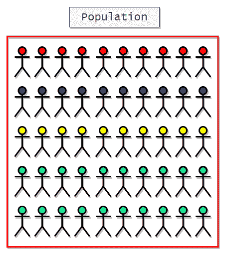

作者图片

假设我们有 50 名学生，我们想从中选择一些样本。要做到这一点，首先，我们需要确定起点。我们可以通过掷骰子来决定。既然我们有了起点，是时候决定间隔了。对于区间大小，我们可以决定从学生中选择每四个人中的一个。请注意，我们可以根据自己的意愿选择区间大小，但它应该取决于我们的样本大小。

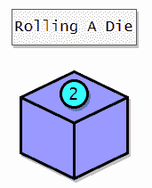

作者图片

这里我们将从第二个学生开始，之后，我们将选择每第四个学生。这是选出的学生样本。

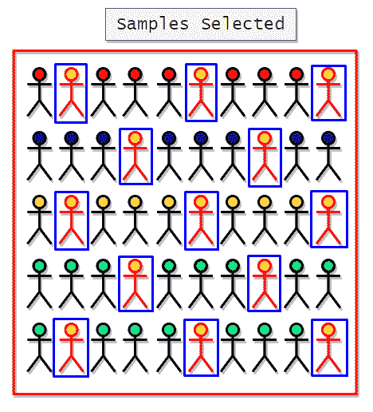

作者图片

**优点:**

1.  比简单的随机抽样更方便。
2.  它易于管理。

**缺点:**

1.如果在排列中有任何潜在的模式，它会给出有偏差的结果。

例如，假设我们要测量学生的平均体重。为了从 50 名学生中做到这一点，我们将随机选择一些学生。假设我们根据之前的计算选择了学生。

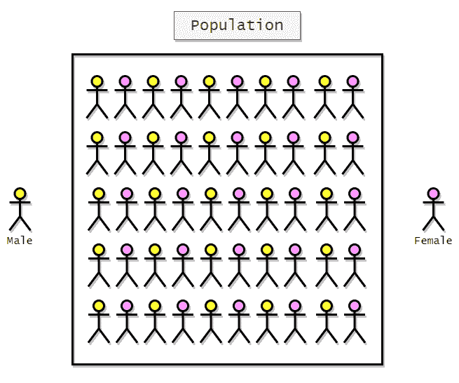

作者图片

以下是入选学生的代表:

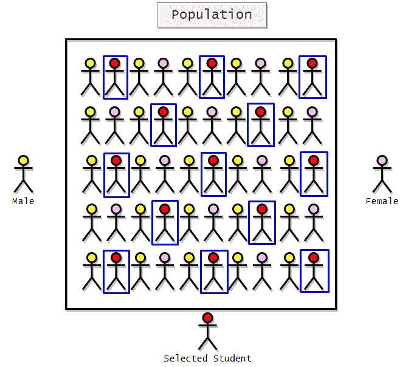

作者图片

在这里我们可以看到所有被选中的学生都是女性。所以我们的样本偏向女学生。此外，我们可以说，它不会给我们全体人民的意见。为了解决这个问题，我们可以在取样前对人口进行内部洗牌。

## 分层抽样

在这种方法中，我们将首先根据特定的特征将整个人口分组。当我们认为基于年龄、性别或种族等特定特征会出现意见分歧时，我们通常会使用这种方法。所以我们在这里做的是，我们将人群分成小组，然后我们将使用简单的随机抽样从每个小组中选择样本。每个被划分的组被称为一个层。通过这样做，我们可以确保我们没有忽略特定群体的意见。让我们举个例子来更好地理解它。假设我们想调查一个新推出游戏的人群。这里我们可以认为，基于年龄的群体之间可能存在一些意见分歧。所以我们将人群分为三组。

1.  儿童(< 18 岁)
2.  成人(18 岁以上和 65 岁以下)
3.  老年人(65 岁以上)

将他们分成这些小组后，我们将使用简单的随机抽样从每个小组中选择样本。

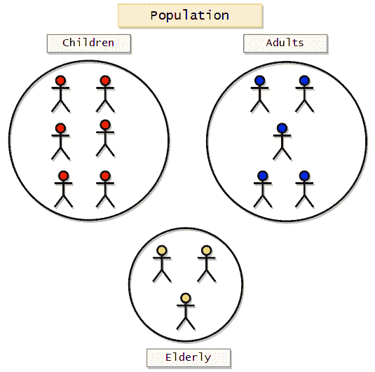

作者图片

既然我们已经将人群分成了亚组，我们可以使用简单的随机抽样从每组中选择受试者。

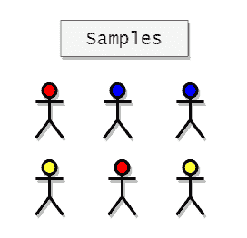

作者图片

**优点:**

1.它提高了整个人口的准确性和总体代表性。

**缺点:**

1.  这需要根据具体特征划分人口的知识。
2.  这既复杂又耗时。

## 整群抽样

在整群抽样中，我们使用群或子群来选择样本。这里的集群是自然形成的。我们不必根据特定的特征来创建集群。

让我们举个例子来更好地理解它。假设我们

想获得某个特定城镇的人的体重信息。现在考虑这个城镇有四条街道。所以，在这种情况下，我们的人口将是城镇或四条街道。这里我们可以说，我们有四个基于街道的子组或集群。现在，我们将从

收集所需信息的 4 个集群。所以在这个方法中，我们知道我们的人口已经被分成了四条街道。所以在这里，我们可以做的是，我们可以在这里应用随机抽样，从城镇的四条街道中选择一条，然后我们可以从那条街道获得信息。所以我们可以说这种方法是在简单随机抽样的基础上运行的。假设一个城镇有四条街道。

*   街道 A
*   街道 B
*   C 街
*   D 街

现在，我们只需应用简单的随机抽样，从 4 条街道中选择 1 条。这是该技术的可视化表示:

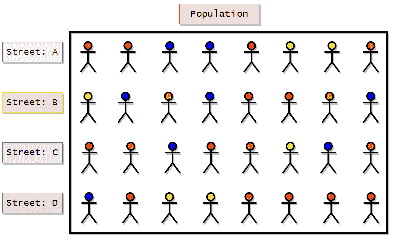

作者图片

应用简单随机抽样选择四条街道。假设我们在随机抽样中得到街道 B。然后，我们可以从代表整个人口的街道 B 中获取所有人的必要信息。

**优点:**

*   如果我们有一个大的地理区域，这种技术会有很大帮助，因为从单个集群中获取大量数据比从多个集群中获取少量数据更容易。

**缺点:**

*   偏倚风险增加。

例如，在上面的例子中，如果每条街道上的人按照特定的特征进行聚类，这种方法将会给出有偏差的结果。如果他们的星座或种族自然地将这个镇上的人聚集在一起，这种技术会给我们带来有偏见的结果。

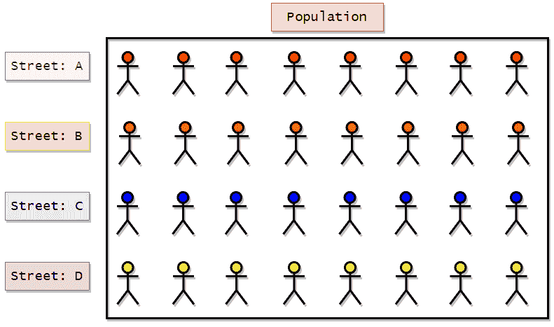

作者图片

如果我们应用简单的随机抽样，并且如果我们得到街道 C，我们可以清楚地看到结果将是有偏差的，并且将只表示蓝色字符。

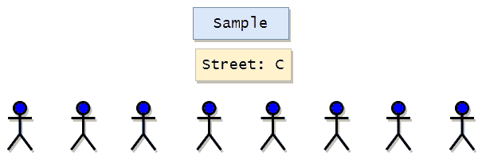

作者图片

## 非概率抽样技术；

在这些技术中，收集样本或受试者时没有考虑具体的概率结构。这里我们可以说抽样并不完全是随机的。样本实际上并不能代表全部人口。

## 方便抽样

便利抽样可能是最简单的抽样方法，因为样本或参与者是根据他们的可用性和参与意愿来选择的。在这种方法中，结果容易出现明显的偏差，并且可能

不代表全体人民的观点。这里还要注意的一点是，样本可能不代表性别或年龄等特征。一般用于前期调研。

例如:

1.  调查朋友。
2.  在购物中心调查人们。
3.  网上投票。

方便抽样的直观表示:

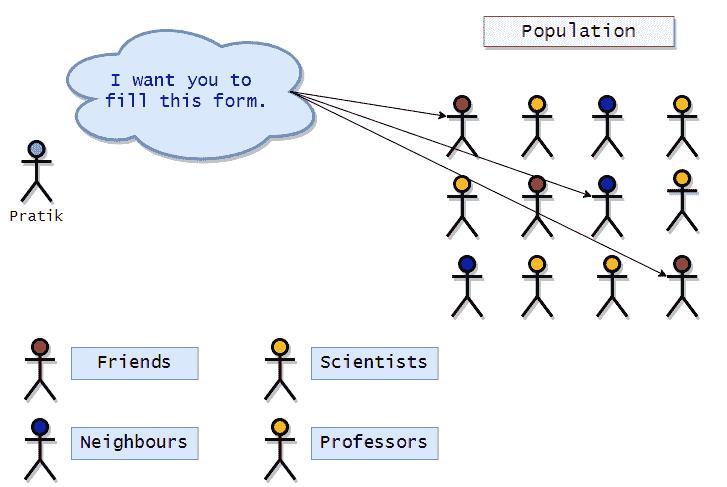

作者图片

在上面的图示中，我们可以看到，研究人员(Pratik)选择他的朋友和邻居作为研究对象，因为他们容易说服或联系。

**优点:**

这很容易，可以很快生成。

**缺点:**

它通常不能很好地代表整个人口。

## 定额抽样

这种方法是分层抽样的一种非概率方法。这里我们要根据一些特征把整个人群分成几个集群。在将人群划分成组后，我们可以在方便的时候从组中选取任何人。受试者不会被随机选择。我们还可以先确定一个配额值，从每个组中选择所需的受试者数量。例如，假设我们要选择一些候选人进行面试，我们必须从人群中选择 10 名男性和 10 名女性。所以我们在这里可以做的是，我们可以基于性别对人群进行聚类，然后我们可以在方便的时候选择任何 10 个男性和 10 个女性。聚类后选择受试者没有随机化。以下是所讨论的取样技术的可视化:

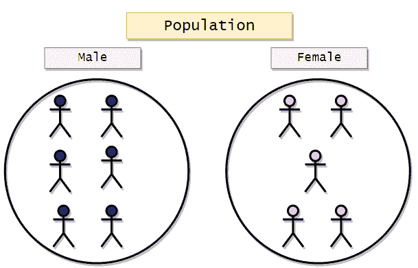

作者图片

**样品:**

在这里，我们将从两组中选择两位候选人。

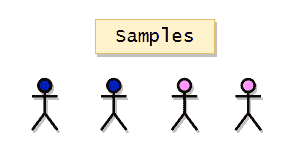

作者图片

**优点:**

*   管理起来很简单。它又快又便宜。
*   如果需要，我们可以考虑人口比例。

**缺点:**

*   选择不是随机的。

## 判断抽样

在这种方法中，研究者根据自己的判断或胆量来选择研究对象或参与者。研究者可以特别选择一群具有特定特征的人。研究者可能只选择女性参与者。所以我们可以说，这种方法基于研究者的判断会有偏差。使用这种方法，研究人员可以只选择那些他/她认为完全适合他/她的研究的主题。它可能不代表全体人民的意见。

这是所讨论的技术的可视化。

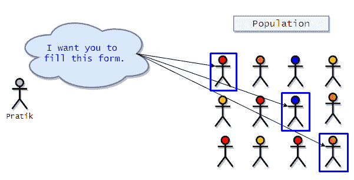

作者图片

**样品**

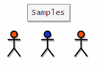

作者图片

**优点:**

1.  这样既省时又划算。

**缺点:**

1.  结果可能会有偏差。

## 滚雪球抽样

这是一种非概率技术，要求现有的受试者提名他们最熟悉的其他受试者。在这里，样本量会像滚雪球一样越来越大。这就是为什么它被称为滚雪球抽样。这里现有的主体会招募其他主体，循环往复。它通常用于社会科学调查，在这种调查中很难找到具有特定特征的对象。在下面的可视化中，我们可以看到最初，Pratik 有三个受试者，然后受试者招募其他人，以此类推。

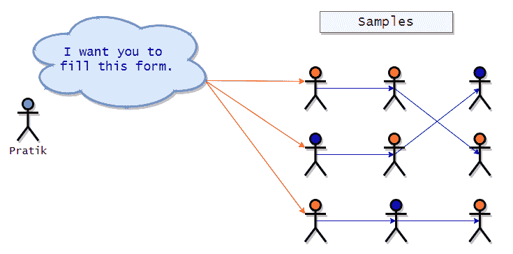

作者图片

**优点:**

*   当样本很难找到时，这很有用。
*   成本低。
*   与我们的研究非常相关的样本。

**缺点:**

*   这种方法依赖于受试者招募其他受试者，因此存在选择偏差的几率很高。

只有在主体有其他相关联系的情况下才有效。

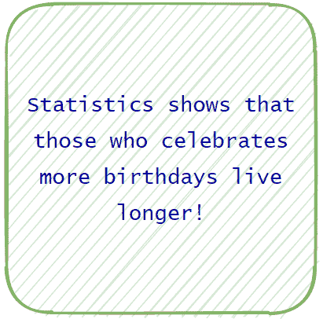

作者图片

## 什么是统计学？

根据维基百科，统计学是一门关于数据的收集、组织、分析、解释和展示的学科。我们也可以说统计学是一门收集和分析大量数值数据的科学。我们也可以说，统计学是一门科学，是一门逻辑。

## 统计学在数据科学和机器学习中的重要性

数据科学和机器学习是以编程和数学为主导的科学学科。大多数数据公司产生大量的数据，专家可以进一步分析和可视化，以了解趋势。数据可视化只有在数据清晰易懂的情况下才能进行。但是，由生成的数据

组织太乱，不好处理。所以我们可以说，发现数据中的结构和基本模式是数据科学的一项基本任务。统计学提供了发现数据中隐藏的结构和模式的方法和工具，以便专家可以从中做出预测。统计学是数据科学领域的基础步骤。我们可以说我们需要统计学来把观察结果转化为信息。在机器学习中，我们使用各种算法进行预测、分类和聚类。然而，有许多有用的库可供使用，它们将为我们执行数学计算。然而，了解每种算法背后的数学是至关重要的，因为它让我们深入了解我们在做什么以及为什么做？

与其将听起来很酷的机器学习算法应用于我们的数据来进行预测，不如理解模式来了解数据的分布是必要的。现在，数据的分布将如何帮助我们？在知道了数据的分布之后，我们可以看看机器学习算法的局限性，并应用它们来给我们最好的结果。在我们的项目中，我们使用数据来训练算法，并从中进行预测。为了训练我们算法的模型，我们通常使用 Python 编程语言。

而且，我们很清楚，python 相对于其他编程语言来说要慢一些。然而，简单的语法和开发良好的库给了程序员一个倾向于它的理由。在现实世界中，数据将是大量的，所以我们不能冒险根据一种不能提供有用见解的算法来训练我们的模型。这就是为什么理解数据的分布是至关重要的。在未来的工作中，我们将展示不同类型的数据分布。

## 统计类型:

统计学可以分为两大类。

*   描述统计学
*   推断统计学

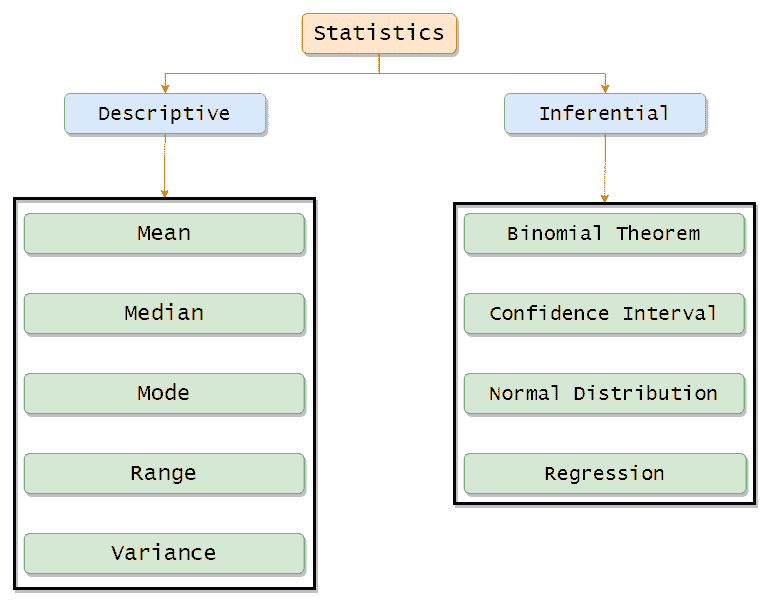

作者图片

## 描述性统计:

描述统计学基本上是利用图表来组织和总结数据。我们可以汇总数据，并使用条形图、直方图和饼状图将其可视化。

我们还可以查看图形的形状和偏斜度。描述性统计包括寻找集中趋势值(如平均值、中值和众数)的方法。除此之外，我们还可以用范围、方差和标准偏差值来衡量数据的可变性或分布。

## 推理统计:

在推断统计学中，我们使用样本数据进行推断或得出总体结论。它用概率来找出我们所做预测的可信度。

在这项工作中，我们将主要侧重于描述性统计。

## 集中趋势的测量:

集中趋势指的是建议一个最好地概括我们整个数据集的数字的想法。它也可以被称为分布的中心。

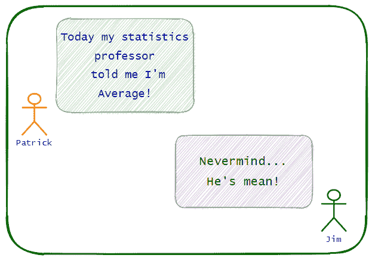

作者图片

## 算术平均值:

均值可以被称为数据的集中趋势。它是一个单一的数字，我们的数据围绕这个数字分布。简而言之，我们可以说这是一个最能代表整个数据集的单一数字。

通过将所有数字相加，然后将总和除以数据集的长度，可以得到数据集的平均值。

**总体均值公式:**

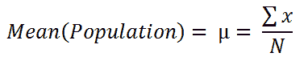

作者图片

**样本均值公式:**

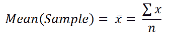

作者图片

**举例:**

1.  找出以下数据集的平均值:[5，8，15，18，25]

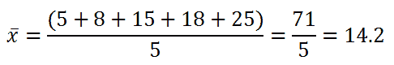

作者图片

Python 实现:

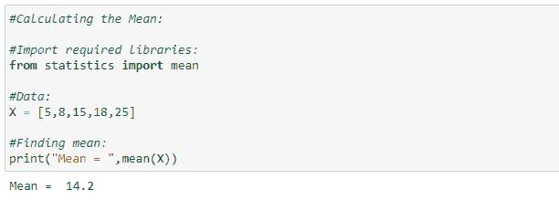

## 加权平均值:

当我们在一些数据中多次出现相同的数字时，要找到平均值，而不是简单地将其相加，然后除以其长度，我们将找到每个数字的加权频率，这样我们的过程将变得更快。

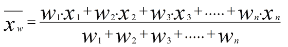

作者图片

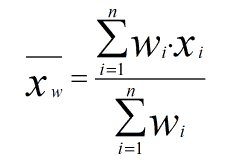

作者图片

求下列数据的加权平均值:

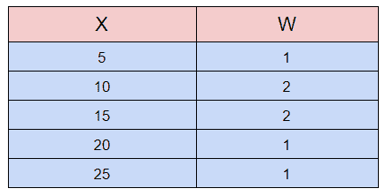

作者图片

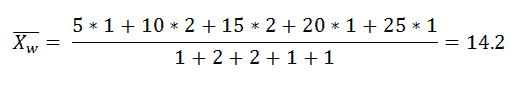

作者图片

Python 实现:

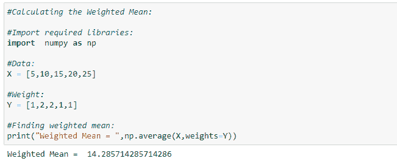

作者图片

## 分类数据集的平均值:

假设我们去了一个只有狗和猫的宠物展。当我们前进时，我们注意到宠物是狗还是猫。以下是最后的观察或数据。

[狗、猫、猫、狗、猫、猫、狗、猫、猫、狗]

现在我们想找出这个分类数据集的平均值。为此，我们必须将分类数据集转换为数值数据集。这里我们将猫表示为 0，狗表示为

1.因此，这是我们的数字数据集。

[1,0,0,1,0,0,1,0,0,1]

现在我们可以应用常规平均值公式:

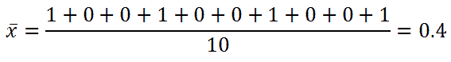

作者图片

现在，我们可以看到平均值向 0 集中。因此，在我们的数据集中，猫的数量高于狗的数量。

## 几何平均值:

当我们把 n 个数相乘时，几何平均数就是“n”次方根。

作者图片

简单来说:

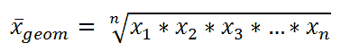

作者图片

**举例:**

求[3，4，5，6，7]的几何平均数。

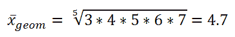

作者图片

**用例:**

当我们试图计算由乘法而不是加法决定的平均增长率时，通常使用它。

例如:

我的苹果股票在第一年上涨了 20%，第二年上涨了 30%，第三年上涨了 40%。那么平均年回报率是多少呢？

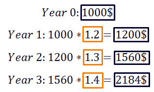

作者图片

给普拉蒂克买杯咖啡！

**免责声明:**本文所表达的观点仅代表作者个人观点，不代表与作者有直接或间接联系的任何公司的观点。这本书并不打算成为最终产品，而是当前思想的反映，同时也是讨论和改进的催化剂。

**除非另有说明，所有图片均来自作者。**

通过[发布**走向 AI** 发布](https://towardsai.net/)

## 资源:

[**Github 资源库**](https://news.towardsai.net/descriptive-statistics-github) 。

[**Google Colab 实现**](https://news.towardsai.net/descriptive-statistics-colab) **。**

 [## 获取我们这本书的完整副本↓

### 使用 Python 进行数据驱动决策的描述性统计。这不是一本典型的描述性统计参考书…

news.towardsai.net](https://news.towardsai.net/shop/)  [## 加入面向人工智能|面向人工智能成员

### “走向人工智能”是一个讨论人工智能、数据科学、数据可视化、深度学习的社区

members.towardsai.net](https://members.towardsai.net/) 

## 参考资料:

[1]所有关于统计学的双关语和笑话都引用自《统计学和统计学家》中的“科学笑话:1。数学:1.2 统计和统计员”。2021.https://jcdverha.home.xs4all.nl/scijokes/1_2.html. jcdverha . home . xs 4 all . nl

[2]“百分位数和四分位数”。2021.Statisticslectures.Com。http://www . statistics lectures . com/topics/percentile quartile/。

[3] 2021.Coursehero.Com。https://www . course hero . com/file/p 3 b 7 kgk/The-variance-is-a-weighted-average-of-The-squared-deviations-from-The-mean/。

[4]“数据的正态分布”。2021.Varsitytutors.Com。https://www . varsitytutors . com/hot math/hot math _ help/topics/normal-distribution-of-data。

[5]“偏”。2021.En.Wikipedia.Org。https://en.wikipedia.org/wiki/Skewness.

[6]“让我们了解相关矩阵和协方差矩阵”。2020.中等。https://towardsdatascience . com/let-us-understand-the-correlation-matrix-and-协方差-matrix-d42e6b643c22。

【7】“协方差 Vs 相关性|相关性与协方差的区别”。2020.Greatlearning 博客:免费资源:塑造你职业生涯的关键！。https://www . mygreatlearning . com/blog/协方差-vs-correlation/。

[8]《矩(数学)》。2021.En.Wikipedia.Org。https://en . Wikipedia . org/wiki/Moment _(数学)。

[9]“置信区间定义”。2021.Investopedia。https://www . investopedia . com/terms/c/confidence interval . ASP。

[10]“正态分布”。2021.En.Wikipedia.Org。https://en.wikipedia.org/wiki/Normal_distribution.

[11]“峰度”。2021.En.Wikipedia.Org。https://en.wikipedia.org/wiki/Kurtosis.

[12]所有图表都是使用“流程图制作工具和在线图表软件”制作的。2021.App.Diagrams.Net。https://app.diagrams.net/.