# 熊猫的描述性统计

> 原文：<https://pub.towardsai.net/descriptive-statistics-with-pandas-a1e206287199?source=collection_archive---------2----------------------->

## [数据科学](https://towardsai.net/p/category/data-science)，[统计](https://towardsai.net/p/category/statistics)

## 带有示例、公式和 python 代码的统计概念


来源: [flexjobs](https://www.flexjobs.com/blog/post/big-work-and-flexibility-stats-from-2018-predictions-2019/)

# 内容

1.  **位置估计**

*   平均
*   修整平均值
*   加权平均数
*   中位数
*   方式

2.**可变性的估计**

*   偏差
*   平均绝对偏差
*   中位数绝对偏差
*   差异
*   标准偏差
*   四分位间距

3.**相关性**

# 了解数据集

我们将使用包含产品 ID、成本价和售价的简单产品详情数据集来演示各种统计方法。

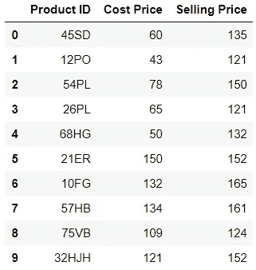

## 导入和读取数据

大多数的统计方法都可以用熊猫来做，除了修剪平均数(scipy)和加权平均数(numpy)。将产品数据读入名为“*产品*”的数据帧。Seaborn 是一个图形绘图库。

```
import numpy as np
import pandas as pd
from scipy import stats
import seaborn as snsproducts = pd.read_csv('products.csv')
```

# **位置估计**

当有几个不同的值时，查看数据所在位置或中心的估计值通常非常有帮助。它也被称为**集中趋势的度量**。让我们看看不同的测量方法。

1.  **的意思是**

最基本的位置估计是数据的平均值，简单地说就是数值的平均 T21。这是所有值的总和除以值的总数。

> 例子
> 
> 值:10，11，1，20，13
> 
> 平均值= (10+11+1+20+13)/5 = 11

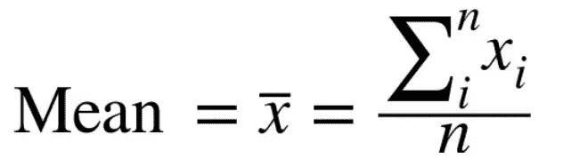

> 平均值用“ *x-bar* ”表示， *n* 是数值的总数。

```
products['Cost Price'].mean()**Output**: 94.2
```

2.**修剪后的平均值**

平均值的另一个变体是修整平均值。修剪平均值只不过是从需要测量平均值的排序数据的极端值中排除一定百分比的值。

例如，在跳水比赛中，五名裁判的最高分和最低分被去掉，最后得分是其余三名裁判的平均值。这使得单个裁判很难操纵比分。

> 例子
> 
> 值:10，11，1，20，13
> 
> 排序:1，10，11，13，20
> 
> 修整后:10、11、13
> 
> 平均值= (10+11+13)/= 11.33

> **注**:由于示例中的值很小，因此平均值和修整平均值之间没有太大差异。当我们处理真实世界的数据时，修剪均值会产生影响。

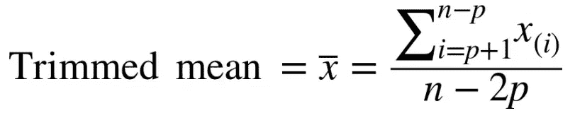

```
#using stats from scipy
#trimming 10%(0.1) of values from both end od sorted data
#trim_mean() sorts the values internally
stats.trim_mean(products[’Cost Price’], 0.1)**Output**: 93.625
```

3.**加权平均值**

加权平均值是另一种类型的平均值，我们将该值乘以用户指定的权重，并将它们的总和除以给定的总权重。

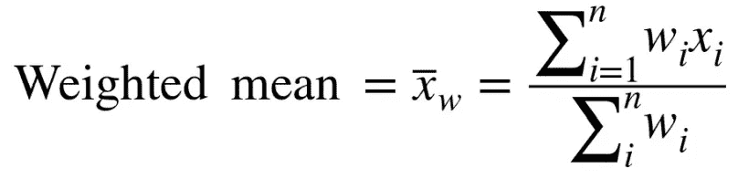

其中 *w* 是对应于值 *x* 的重量。

```
#generating random weights
weights = [i for i in range(10,20)]#calculating weighted average
np.average(products['Cost Price'], weights=weights)**Output**: 99.6896551724138
```

**什么时候使用加权平均值？**

*   假设我们取多个传感器读数的平均值，并且其中两个传感器不太准确，那么可能可行的是给该传感器分配较小的权重，而不是丢弃该读数。
*   假设我们可能没有代表数据集中所有组的数据。为了纠正这种情况，我们可以对预测不足的一组值赋予更高的权重。

4.**中间值**

Median 不过是排序数据的**中间值**。如果有偶数个值，那么中值将是两个值的平均值，这两个值将把排序后的数据分成相等的下半部分和上半部分。

> 示例 1
> 
> 值:10，11，1，20，13
> 
> 排序:1，10，11，13，20
> 
> 中位数:11
> 
> 示例 2
> 
> 值:10，11，1，20，13，5
> 
> 排序:1，5，10，11，13，20
> 
> 中位数:(10+11)/2=10.5

```
products['Cost Price'].median()**Output**: 93.5
```

**为什么中位数高于平均数？**

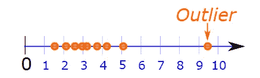

来源:[数学趣味](https://www.mathsisfun.com/definitions/outlier.html#:~:text=A%20value%20that%20)

均值对异常值非常敏感，异常值可能会操纵位置的估计。例如，我们对计算 COVID19 爆发前开始的初创公司的平均收入感兴趣，我们可以看到，有一家初创公司的收入与剩余公司相比非常高，因为该初创公司对现代面料感兴趣，并且一旦对口罩的需求被夸大，他们就开始生产口罩，从而获得高收入。这被认为是异常值，会导致不准确的数据汇总。在这种情况下，中值是首选。

5.**模式**

众数是最简单的，数据中**出现次数最高的值**就是众数。虽然下面的例子有数字，但模式是分类数据的汇总统计，通常不用于数字。

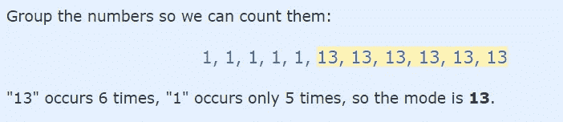

资料来源:mathisfun

```
#value_counts() given number of occurances
#of each unique values in Cost Price column
products['Cost Price'].value_counts()
```

# **可变性的估计**

统计学的核心在于可变性。可变性是**总结一个特征的另一个维度**。也称为**分散**，衡量一个值是紧密聚集还是分散。统计学家已经定义了许多测量离差的方法，让我们来看看每一种方法。

1.  **偏差**

偏差是最广泛使用的变异估计。它测量给定数据点偏离位置估计值的程度。

> 例子
> 
> 值:10，11，1，20，13
> 
> 平均值(位置估计值):11
> 
> 每个值与平均值的偏差
> 
> =10–11, 11–11, 1–11, 20–11, 13–11
> 
> = -1, 0, -10, 9, 2

在上面的示例中，显示了每个值与位置估计值的离散程度。

2.**平均绝对偏差**

仅仅是偏差值没有多大意义，我们需要对它进行总结以得出一些推论，这可以通过计算这些偏差的平均值来完成。

> 例子
> 
> 偏差值:-1，0，-10，9，2
> 
> Avegare: (-1 + 0 + -10 + 9 + 2)/5 = 0

惊讶吗？不要这样。偏差的平均值始终为零，负值抵消了正值。为了克服这一点，我们采用偏差的绝对值。

> 绝对偏差值:1，0，10，9，2
> 
> 平均值:(1+0+10+9+2)/5=4.4

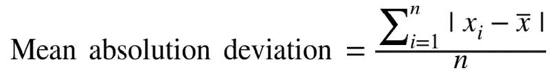

*x-bar* 为平均值， *x* 为单个数值， *n* 为数值总数

```
#np is alias for numpy
mean = np.mean(products['Cost Price'])
np.mean(np.absolute(products['Cost Price'] - mean))**Output**: 35.0
```

3.**中位数绝对偏差**

你猜对了。使用中间值**代替平均值**获得中间值绝对偏差。使用的理由是一样的，中位数绝对偏差对异常值不敏感。

4.**差异**

方差是离差平方的平均值。许多统计学家倾向于使用平均绝对偏差，因为它更准确。

> 例子
> 
> 每个值与平均值的平方偏差
> 
> =(10–11)², (11–11)², (1–11)², (20–11)², (13–11)²
> 
> = 1, 0, 100, 81, 4
> 
> 方差=(1+0+100+81+4)/(5–1)
> 
> =37.2

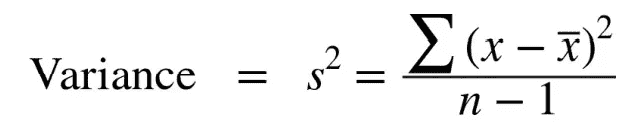

5.**标准偏差**

我们发现上面例子中的方差是 37.2，但是 37.2 有多好或多坏呢？37.2 的方差实际上意味着什么？为了从方差中提取信息，我们计算标准差。方差的平方根就是标准差。标准差是查找数据分布情况的最佳方法，因为结果值与原始数据的比例相同。

> 例子
> 
> 方差=37.2
> 
> 标准偏差= 6.09

这个值看起来不错。更有道理。现在我们可以知道哪个值在平均值的一个标准偏差(6.09)内。

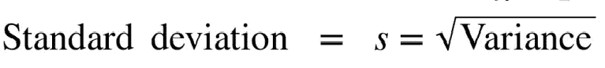

```
products['Cost Price'].std()**Output**: 39.33276835752432
```

6.**四分位间距**

另一种估计离差的不同方法是查看分类数据的**分布**。这可以通过计算第 25 个百分位数和第 75 个百分位数之间的差值(IQR)来实现。

**什么是百分位数？**

假设你在一个 20 人的班级中排名第四，这意味着 80%的人得分比你低。换句话说，你是班级群体的第 80 个百分位数。

反过来，为了找到第 80 个百分位数，对数据进行排序，从最小值开始，向最大值前进 80%，得到第 80 个百分位数。

> 例子
> 
> 值:3，1，5，3，6，7，2，9
> 
> 排序:1，2，3，3，5，6，7，9
> 
> 第 25 百分位:2.5
> 
> 第 75 百分位:6.5
> 
> 四分位距:6.5–2.5 = 4

```
percentile_75th = products['Cost Price'].quantile(0.75)
percentile_25th = products['Cost Price'].quantile(0.25)
IQR = percentile_75th - percentile_25th**Output:** 68.0
```

# **相关性**

相关性是对两个变量的联合可变性的度量。测量通常在预测值之间或预测值变量和目标变量之间进行。相关值始终介于-1 和 1 之间。

*   如果 *Y* 值随着 *X* 值的增加而增加，或者 *Y* 值随着 *X* 值的减少而减少，则变量 *X* 和 *Y* 被称为正相关(值 1)。
*   相关值为 0 意味着这两个变量是独立的。
*   如果 *Y* 值随着 *X* 值的增加而减少，或者反之亦然，那么这两个变量 *X* 和 *Y* 被称为负相关。

让我们看看*成本价*和*售价*在我们的*产品*数据集中是如何关联的。同样，Pandas 有一个非常简单的函数 corr()，它从数据集中选取数字列，并给出相关的表格形式。

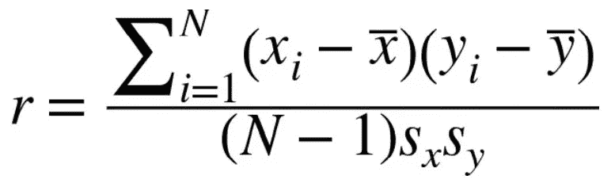

*x* 是变量 *X* 的单个值， *y* 是变量 *Y 的单个值，x-bar* 是变量 *X 的平均值，y-bar* 是变量 *Y 的平均值，N* 代表值的总数， *S(x)* 是 *X* 的标准差，并且

> **注**:
> 
> 相同变量之间的相关性始终为 1。

```
products.corr()
```

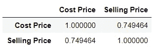

它表示成本价和售价与 0.75 的值相关。任何大于 0.5 的值都可以被认为是正相关。这意味着，如果任何产品的成本价上升，销售价格也很有可能上升，反之亦然。当我们有较少的列时，表格形式是好的，当我们有许多列时，表格形式是难以阅读的。Seaborn 是一个可视化的库，它可以绘制相关性以便快速理解。

```
#sns is alias to seaborn
#heatmap to plot correlation
sns.heatmap(products.corr(),annot=True)
```

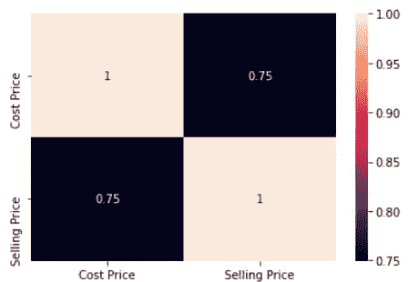

现在，这更容易解释了。


乔恩·泰森在 [Unsplash](https://unsplash.com?utm_source=medium&utm_medium=referral) 上的照片

让我们连接

[](https://www.linkedin.com/in/sujan-shirol/) [## Sujan Shirol - Python 开发人员- 2x Kaggle 专家| LinkedIn

### 我相信教学是最好的学习方式。技术作家在媒体的最大出版物的启动，走向人工智能&…

www.linkedin.com](https://www.linkedin.com/in/sujan-shirol/)