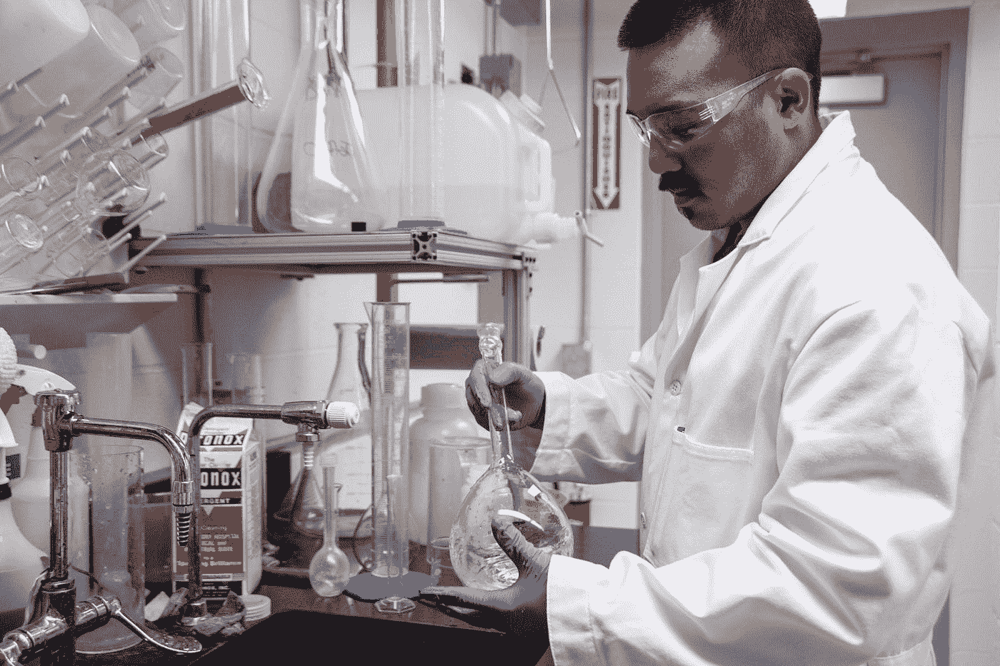

# 数据科学实验设计

> 原文：<https://pub.towardsai.net/design-of-experiments-in-data-science-b0f354c185c2?source=collection_archive---------1----------------------->

在 [Unsplash](https://unsplash.com?utm_source=medium&utm_medium=referral) 上[科学高清](https://unsplash.com/@scienceinhd?utm_source=medium&utm_medium=referral)拍摄的照片

## 数据科学

## 设计实验以收集数据的过程

# 一.导言

数据在数据科学和机器学习中起着核心作用。最常见的情况是，我们假设用于分析或建模的数据是现成的和免费的。有时，我们可能没有数据，获取完整的数据集要么是不可能的，要么需要太长时间来收集。在这种情况下，我们需要设计一种方法来尝试收集我们可以快速有效地获得的数据的最佳子集。设计一个实验来收集数据的过程称为 ***实验设计*** 。实验设计的一些例子包括调查和临床试验。

在本文中，我们将讨论在设计和执行数据收集实验时要记住的 4 个主要因素。

# 二。设计数据收集实验时要记住的因素

在本节中，我们将讨论设计数据收集实验时需要考虑的 4 个主要因素。

## 1.时间

我们需要确保实验可以在合理的时间内设计和实施。例如，假设某个组织的客户服务部门正在经历呼叫数量的指数级增长。组织可以设计员工和客户都可以参与的调查。这必须以迅速和及时的方式完成，以便可以分析收集的数据并将其用于数据驱动的决策，从而帮助改善客户体验。如果没有及时执行实验设计和数据分析，可能会对销售和利润产生负面影响。

## 2.数据量

在设计实验时，我们需要确保从实验中收集的数据足以回答我们需要回答的问题。与总体数据相比，收集的数据量必须很小，否则将需要很长时间来收集。样本数据必须能代表整个人口。例如，为研究药物疗效而设计的实验应该在人口统计学上具有代表性(应该包括不同的年龄组、性别、种族等)。).

## 3.确定重要因素

在设计收集数据的实验时，你需要决定你的因变量或预测变量是什么。例如，如果实验的目标是收集数据，使您能够估计给定社区的房价，您可能会决定根据预测因素或特征(如卧室数量、浴室数量、平方英尺、邮政编码、学区、建造年份、HOA 等)来预测房价。理解重要特性和控制特性是很重要的。

## 4.费用

设计一个收集数据的实验可能会非常昂贵。执行实验也可能涉及成本。例如，参与调查的参与者可以获得报酬，作为鼓励参与的奖励。重要的是，在设计一个实验之前，你要估计执行实验的成本，以及实验的收益是否大于风险。例如，如果调查结果可以改善客户体验并增加利润，那么投资就是值得的。

# 三。摘要

总之，我们已经讨论了在设计数据收集实验时必须考虑的几个因素。关键目标是设计一种快速有效地收集最佳数据子集的方法。

# 其他数据科学/机器学习资源

[数据科学最低要求:开始从事数据科学工作需要知道的 10 项基本技能](https://towardsdatascience.com/data-science-minimum-10-essential-skills-you-need-to-know-to-start-doing-data-science-e5a5a9be5991)

[数据科学课程](https://medium.com/towards-artificial-intelligence/data-science-curriculum-bf3bb6805576)

[机器学习的基本数学技能](https://medium.com/towards-artificial-intelligence/4-math-skills-for-machine-learning-12bfbc959c92)

[3 个最佳数据科学 MOOC 专业](https://medium.com/towards-artificial-intelligence/3-best-data-science-mooc-specializations-d58da382f628)

[进入数据科学的 5 个最佳学位](https://towardsdatascience.com/5-best-degrees-for-getting-into-data-science-c3eb067883b1)

[2020 年开始数据科学之旅的 5 个理由](https://towardsdatascience.com/5-reasons-why-you-should-begin-your-data-science-journey-in-2020-2b4a0a5e4239)

[数据科学的理论基础——我应该关心还是仅仅关注实践技能？](https://towardsdatascience.com/theoretical-foundations-of-data-science-should-i-care-or-simply-focus-on-hands-on-skills-c53fb0caba66)

[机器学习项目规划](https://towardsdatascience.com/machine-learning-project-planning-71bdb3a44349)

[如何组织你的数据科学项目](https://towardsdatascience.com/how-to-organize-your-data-science-project-dd6599cf000a)

[大型数据科学项目的生产力工具](https://medium.com/towards-artificial-intelligence/productivity-tools-for-large-scale-data-science-projects-64810dfbb971)

[数据科学作品集比简历更有价值](https://towardsdatascience.com/a-data-science-portfolio-is-more-valuable-than-a-resume-2d031d6ce518)

[数据科学 101 —包含 R 和 Python 代码的中型平台短期课程](https://medium.com/towards-artificial-intelligence/data-science-101-a-short-course-on-medium-platform-with-r-and-python-code-included-3cdc9d489c6d)

***如有疑问，请发邮件给我***:benjaminobi@gmail.com