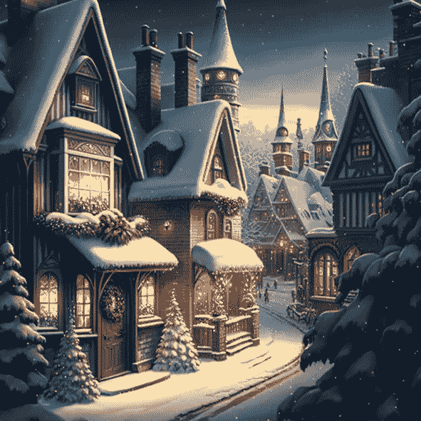
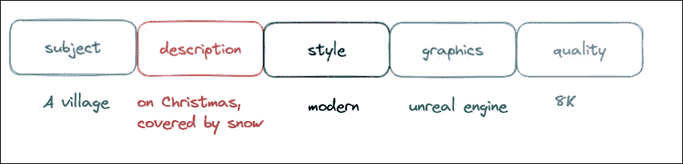
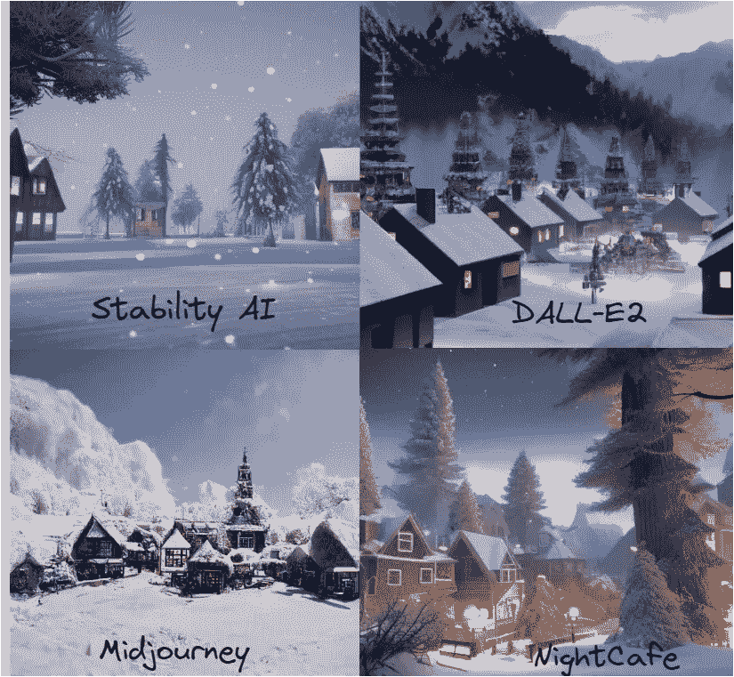
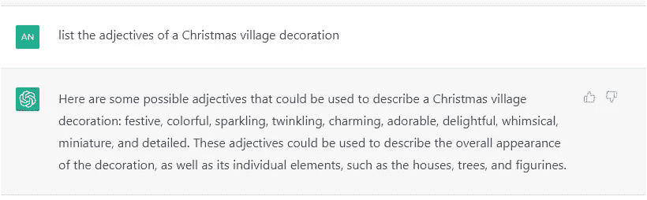
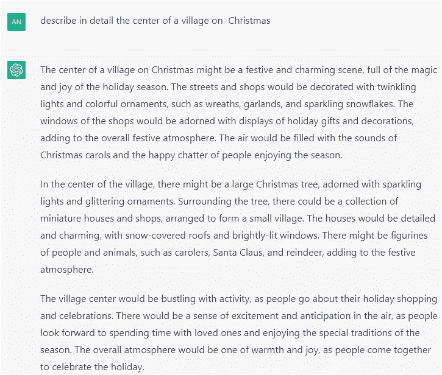
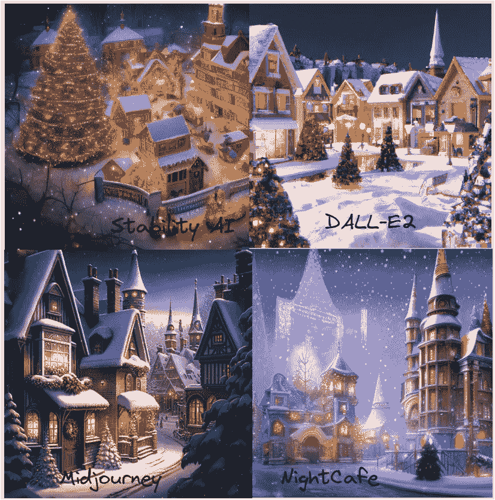

# 使用 ChatGPT 设计你的 AI 艺术生成器提示

> 原文：<https://pub.towardsai.net/design-your-ai-art-generator-prompt-using-chatgpt-7a3dfddf6f76?source=collection_archive---------0----------------------->

## 关于如何使用 ChatGPT 编写文本提示的简短指南

图片由作者使用 [**中途生成**](https://midjourney.com)

# 动机

[**ChatGPT**](https://chat.openai.com/chat)**open ai 聊天机器人自发布以来已经相当受欢迎。它可以以各种有趣的方式使用，例如生成代码片段，解释使用工具/框架/语言的技术步骤，建议最佳实践，简历书籍，文章等。
然而，我一直很好奇 ChatGPT 是如何支持我的个人爱好摄影的。本文解释了如何使用 ChatGPT 为图像 AI 生成器创建精心制作的提示，例如 [DALL-E](https://openai.com/blog/dall-e/) 、 [Midjourney](https://midjourney.com) 、 [Nightcafe](https://creator.nightcafe.studio/) 和 [DreamStudio AI](https://beta.dreamstudio.ai/home) 。**

# ****关于人工智能艺术生成器的几句话****

**人工智能艺术生成器是一个能够根据给定的文本提示创建图像、视频或音乐的系统。使用图像-文本对来训练该系统。我玩过 [DALL-E](https://openai.com/blog/dall-e/) 、[midway](https://midjourney.com)、 [Nightcafe](https://creator.nightcafe.studio/) 和 [DreamStudio AI](https://beta.dreamstudio.ai/home) AI 生成器，因为它们操作简单，图像质量好。**

**[*DALL-E2*](https://openai.com/blog/dall-e/) 是一个使用[扩散](https://en.wikipedia.org/wiki/Diffusion_model)和*对比语言——图像预训练* (CLIP)模型的文本到图像的 AI 艺术生成器。它使用的**35 亿**参数比它的前身 [DALL-E](https://openai.com/blog/dall-e/) (一个[生成式预训练变压器](https://en.wikipedia.org/wiki/Generative_Pre-trained_Transformer) (GPT-3)的版本)少**120 亿**参数，两者都是由 OpenAI 开发的。请记住，DALL-E2 的提示长度限制为 400 个字符。它可以生成非常逼真的照片。所以如果你正在寻找艺术照片，DALL-E 可能不是一个很好的选择。**

**[*Midjourney*](https://midjourney.gitbook.io/docs/) 是一个人工智能艺术生成器，它使用基于生成对抗网络(GANs)的文本到图像技术。它使用一个不和谐机器人与其内部人工智能服务器进行通信。生成的图像具有独特而令人印象深刻的艺术风格。我必须承认我是一个超级粉丝。**

**[*Nightcafe*](https://creator.nightcafe.studio/)AI Generator 最初使用的是神经式的转移模型，但在后来的升级中使用了 CLIP +矢量量化生成对抗网络(VQGAN)和稳定扩散模型。使用 Nightcafe 的一个主要优点是，我们可以随心所欲地使用生成的图像。**

**[*DreamStudio AI —稳定扩散*](https://stability.ai/blog/stable-diffusion-public-release) *2.0* 是 StabilityAI 基于稳定扩散模型的文本到图像的 AI 艺术生成器。就质量而言，它与 DALL-E 2 相当，但比 DALL-E 2 更具艺术性。**

# **什么是提示？**

**要使用人工智能艺术生成器创建高质量的内容，您需要提供适当的提示和精选的关键字。输出在很大程度上取决于提示的好坏。**

***提示是一组自然语言的指令，简单来说就是一个文本，作为人工智能生成器的输入。***

**一个好的提示应该提到以下实体:**

****

**作者图片**

*   ****主语:**用名词表示向 AI 系统暗示要生成什么场景。**
*   ****描述:**暗示与主题相关的附加信息，如形容词(惊艳、可爱)、背景描述等。**
*   ****Style** :表示图像的主题。它可以包括艺术家的名字(毕加索等。)或者定制风格如*奇幻、* *详解、现代、当代等。***
*   ****Graphics** :代表增强图像效果的计算机图形引擎类型。此类关键字的示例有*虚幻引擎、3D 渲染和辛烷渲染。***
*   ****质量:**表示图像质量，如 4K、8K 或 HD。**

# **所以让我们开始玩吧🎄**

**让我们使用下面的提示。**

> ****提示:**圣诞节的美丽村庄，白雪覆盖，现代，虚幻引擎，8K**

****

**我们可以看到，所有四个 AI 生成器都产生了有趣的输出，但缺乏个性。**

**让我们使用聊天机器人 ChatGPT 来帮助我们改进我们的提示描述。我让 ChatGPT 列出形容词并描述一个圣诞村的装饰。**

********

## **在 ChatGPT 的帮助下设计的提示🎄**

> **圣诞村，神奇，迷人，花环，白雪覆盖的街道，多彩的建筑，闪闪发光，迷人，详细，闪闪发光，闪亮，闪烁的灯光，喜庆，华丽，传统，异想天开，圣诞节，高度详细，超现实，插图，虚幻引擎 5，8K**

**你可以在下面的图片中看到每个提到的人工智能艺术生成器的输出:**

****

**你在说什么？图像好多了😄。个人比较欣赏 Stability AI 和 Midjourney 生成的图像。当然，还有改进的空间。但是，我仍然对 ChatGPT 的帮助非常满意。我相信，通过使用下一代人工智能工具，我们可以以各种方式丰富我们的创造力。**

**现在轮到你了。通过详细描述、添加新的样式等，您可以随意提高图像的质量。最后，由你的想象力来决定何时停止😊。**

**我希望你喜欢这篇文章。**

# **感谢您的阅读！**

**如果你想在收件箱里收到我未来的故事，别忘了订阅。**

***如果您喜欢阅读我的故事，并希望支持我成为一名作家，请考虑注册成为 Medium 会员，并获得数千篇数据工程和数据科学文章。***

** [## 通过我的推荐链接加入 Medium—Bildea Ana

### 作为一个媒体会员，你的会员费的一部分会给你阅读的作家，你可以完全接触到每一个故事…

medium.com](https://medium.com/@anna.bildea/membership) 

*在*[*LinkedIn*](https://www.linkedin.com/in/ana-bildea-phd-2339b728/)*和* [Twitter](https://twitter.com/AnaBildea) 上找我！

查看我收集的 MLops 文章

[Bildea Ana](https://medium.com/@anna.bildea?source=post_page-----7a3dfddf6f76--------------------------------)

## 关于 mlops

[View list](https://medium.com/@anna.bildea/list/mlops-04b6c81c50c8?source=post_page-----7a3dfddf6f76--------------------------------)4 stories**