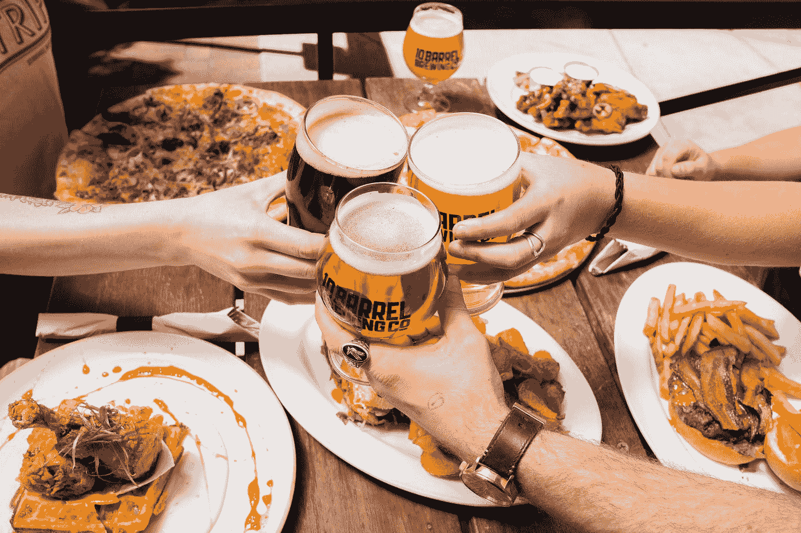
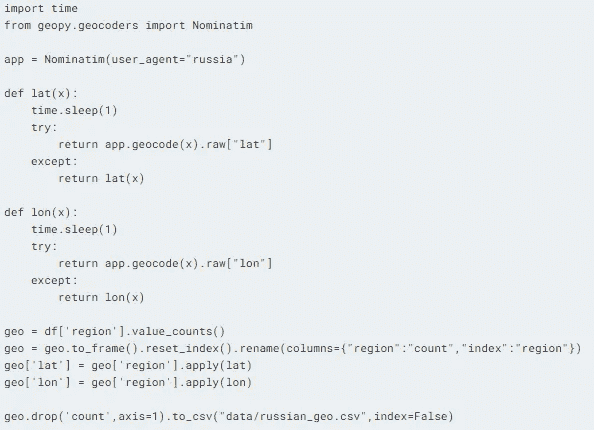

# 设计俄罗斯酒精饮料的促销策略

> 原文：<https://pub.towardsai.net/designing-a-promotional-strategy-for-alcoholic-drinks-in-russia-ec542c153004?source=collection_archive---------2----------------------->

## [机器学习](https://towardsai.net/p/category/machine-learning)

## 主要目标是使用无监督学习找到下十个与圣彼得堡相似的地点。

照片由[将](https://unsplash.com/@elevatebeer?utm_source=medium&utm_medium=referral)升高到[不飞溅](https://unsplash.com?utm_source=medium&utm_medium=referral)

俄罗斯的酒精消费量仍然是世界上最高的。根据世界卫生组织 2011 年的一份报告，这使得它成为开始饮料生意的最佳地点。人们喜欢他们的饮料，该公司在俄罗斯拥有一家出售各种酒精饮料的连锁商店，希望投资营销活动。该公司最近在圣彼得堡举办了一场非常成功的葡萄酒促销活动。由于业务成本，不可能在所有地区开展促销活动。在这个项目中，我们将分析我们的数据，修复丢失的值，可视化数据，训练聚类模型，并最终可视化我们的结果。

# 数据

营销团队为您提供了几种不同饮料类型的历史人均销售额。

**数据集可在** [**俄罗斯酒精消费(1998–2016)| Kaggle**](https://www.kaggle.com/dwdkills/alcohol-consumption-in-russia)**与** [**知识共享— CC0 1.0 通用**](https://creativecommons.org/publicdomain/zero/1.0/) **许可**

*   “年份”——年份(1998 年至 2016 年)
*   “地区”——俄罗斯联邦主体的名称。它可以是州、共和国、边疆区、自治市、联邦城市和一个自治州
*   “葡萄酒”——人均年葡萄酒销量(升)
*   “啤酒”——人均年啤酒销量(升)
*   “伏特加”——人均年伏特加销售量(升)
*   “香槟”——人均年香槟销量(升)
*   “白兰地”——以公升为单位的人均年白兰地销售额

## 正在加载数据集

我们已经使用 pandas 加载了`.csv`数据集及其包含每个地区(85)每年(1998-2016 年)酒精消费量(啤酒、香槟、白兰地、葡萄酒、伏特加)的非常小的数据集。

有 1615 个样本是合理的，因为我们有 19 年的数据和 85 个地区。啤酒是这场游戏的主角，因为啤酒的平均价值是人均每年 51.3 升，第二高的是伏特加，人均每年 11.81 升，现在甚至接近啤酒。这意味着人们更喜欢啤酒作为首选饮料。啤酒也有最高的标准差，这意味着它的需求不稳定，会随着时间波动，而如果你想以最低的标准差开始一项低风险的业务，香槟和白兰地是一个非常安全的赌注。

我们可以探索数据集中所有独特的区域。

# 相互关系

香槟和白兰地之间有很高的相关性，这使得它更好。如果你推广香槟，白兰地和香槟的销量就会增加，这是双赢的局面。

# 缺少值

我们将使用 pandas dataframe `background_gradient`来显示几个缺失值和百分比。似乎所有的饮料栏都有缺失值，最高的是白兰地，66。

我们将使用`fillna`函数和方法`pad`用一列中以前的值填充缺失的值。正如我们可以看到的，我们的数据集中没有缺失值。

# 地理位置

对于地理定位，我们需要获得坐标来在地图上显示 stat。为此，我们需要:

*   地理->命名
*   正在创建用户代理以连接到 geopy 服务器。
*   创建`lat`和`lon`函数，使用地名提取经纬度。
*   计算`region`列的值，重置索引，然后重命名列。
*   将两种功能应用于`geo['region']`
*   将文件导出为“russian_geo.csv”

这个过程需要 5 分钟来运行，所以我们只是将结果保存在一个. csv 文件中，稍后将它与我们的主数据库合并。

作者图片

*   正在加载地理位置数据集。
*   将其与主数据集合并。
*   按“地区”和平均值分组。
*   按“啤酒”降序排列值。

我们将使用 df_geo 数据集在 Plotly 地图上绘制总酒精消耗量。

# 地图

在本节中，我们将在地图上绘制每个地区的总酒精消耗量。

*   我们创建了一个名为“total”的新列，它汇总了所有的饮料列。
*   我们还创建了包含标题的测试列，它将显示在地图上。
*   我们将数据集分为三类，第一类包含前 10 名，第二类包含第 11 至 21 名，第三类包含其余地区。排名是基于每个地区的酒精消费量。
*   我们将使用 Plotly 示例代码[绘制气泡图。](https://plotly.com/python/bubble-maps/)

> *前 10 名和 11-21 名没有家长。它们无处不在，但我们可以在其他类别中看到这种模式。您还可以通过将鼠标悬停在不同的区域上并缩小来观察更多的区域，从而探索不同的区域。*

# 酒精消费过去趋势

在这一部分，我们将探讨不同类型的饮料及其在过去 19 年中的消费趋势。

> *我们可以看到，啤酒消费量在 2007 年之前一直呈上升趋势，之后趋于稳定，并从 2011 年开始下降。葡萄酒、香槟和白兰地的消费量低于啤酒，但保持稳定。直到 2002 年，伏特加的需求一直在增长，随着时间的推移，需求缓慢而稳定地下降。*

最保险的做法是针对白兰地或香槟发起一场运动，但葡萄酒也可能有利可图，因为它的人均消费量更高，而且价格稳定。

# 动画

您可以与下图进行交互，并通过单击播放按钮来观察需求的变化。对于营销经理来说，这是一种简单而有吸引力的方式，可以将您的数据以故事的形式呈现出来。

> 这也很有趣😊

# k 均值聚类

查找聚类是监督学习的一个子类，其中在训练数据中没有可用的目标。聚类的任务是将一组对象组合在一起，使同一聚类中的对象彼此之间比其他聚类中的对象更相似。K-means 在许多数据科学应用程序中广泛用于聚类，如果您需要从未标记的数据中快速发现见解，它尤其有用。

首先，我们需要找到我们的数据中有多少个聚类，在此之前，我们需要创建我们的`X`,为此我们将按“区域”对数据集进行分组，并取平均值。然后我们要在 1 到 9 的范围内运行 SKlearn `KMeans`。在我们的线图中有两个弯头，我们将检查它们。肘方法告诉我们，当惯性有显著变化时，选择集群。

我们在`2`和`3`发现了弯头。

让我们检查 n=2 的集群。

> *这似乎很清楚，但我们不能就此停止，我们还需要在下一部分检查 n=3。*

现在检查 n=3 的集群。

> *我认为 3 个集群更好，我们将基于它划分数据集。聚类是基于酒精消耗量创建的。*

# 集群可视化

在这一部分，我们将比较不同列上的聚类，正如您所看到的，最佳结果显示为啤酒和葡萄酒。

# 聚类群集图

让我们使用 Swamplot 可视化我们的结果。

> *我们可以清楚地看到，在所有饮料类别中，橙子的平均消费量最高。他们都遵循相似的排名规则。橙色高，蓝色中等，绿色低。我们将用它来选出十大地区和产品。*

# 饮料总量群集图

为了总结我们的发现，让我们将酒精总消耗量和聚类可视化。现在很清楚，关于橙子从梯子顶端开始的假设是正确的。

# 层次聚类

我们将使用 scipy spatial distance_matrix 来计算数据集中每个点到所有其他点的距离。函数 distance_matrix 需要两个输入，我们将 X 和 X 相加。

然后，我们将使用 scipy 层次链接，使用平均方法来创建每个聚类之间的链接，稍后将使用这些链接来绘制树状图。

# 系统树图

分层聚类通常被可视化为一个树状图，每个唯一的聚类用不同的颜色表示。正如您所看到的，每个节点是如何连接起来形成这个集群层次结构的。

> 看起来我们有 4 个由不同颜色决定的层次聚类。

# 层次凝聚聚类

使用凝聚聚类，我们将把我们的数据集分成 4 个聚类。要了解更多关于聚集聚类的信息，请点击此[链接](https://towardsdatascience.com/breaking-down-the-agglomerative-clustering-process-1c367f74c7c2)

这 4 个聚类几乎与 Kmeans 的 3 个聚类相似，但中间的聚类是有区别的。我们将使用 Kmeans 和层次聚类来确定营销活动的最佳位置。

# 分类集群

是时候将 Kmeans 集群和层次集群添加到我们的主数据库中了。

1.  创建新列“H_Pop”并添加 H 分类预测。
2.  根据受欢迎程度将数值重命名为类别。
3.  筛选出前 2 个值。

我们将对 Kmean 集群进行同样的操作:

1.  将列名从“标签”重命名为“KM_Pop”
2.  创建一个新列“Total_Drinks”并添加总饮料值。
3.  根据受欢迎程度将数值重命名为类别。
4.  过滤掉以查看按总酒精消耗量排序的前 11 个值。

# 结果

我们最终发现了 10 个与圣彼得堡相似的地区，用于推广新的营销对比。我们选择了在 Kmean 分类上为“High”、在 Herarchery 分类上为“Top”的分类，然后对“Total_Drinks”之外的值进行排序，以获得该活动的前十个地区。

对于最终结果，我们将按照葡萄酒消费量对我们的值进行排序，以得到一个与圣彼得堡相似的聚类，该公司的葡萄酒营销活动在圣彼得堡取得了成功。

这些是我们下一步推广葡萄酒和其他酒精饮料的目标地区:

1.  沃洛格达州
2.  科米共和国
3.  列宁格勒州
4.  斯摩棱斯克州
5.  斯维尔德洛夫斯克州
6.  莫斯科
7.  堪察加边疆区
8.  伊万诺沃州
9.  雅罗斯拉夫尔州
10.  塞瓦斯托波尔

# 结论

我喜欢玩各种无监督聚类算法，并在地图上绘制数值。在这个项目中，我们学习了如何分析数据、填充缺失值、在地图上绘制值、各种 seaborn 可视化，以及最终使用聚类算法来预测营销活动的前十个地区。推广啤酒很容易，但它自 2007 年以来一直在下降，所以最大的希望是推广更稳定的产品，如葡萄酒和白兰地。该公司应专注于“沃洛格达州”地区，因为该地区在顶级集群中拥有最高的葡萄消费量，在成功推出后，它应转移到上述九个地方的其余地方。我们不知道现在是哪一年，也很难使用时间序列来预测聚类，相反，我通过取平均值来简化问题。

> 谢谢你阅读我的笔记本，别忘了投赞成票👆。

# 密码

*   【deepnote.com 酒精饮料促销活动
*   [DataCamp Workspace |俄罗斯酒精饮料数据分析，用于制定促销策略。](https://app.datacamp.com/workspace/w/430606ed-5ae6-4ee1-b682-f97ddb7c7e2a/edit)

# 学习资源

1.  [聚类凝聚过程|走向数据科学](https://towardsdatascience.com/breaking-down-the-agglomerative-clustering-process-1c367f74c7c2)
2.  [话题七。无监督学习:PCA 和聚类| Kaggle](https://www.kaggle.com/kashnitsky/topic-7-unsupervised-learning-pca-and-clustering)
3.  [无监督学习和数据聚类| Sana tan mis HRA |走向数据科学](https://towardsdatascience.com/unsupervised-learning-and-data-clustering-eeecb78b422a)
4.  [课程—数据营学习](https://app.datacamp.com/learn/courses/unsupervised-learning-in-python)
5.  [✨介绍《直通车✨.》Plotly Express 是一个新的高级… |由 plotly | Plotly | Medium](https://medium.com/plotly/introducing-plotly-express-808df010143d)
6.  [seaborn:统计数据可视化— seaborn 0.11.2 文档(pydata.org)](https://seaborn.pydata.org/)
7.  [COVID(EDA)期间的餐厅销售额👨‍🍳😲|卡格尔](https://www.kaggle.com/ahmedterry/restaurants-sales-during-covid-eda)

# 未来作品

*   在这个项目中，我没有使用时间序列数据来确定聚类。对于未来的工作，我将使用时间序列模型来预测类似于`Saints Perterberg`的集群。
*   接下来，我将探索地理空间分析中的各种选项。
*   我将使用各种缩放工具来标准化数据，并观察差异。
*   最后我会做一个各种算法结果的对比。

# 关于作者

[阿比德·阿里·阿万](https://www.polywork.com/kingabzpro) ( [@1abidaliawan](https://twitter.com/1abidaliawan) )是一名认证数据科学家专业人士，热爱构建机器学习模型和研究最新的人工智能技术。目前在 PEC-PITC 测试人工智能产品，他们的工作后来获得批准用于人体试验，如乳腺癌分类器。