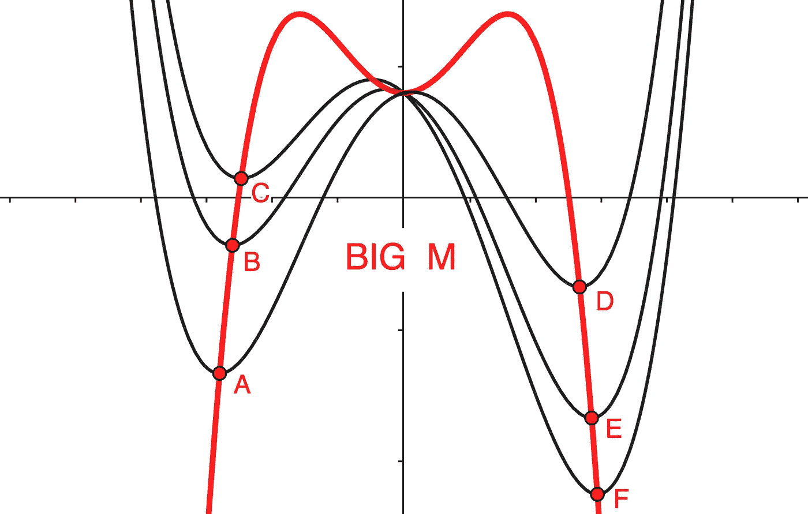
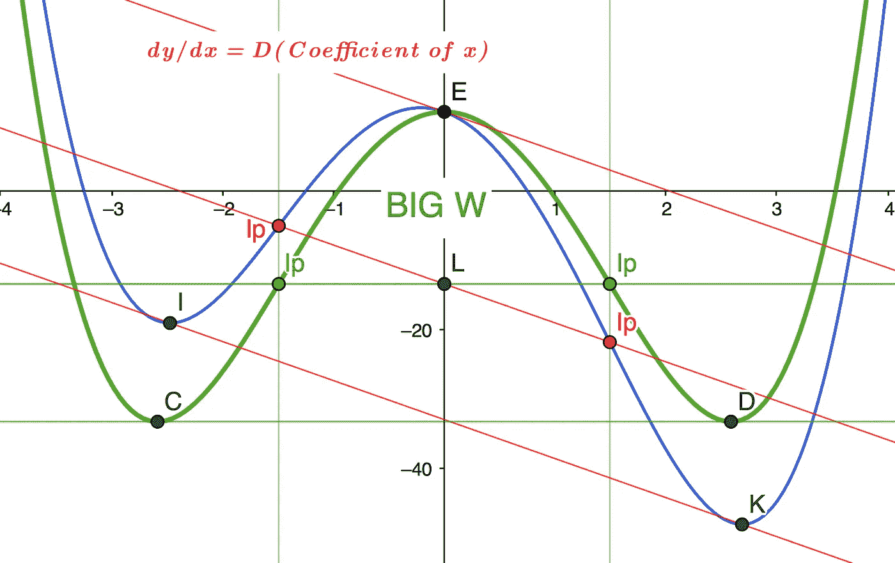
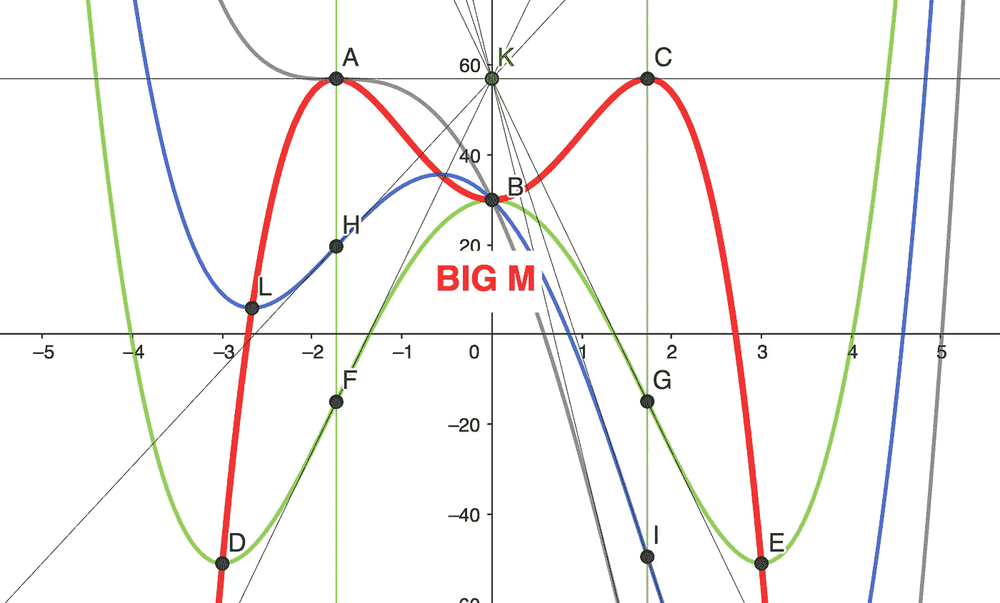
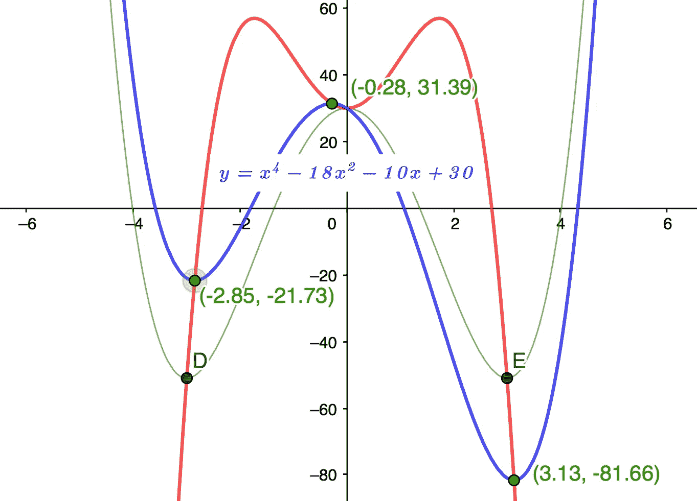
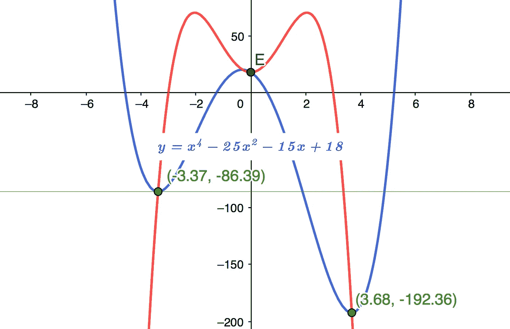

# 使用大 M 指定转向点的四次多项式

> 原文：<https://pub.towardsai.net/designing-quartic-polynomials-from-specified-turning-points-af0db707a6d7?source=collection_archive---------2----------------------->

大 M

## 使用遗传结构设计具有特定转折点的四次曲线，而不使用三次方程

虽然多项式经常从根向上导出，数学教育的重点似乎是再次找到它们，但这并没有解决 ***Tps*** 在一些机器人和人工智能应用中的重要性。这是可以理解的，因为设计满足指定的 ***Tp(y)*** 值的四次函数可能需要三次梯度函数的试错迭代求解。

这篇文章介绍了一种新颖的方法，它使用遗传的**‘大 M’**结构来公式化一个基本的四次多项式，以满足指定的转折点。它完全避免了小隔间，而且第一次就做对了。

因为该函数在 X-Y 网格中保持其形状，所以我们可以使用一个降低或简化的四次多项式， ***y=Ax⁴+Cx +Dx+E，*** 通过在 x 轴上移动它来消除立方内容 ***Bx*** ，然后将结果调整回起始点，从而使分析更简单。对于一个变化的简报，你可以参考我之前的帖子， [*下降的四次多项式-翻译数学简化*](https://gregmath1.medium.com/depressed-quartic-polynomials-translation-math-simplified-2992e503eeec) *。*

*注:在整篇文章中，为了简单起见，我们使用***系数****a = 1****因为它不改变* ***x*** *坐标的转折点和根，也不影响任何对相对梯度的依赖。**

*这篇文章假设了高中水平的数学。一如既往，我希望它能鼓励人们更形象地思考数学！*

*问 **建筑遗传学***

*参考图表 1:*

*四次曲线的一个特征，用 ***表示，y=Ax⁴+Cx +Dx+E*** 显示为蓝色，是它们模拟的 ***见锯*** 动作关于 ***x=0*** 同斜率完全归因于系数*****这条红色的线也平行于通过转折点 **I** 和 **K** 的红线。******

**如果我们设定 ***x*** 系数 ***D=0，*** 四次曲线形成一个对称的**【大 W】**如绿色所示具有相同拐点的***【Ip(x)***和***Tps*****C**和 **D** 横。**

**通过所有遗传函数的拐点的线与 Y 轴相交于同一点 **L *(0，Ipy)*** 。所有 ***Ip*** 截取形成垂直线***x =+-SqRt【C/6A】***。**

****图表 1****

****

****图 1 大 W 见锯****

**BIG M**

**参考图表 2:**

****大 M** 是一个通用的混合函数 ***y=-3x⁴-Cx +E，*** 如红色所示，它描绘了具有不同 ***x*** 系数 ***D*** 的所有函数的 *Tps* 。比如蓝色函数 ***y=x⁴+Cx +？x+E*** 有一个**跷跷板**渐变 ***dy/dx < 0*** 即 ***D < 0*** 而黑色有一个渐变 ***dy/dx=0*** 在 **A、**上**

> **所有函数的 **Ips** 在 **x=0** 处的切线 ***A_C*** 和所有函数的 **Tps** 由 ***大 M*** 追踪。**

****图表 2****

****

****图表 2****

**Derive 大 M**

**让***y=ax⁴-cx+e***代表一个**大 M** 泛红色的**大 w**:***y=ax⁴+cx+e***。其中系数 ***C*** 具有相反的符号，常数 ***E*** 对于两个函数是相同的。**

> **注意系数 **A** 和 **C** 必须具有相反的符号来创建 **Tps** 所以我们在下面的公式中假设 **+A** 和 **-C** 。**

**我们可以得出如下系数:**

**如**大 M 的**外**TpsA(x)***和 **C(x) *=* 大 W*Ip(x)***我们可以这样写:***

*****【Tp(x)=+-SqRt【C/6A】***，等同于**大 M**；**

****大 M**:***dy/dx = 4ax-2Cx = 0***遂；***x = 0******(2ax+C)= 0***遂 sub ***Tp(x)*** :**

*****2a *(SqRt[C/6A])+C = 0***，于是:**

*****aC/3A=-C*** 与 ***A=+1*** 因此；**

*****a=-3*** (或 ***a=+3*** 当 ***A=-1*** )**

**X检查**

**参考图表 3:**

**表明***y=x⁴-18x-10x+30***在图中以蓝色表示外部***TPS***；**

*****Tp(-2.85，-21.73)*** 和 ***Tp(3.13，-81.66)*** 由下式给出:**

1.  ****大 m**:**t111】y=-3x⁴+18x+30t113】；***y =-3 * 65.98+18 * 8.123+30 =-21.73*******
2.  ****大 m:*y=-3x⁴+18x+30*t121】；***y =-3 * 95.98+18 * 9.80+30 =-81.60*******

****图表 3****

****

****图表 3****

**S指定的转向点**

**给定一个基本四次的 ***y=x⁴-25x +？x+18*** 我们需要求出 ***x*** 的系数 ***D*** 使得一个外部***Tp******=(x，-86.39)*** 截距**大 M**at***y = Ip(y)=-86.39***，因此:**

****

**图表 4**

****大 m**:***y=-3x⁴+25x+18 =-86.39***遂；**

*****y=-3x⁴+25x+104.39 = 0***。将四次方程化为二次方程；让 ***u=x*****

*****y =-3u+25u+104.39***并用 Std 二次方程求解；因此**

*****x=-SqRt[11.387]=-3.37。*** 替换 ***中的 y=x⁴-25x +Dx+18=-86.39*****

*****y=x⁴-25x+dx+104.39 = 0*****

****y = 128.98–283.92–3.37d+104.39 = 0因此:****

*****D =-50.55/3.37 =-15***因此**

*****y=x⁴-25x-15x+18****符合规范。***

> ***注意:如果该结果导致不可接受的高或低 ***见 Saw*** 梯度 **Ip(y)** 范围，则有必要使用一个新的 ***大 W*** 族，该族具有非统一系数**x⁴**的和/或不同系数 **x** 的 **C*****

***R oots***

***这篇文章不是关于根，但是考虑到**大对**对于功能设计的潜力，很难不把它们挤进去。如果，除了指定一个 ***Tp*** 之外，还要求生成的外部根必须保持在**大 W** 根的特定范围内(用**大** **W** 系数 ***D=0*** 这基本上是一个简单的二次计算。)，这就需要注意系数 ***A*** 和 ***C*** 。***

**让我们看看**大 W** 和**大 M** 如何直观地辅助设计参数。**

**如果你仔细观察上面的图表，你会看到函数在**大 W** 内向上移动，而**大 M** 跟踪它们的 ***Tps* ，**的两个根都大约集中在**大 W 的**根之间。向下，根部现在在外面，但是相当均匀地跨在大 W 的上面。有道理，因为 ***Ips*** 正在跟踪一条**大 M** 曲线试图保持中立！上涨空间总是比下跌空间大！**

**这里有机会让函数设计者学习一些简单的近似技巧！**

**无论如何，对于近似值或实际值，找出任意两个根，另外两个由我在 [*三次多项式中提出的扩展二次方程给出——四次应用中更简单的方法*](https://medium.com/swlh/cubic-polynomials-7b3cd2dc154e?sk=4fedf5ac00cdb51233afad5b2baedbc0) ,如下所示:**

****

**其中 ***A*** 到 ***E*** 为函数***y=ax⁴+bx+CX+dx+e***和 ***k*** 和 ***l*** 已知因子的系数和常数项(-根)。**

**顺便说一句，通过将已知的*Tp(x)*l 作为单因子加载到扩展的二次方程中，可以很容易地找到另一个外部和一个内部的***Tp***TpTp*Tp(x)*Tp(x)l*l*，其中在 *dy/dx* 三次方程中有常数****

**查看**

**这篇文章提供了一个新颖的**大 M** 公式，使规范的 ***Ip(y)*** 值无需复杂的三次迭代，以简化函数设计。如果你研究了上一节中关于根的要点，你也可以在决定一个***【Tp(y)***时，改进你的起始**大 W** 函数。**

**因此，将**大 M** 和**大 W** 整合到您的设计中，让数学为您工作，而不是您为它工作！**