# 使用人工智能从客户支持对话中发现业务见解

> 原文：<https://pub.towardsai.net/detect-business-insights-from-customer-support-conversations-using-ai-b09759144c00?source=collection_archive---------2----------------------->

## 了解如何用 15 行 Python 代码分析客户对话！

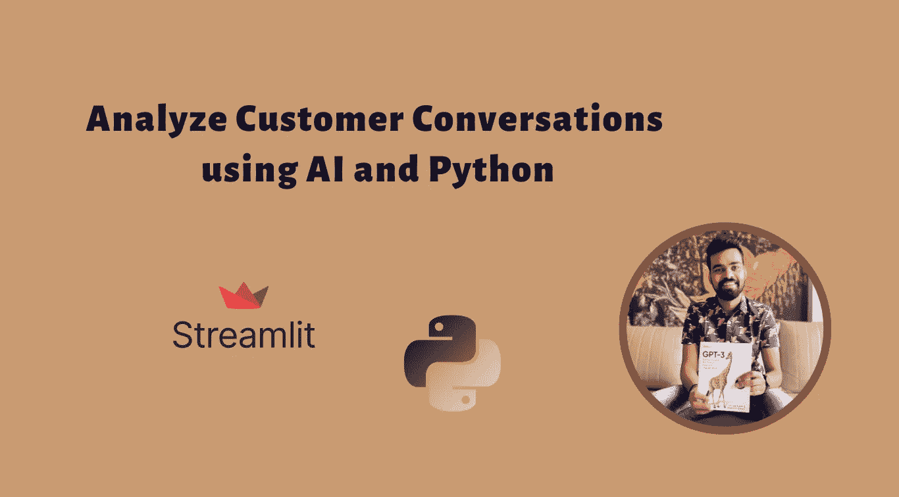

# 背景

积极的客户体验可以决定是失去客户还是留住客户。企业需要不断改进他们的产品和服务，并在早期识别趋势和问题，以保持客户满意！

分析客户支持数据并获得有价值的见解变得比以往任何时候都更加重要，以确保根据客户的偏好尽早进行必要的修改和增强，并确保业务有效地支持这些数据。

但这是最大的挑战。不幸的是，大多数企业都很难捕捉和理解由此产生的数据。虽然听所有的电话或浏览所有的电子邮件来找出真知灼见会很麻烦，但即使是抽样也不能确保正确识别问题领域。几行代码可以帮助你通过找出客户真正想要的东西来加速你的业务增长！

# 如何理解这些庞大的数据？

## 介绍 [One AI 工作室](https://studio.oneai.com/?utm_source=social&utm_medium=medium&utm_campaign=daniel&utm_term=saboo_pub-towardsai-net-detect-business-insights-from-customer-support-conversations-using-ai-b09759144c00)！

One AI 是一种语言人工智能服务，其中各种预先训练的 NLP 模型被打包并通过 API 提供，支持在上下文中理解语言，并将任何来源的文本转换为结构化数据。一个人工智能工作室能够执行广泛的任务，包括但不限于:

*   转录音频文件
*   生成输入的突出显示
*   主题抽取
*   情感以及情感检测
*   关键词的识别
*   识别行动项目
*   将数据基础技能聚类为参数，如关键词或情感等。

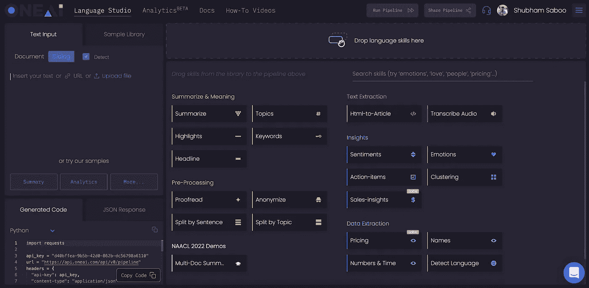

一个 AI 工作室界面

让我们看看如何使用 [One AI](https://studio.oneai.com/?utm_source=social&utm_medium=medium&utm_campaign=daniel&utm_term=saboo_pub-towardsai-net-detect-business-insights-from-customer-support-conversations-using-ai-b09759144c00) 和 Python 构建一个 streamlit 应用程序来分析客户支持对话。你所需要的是:

*   Python 的基础知识
*   [流线型](/streamlit-revolutionizing-data-app-creation-e269177d9112)
*   [一个 AI API](https://studio.oneai.com/?utm_source=social&utm_medium=medium&utm_campaign=daniel&utm_term=saboo_pub-towardsai-net-detect-business-insights-from-customer-support-conversations-using-ai-b09759144c00)

# 应用程序演练

我们将使用 Streamlit 框架在 python 本身中构建一个漂亮的前端。以下是构建用于分析客户支持对话的 Python 应用程序的分步演练:

1.  导入必要的库并从用户处获取 API 密钥。

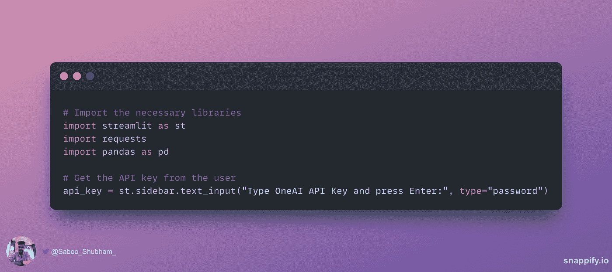

2.从用户处获取对话或电子邮件线索作为输入，并创建在不同智能特性之间进行选择的功能。

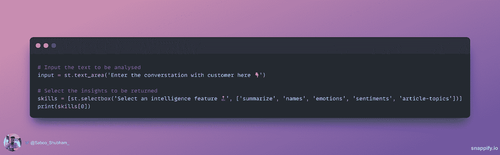

3.通过将输入数据转换成 JSON 来格式化语言模型要处理的数据。

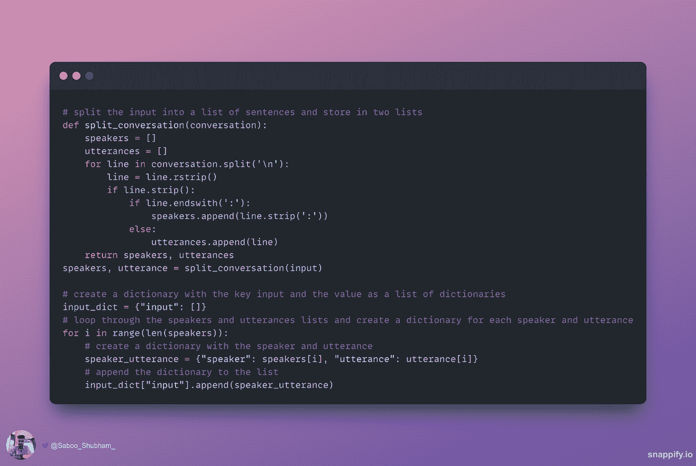

4.设置要发送给 API 的头、API 端点地址和有效负载。使用请求库来访问 API 端点，并获得以 JSON 格式返回的输出。

5.处理 JSON 文件并向最终用户显示输出！

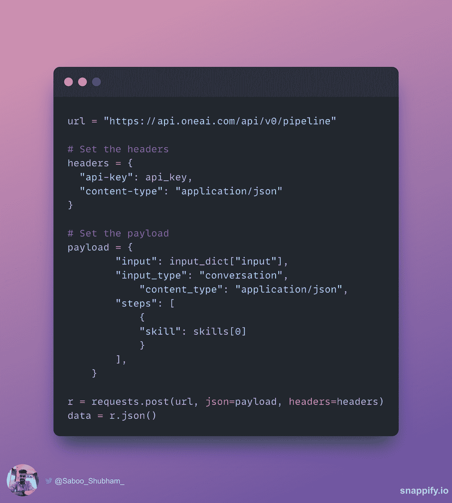

🌟下面是获取源代码的 GitHub 库:

[](https://github.com/Shubhamsaboo/customer-center-analytics-nlp) [## GitHub-Shubhamsaboo/customer-centre-analytics-NLP:使用一个 AI API 分析深度客户…

### 此时您不能执行该操作。您已使用另一个标签页或窗口登录。您已在另一个选项卡中注销，或者…

github.com](https://github.com/Shubhamsaboo/customer-center-analytics-nlp) 

这是我们最终应用程序的样子👇

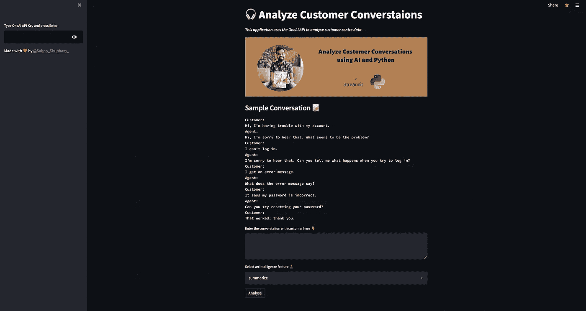

简化 it 应用程序以分析客户对话

# 人工智能分析在🕹的应用

现在，让我们看看如何在现实世界中使用上述应用程序:

第一步:首先，你必须把你的 API 密匙用于认证。复制你的【AI API 键并粘贴到工具条上。

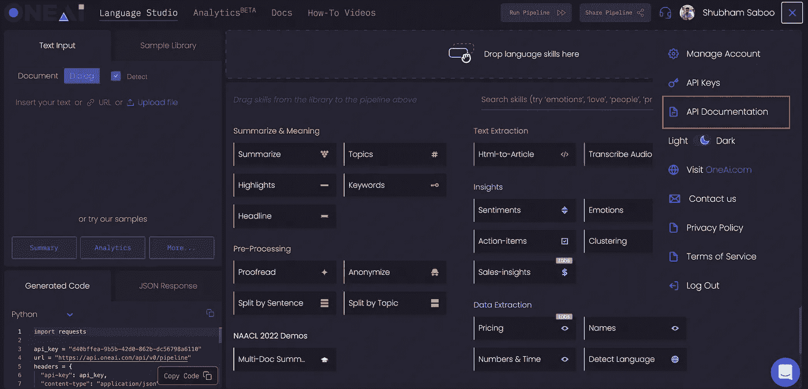

获取 API 密钥(屏幕 1)


获取 API 密钥(屏幕 2)

将 API 键粘贴到应用程序侧栏中。


**第二步:**让我们开始吧。在输入框中输入音频通话的文字记录，并选择智能功能。

***样本对话***

确保输入以下面的格式给出。

```
Customer:Hi, I am Dragos from Leverkin Management. I am having a lot of trouble with using your product, it is very complicated. I require a training session.Agent:Hi, I’m sorry to hear that. I will surely schedule a session for you. Is Tuesday 5 p.m. a good time?Customer:Yes, that will work thanks.
```

1.  ***摘要*** “作为情报特征:

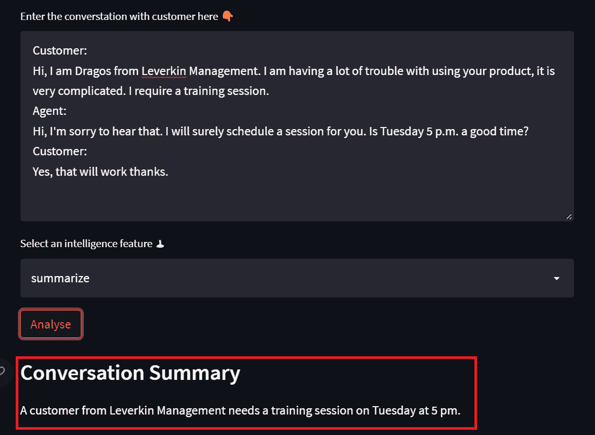

2. ***命名实体识别*** 作为智能特征:

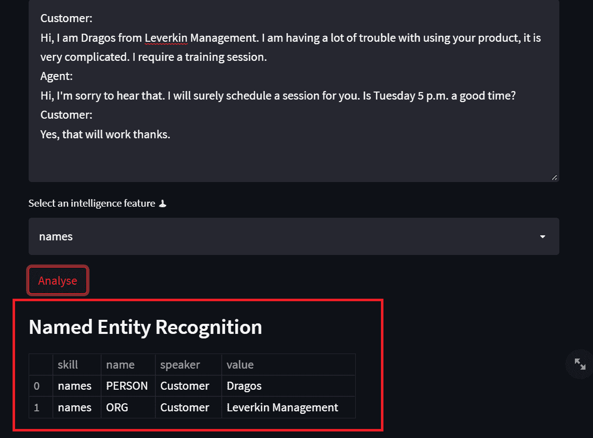

3.*情感检测“作为一种智能特征:*

*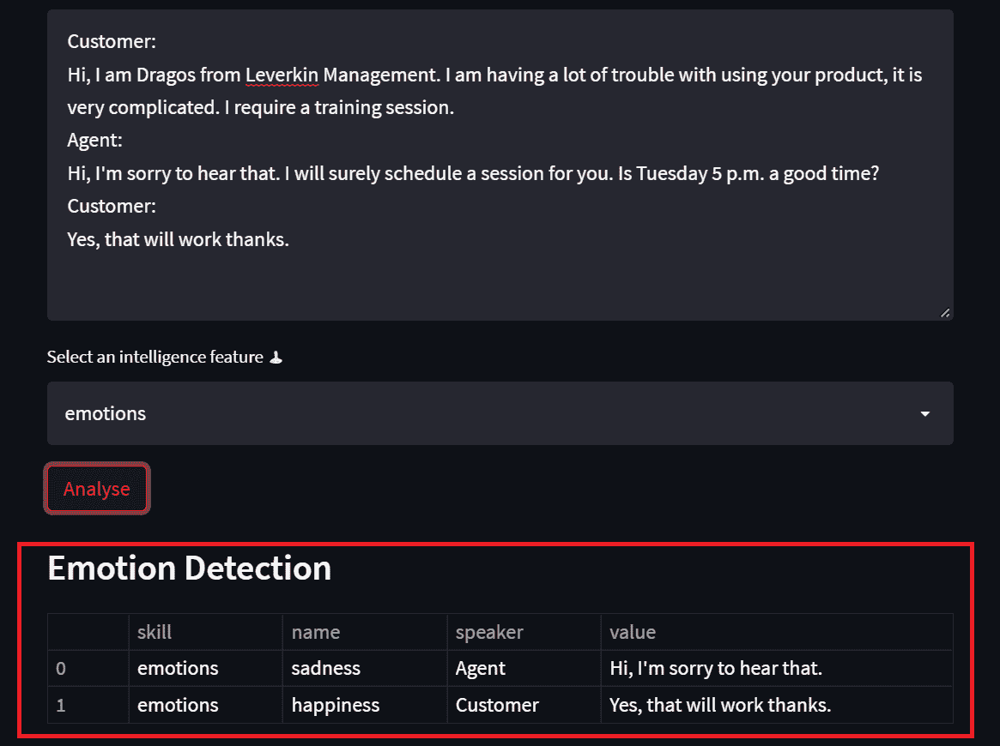*

*4. ***舆情分析*** 作为情报特征:*

*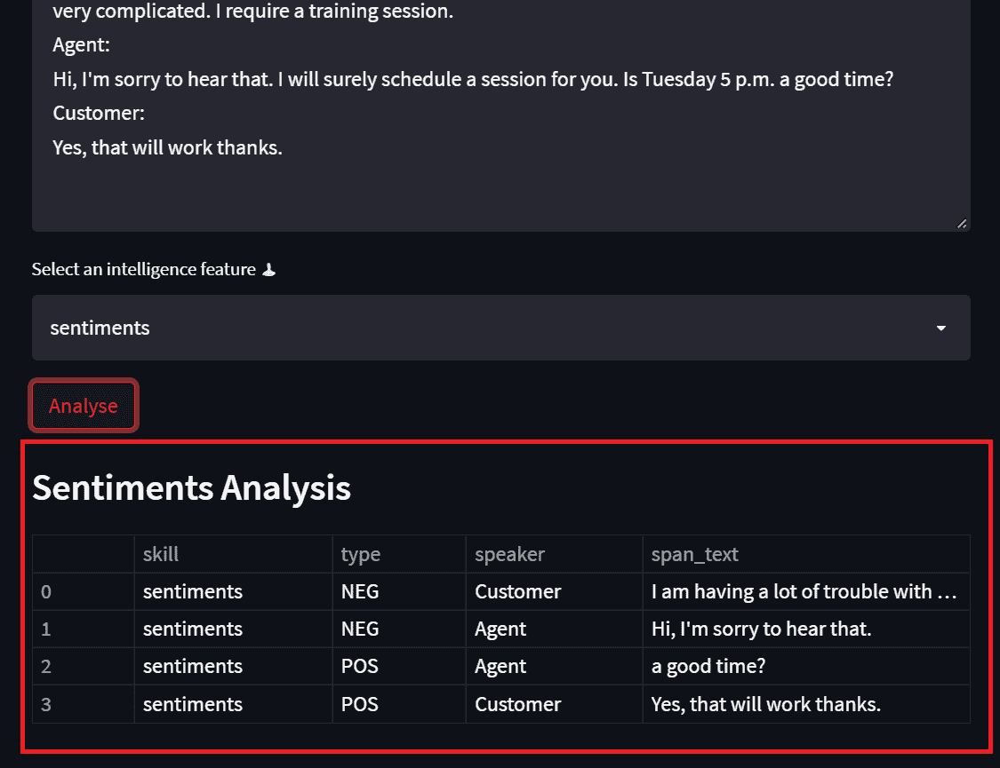*

*5. ***话题检测*** “作为情报特征:*

*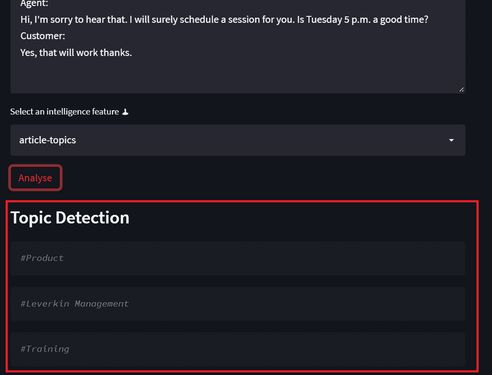*

*自己试试吧👉[简化应用](https://shubhamsaboo-customer-center-analytics-nlp-app-c8s9ce.streamlitapp.com/)*

# *结论*

*人工智能将彻底改变客户中心数据的分析方式。它将在如何更有效、更准确地从客户体验中获得有用的见解方面发挥关键作用。通过识别客户需求和偏好，呼叫中心代理将能够提供更加个性化和令人满意的客户服务体验。*

*如果你想了解更多或者想让我写更多关于这个主题的东西，请随时联系我们。*

*我的社交链接:[LinkedIn](https://www.linkedin.com/in/shubhamsaboo/)|[Twitter](https://twitter.com/Saboo_Shubham_)|[Github](https://github.com/Shubhamsaboo)*

**

*如果你喜欢这篇文章或觉得它有帮助，请花一分钟按一下拍手按钮，它会增加这篇文章对其他媒体用户的可见性。*