# 使用机器学习检测恶意 JavaScript 代码

> 原文：<https://pub.towardsai.net/detect-malicious-javascript-code-using-machine-learning-7709f9cdb7e7?source=collection_archive---------1----------------------->

在本文中，我们将考虑使用机器学习来检测混淆的 JavaScript 代码片段的方法。

加布里埃尔·海因策在 [Unsplash](https://unsplash.com?utm_source=medium&utm_medium=referral) 上的照片

## 介绍

M ost 网站使用 JavaScript (JS)代码制作动态内容；因此，JS 代码成为针对浏览器、浏览器插件、电子邮件客户端和其他 JS 应用程序的有价值的攻击媒介。常见的基于 JS 的攻击包括下载驱动、跨站脚本(XSS)、跨站请求伪造(XSRF)、恶意广告等。大多数恶意的 JS 代码被混淆，以便隐藏它们正在做的事情，并避免被基于签名的安全系统检测到。换句话说，混淆技术是一系列混淆的代码转换，以损害其可理解性，但同时保存其功能。

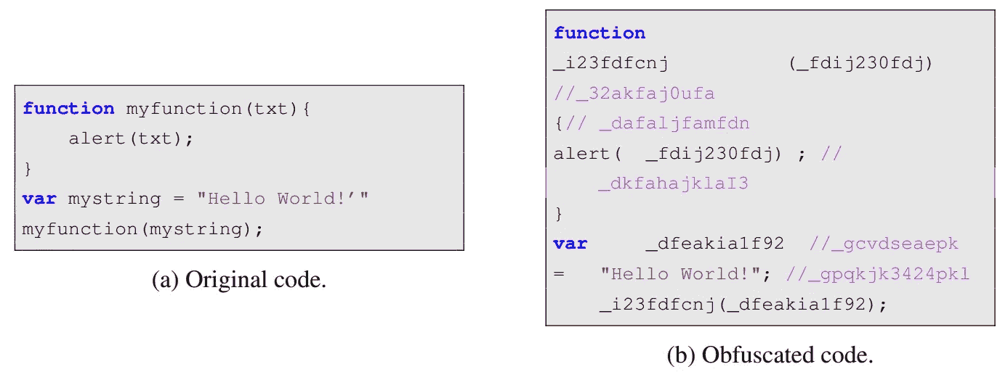

随机化混淆的示例

传统的反病毒和入侵检测系统(IDS)采用基于启发式和基于签名的方法来检测恶意 JS 代码。但是在零日攻击的情况下，这种分析可能是低效的。目前正在各个行业积极开发的机器学习(ML)应用也在网络安全中找到了自己的位置。ML 已经证明了它对零基攻击的有效性。当涉及到检测恶意 JS 代码时，有不同的方法，从自然语言处理(NLP)领域，使用表格数据的标准 ML，到深度学习模型。

ML 模型的输入数据会有所不同，因为有两种方法来分析程序的行为:静态和动态代码分析。静态方法在不运行源代码的情况下分析数据，并且只基于源代码。例如，这可以通过遍历代码抽象语法树来存档。相反，动态代码分析需要执行源代码。在这篇文章中，我们将只考虑静态分析的情况。

在本文中，我们将查看一些相关的工作，以了解研究人员为混淆的 JS 代码检测提供了什么。还将考虑使用 NLP 特性和标准 ML 方法的组合来分类良性/恶意 JS 代码片段的任务。

## 相关著作

在“[使用机器学习检测混淆的 JavaScript](https://www.researchgate.net/publication/321805699_Detecting_Obfuscated_JavaScripts_using_Machine_Learning)中，作者使用了来自内容交付网络 jsDelivr、Alexa 500 强网站的常规、迷你和混淆样本数据集，以及来自瑞士信息保障报告和分析中心 [MELANI](https://www.ncsc.admin.ch/ncsc/en/home.html) 的一组恶意 JavaScript 样本。作者表明，区分混淆和非混淆脚本是可能的，精确度和召回率约为 99%。使用了以下一组功能:

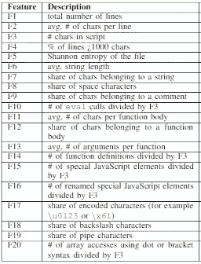

JavaScript 片段的静态特性，来源:[使用机器学习检测混淆的 JavaScript](https://www.researchgate.net/publication/321805699_Detecting_Obfuscated_JavaScripts_using_Machine_Learning)

提取的特征向量集用于训练和评估三种不同的分类器:线性判别分析(LDA)、随机森林(RF)和支持向量机(SVM)。

在“[使用 AST 特征和段落向量检测基于 JavaScript 的攻击的机器学习方法](https://www.sciencedirect.com/science/article/pii/S1568494619305022)中，作者使用了另一种方法从 JS 代码中提取特征。他们采用[抽象语法树(AST)](https://en.wikipedia.org/wiki/Abstract_syntax_tree) 作为代码结构表示，并将其用作 Doc2Vec 方法的输入。恶意 JS 代码的驱动下载数据和良性 JS 代码的 JS unpack plus Alexa 100 强网站数据集被用作训练数据集。为了构建 AST，作者使用了一个语法和词汇分析工具 [Esprima](https://esprima.org/demo/parse.html#) 。

虽然以前的方法依赖于词法和语法特征，但“[基于双向 LSTM 模型的恶意 JavaScript 检测](https://www.mdpi.com/2076-3417/10/10/3440)中考虑的方法利用了语义信息。除了 AST 特性，作者还构建了程序依赖图(PDG ),并生成了 JS 代码语义片，这些语义片被转换成数字向量。然后将这些向量输入双向长短期记忆神经网络。BLSTM 模型表现出 97.71%的准确率和 98.29%的 F1 值。

综上所述，在静态分析的情况下，可以确定 JS 代码的几种常见**方法:**

*   方法 1(自然语言):将 JS 代码视为自然语言文本。特征可以表示为字符统计、文件熵、特殊功能计数、特殊符号数量等的集合。
*   方法 2(词法特性):提取普通 JS 文本元素的正则表达式(如[a-z]+并删除特殊字符，如∫、=、！等。)与 NLP 特征化方法应用相结合，如词袋(BOW)、TF-IDF、Doc2Vec、LDA、嵌入等。
*   方法 3(句法特征):AST 特征加 NLP 特征化；
*   方法 4(语义特征):获取 AST 特征->构建控制流图(CFG) ->构建程序依赖图(PDG) ->获取语义切片->转换为数字向量。

## 编码部分:**良性/恶意 JS 代码的分类**

**出于这个目的，让我们为网络安全食谱使用来自[机器学习的数据集。为了简单起见，我将使用上面提到的方法 1。](https://github.com/PacktPublishing/Machine-Learning-for-Cybersecurity-Cookbook/tree/master/Chapter03/Detecting%20Obfuscated%20Javascript)**

****数据下载****

**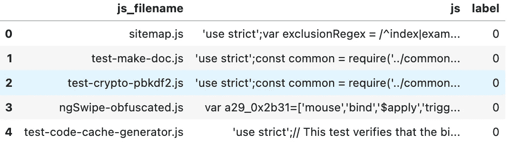**

****数据清理****

**0 标签—正常代码，1 标签—混淆代码**

**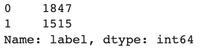****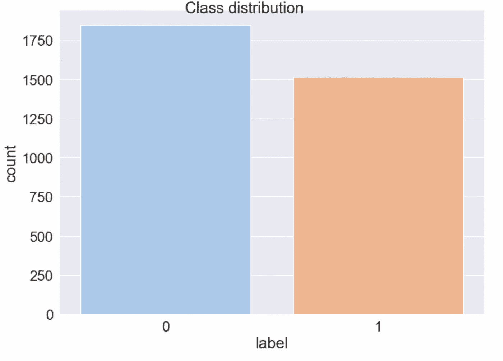**

****特征工程****

******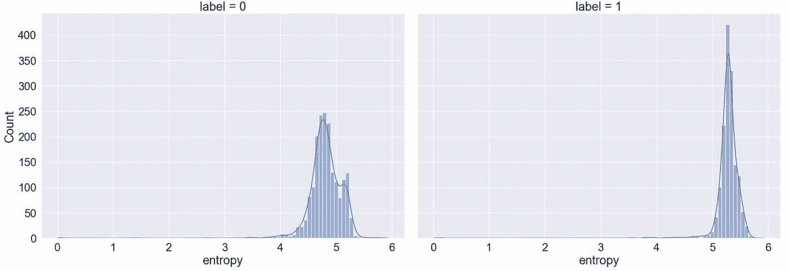**

**对于其他特性，我使用了下面的 JS 函数列表，这些函数经常在恶意 JS 代码中使用:**

****

**恶意 JavaScript 中广泛使用的函数，来源:[基于双向 LSTM 模型的恶意 JavaScript 检测](https://www.mdpi.com/2076-3417/10/10/3440)**

**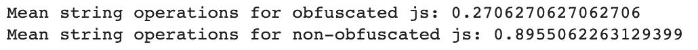****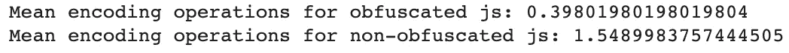****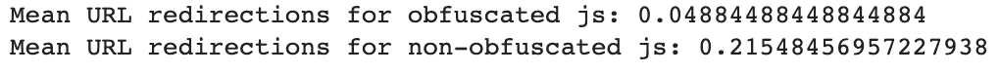****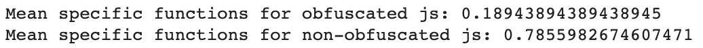**

****训练/测试数据分割****

****随机森林模型****

****指标结果****

**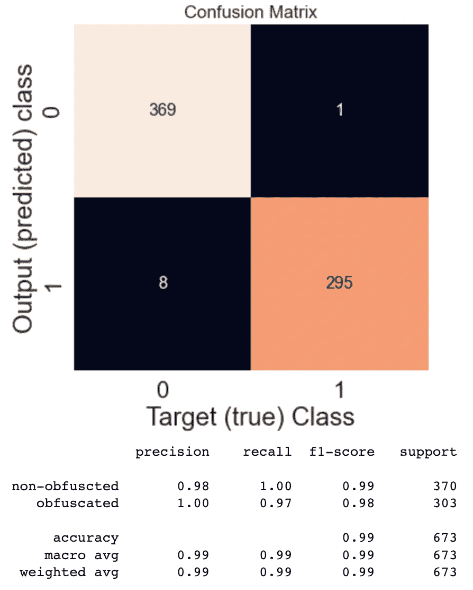**

**👉🏻完整的代码也可以通过我的 GitHub 获得。**

## **进一步阅读**

**[1] S. Aebersold 等人，[利用机器学习检测混淆 JavaScript](https://www.researchgate.net/publication/321805699_Detecting_Obfuscated_JavaScripts_using_Machine_Learning)(2016)，ICIMP 2016:第十一届互联网监控与保护国际会议**

**[2] S. Ndichu 等人，[使用 AST 特征和段落向量检测基于 JavaScript 的攻击的机器学习方法](https://www.sciencedirect.com/science/article/pii/S1568494619305022) (2019)，应用软计算**

**[3] A. Fass 等人， [JAST:恶意(混淆)JavaScript 的完全语法检测](https://link.springer.com/chapter/10.1007/978-3-319-93411-2_14) (2018)，迪姆瓦**

**[4] X. Song 等，【基于双向 LSTM 模型的恶意 JavaScript 检测】 (2020)，应用科学**