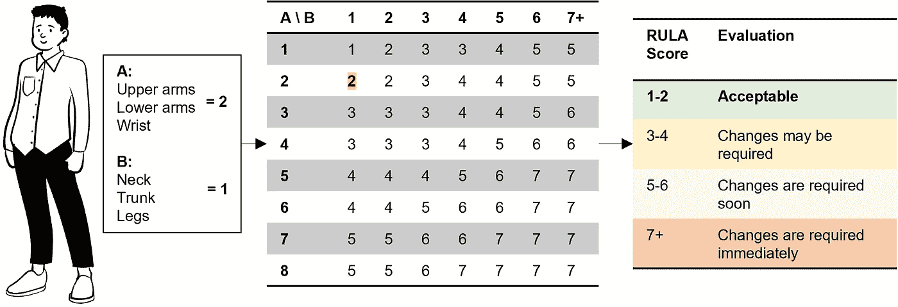
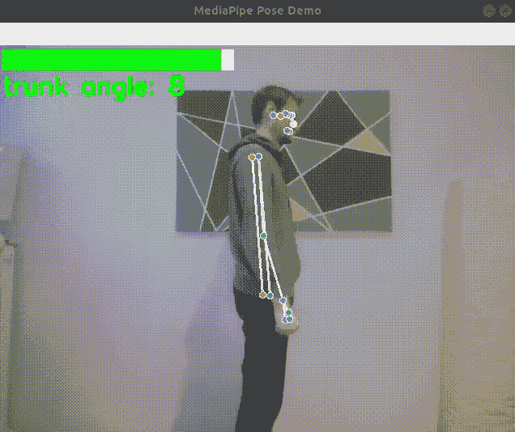
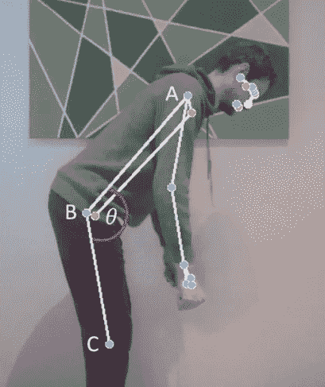

# 用机器学习检测不良姿势

> 原文：<https://pub.towardsai.net/detecting-bad-posture-with-machine-learning-be4b9de763d0?source=collection_archive---------1----------------------->

## 使用计算机视觉和机器学习的实时人机工程学反馈介绍


朱利安·特朗瑟在 [Unsplash](https://unsplash.com?utm_source=medium&utm_medium=referral) 拍摄的照片

答根据世界卫生组织的报告，肌肉骨骼疾病是全球范围内导致残疾的主要原因，其中腰痛是主要原因[1]。

使用最先进的机器学习和计算机视觉，现在可以自动检测不良姿势并实时给出反馈，这可以显著降低肌肉骨骼疾病的风险[2]。

在本文中，您将首先了解评估人体工程学的相关观察方法。然后，我们将在实践中应用这些知识，使用网络摄像头和来自 Google media pipe 的机器学习模型，用 Python 创建一个工作示例。

# 评价人类工程学的方法

在观察性工效学评估方法中，专家观察人们的工作表现。同时，他们填写标准化工作表，如快速上肢评估(RULA)、快速全身评估(REBA)、Ovako 工作姿势分析系统(OWAS)或人体工程学评估工作表(EAWS)。

在本文中，我们将重点关注 RULA，因为它在实践中是常用的，快速且易于应用，其结果与相关的肌肉骨骼状况密切相关[3]。

1993 年，McAtamney 和 Corlett 在科学杂志*应用人体工程学*上发表了《RULA 》,主要关注上肢的姿势。RULA 为颈部、躯干、手臂、手腕和腿部定义关节角度范围。姿势越差，分数越多。最后，将所有的分数相加，给出一个总分，而总分的范围从“可接受的姿态”到“需要立即改变”[4]。



可接受姿势的 RULA 简化示例。来源:图片由作者提供。

# 使用 MediaPipe 和 OpenCV 进行自动后角评估

在下一节中，我们将使用 Python 编写一个脚本，通过网络摄像头实时评估躯干弯曲角度，如下面的演示 GIF 所示。



展示结果的演示 GIF。来源:图片由作者提供。

首先，我们需要一个预训练的机器学习模型，它可以检测图像/视频中的身体关节。这里我们将使用 [Google 的 MediaPipe Pose](https://google.github.io/mediapipe/solutions/pose.html) ，它是基于卷积神经网络 blaze Pose【5】。

MediaPipe 估计 33 个被称为姿势标志的身体关键点，只给定一个 RGB 图像作为输入，不需要 GPU。每个地标都有从臀部开始的以米为单位的`x`、`y`和`z`现实世界坐标。

要使用 Pip 安装 MediaPipe，我们只需执行命令`pip install mediapipe`。[文档提供了下面使用网络摄像头的最小 Python 示例](https://google.github.io/mediapipe/solutions/pose#python-solution-api)，我们将使用并扩展它。

最重要的一行是`results = pose.process(image)`，包含了 33 个身体关键点。我们可以用`landmarks_3d = results.pose_world_landmarks`来访问它们。

每个标志索引对应于一个身体关键点。有关所有可用关键点的列表，请参见姿势标志模型的[文档。例如，我们可以用下面几行代码访问鼻子的`x`、`y`和`z`坐标:](https://google.github.io/mediapipe/solutions/pose.html#pose-landmark-model-blazepose-ghum-3d)

```
# get key points from mediapipe results
results = pose.process(image)
landmarks_3d = results.pose_world_landmarks# nose equals index 0
x_nose = landmarks_3d.landmark[0].x
y_nose = landmarks_3d.landmark[0].y
z_nose = landmarks_3d.landmark[0].z
```

如下图所示，使用 MediaPipe 姿势，我们现在可以得到肩膀、臀部和膝盖的关节。通过平均左右关节使用中点，我们得到以下三个点 A、B 和 C，中间有角度 *θ* 。



背部屈曲角度可以使用中间管体式中肩部、臀部和膝盖的三个中点来近似。来源:图片由作者提供。

角度 *θ* 可以使用基本几何图形计算:

计算 A、B 和 C 三点之间的角度

根据 RULA、REBA 和 EAWS，躯干屈曲角度可分为三类:0-20°、20-60°和> 60°。我们将使用这三个类别来区分低、中、高风险背部姿势。

请注意，我们的角度 *θ* 在直立状态下从 180°开始，而评估人体工程学的方法将这个位置定义为 0°。因此，我们必须通过减去 180°来调整我们的角度。

下面的 Python 代码创建了一个人机工程学类，其中`update_joints()`从 MediaPipe 中读取 3D 界标，使用`get_angle()`通过我们的三个点 A、B 和 C 计算躯干弯曲角度，并使用`get_trunk_color()`以绿色、黄色和红色显示三个类。

网络摄像头演示的完整工作代码可在我的 [GitHub](https://github.com/leoneversberg/ergonomy_demo) 上获得。随意试验和构建代码，例如，添加对颈部、手臂和腿部的评估。

除了用于工作场所的人体工程学之外，另一个应用领域是在健身行业，例如，在蹲下或按压运动期间检查姿势。

下面的演示视频来自该大学的主持人，*工业级网络和来自柏林工业大学的云*，展示了使用微软 Azure Kinect 摄像头基于 RULA 的详细人机工程学评估[6]。根据本文描述的方法进行自动人机工程学评估。类似的研究工作最近已经发表，例如，ErgoSentinel 工具[7]基于 RULA，而 ErgoExplorer [8]基于 REBA。

# 结论

使用现代机器学习和计算机视觉进行身体跟踪，您可以轻松构建实时人体工程学反馈的应用程序。可能的应用领域是工作场所，或者例如健身行业。

# 额外资源

来自 ErgoPlus 的*RULA 评估工具的分步指南*:[https://ergo-plus.com/rula-assessment-tool-guide/](https://ergo-plus.com/rula-assessment-tool-guide/)

来自 ErgoPlus 的 *RULA 员工评估工作表*:[https://ergo-plus.com/wp-content/uploads/RULA.pdf](https://ergo-plus.com/wp-content/uploads/RULA.pdf)

# 参考

[1]世界卫生组织，肌肉骨骼健康(2022)，[https://www . who . int/news-room/fact-sheets/detail/muscle skeletal-conditions](https://www.who.int/news-room/fact-sheets/detail/musculoskeletal-conditions)

[2] N. Vignais 等人，工业制造中实时人机工程学反馈的创新系统(2013)，[https://doi.org/10.1016/j.apergo.2012.11.008](https://doi.org/10.1016/j.apergo.2012.11.008)

[3] D. Kee，基于文献综述的 OWAS、RULA 和 REBA 的系统比较(2022)，[https://doi.org/10.3390/ijerph19010595](https://doi.org/10.3390/ijerph19010595)

[4] L. McAtamney 和 E. N. Corlett，RULA:调查与工作有关的上肢疾病的调查方法(1993 年)，[https://doi . org/10.1016/0003-6870(93)90080-S](https://doi.org/10.1016/0003-6870(93)90080-S)

[5] V. Bazarevsky 等人，BlazePose: On-device 实时身体姿态跟踪(2020)，[https://arxiv.org/abs/2006.10204](https://arxiv.org/abs/2006.10204)

[6] L. Eversberg，C. Sohst，J. Lambrecht，*assistensystem zur Verbesserung der Ergonomie/assisten system 改善人机工程学——用人工智能预防制造业中的肌肉骨骼障碍(2022)【https://doi.org/10.37544/1436-4980-2022-09-68】T4*

*[7] V. M. Manghisi 等人，工厂车间的自动人体工程学姿势风险监控 ERGOSENTINEL 工具(2020 年)[https://doi.org/10.1016/j.promfg.2020.02.091](https://doi.org/10.1016/j.promfg.2020.02.091)*

*[8] M. M. Fernandez 等人，ErgoExplorer:来自视频集合的交互式人机工程学风险评估(2022 年)，[https://arxiv.org/abs/2209.05252](https://arxiv.org/abs/2209.05252)*