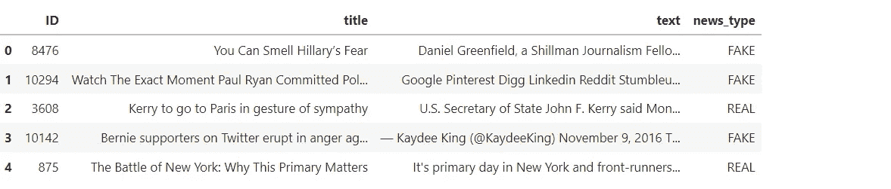
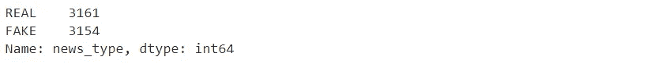
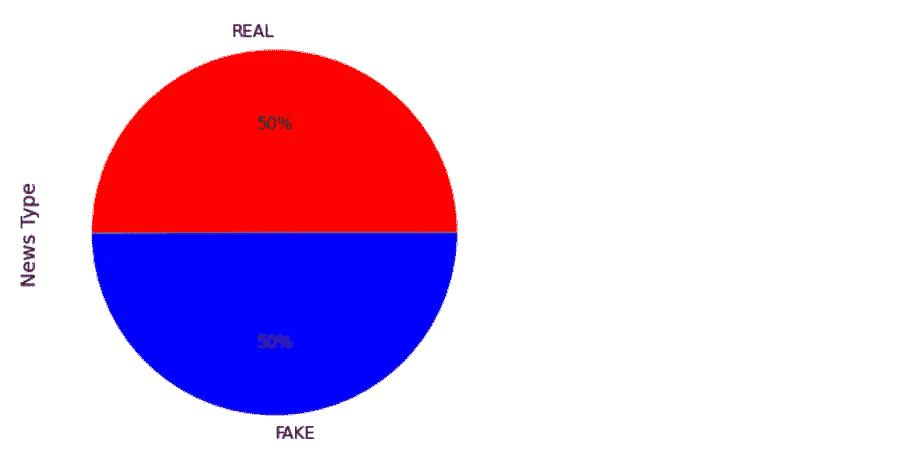
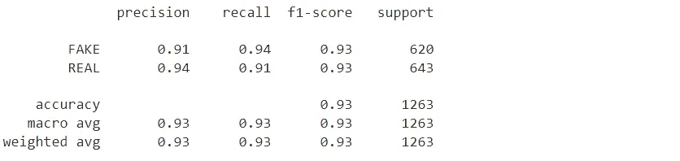
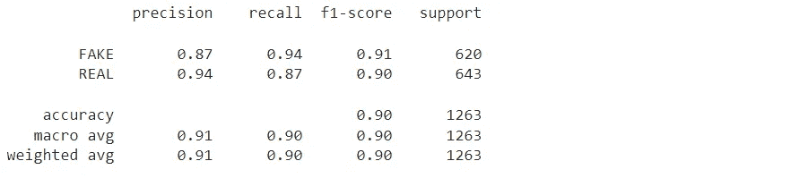
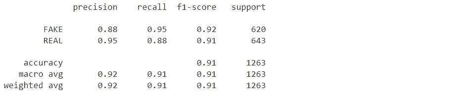
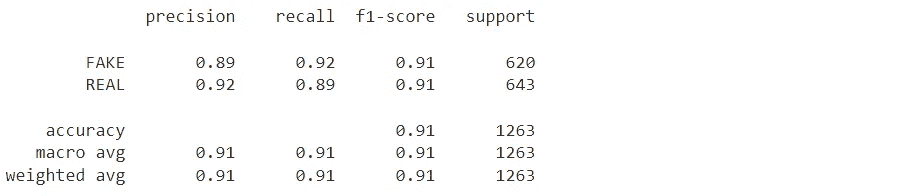
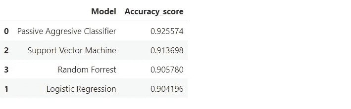
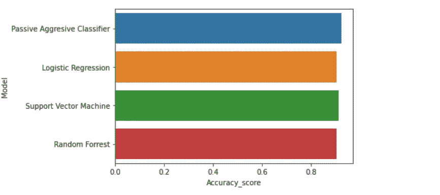

# 用机器学习检测假新闻

> 原文：<https://pub.towardsai.net/detecting-fake-news-with-machine-learning-88761ec6d251?source=collection_archive---------4----------------------->

## [机器学习](https://towardsai.net/p/category/machine-learning)

“假新闻和谣言在网上盛行，因为很少有人核实什么是真实的，并且总是偏向于强化他们自己偏见的内容”。

*-* 瑞安·比嘉


iStockphoto 的 Getty Images

**什么是假新闻？**

假新闻可以定义为以文章、故事、图像或视频的形式分享的虚假报道或错误信息，这些报道或信息以“真实新闻”的形式呈现，但实际上是为了操纵人们的观点。这些新闻故事没有可核实的事实或可信的来源。有时，这些故事被用于宣传，旨在误导读者，或者可能被用作经济刺激的“点击诱饵”，作者从点击故事的人数中获利。

假新闻可能是由个人或团体为了他们自己或第三方的利益而制造的。假新闻通过社交媒体用户和隐藏的社交机器人迅速传播，这些社交机器人评论、转发和转发新闻文章。

**假新闻的种类**

《媒体更新》的执行主编阿诗玲·麦卡锡描述了五种最常见的假新闻。其中包括以下内容:

1.讽刺或戏仿——讽刺文章旨在通过使用幽默、讽刺、夸张和嘲笑来尝试真实的新闻。它经常被用作一种社会或政治评论的形式。通常，讽刺性新闻网站被制作得看起来像真实的新闻网站，并试图模仿它们。然而，正是这一事实往往会导致读者上当受骗。

2.在某些情况下是真实的误导性新闻——把这想成是部分真实的事实，但是用在了错误的情况下。这些都是经过选择的事实，只是为了成为头条新闻而被报道——但它们往往是对事实的曲解。

3.制造虚假联系的报道——这种类型的假新闻将两件或更多不相关的事情联系在一起，其中一篇报道的照片、说明或标题与内容不符。它通常与 clickbait 联系在一起，标题是“你不知道的名人已经去世”,上面还有一张名人的照片。一旦你点击阅读了这篇文章，你会意识到文章中根本没有提到图片中的人。

4.被操纵的内容——这种类型的假新闻是事情真正变得邪恶的地方。这些内容确实呈现了真实的信息——通常甚至是照片和视频——但却被以某种方式操纵了。这类内容很大程度上依赖于“fauxtography”。

5.有意欺骗的内容—这是专门为误导人们而设计的内容。这类新闻是为了通过获得大量点击来赚钱，或者作为耸人听闻的宣传来引起混乱或不满而捏造的。这些故事通常通过看起来像“真正的”新闻品牌的网站传播，通常包含被操纵来推动议程的图形和视频。

**假新闻的例子**

*冠状病毒假新闻:*新冠肺炎疫情为网上虚假信息提供了沃土，在整个危机中假新闻的例子数不胜数。社交媒体中假新闻的一个持久例子是声称 5G 技术与病毒的传播有关——据说是因为 5G 抑制了免疫系统，而病毒通过无线电波传播。这些说法是不真实的，[被官方来源](https://www.bbc.co.uk/news/52168096)多次揭穿，但仍被广泛分享。

*2016 年美国总统大选:*假新闻和错误信息成为 2016 年美国大选期间的一个大问题，虚假和误导性的说法遍布整个政治光谱。一项分析表明，选举中产生的很大一部分假新闻是由马其顿的青少年创造的，他们发现他们创造的超党派故事越多，点击和分享的人就越多，结果他们赚的钱就越多。

*波士顿马拉松爆炸案:*2013 年波士顿马拉松爆炸案发生后，网上流传着关于爆炸是美国政府精心策划的骗局的虚假说法。随着世界各地许多恐怖事件的发生，阴谋论经常盛行。认为它们是“假旗”行动的概念——即由国家或秘密阴谋集团实施，以将责任归咎于他人或为其他活动提供掩护——是一个常见的比喻。

金正恩——当今最性感的男人？2012 年，讽刺网站 The Onion 刊登了一篇文章，声称朝鲜独裁者金正恩被选为最性感的男人，并宣称“这个在平壤长大的万人迷是每个女人的梦想成真”讽刺有时会被不同文化误解的一个例子是，中国的出版物——包括中国共产党报纸的网络版——报道了这种说法，好像它是真的一样。

**假新闻有哪些危害？**

下面列举了假新闻产生的一些危害。

1.研究表明，许多美国人分不清哪些新闻是假的，哪些是真的。许多假新闻旨在扰乱和加剧社会冲突。当争论的不同方面有自己的一套“事实”时，这将导致社会内部更大的两极分化，并可能影响选举结果和导致暴力。

2.有许多虚假和误导性的新闻故事与医学治疗或癌症或糖尿病等重大疾病有关。相信这些故事会导致人们做出错误的决定，这对他们的健康有不利影响。

3.假新闻让认识真相变得更加困难。一项[皮尤研究中心](https://www.theatlantic.com/ideas/archive/2019/06/fake-news-republicans-democrats/591211/)的研究发现，政治光谱中的左派和右派对“假新闻”的定义有不同的看法。“皮尤的研究表明，假新闻恐慌，而不是驱使人们放弃意识形态渠道和边缘，实际上可能正在加速两极分化的过程:它驱使消费者放弃一些渠道，只是总体上消费更少的信息，甚至切断社会关系。”

人们尽可能不带偏见地寻找新闻来源是非常重要的。像美联社和路透社这样的新闻服务机构努力提供准确、中立的重大新闻事件报道。

**一个潜在的解决方案**

假新闻的威胁和危险是严重的，需要立即解决。我相信我们可以使用自然语言处理和机器学习模型来分析新闻文章的内容，确定它们是真实的还是虚假的。这需要高度准确地完成和证明。一旦完成，媒体源(即脸书、Twitter 和 YouTube)需要在生产中实施这些模型，并识别和丢弃任何被确定为虚假或错误信息的文章、消息或文本。

**路线图**

本文的剩余部分将展示一个程序，该程序将尝试根据新闻文章中的文本来预测新闻文章是真是假。以下步骤将使用机器学习和 Python 来执行。

1.导入所需的软件库。

2.加载数据。

3.数据分析和探索。

4.将文本转换为数字。

5.将数据分为训练数据集和测试数据集。

6.根据训练数据训练模型。

7.根据测试数据进行预测。

8.评估模型的性能。

9.从评估中得出结论。

**程序**

使用机器学习模型从新闻文章中检测假新闻的程序如下所示。

**导入所需的软件库**

```
**import** numpy **as** np
**import** pandas **as** pd
**import** matplotlib.pyplot **as** plt
**import** seaborn **as** sns
**import** itertools
**from** sklearn.model_selection **import** train_test_split
**from** sklearn.feature_extraction.text **import** TfidfVectorizer
**from** sklearn.linear_model **import** PassiveAggressiveClassifier
**from** sklearn.linear_model **import** LogisticRegression
**from** sklearn.svm **import** SVC
**from** sklearn.ensemble **import** RandomForestClassifier
**from** sklearn.metrics **import** accuracy_score, classification_report
```

**加载数据**

```
**from** google.colab **import** files *# Use to load data on Google Colab*
uploaded **=** files**.**upload()      *# Use to load data on Google Colab*
```

将数据存储到数据帧中

```
news **=** pd**.**read_csv('news.csv')
```

**数据分析与探索**

过滤数据并重命名一些列以使其更有意义。

```
news **=** news[['Unnamed: 0', 'title', 'text', 'label']]**.**copy()
news**.**rename(columns **=** {'Unnamed: 0':'ID'}, inplace **=** **True**)
news**.**rename(columns **=** {'label':'news_type'}, inplace **=** **True**)
```

打印数据框的前 5 行。

```
news**.**head()
```



这些数据来自 Kaggle 的网站。点击[链接](https://www.kaggle.com/shubh0799/fake-news)可以找到数据

下面列出了列和定义。应该注意的是，每篇新闻文章的“假”或“真”的新闻类型在分配之前都经过了研究和核实。

1.  ID —新闻标识符。
2.  标题—文章的标题。
3.  文本—文章的文本。
4.  news_type —新闻的一种类型(“假”或“真”)。

显示有关数据列的信息。

```
news**.**info()
<class 'pandas.core.frame.DataFrame'>
RangeIndex: 7795 entries, 0 to 7794
Data columns (total 4 columns):
 #   Column     Non-Null Count  Dtype 
---  ------     --------------  ----- 
 0   ID         7576 non-null   object
 1   title      7185 non-null   object
 2   text       6929 non-null   object
 3   news_type  6755 non-null   object
dtypes: object(4)
memory usage: 243.7+ KB
```

有 7，795 篇文章和 4 个专栏。所有变量都是字母数字，包含空值或缺失值。

某些数据在新闻类型列中的值不是真实的或虚假的。因此，有必要过滤数据框，使其仅包含新闻类型等于真实或虚假的行。

```
options **=** ['REAL', 'FAKE'] 
news **=** news**.**loc[news['news_type']**.**isin(options)]
```

显示新闻类型和每种新闻类型的数量。

```
news['news_type']**.**value_counts()
```



可视化新闻类型分布。

```
news**.**news_type**.**value_counts()**.**plot(kind**=**'pie', autopct**=**'%1.0f%%',  fontsize**=**12, figsize**=**(9,6), colors**=**["red", "blue"])
plt**.**ylabel('News Type', size**=**14)
```



这很好，因为新闻文章平均分布在真实新闻和虚假新闻之间。

我们现在需要将数据集分为要素数据集和标注数据集。特征数据集将仅包括第三列或索引 2 中的新闻文章文本。标签数据集将包括我们希望在第 4 列或第 3 索引中预测的文章的新闻类型。我们将对新闻数据框使用分块方法来创建要素和标注数据集。

```
features **=** news**.**iloc[:, 2]**.**values
labels **=** news**.**iloc[:, 3]**.**values
```

**将数据分成训练和测试数据集**

```
# Use train_test_split function to generate training data and test data. Test data set will be 20% of the original data set.

x_training_data, x_test_data, y_training_data, y_test_data **=** train_test_split(news['text'], labels, test_size**=**0.2, random_state**=**7)
```

**将文本转换成数字**

统计算法使用数学来训练机器学习模型，而数学只对数字有效。因此，为了使统计算法能够处理文本，我们需要将文本转换成数字。为了做到这一点，我们将使用 TF-IDF，它代表词频—逆文档频率。TF-IDF 方法背后的思想是，在所有文章中出现较少而在单个文章中出现较多的单词对分类贡献更大。TF-IDF 是应用于我们数据集中每篇文章中每个词的分数。并且对于每一个单词，TF-IDF 值随着该单词在一篇文章中的每一次出现而增加，但是会随着在其他文章中的每一次出现而逐渐减少。

TF 和 IDF 计算如下:

*   TF =(文档中单词的频率)/(文档中的总单词数)
*   IDF = Log((文档总数)/(包含该单词的文档数))

我们将使用 Python 的 Scikit-Learn 库，其中包含 TfidfVectorizer 类，用于将文本特征转换为 TF-IDF 特征向量。

```
**import** nltk 
**from** nltk.corpus **import** stopwords
nltk**.**download('stopwords')
**from** sklearn.feature_extraction.text **import** TfidfVectorizer
# Initialize TfidfVectorizer
vectorizer **=** TfidfVectorizer (stop_words**=**('english'), max_df**=**0.7)

# Fit and transform training and test data sets.
tfidf_train **=** vectorizer**.**fit_transform((x_training_data)**.**astype('U'))
tfidf_test **=** vectorizer**.**transform(x_test_data)
```

*   max_df 设置为 0.7，指定只使用在最多 70%的新闻文章中出现的那些词。在所有新闻文章中出现的单词对分类没有用处。

现在，我们将训练模型，进行预测，并评估四种不同模型的性能。

**被动攻击性量词**

```
# Create model object.
pa **=** PassiveAggressiveClassifier(max_iter**=**50)
# Train the model on the training data.
pa**.**fit(tfidf_train, y_training_data) 
# Make predictions on the test data. 
predictions_pa **=** pa**.**predict(tfidf_test)
```

计算准确度分数。

```
pa **=** accuracy_score(y_test_data, predictions_pa)
print(f'Accuracy: {round(pa*****100,2)}%')
```

准确率:92.56%

评估模型的性能。

```
print(classification_report(y_test_data, predictions_pa))
```



被动-主动分类器模型准确预测了 93%的新闻文章是假的还是真的。

*   91%正确预测假新闻。
*   94%正确预测了真实新闻。

**逻辑回归模型**

```
# Create model object.
model_lr **=** LogisticRegression(max_iter**=**150)
# Train the model on the training data.
model_lr**.**fit(tfidf_train, y_training_data)
# Make predictions on the test data. 
predictions_lr **=** model_lr**.**predict(tfidf_test)
```

计算准确度分数。

```
lr **=** accuracy_score(y_test_data, predictions_lr)
print(f'Accuracy: {round(lr*****100,2)}%')
```

准确率:90.42%

评估模型的性能。

```
print(classification_report(y_test_data, predictions_lr))
```



逻辑回归模型准确地预测了 90%的新闻文章是假的还是真的。

*   87%正确预测假新闻。
*   94%正确预测了真实新闻。

**支持向量机模型**

```
# Create model object. 
model_sv **=** SVC()
# Train the model on the training data.
model_sv**.**fit(tfidf_train, y_training_data)
# Make predictions on the test data. 
predictions_sv **=** model_sv**.**predict(tfidf_test)
```

计算准确度分数。

```
sv **=** accuracy_score(y_test_data, predictions_sv)
print(f'Accuracy: {round(sv*****100,2)}%')
```

准确率:91.37%

评估模型的性能。

```
print(classification_report(y_test_data, predictions_sv))
```



支持向量机模型准确预测了 91%的新闻文章是假的还是真的。

*   88%正确预测假新闻。
*   95%正确预测了真实新闻。

**随机福里斯特模型**

```
# Create model object.
model_rf **=** RandomForestClassifier(n_estimators **=** 200, random_state**=**0)
# Train the model on the training data.
model_rf**.**fit(tfidf_train, y_training_data)
# Make predictions on the test data.
predictions_rf **=** model_rf**.**predict(tfidf_test)
```

计算准确度分数。

```
rf **=** accuracy_score(y_test_data, predictions_rf)
print(f'Accuracy: {round(rf*****100,2)}%')
```

准确率:90.58%

评估模型的性能。

```
print(classification_report(y_test_data, predictions_rf))
```



随机森林模型准确地预测了 91%的新闻文章是假的还是真的。

*   89%正确预测假新闻。
*   92%正确预测了真实新闻。

显示每个模型的准确度分数。

```
models **=** pd**.**DataFrame({
    'Model':['Passive Aggresive Classifier', 'Logistic Regression', 'Support Vector Machine', 'Random Forrest'],
    'Accuracy_score' :[pa, lr, sv, rf]
})
models
sns**.**barplot(x**=**'Accuracy_score', y**=**'Model', data**=**models)

models**.**sort_values(by**=**'Accuracy_score', ascending**=False**)
```



结论:新闻出版物分析是自然语言处理中最常执行的任务之一。这种分析有助于确定一篇新闻文章的内容是真实可信还是虚假误导。

被动-主动分类器模型具有最高的准确度分数。该模型根据文章中的文本正确预测了 93%的新闻文章是假的还是真的。紧随其后的是支持向量机模型，它根据文章中的文本正确预测了 91%的新闻文章是假的还是真的。被动-主动分类器和支持向量机模型在预测真实新闻方面都略好于假新闻。

可以通过增加数据集中新闻文章的数量和调整模型的一些超参数来提高模型的准确性。

非常感谢你阅读我的文章！如果您有任何意见或反馈，请在下面添加。

如果你喜欢阅读这样的故事，并想支持我成为一名作家，可以考虑报名成为一名媒体成员。会员资格让你可以无限制地接触媒体上的故事。你可以使用此链接[https://medium.com/@dniggl/membership](https://medium.com/@dniggl/membership)注册