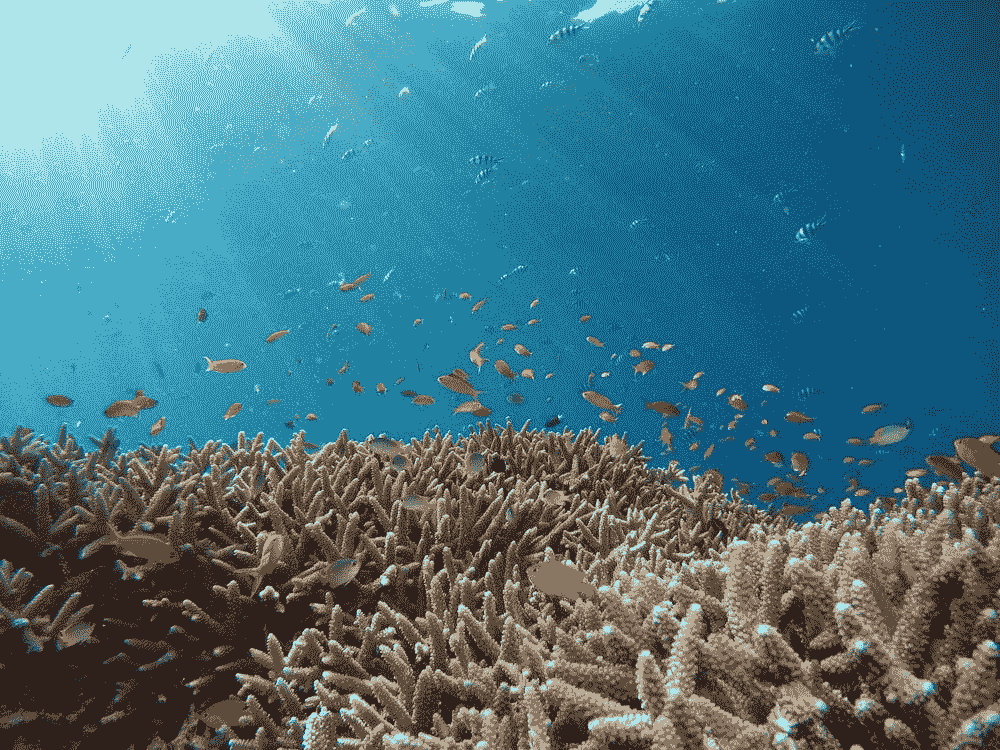
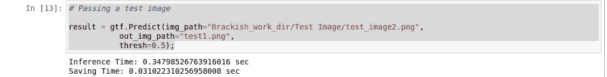
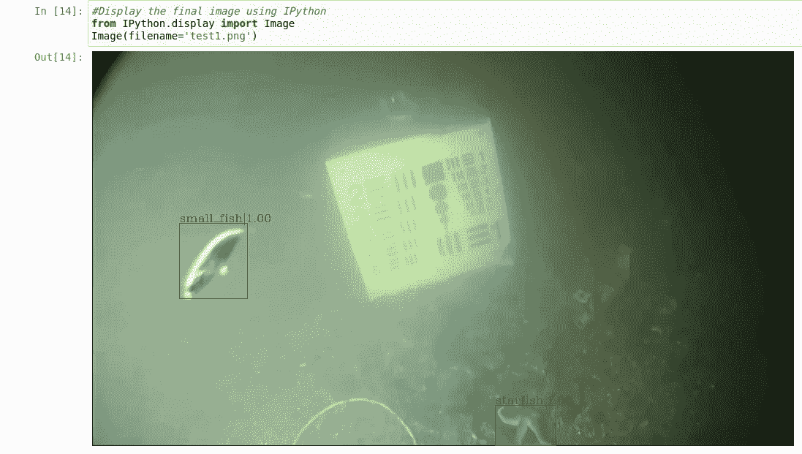

# 使用 Monk 对象检测库检测海洋生物

> 原文：<https://pub.towardsai.net/detecting-marine-creatures-using-monk-object-detection-62ea2f8460e6?source=collection_archive---------4----------------------->

## [计算机视觉](https://towardsai.net/p/category/computer-vision)

## Monk 对象检测库是一个低代码库，可以非常容易和有效地执行对象检测。

来源: [Unsplash](https://unsplash.com/photos/9y7y26C-l4Y)

# 关于项目:

世界各地的人们都食用像鱼、蟹、虾这样的咸水生物。捕捞这些生物的渔民倾向于过度捕捞，这引起了海洋生物学家和科学家的关注。因为许多海洋生物正濒临灭绝。但是如果我们有一个探测器，可以探测到这些生物。这肯定会降低过度捕捞的风险，并帮助这些物种免于濒临灭绝。

使用 Monk 对象检测，我们可以非常容易地构建它。所以让我们开始做吧！！

# 关于数据集:

训练任何模型，首先需要的是数据。用于此目的的数据集名为“半咸水数据集”，可在 Kaggle 中获得。该数据集包含在咸水中发现的海洋生物的视频。现在，我们需要将视频转换为帧图像，以便我们的模型进行训练和检测。

## 创建训练、验证和测试数据集:

现在，一旦我们准备好了帧图像，我们就可以开始创建数据集了。为此，数据集本身包含。txt 文件，分别包含训练、验证和测试数据集的图像名称列表。

我写了一个小函数，它将图像文件夹路径、目标路径和文本文件路径作为参数。一旦我们传递了它，它就将文本文件读入一个 pandas 数据帧，并使用“shutil”将文件中名称可用的图像从源目录移动到目标目录。

呼唤列车图像

我已经处理了图像，并执行了训练测试分割，因此数据可以直接使用。数据集包含大约 11，000 张训练图像，有 6 种不同的生物。

数据集链接:[https://drive . Google . com/drive/folders/1e 7 lzqlc _ Zr 7 yvy 4 CJ 3 yywtb 1 pz 0 rz 5 RS？usp =分享](https://drive.google.com/drive/folders/1E7LZQlC_zR7Yvy4CJ3yyWTB1PZ0Rz5RS?usp=sharing)

## 创建注释文件:

Monk 对象检测库支持各种管道，并支持可可和 YOLO 注释。对于这个项目，我将使用带有 COCO 注释的“mmdnet”管道。

我还直接包含了注释文件。但是，所有的数据预处理代码都可以在 Github 存储库中找到。

批注文件链接:[https://drive . Google . com/drive/folders/1 eu 9 kdi 9 ln 1 hufz 3 weuuwac 6 al h 9 GHG br？usp =分享](https://drive.google.com/drive/folders/1EU9KDI9lN1hUFZ3WEuUWac6Alh9GhgBR?usp=sharing)

# 训练模型:

我们已经准备好数据，现在我们必须训练模型。如前所述，为此我使用了 Monk 对象检测库。

## 安装和设置库:

这样，我们就克隆了存储库。一旦库被克隆，我们需要为我们的“mmdnet”管道安装需求，以便为我们的代码使用库。

这通常需要 5-6 分钟，一旦安装了每个依赖项，我们就可以设置库以供使用了。

现在我们导入检测器函数，它用于训练一个对象检测器。

## 加载数据:

这里加载了列车图像，以及注释文件和类名文件。类似地，我们也将加载验证集。

## 设置参数:

现在，我们需要为我们的项目设置超参数、纪元数量和模型。为此，我选择了“faster _ rcnn _ x101 _ 64x4d _ fpn”型号。

## 训练模型:

现在剩下的唯一步骤是训练模型及其最简单的部分。

这将开始训练，在标准 GPU 上需要一点时间。所以耐心点，当模型训练的时候。

# 测试模型:

训练需要在标准 GPU 上进行 5-6 小时，你训练模型越多，它的表现就越好。

一旦训练完成，我们需要测试模型性能。

我们称之为“推断”法，以检验模型性能。

## 加载训练好的模型，并在测试图像上进行测试:

我们加载训练好的模型，用于测试。现在我们通过一个测试图像，来检查性能。

这个输出显示图像被保存为“test1.png ”,现在让我们看看它是什么样子。

可以清楚地看到，我们的模型成功地检测到了图像中检测到的所有海洋生物。

所以你可以非常容易地训练你自己的物体检测模型。我还链接了包含完整代码的存储库。

# 资源:

存储库链接:[https://github . com/Tessellate-Imaging/Monk _ Object _ Detection/blob/master/application _ model _ zoo/Example % 20-% 20 brackish % 20 water % 20 creatures % 20 identificati on . ipynb](https://github.com/Tessellate-Imaging/Monk_Object_Detection/blob/master/application_model_zoo/Example%20-%20Brackish%20Water%20Creatures%20Identification.ipynb)

僧库:【https://github.com/Tessellate-Imaging/Monk_Object_Detection 

原始数据集:【https://www.kaggle.com/aalborguniversity/brackish-dataset 