# 从图像和视频中检测道路损伤

> 原文：<https://pub.towardsai.net/detecting-road-damages-from-image-and-video-6e6d56241e7d?source=collection_archive---------1----------------------->

## 从为对象识别训练 yolov5 模型到在 streamlit 上托管

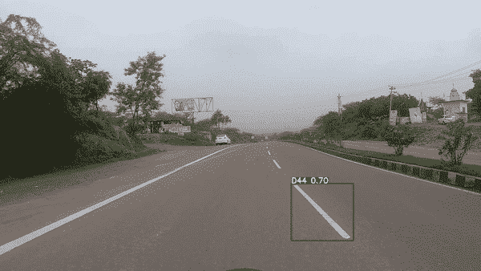

从视频中检测道路缺陷的模型

# 动机

假设您在一个行业工作，该行业会生成大量图像数据，并且图像中有您感兴趣的某些对象。例如，您有大量的 X 射线图像，这些图像标有出现异常的确切位置。你想要一个能在新的 x 光图像中发现同样异常的模型。不幸的是，在你的数据集上没有训练。你是做什么的？

这就是你利用 yolov5 或类似工具，根据你的数据训练一个深度神经网络，可以在新的 X 射线图像中检测出相同的异常。也许你想检测水族馆中的鱼，或者闭路电视镜头中穿大衣的人，训练对象检测模型是解决这类问题的首选方法。

这次我们要深入研究 yolov5，学习如何从零开始构建一个对象检测模型。嗯，实际上不是从头开始，因为我们将使用预训练的 yolov5 模型进行迁移学习。但这本身是一项艰巨的任务，因为要将训练数据输入 yolov5，需要进行大量的数据预处理。像往常一样，我们将通过创建一个 streamlit web 应用程序来公开我们的项目，用户可以上传道路的图像或视频，应用程序将生成一个带有边框的输出图像，突出显示道路上的缺陷。

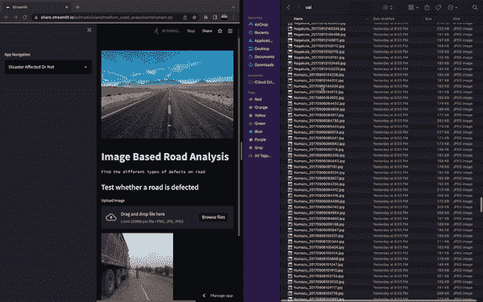

背景为 yolov5 的 Streamlit 应用程序

# 第 1 部分:数据预处理

**数据集**

包含路面裂缝的图片可以从下面的[链接](https://mycityreport.s3-ap-northeast-1.amazonaws.com/02_RoadDamageDataset/RoadDamageDataset.tar.gz)下载。下载的文件将被命名为 RoadDamageDataset.tar.gz 的*。*我们将使用 Python 代码提取数据，所以先不要解压缩。

***文件夹结构***

这就是文件夹结构应该的样子。

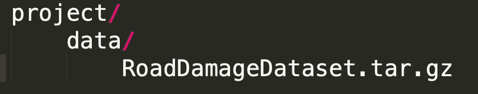

初始文件夹结构。确保压缩文件保存在名为 data 的文件夹中。

现在让我们开始编写提取数据的代码。打开 Jupyter 笔记本并导入所需的库。

现在让我们从 tar.gz 文件中提取数据

一旦执行了上面这段代码，提取的文件将存储在 data 文件夹中名为 RoadDamageDataset 的文件夹中。项目文件夹结构现在如下所示:

提取后

如果我们查看 **RoadDamageDataset** 文件夹，我们会看到收集数据的不同位置。

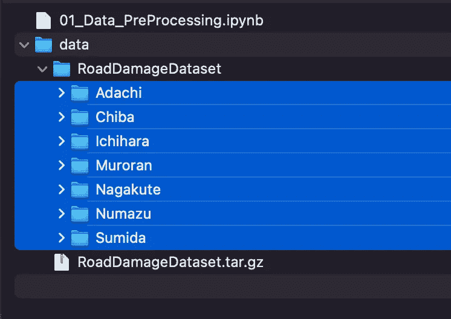

足立、千叶、市原等是日本不同的城市，在这些城市拍摄了道路图像并发现了缺陷。让我们仔细看看。

对于每个城市，存在以下文件夹

*   释文
*   图像集
*   JPEGImages

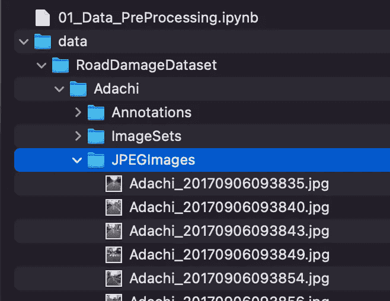

JPEGImages 包含道路的彩色图像

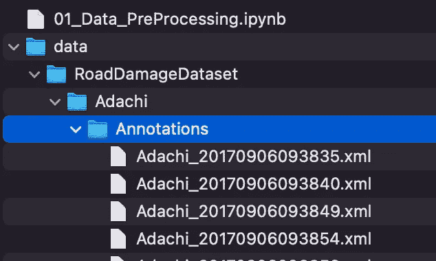

“注释”文件夹包含每个图像的标签细节

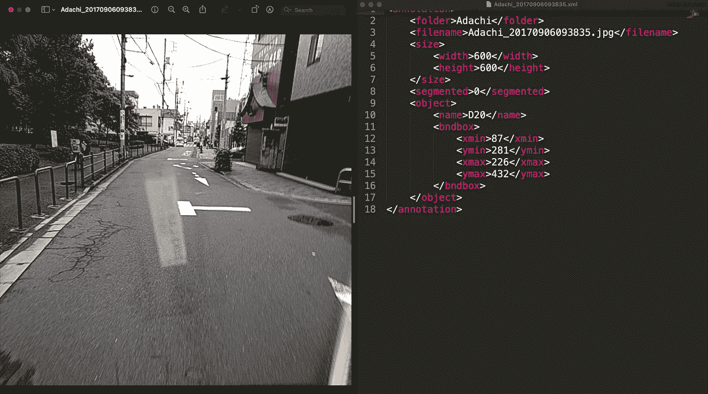

图像和注释并列

为了便于理解，图像及其对应的注释文件是并排保存的。我们感兴趣的标记是和其中的组件。例如，在该图像中，存在的缺陷是 D20，并且其位于 X 轴上的像素点 87 至 226 和 Y 轴上的像素点 281 至 432。一些图像往往包含不止一个缺陷。下图是一个例子。一对缺陷其实是肉眼可见的。

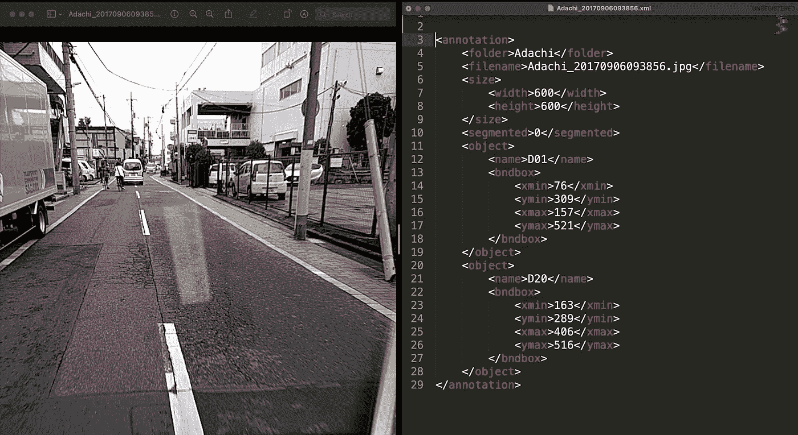

道路上有多个缺陷的图像

缺陷的名称各不相同，通常以 D 开头，后面是一个 2 位数，如“D20”、“D01”等。

现在我们已经有了注释文件和图像，我们需要以一种可以用来训练 PyTorch 模型的方式来排列它们。首先，我们需要将所有图像放在一个文件夹中，将所有注释放在另一个文件夹中。它们应该有相同的名称，只是扩展名不同。比如一个文件“Chiba_20170913094022”，Chiba_20170913094022.jpg 要存放在一个文件夹中，Chiba_20170913094022.xml 要存放在另一个文件夹中。让我们看一下下面的代码片段，它将不同城市的所有图像和注释放在两个独立的文件夹中。

**输出**:

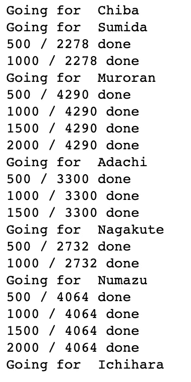

代码的第一部分(try 块)创建保存所有图像和注释的文件夹。创建必要的文件夹后，排列如下:

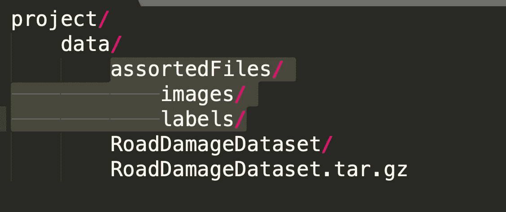

将所有图像和注释存储在一个位置的文件夹

一旦代码的第二部分执行，文件将被复制到 images 和 labels 目录中，这取决于它们是图像文件还是 XML 文件。

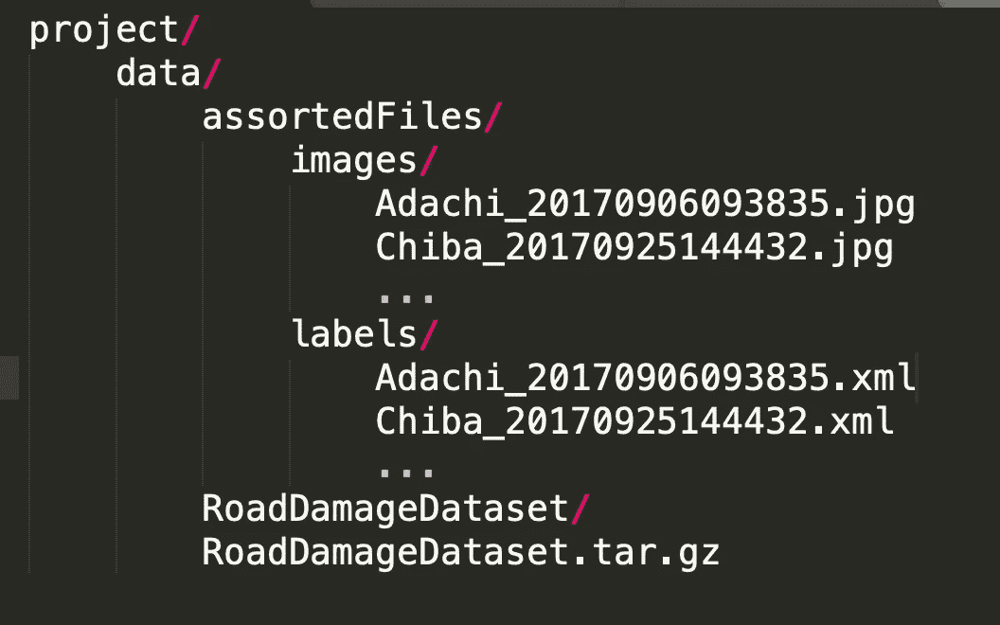

排列到图像和标签文件夹的文件

**注解文件**

现在让我们仔细看看注释文件。我们可以随便挑一个。

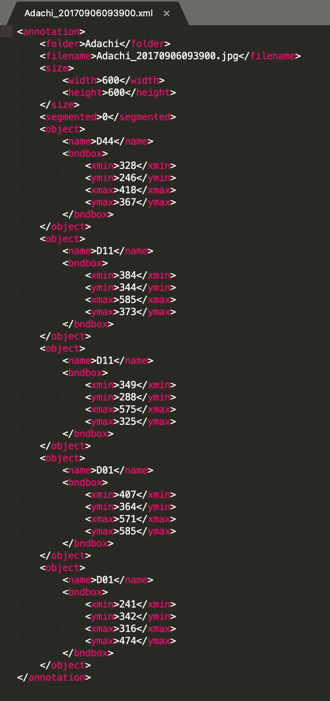

该文件包含 5 个缺陷的坐标

上图是一个包含 5 个路上缺陷的文件的例子。对于每个缺陷，我们有 xmin、ymin、xmax 和 ymax——基本上是角。

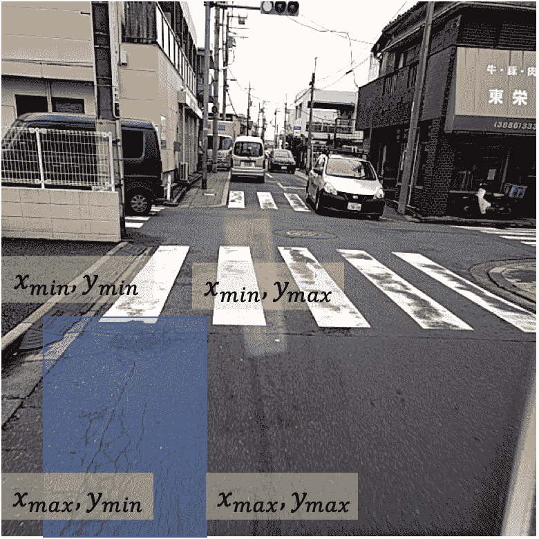

XML 文件中的注释

但是我们必须将这个文件转换成 yolov5 训练时可以理解的格式。在 yolov5 的情况下，它需要突出显示部分的中心的 x 和 y 坐标以及其长度和宽度。让我们看看 yolov5 的理想注释文件是什么样的。上面显示的相同文件转换成 yolov5 可理解的格式后将如下所示。

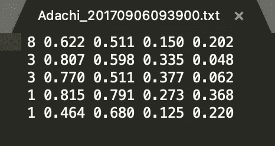

XML 变成了 txt 文件

注意只有 5 行，每个缺陷一行。第一个值是类的数字编码，后面是 x_center、y_center、高亮块的宽度和高亮块的高度。此外，这些不是绝对值，而是与图像的高度或宽度成比例的值。让我们试着进一步理解这一点。

第一个值是高亮部分中心的 x 坐标除以图像的长度。让我们看看第一个突出显示的部分。

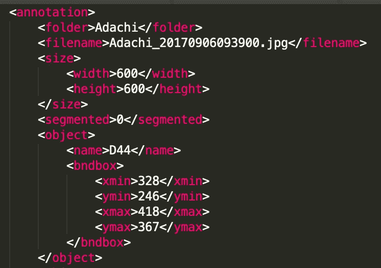

如 Adachi_20170906093900.xml 的原始 XML 文件中所述

xmin 和 xmax 分别为 328 和 418。因此，x_center 应该是

> *(xmin + xmax)/2*

因此 x_center 是(328+418)/2 = 373

但这还不是全部。yolov5 需要的是一个比例值。373 相对于图像高度的比例是多少？如果我们看上面图像的顶部，我们可以看到图像的高度是 600。因此，比例为 373/600 = **0.622**

同理，y_center = (246 + 367) / 2 =306.5，其对应的比例值为 306.5 /600= **0.511**

现在是高亮块的宽度和高度。

突出显示块的宽度= (xmax — xmin)

但是由于我们需要一个比例值，它将除以图像的总宽度。

宽度比例=(xmax-xmin)/图像宽度

高度比例=(ymax-ymin)/图像高度

对于本例，宽度比例=(418–328)/600 =**0.150**

身高比例=(367–246)/600 =**0.202**

如果我们看转换后的文件的第一行，这些是我们得到的值。

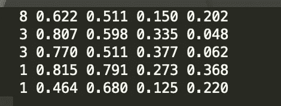

注释的 Yolov5 格式

好的一面是，我们已经有了一些功能，可以为我们执行这种转换。让我们先确定目标。下面是我们的目录结构

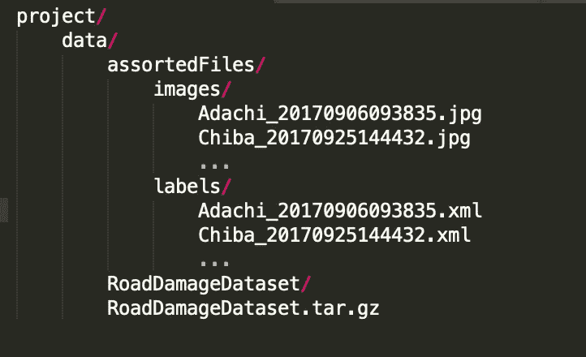

当前目录结构

我们需要的是分类文件目录中的另一个文件夹，名为 annotations，其中包含 yolov5 可理解格式的注释。

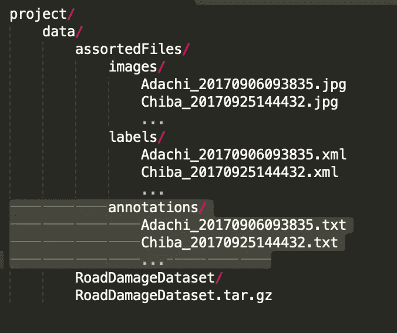

我们想要的—注释文件夹包含与标签文件夹中相同的注释，但采用 yolov5 可理解的格式

突出显示的部分是我们想要的。让我们看看代码。

前两个函数*extract _ info _ from _ xml()*和 *convert_to_yolov5(…)* 负责从 XML 文件中提取数据，然后转换成比例，最后保存为 txt 文件。在这一步之后，将在分类文件目录中以编程方式创建 annotations 文件夹，并生成文本文件。请注意，我们已经创建了一个映射字典来将灾难类型 D11、D44 等转换为数字，因为 yolov5 只理解数字。

在我们完成数据预处理之前，让我们快速检查注释是否已经正确完成。让我们运行下面这段代码，它拾取一个图像及其相应的注释 txt 文件，并根据文件中的值绘制边界框。

我们定义了一个 plot_bounding_box(…)函数，它在图像上绘制一个边界框。然后，我们使用任何旧的 fille，访问其相应的 annotations (txt)文件，并查看这些文件中的坐标是否实际上突出了道路的缺陷区域。输出如下所示。

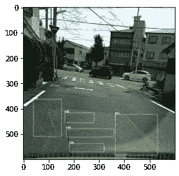

缺陷明显突出

数据预处理的最后一步是将数据分为训练、验证和测试。我们要吃的东西如下。

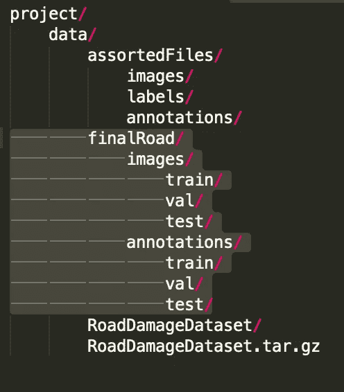

图像和注释分为训练、验证和测试

上图中突出显示的部分显示了分布情况。来自**分类文件/图像**的图像将在*最终道路/图像/列车*、*最终道路/图像/val* 和*最终道路/图像/测试*之间重新分配。同样，来自**分类文件/注释**的注释将被分配到*最终道路/注释/列车*、*最终道路/注释/val* 和*最终道路/注释/测试*中。请记住，finalRoad/images/*/中的文件应该与 finalRoad/annotations/*/中的文件相匹配。也就是说，对于图像目录的 train 文件夹中存在的每个文件，它应该在注释目录的 train 文件夹中具有相应的注释文件。下面这段代码会处理所有这些问题。

用于对图像和注释进行模式化以进行训练、评估和测试的代码

代码的第一部分将文件名分为图像和注释的三个列表，注意相同的文件出现在图像和注释的每个组中。然后我们创建 test、train 和 vali 文件夹。最后，我们将图像从分类文件文件夹复制到最终的道路文件夹。

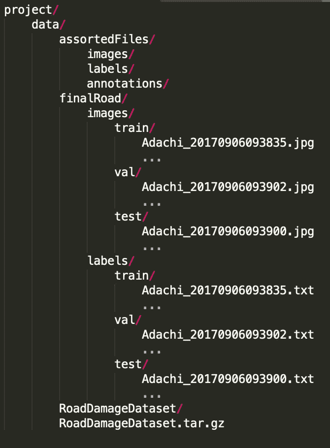

已填充训练、Val 和测试文件夹。

让我们做一个健全性检查，看看每个文件夹中有多少文件

输出:

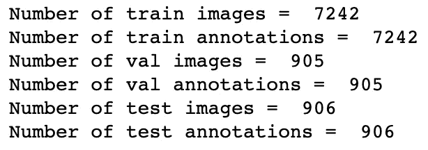

数字加起来。我们可以进入下一阶段

第 1 部分的所有代码可以在 jupyter 笔记本[这里](https://github.com/ashhadulislam/medium_road_analysis_core/blob/main/01_Data_PreProcessing.ipynb)找到。

## 数据预处理结束。

如果您已经到了这一步，请深入到下一部分，您将在数据集上训练一个定制的 yolov5 模型。这似乎是一次艰难的旅程，但回报是令人满意的。

您现在可以打开一个新的 jupyter 笔记本。

# 第 2 部分:培训

得到约洛夫 5

这是我们下载 yolov5 代码库的地方，以便利用已经存在的代码库。

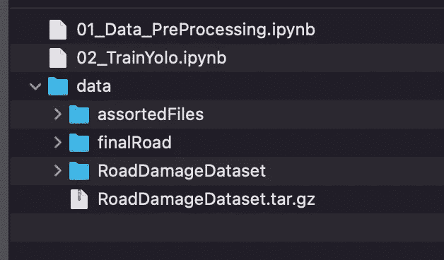

当前目录结构

这是文件夹结构的样子。这是我们在第 1 部分中所做工作的延续。*01 _ Data _ preprocessing . ipynb*是我们写数据预处理(第 1 部分)代码的笔记本。现在，我们有一个名为***02 _ trainyolo . ipynb***的新笔记本，我们将在其中编写第 02 部分。

在您刚刚打开的新 jupyter 笔记本(***02 _ train yolo . ipynb***)中，执行以下操作:

第 2 行将 yolov5 代码 repo 下载到当前目录中。第 3 行将工作目录更改到 yolov5 文件夹中，其中包含所有下载的代码 repo。存储库中有一个 requirement.txt 文件，其中包含了所有必需的库。第 4 行将它们安装在当前正在执行的内核中。

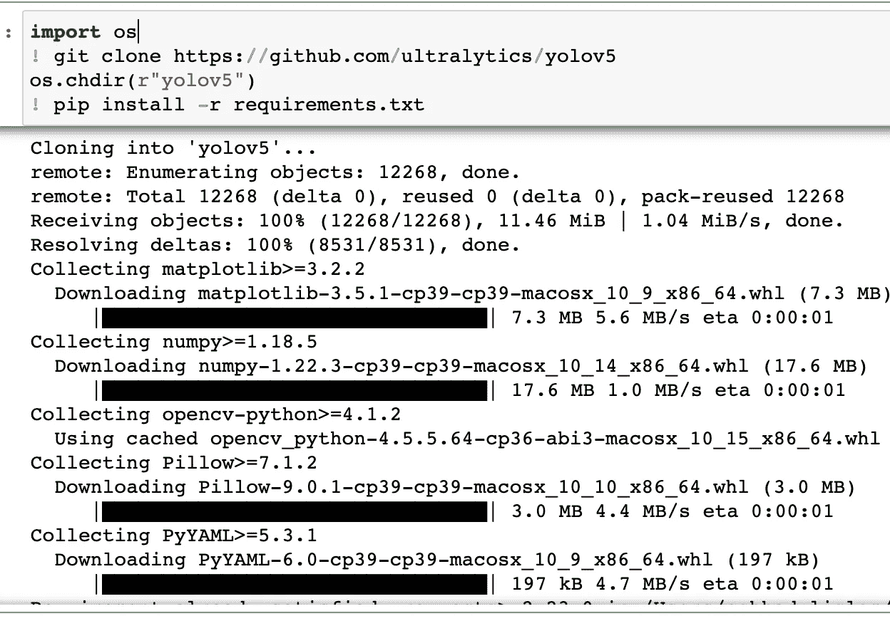

已成功安装库

如果您现在检查文件夹结构，您将在代码库中看到一个名为 yolov5 的文件夹。

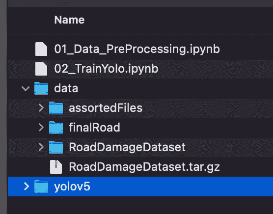

我们现在在 yolov5 文件夹中

**YAML 文件**

这是本部分最关键的部分。我们需要通知 yolov5 关于训练、验证和测试文件的位置。这是通过 YAML 文件传达的。最终的 YAML 文件如下所示，尽管我们将以编程方式创建它。

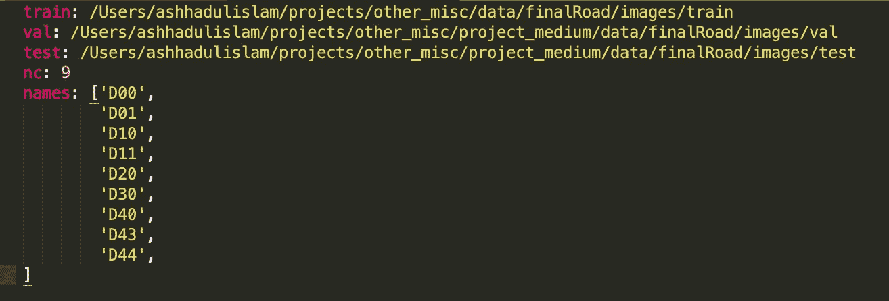

用于培训的元数据

请注意我们是如何给出 train、validation 和 test 文件夹的绝对路径的。这很重要。为了减少混乱，我们将使用代码来创建文件。下面的代码片段创建了 YAML 文件——将其粘贴到您当前正在处理和执行的 jupyter 笔记本中。

YAML 文件的代码

代码的第一部分获取父目录的绝对路径，因为我们在 yolov5 文件夹中，而数据在 yolov5 目录外的单独文件夹**中。该代码导致创建一个名为 dataRoad 的文件。yolov5 文件夹里的 YAML。**

为培训创建元数据

接下来，我们将运行代码来执行训练。实际上，训练的代码已经写好了。我们需要做的是用正确的参数执行代码。我们的做法如下:

使用正确的参数执行训练

在这里重写命令

！python train . py-—data data road . YAML-—CFG yolov 5s . YAML-—批量大小 32 -— epochs 1 -—名称 RoadTrainModel

一个重要的参数是- *data* ，这里我们给出了刚刚创建的 YAML 文件的名称。另一个必要的参数是- *epochs* ，在上面的例子中它仅仅是 1，但是它应该被改变为 20 或更多以获得更好的精度。最后，参数- *name* 很重要，因为它声明了最终训练好的模型将存储在哪里。例如，在这种情况下，训练好的模型将被存储在 yolov5 文件夹的运行目录内的文件夹 *RoadTrainModel* 中。

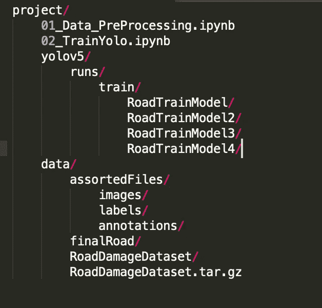

每当我们运行 train.py 文件时，都会创建一个新的 RoadTrainModel*文件夹。

上述代码的输出如下:

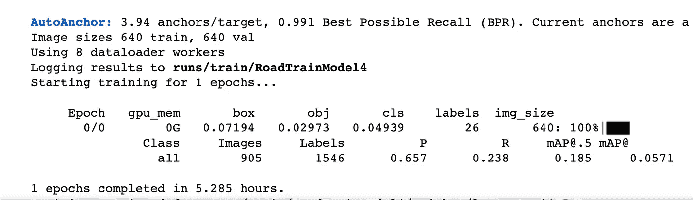

接受 1 个时代的培训

正如你所看到的，我是在一个 CPU 系统中训练的，所以我花了 5 个小时来完成一个纪元！不过，如果你用的是 google colab，应该会快很多。

**训练过的重量**

我们需要能够重用经过训练的模型。模型的重量可以在 RoadTrainModel*文件夹中找到。*代表最高数字。例如，我有一些错误，而我的最终成功训练发生在第 4 次尝试时，这就是为什么在我的情况下，训练的权重将在 RoadTrainModel4 目录中找到。

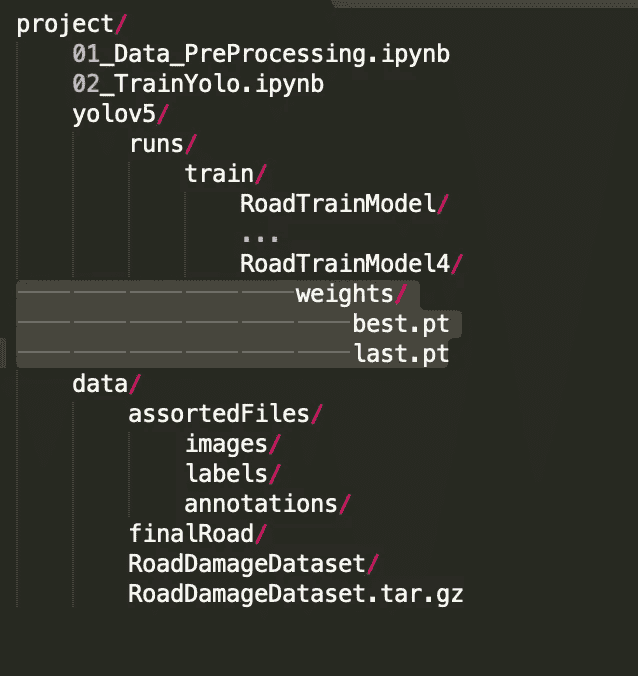

best.pt 是我们追求的目标

最佳权重存储在 best.pt 中，这是我们测试模型时需要加载的文件。

第 02 部分的所有代码可以在[这里](https://github.com/ashhadulislam/medium_road_analysis_core/blob/main/02_TrainYolo.ipynb)找到。

您现在可以关闭此笔记本并开始一个新的。我们姑且称之为 ***03_Test.ipynb***

# 第 3 部分:测试

我们再次利用 yolov5 的代码库来测试训练好的网络。它可以应用于图像以及视频，因此我们下载了一个测试图像[和一个测试视频](https://drive.google.com/file/d/1yspXaykHW0XOBgshZDMuSFtYu-FJz9J3/view?usp=sharing)。让我们创建一个名为 test 的文件夹，并将图像和视频保存在那里。文件夹结构如下所示:

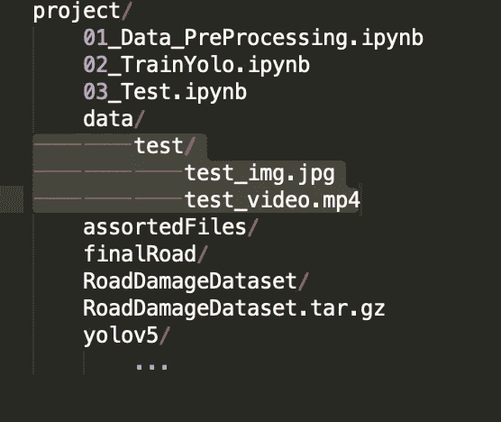

创建一个名为 test 的文件夹，并添加图像和视频文件

另外，请注意 03_Test.ipynb 文件，我们将在该文件中编写这一部分的代码。代码非常简单。我们需要使用 yolov5 目录中的 detect.py 文件，让它知道哪些是测试文件，哪些是训练权重。代码如下:

只有两行

为了清楚起见，在这里重复命令。

！python yolov 5/detect . py-源数据/测试/-权重 yolov 5/runs/train/roadtraintmodel 4/weights/best . pt-conf 0.25-名称 RoadTestModel

—源是测试图像和视频所在的位置。—权重是已训练的最佳权重的位置。同样，name 是可以找到测试输出的文件夹的名称。这可以在 yolov5 的 runs 文件夹中再次找到。

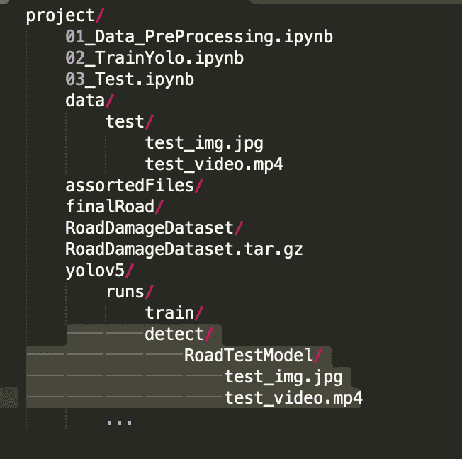

输出文件与输入测试文件同名。

注意到名为 detect 的新文件夹了吗？这是输出将被存储的地方。代码的输出如下所示:

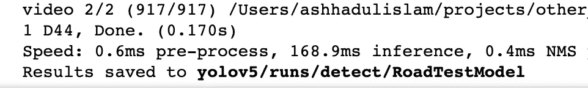

告诉您输出存储在哪里

输出文件如下所示:

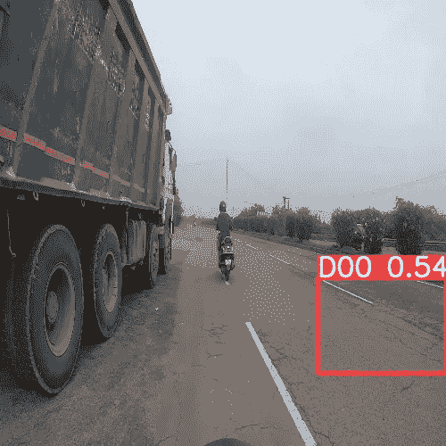

检测输出图像

就是这样！您已经能够在自定义数据集上训练和测试 yolov5 对象检测模型。

# 奖励部分:Streamlit 应用程序

如果我们能把这作为一个应用程序与全世界分享，那就太好了。你只需上传任何道路的图像，它就会给出道路受损的区域。我们可以使用 streamlit 做到这一点。

行动中的简化应用

关于 streamlit 中编码的更详细的解释，请看这篇[文章](/deep-learning-a692669f6f42)，并转到作为 Streamlit 应用程序托管的*部分(本地和云中)。*这个应用程序的代码以类似的格式编写。我在这里附上 streamlit 应用[的 GitHub repo。你可以试试这里的 app](https://github.com/ashhadulislam/medium_road_analysis)。

**遗言**

如果你坚持到了最后，那么恭喜你——我希望这段时间花得值，你可以利用本文分享的知识开发出一些很棒的应用程序。请随时与我在 ashhadulislam@gmail.com 取得联系，提出意见或改进建议。

下次见。