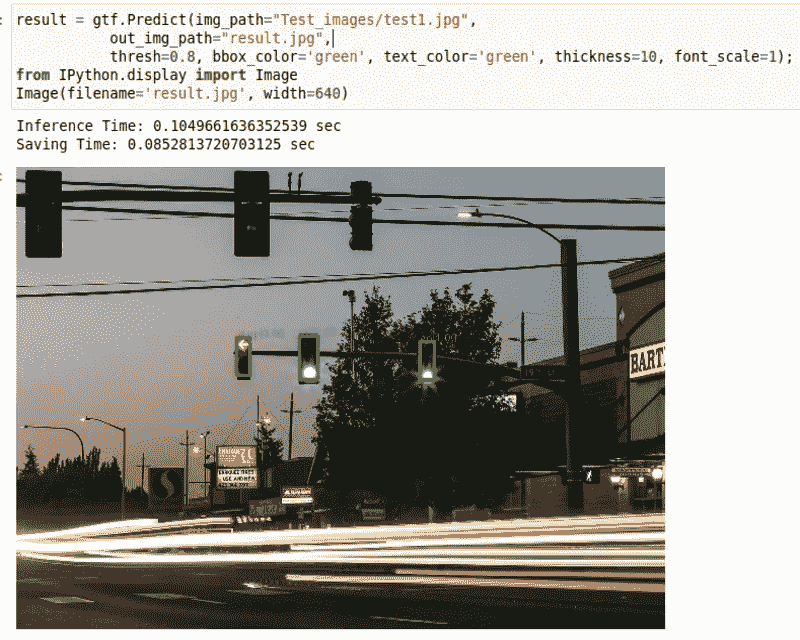
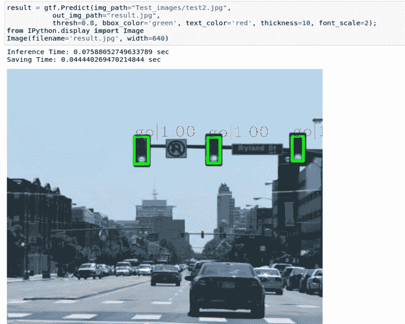
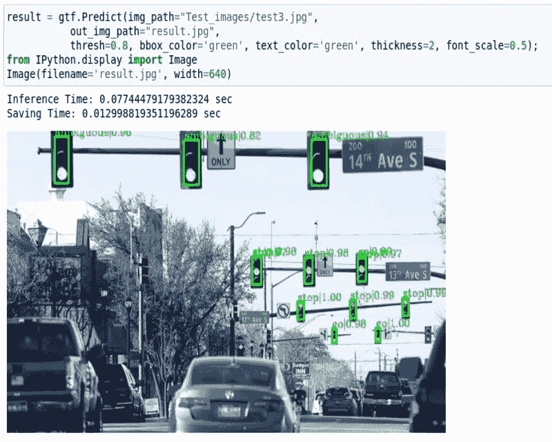

# 使用 Monk 对象检测库检测交通灯

> 原文：<https://pub.towardsai.net/detecting-traffic-lights-using-the-monk-object-detection-library-1321b113f37d?source=collection_archive---------5----------------------->

## [计算机视觉](https://towardsai.net/p/category/computer-vision)

## 这篇文章是一个如何使用 MONK 对象检测库的例子。


由[克里斯·奥瓦尔](https://unsplash.com/@crisovalle?utm_source=medium&utm_medium=referral)在 [Unsplash](https://unsplash.com?utm_source=medium&utm_medium=referral) 上拍摄的照片

对于这个项目的笔记本访问[这里](https://github.com/Tessellate-Imaging/Monk_Object_Detection/blob/master/application_model_zoo/Example%20-%20Lara%20Traffic%20Lights%20Detection%20Dataset.ipynb)。

欲了解更多关于僧侣对象检测的示例，请访问[此处](https://github.com/Tessellate-Imaging/Monk_Object_Detection/tree/master/application_model_zoo)。

# 关于项目:

在一个无人驾驶汽车、交通灯🚦会成为过去。但只要人类在旁边行驶，自动驾驶车辆就必须遵循人类制定的规则。这些规则之一是遵守交通信号灯。自动驾驶汽车🚗必须检测和识别交通灯，以避免事故和街道上的混乱。
这是我最近对 Tessellate Imaging Monk 对象检测库的贡献。期待将其部署到边缘设备。

# 关于数据集:

在此可以查看数据集[。数据集文件包含**9168 个交通灯实例，手工标记为**。红绿灯细节如下:**3381“绿色”**(叫*‘行’*)**58“橙色”**(叫*‘警告’*)**5280“红色”**(叫*‘停’*)**449“暧昧”。**](http://www.lara.prd.fr/benchmarks/trafficlightsrecognition)

# 项目目标:

1.  安装[和尚物体检测库](https://github.com/Tessellate-Imaging/Monk_Object_Detection)
2.  使用预先训练的模型来检测交通灯。
3.  从头开始训练交通灯检测模型。

## 1.安装僧侣图书馆

运行这些命令

```
!git clone [https://github.com/Tessellate-Imaging/Monk_Object_Detection.git](https://github.com/Tessellate-Imaging/Monk_Object_Detection.git)!cd Monk_Object_Detection/16_mmdet/installation
```

选择正确的文件并运行

```
!chmod +x install.sh && ./install.sh
```

## 2.使用预先训练的模型来检测交通灯。

要使用预先训练的模型在测试图像上加载和运行推理，请遵循以下代码。

导入 MONK 对象检测并创建一个推断类的对象。

```
import os
import sys
sys.path.append("Monk_Object_Detection/16_mmdet/lib")from infer_engine import Infer
gtf = Infer();
```

从驱动器下载预先训练好的模型并解压。

```
! wget --load-cookies /tmp/cookies.txt "[https://docs.google.com/uc?export=download&confirm=$(wget](https://docs.google.com/uc?export=download&confirm=$(wget) --save-cookies /tmp/cookies.txt --keep-session-cookies --no-check-certificate '[https://docs.google.com/uc?export=download&id=1XLSAp7YAYBY8xwKURiehj_uerHTJeq5n'](https://docs.google.com/uc?export=download&id=1XLSAp7YAYBY8xwKURiehj_uerHTJeq5n') -O- | sed -rn 's/.*confirm=([0-9A-Za-z_]+).*/\1\n/p')&id=1XLSAp7YAYBY8xwKURiehj_uerHTJeq5n" -O obj_traffic2_trained.zip && rm -rf /tmp/cookies.txt! unzip -qq obj_traffic2_trained.zip
```

加载模型参数。

```
gtf.Model_Params("work_dirs/config_updated/config_updated.py", 
                 "work_dirs/config_updated/latest.pth")
```

对您想要的图像运行 Predict()函数。

```
result = gtf.Predict(img_path="Test_images/test1.jpg",
           out_img_path="result.jpg",
           thresh=0.8);
from IPython.display import Image
Image(filename='result.jpg')
```



# 从头开始训练交通灯检测模型

## 涉及的步骤

1.  下载数据集
2.  将 CVML 标注格式转换为 COCO 格式
3.  使用 [MMDet](https://github.com/open-mmlab/mmdetection) 训练模型

## 1.下载数据集

数据集学分:[红绿灯识别(TLR)公共基准](http://www.lara.prd.fr/benchmarks/trafficlightsrecognition)。使用下面的代码数据集可以下载到你的机器上。

```
!wget [http://s150102174.onlinehome.fr/Lara/files/Lara_UrbanSeq1_JPG.zip](http://s150102174.onlinehome.fr/Lara/files/Lara_UrbanSeq1_JPG.zip)
```

解压缩数据集:

```
!unzip Lara_UrbanSeq1_JPG.zip
```

## 2.转换 CVML 到可可格式。

这一步是必需的，因为数据集的标注是 CVML 格式，因此需要转换为 COCO 格式。

更多详情请参考本博客: [CVML 注解——什么是注解，如何转换？](https://medium.com/towards-artificial-intelligence/cvml-annotation-what-it-is-and-how-to-convert-it-7b818dc30c9f)

将 CVML 转换为僧侣类型的代码

```
import os
import sys
import numpy as np
import pandas as pd
import xmltodict
import json
from tqdm.notebook import tqdm
import collections
from pycocotools.coco import COCOimg_dir = "Lara3D_UrbanSeq1_JPG/";annoFile="Lara_UrbanSeq1_GroundTruth_cvml.xml"
f = open(annoFile, 'r');
my_xml = f.read();
anno = dict(dict(xmltodict.parse(my_xml))["dataset"])combined=[]
count=0;
for frame in tqdm(anno['frame']):
    fname=file_content[count].strip()
    count+=1
    label_str = "";
    width=640
    height=480
    if(type(frame["objectlist"]) ==collections.OrderedDict):
        if(type(frame["objectlist"]['object']) == list):
            for j,i in enumerate(frame['objectlist']['object']):
                x1=max(int(i['box']['[@xc](http://twitter.com/xc)'])-int(i['box']['[@w](http://twitter.com/w)'])/2,0)
                y1=max(int(i['box']['[@yc](http://twitter.com/yc)'])-int(i['box']['[@h](http://twitter.com/h)'])/2,0)
                x2=min(int(i['box']['[@xc](http://twitter.com/xc)'])+int(i['box']['[@w](http://twitter.com/w)'])/2,width)
                y2=min(int(i['box']['[@yc](http://twitter.com/yc)'])+int(i['box']['[@h](http://twitter.com/h)'])/2,height)
                label=i['hypothesislist']['hypothesis']['subtype']['#text']
                label_str+=str(x1)+" "+str(y1)+" "+str(x2)+" "+str(y2)+" "+label+" "else:
            x1=max(0,int(frame["objectlist"]['object']['box']['[@xc](http://twitter.com/xc)'])-int(frame["objectlist"]['object']['box']['[@w](http://twitter.com/w)'])/2)
            y1=max(0,int(frame["objectlist"]['object']['box']['[@yc](http://twitter.com/yc)'])-int(frame["objectlist"]['object']['box']['[@h](http://twitter.com/h)'])/2)
            x2=min(width,int(frame["objectlist"]['object']['box']['[@xc](http://twitter.com/xc)'])+int(frame["objectlist"]['object']['box']['[@w](http://twitter.com/w)'])/2)
            y2=min(height,int(frame["objectlist"]['object']['box']['[@yc](http://twitter.com/yc)'])+int(frame["objectlist"]['object']['box']['[@h](http://twitter.com/h)'])/2)
            label=frame["objectlist"]['object']['hypothesislist']['hypothesis']['subtype']['#text']
            label_str += str(x1)+" "+str(y1)+" "+str(x2)+" "+str(y2)+" " + label

    combined.append([fname,label_str.strip()])df = pd.DataFrame(combined, columns = ['ID', 'Label']);
df.to_csv("train_labels.csv", index=False);
```

和尚到可可类型

```
import os
import numpy as np 
import cv2
import dicttoxml
import xml.etree.ElementTree as ET
from xml.dom.minidom import parseString
from tqdm import tqdm
import shutil
import json
import pandas as pdroot = "./";
img_dir = "Lara3D_UrbanSeq1_JPG/";
anno_file = "train_labels.csv";dataset_path = root;
images_folder = root + "/" + img_dir;
annotations_path = root + "/annotations/";if not os.path.isdir(annotations_path):
    os.mkdir(annotations_path)

input_images_folder = images_folder;
input_annotations_path = root + "/" + anno_file;output_dataset_path = root;
output_image_folder = input_images_folder;
output_annotation_folder = annotations_path;tmp = img_dir.replace("/", "");
output_annotation_file = output_annotation_folder + "/instances_" + tmp + ".json";
output_classes_file = output_annotation_folder + "/classes.txt";if not os.path.isdir(output_annotation_folder):
    os.mkdir(output_annotation_folder);df = pd.read_csv(input_annotations_path);
columns = df.columnsdelimiter = " ";list_dict = [];
anno = [];
for i in range(len(df)):
    img_name = df[columns[0]][i];
    labels = df[columns[1]][i];
    tmp = str(labels).split(delimiter);
    for j in range(len(tmp)//5):
        label = tmp[j*5+4];
        if(label not in anno):
            anno.append(label);
    anno = sorted(anno)

for i in tqdm(range(len(anno))):
    tmp = {};
    tmp["supercategory"] = "master";
    tmp["id"] = i;
    tmp["name"] = anno[i];
    list_dict.append(tmp);anno_f = open(output_classes_file, 'w');
for i in range(len(anno)):
    anno_f.write(anno[i] + "\n");
anno_f.close();coco_data = {};
coco_data["type"] = "instances";
coco_data["images"] = [];
coco_data["annotations"] = [];
coco_data["categories"] = list_dict;
image_id = 0;
annotation_id = 0;for i in tqdm(range(len(df))):
    img_name = df[columns[0]][i];
    labels = df[columns[1]][i];
    tmp = str(labels).split(delimiter);
    image_in_path = input_images_folder + "/" + img_name;
    img = cv2.imread(image_in_path, 1);
    h, w, c = img.shape;images_tmp = {};
    images_tmp["file_name"] = img_name;
    images_tmp["height"] = h;
    images_tmp["width"] = w;
    images_tmp["id"] = image_id;
    coco_data["images"].append(images_tmp);for j in range(len(tmp)//5):
        x1 = float(tmp[j*5+0]);
        y1 = float(tmp[j*5+1]);
        x2 = float(tmp[j*5+2]);
        y2 = float(tmp[j*5+3]);
        label = tmp[j*5+4];
        annotations_tmp = {};
        annotations_tmp["id"] = annotation_id;
        annotation_id += 1;
        annotations_tmp["image_id"] = image_id;
        annotations_tmp["segmentation"] = [];
        annotations_tmp["ignore"] = 0;
        annotations_tmp["area"] = (x2-x1)*(y2-y1);
        annotations_tmp["iscrowd"] = 0;
        annotations_tmp["bbox"] = [x1, y1, x2-x1, y2-y1];
        annotations_tmp["category_id"] = anno.index(label);coco_data["annotations"].append(annotations_tmp)
    image_id += 1;outfile =  open(output_annotation_file, 'w');
json_str = json.dumps(coco_data, indent=4);
outfile.write(json_str);
outfile.close();
```

# 2.培训模式

加载 monk 并创建一个检测器类的对象。

```
import os
import sys
sys.path.append(“Monk_Object_Detection/16_mmdet/lib”)from train_engine import Detector
gtf = Detector();
```

查找所需的文件。

```
img_dir = "Lara3D_UrbanSeq1_JPG";
annofile = "annotations/instances_Lara3D_UrbanSeq1_JPG.json"
class_file = "annotations/classes.txt"
```

加载数据集、给定数据集参数、加载模型架构以及调整超参数:

```
gtf.Train_Dataset(img_dir, annofile, class_file);
gtf.Dataset_Params(batch_size=8, num_workers=2);
gtf.Model_Params(model_name="faster_rcnn_fpn50");
gtf.Hyper_Params(lr=0.02, momentum=0.9, weight_decay=0.0001);
```

开始培训:

```
gtf.Training_Params(num_epochs=50, val_interval=1);
gtf.Train();
```

## 3.对测试图像进行推理

要使用预先训练的模型在测试图像上加载和运行推理，请遵循以下代码。

导入 MONK 对象检测并创建一个推断类的对象。

```
import os
import sys
sys.path.append(“Monk_Object_Detection/16_mmdet/lib”)from infer_engine import Infer
gtf=Infer();
```

加载模型参数。

```
gtf.Model_Params("work_dirs/config_updated/config_updated.py", 
                 "work_dirs/config_updated/latest.pth")
```

对您想要的图像运行 Predict()函数。

```
result = gtf.Predict(img_path="Test_images/test1.jpg",
           out_img_path="result.jpg",
           thresh=0.8);
from IPython.display import Image
Image(filename='result.jpg')
```



如需更多测试图片，或查看完整笔记本，请访问[此处](https://github.com/Tessellate-Imaging/Monk_Object_Detection/blob/master/application_model_zoo/Example%20-%20Lara%20Traffic%20Lights%20Detection%20Dataset.ipynb)。

# 结论

1.  Monk library 让学生、研究人员和竞争对手可以非常轻松地创建深度学习模型，并尝试不同的超参数调整来提高模型的准确性。
2.  预先训练的模型可以直接下载使用，而无需进入模型创建部分。
3.  使用 Monk 使这个过程变得简单，耗时更少。

# 感谢阅读。

如果你读到这里，请为这篇文章鼓掌。还有，在 [LinkedIn](https://www.linkedin.com/in/rohit96/) 上和我联系。