# 基于 Monk AI 的热图像足球运动员检测

> 原文：<https://pub.towardsai.net/detection-of-soccer-players-from-thermal-images-using-monk-ai-30f73a43135?source=collection_archive---------5----------------------->

## [计算机视觉](https://towardsai.net/p/category/computer-vision)

## 使用 Monk，低代码深度学习工具和计算机视觉的统一包装器，使计算机视觉变得简单。

# 介绍

在本教程中，我们将使用室内足球场的热图像数据集制作一个对象检测应用程序。使用这个应用程序，我们将能够跟踪在特定时间出现在地面上的玩家数量，因此这个应用程序可以用于目标跟踪活动。这将有助于我们跟踪多个人，特别是在人们快速、不稳定地移动并穿着相似制服的活动中。Monk 的对象检测工具包允许我们使用低代码语法部署我们的模型，不同深度学习管道的一行安装使我们的工作更容易。

# 使用 Monk 创建真实世界的对象检测应用程序

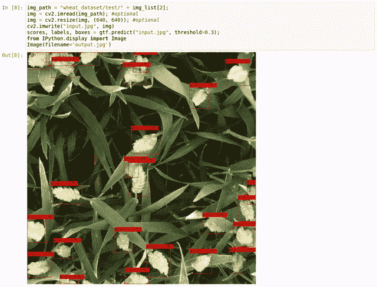

田间小麦检测

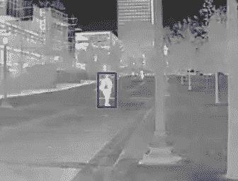

红外图像中的人物检测

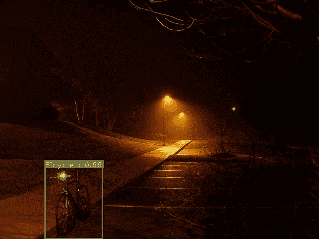

弱光下的目标检测

# 关于数据集

热足球数据集可在 [Kaggle](https://www.kaggle.com/aalborguniversity/thermal-soccer-dataset) 上获得，该数据集是使用热摄像机捕捉的，这确保了更好的分割，并确保了公共设施中人们的隐私。
这个数据集包含 4 个 30 秒的视频序列，8 个人在室内竞技场踢足球。该视频使用 AXIS Q1922 型热感摄像机拍摄，分辨率为 640480 像素，每秒 25 帧。这三幅图像被拼接成一幅 1920*480 像素的图像。
对视频进行手动注释以便跟踪。

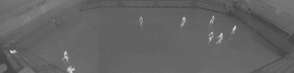

热足球数据集

# 目录

## 1.安装说明

## 2.使用训练好的模型来检测足球运动员

## 3.使用 MMdetection 包装器训练您自己的检测器

**— VOC 转和尚式
—和尚转 COCO 式
—培训**

## 4.推理

# 装置

第一步是在我们工作的平台上设置 MONK AI toolkit 及其依赖项，我使用 Google Colab 作为我的环境。

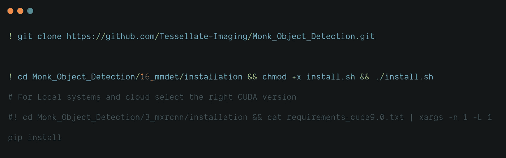

# 使用已经训练好的模型进行检测。

MONK toolkit 还允许我们使用预先训练的模型来演示我们的应用程序。我还使用了一个由我预先训练的模型来检测热图像中的足球运动员。

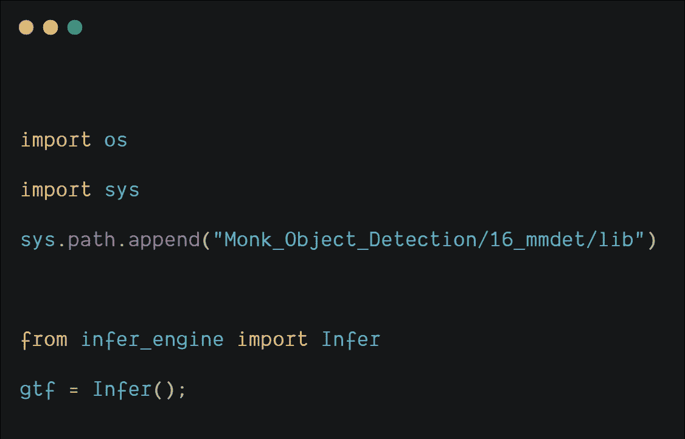

下载预先训练的模型文件夹，并使用它来推断一些测试图像。

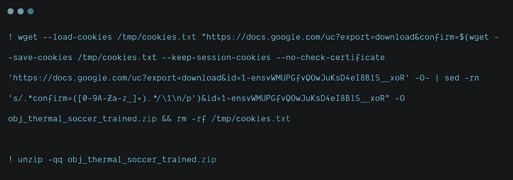

从预训练模型文件夹中加载模型参数。

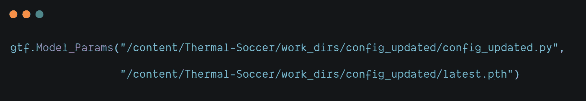

使用预测功能，我们将为一些测试图像预测足球运动员的边界框。

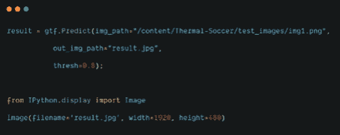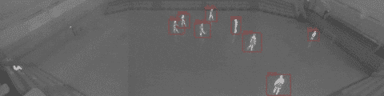

**推断图像**

# 训练自定义检测器

训练自定义检测器的第一步是将 VOC 格式转换为 MONK 类型格式，但在此之前，我们需要准备一个合适的 VOC 类型数据集，为此我们需要遵循以下步骤:

*   从下面的[链接](https://www.kaggle.com/aalborguniversity/thermal-soccer-dataset)将数据集下载到您的本地系统。
*   将不同文件夹中的所有图像移动到一个公共文件夹中。
*   选择所有图像，并将第一张图像重命名为**“img”**。
*   将此图像文件夹上传到您的驱动器，并在笔记本中安装您的驱动器。
*   现在 XML 文件从 Kaggle 下载，我们将为每个图像创建单独的 XML 文件，并将它们保存在单独的文件夹中。
*   执行上述步骤，以便在数据集从 VOC 转换为 MONK 类型后，可以实现正确的标签匹配。

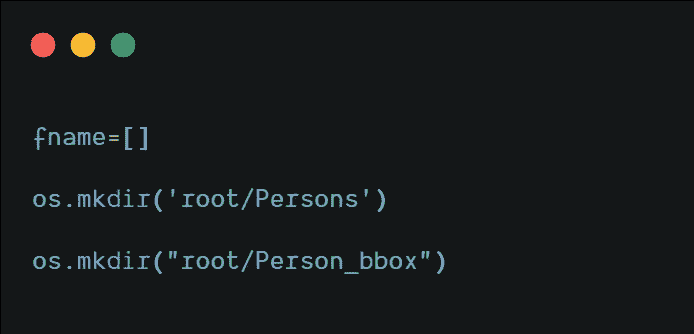

将图像保存在根目录下的**【人物】**图像目录中。

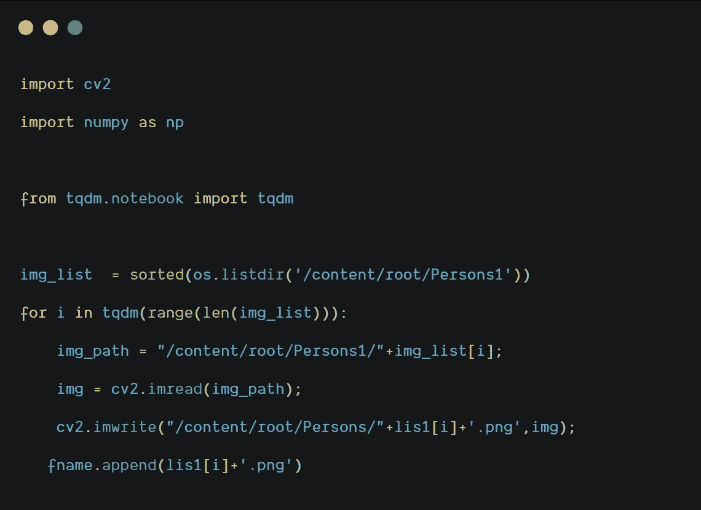

为每个图像创建单独的 XML 文件，并将它们保存在根目录下的单独目录 **"Person_bbox1"** 。

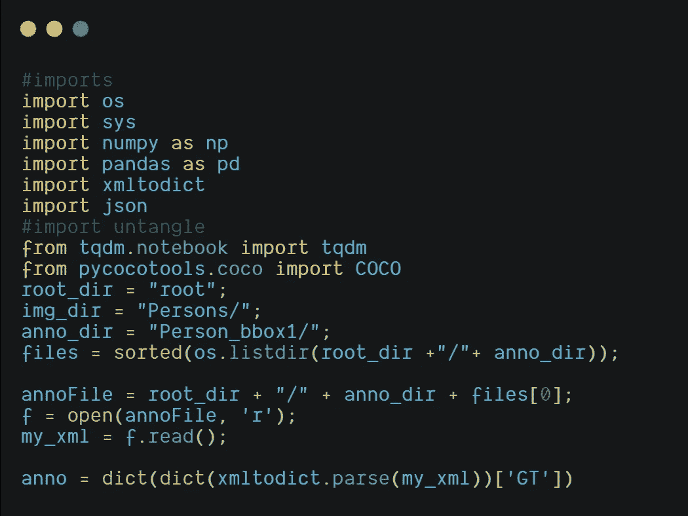

类似地，其他三个文件夹中图像的 XML 文件保存在根目录的 annotation 文件夹中。
现在，在 VOC 类型数据集准备就绪后，我们将把它转换成 MONK 格式。
那么现在，什么是和尚格式？

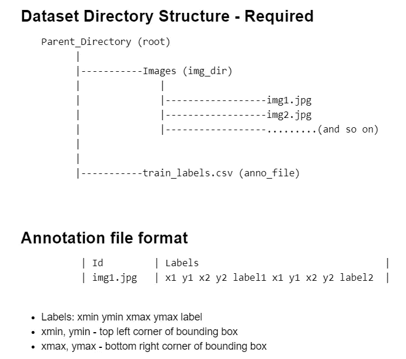

**修士格式**

## VOC 到 MONK 类型

因此，为了将我们的数据转换为上面显示的 MONK 格式，我们运行下面给出的代码片段。

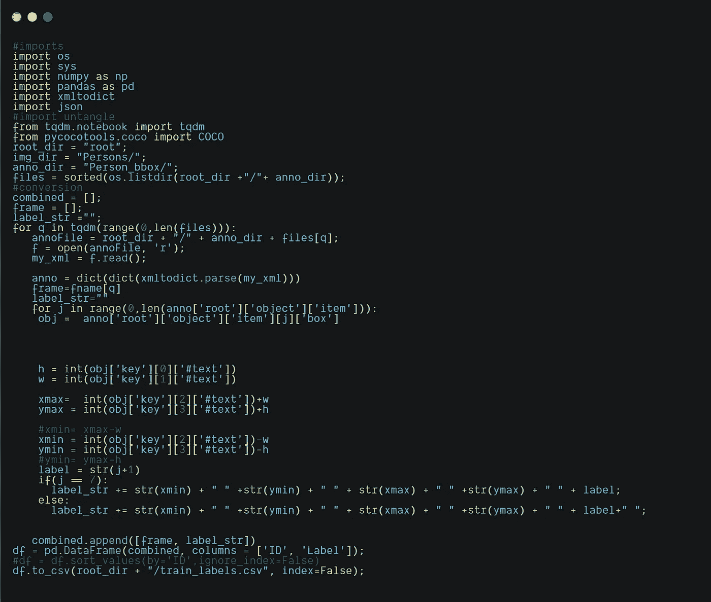

**将数据集从 VOC 转换为 MONK 类型**

因此生成的 CSV 文件如下所示。

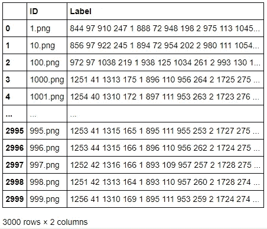

**train_labels.csv**

## 和尚到可可类型

MONK 类型数据集现在将被转换为 COCO 类型，用于对象检测。在 COCO 格式中，每个图像的边界框的注释细节保存在 JSON 文件中，而 classes.txt 文件包含图像中可能存在的所有对象类别。

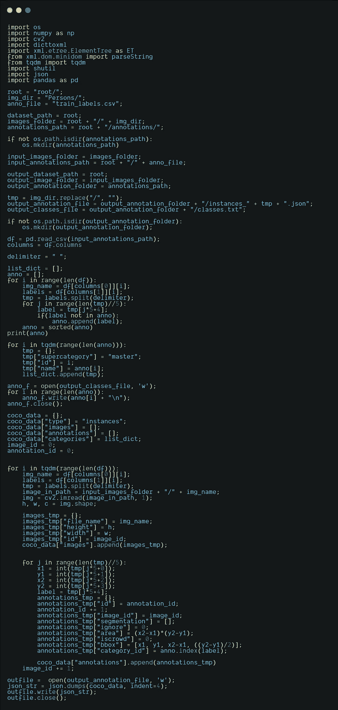

**将数据集从 MONK 类型转换为 COCO 类型**

## 培养

在将数据集转换为 COCO 格式后，我们可以继续使用 MMDetection 包装类训练检测器的最后一步。

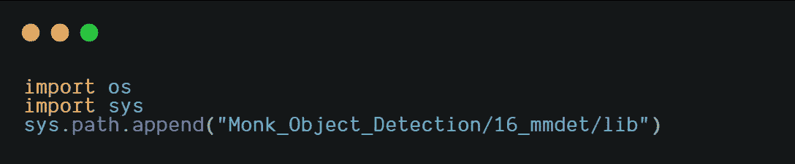

导入检测器模块。

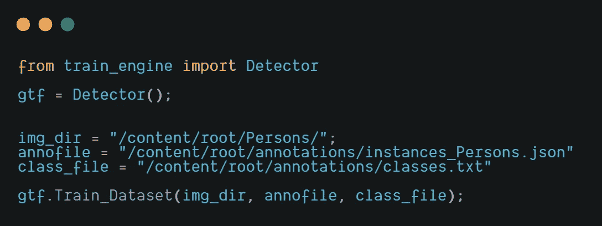

现在，我们将更新检测器的数据集参数、模型参数、超参数和训练参数。

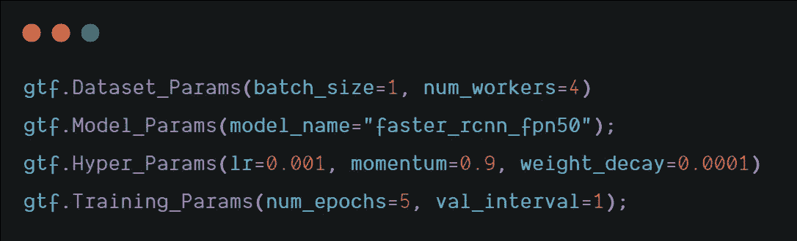

现在，我们都准备好开始训练我们的模型。

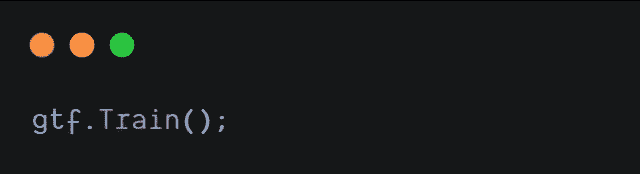

# 推理

一旦训练完成，我们可以在一些图像上运行推理，以验证我们的模型的准确性和效率。

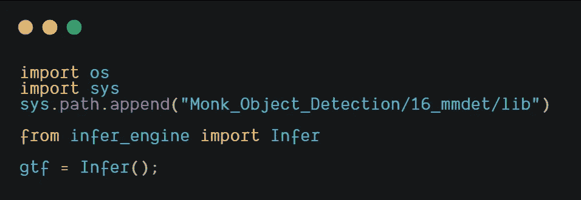

根据训练模型的最新时期，设置用于推理的模型参数。

现在，我们将推断一个图像。

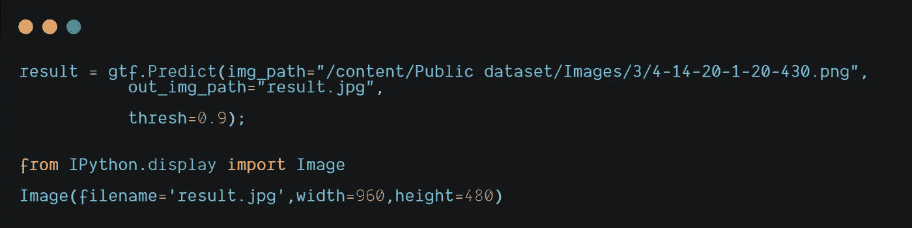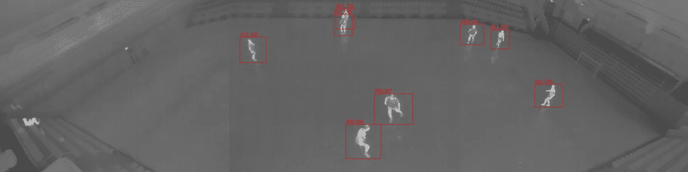

推断图像

# 结论

因此，我们看到了如何使用 MONK 的低代码语法轻松创建使用热图像数据集的足球运动员检测应用程序。这种类型的应用程序有助于实时跟踪人们，同时确保人们的隐私，因为我们使用的是热图像。热感相机能够在夜间甚至恶劣天气条件下观察，这使得它非常适合目标探测应用。该应用程序也可以被安全部队用于监视目的，更多此类应用程序请参考 MONK 对象检测库的[应用程序模型 Zoo](https://github.com/Tessellate-Imaging/Monk_Object_Detection/tree/master/application_model_zoo) 。

在 [Github](https://github.com/Tessellate-Imaging/Monk_Object_Detection/blob/master/application_model_zoo/Example%20-%20Thermal%20Soccer%20-%20(Player%20Detection).ipynb) 上有教程。