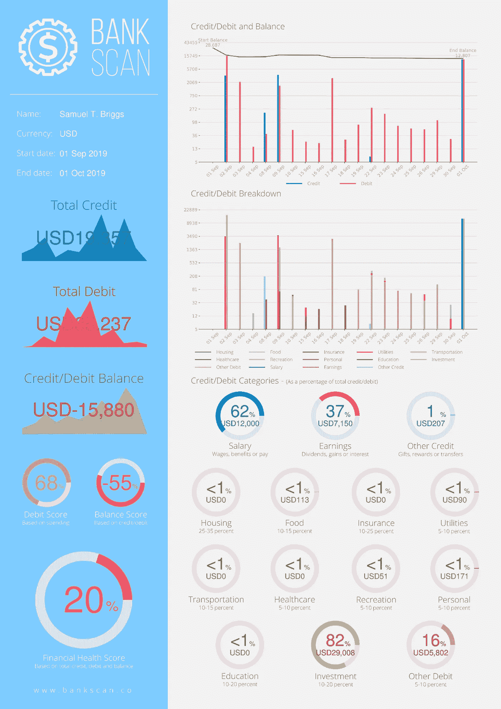
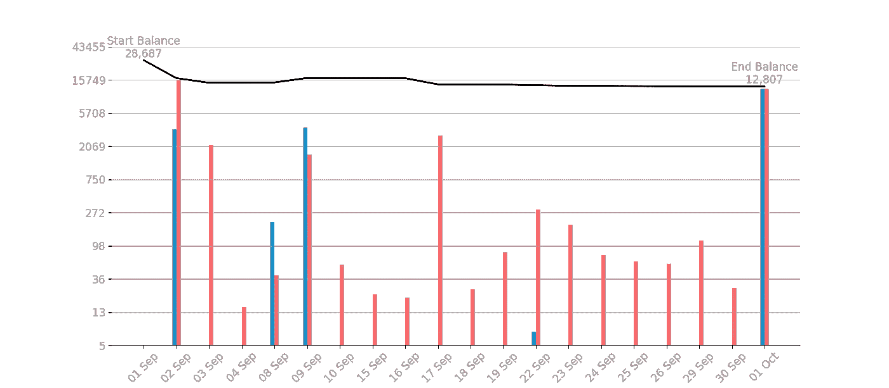
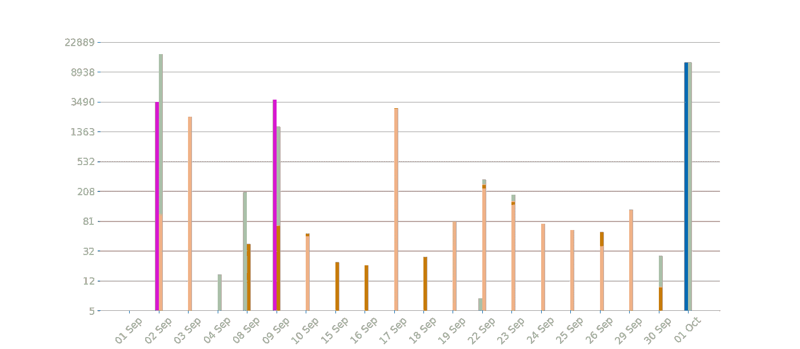
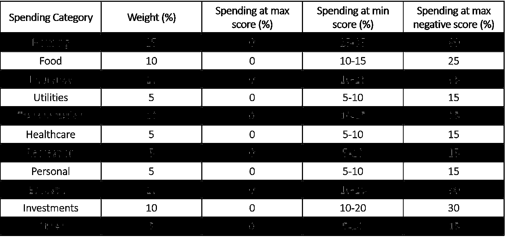
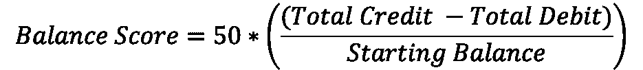
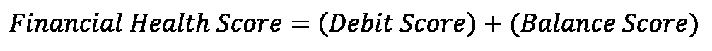

# 银行扫描:你的个人理财顾问

> 原文：<https://pub.towardsai.net/developing-an-ai-fintech-application-to-analyze-and-determine-the-financial-health-of-banking-6cb2a2f68007?source=collection_archive---------3----------------------->

## [人工智能](https://towardsai.net/p/category/artificial-intelligence)，[编程](https://towardsai.net/p/category/programming)

## 开发人工智能金融技术应用程序，以分析和确定银行客户的财务健康状况



*银行扫描生成的报告*

世界上有 20—30 亿人银行服务不足，其中包括 25%的美国家庭，提供智能银行分析的需求怎么强调都不为过。对于那些可能不熟悉“银行服务不足”这一术语的人来说，银行服务不足被定义为拥有银行账户但金融服务和见识有限的个人。尤其是对于我们许多千禧一代来说，缺乏像 Apple Pay 这样可靠的财务顾问，我们可能会以极快的速度吸走我们的财富。

表面上看，并不是每个人都可以访问他们的银行或智能手机提供的高级分析，然而，我们大多数人都会访问某种形式的银行对账单或类似的东西。虽然目前的分析服务可以直接与您的银行账户进行交互，从而客观地获取信息，但第三方服务需要逐字阅读并消化打印在您银行对账单上的信息。这是一个具有人工智能的金融科技应用程序可以为我们缺乏银行支持的客户提供接口并增加价值的地方。这确实是人工智能金融技术应用程序(以下简称“银行扫描”)将要做的事情。

# 方法学

银行扫描是一个应用程序，它将读取你的银行对账单，计算你有多少信用，借贷和余额，甚至可以破译你在哪些类别中花了钱。最后，它会给出一个“财务健康分数”，表明你的财务状况有多好。所有这些都是通过诸如自然语言处理、数据挖掘以及最突出的人工智能等技术的应用来完成的。也就是说，在这个程序中使用了 Python 中的几个包来从您的银行对账单中提取数据，否则这些数据将由人来执行。具体来说， [Tabula](https://tabula.technology/) 从你的银行对账单中提取表格数据，并将其输入 Python 中的 Pandas dataframe，而 [spaCy](https://spacy.io/) 负责自然语言处理，从文档中提取所有人类可读的文本，甚至使用人工智能来查找姓名和货币等项目。

一旦银行对账单的内容被插入到数据帧中，计算总的贷方、借方和余额就相当简单了，然而，确定贷方和借方交易属于哪一类就不那么简单了。为此，我们采用了一种词汇袋方法来分析每笔交易的描述，并解读该商品属于哪一类。例如，如果描述符包含以下任何词语，则它将被归类为食品支出:

```
food_words =[‘restau’,’burger’,’food’,’sandwich’,’steak’,’grocer’,’meal’,’mcdonald’,’lunch’,’dinner’,’breakfast’,’gourmet’,’wine’,’bar’,’drink’,’f&b’,’beverage’,’nutri’,’meat’,’eat’,’mexic’]
```

针对以下每一个消费类别，形成了一个包含数百个词干和词条的字典，以对每一笔交易进行分类。

*   房屋
*   食物
*   保险
*   公用事业
*   运输
*   卫生保健
*   娱乐
*   个人的
*   教育
*   投资
*   其他的

同样，银行对账单中的任何贷款都以同样的方式进行了分类，分类如下。

*   薪水
*   收益
*   其他的

# 形象化

账户的贷方/借方如下所示，其中蓝色和红色条分别表示贷方和借方。



*贷方、借方和余额与时间的关系图*

随后，图表被分解成上述每一个贷项/借项类别，每个类别都用颜色编码。



*借贷明细与时间关系图*

# 财务健康得分

根据检测到的支出不足或超支程度，对每个类别的支出进行线性评分。过度支出会受到惩罚，而支出不足不会受到惩罚，每种支出的门槛大致由金融专家对支出的建议决定，即你在住房上的支出不应超过总支出的 25-35%，在食品上的支出不应超过总支出的 10-15%。

最后，为了计算财务健康分数，最初我计算了一个“借方分数”,它综合了你在所有 11 个支出类别上的分数，并赋予这个分数 50%的权重。



然后，我计算了“余额分数”,它考虑了你的支出是盈余还是赤字，并根据你账户的期初余额进行了标准化，如下图所示。同样，平衡得分的权重也为 50%。



随后,“借方得分”和“余额得分”按如下方式组合，给你一个总体“财务健康得分”。



# 结论

虽然这是一个全面的应用程序，解决了银行服务不足的客户的需求，但它也不是详尽无遗的，确实是一项正在进行的工作。通过将其作为开源服务发布，并提供源代码访问，我希望通过合作和迭代的方式来增强该产品，并在不久的将来将其作为一个 web 应用程序。

## 使用 Streamlit 开发 Web 应用程序:

[](https://www.amazon.com/Web-Application-Development-Streamlit-Applications/dp/1484281101?&linkCode=ll1&tag=mkhorasani09-20&linkId=a0cb2bc17df598006fd9029c58792a6b&language=en_US&ref_=as_li_ss_tl) [## 使用 Streamlit 开发 Web 应用程序:开发和部署安全且可伸缩的 Web 应用程序…

### 使用 Streamlit 开发 Web 应用程序:使用……开发安全且可扩展的 Web 应用程序并将其部署到云中

www.amazon.com](https://www.amazon.com/Web-Application-Development-Streamlit-Applications/dp/1484281101?&linkCode=ll1&tag=mkhorasani09-20&linkId=a0cb2bc17df598006fd9029c58792a6b&language=en_US&ref_=as_li_ss_tl) 

## 使用 Python 实现数据可视化:

[](https://www.coursera.org/learn/python-for-data-visualization?irclickid=xgMQ4KWb%3AxyIWO7Uo7Vva0OcUkGQgW2aEwvr1c0&irgwc=1&utm_medium=partners&utm_source=impact&utm_campaign=3308031&utm_content=b2c) [## 用 Python 实现数据可视化

### “一图胜千言”。我们都熟悉这个表达。它尤其适用于试图…

www.coursera.org](https://www.coursera.org/learn/python-for-data-visualization?irclickid=xgMQ4KWb%3AxyIWO7Uo7Vva0OcUkGQgW2aEwvr1c0&irgwc=1&utm_medium=partners&utm_source=impact&utm_campaign=3308031&utm_content=b2c) 

## 面向所有人的 Python 专业化:

[](https://www.coursera.org/specializations/python?irclickid=xgMQ4KWb%3AxyIWO7Uo7Vva0OcUkGQgW16Ewvr1c0&irgwc=1&utm_medium=partners&utm_source=impact&utm_campaign=3308031&utm_content=b2c) [## 面向所有人的 Python

### 学习用 Python 编程和分析数据。开发收集、清理、分析和可视化数据的程序…

www.coursera.org](https://www.coursera.org/specializations/python?irclickid=xgMQ4KWb%3AxyIWO7Uo7Vva0OcUkGQgW16Ewvr1c0&irgwc=1&utm_medium=partners&utm_source=impact&utm_campaign=3308031&utm_content=b2c) 

## GitHub 资源库:

[](https://github.com/mkhorasani/Bank_Scan) [## mkhorasani/Bank_Scan

### 银行扫描是一个应用程序，将读取您的银行对账单，确定有多少信贷，借记和平衡你有…

github.com](https://github.com/mkhorasani/Bank_Scan) 

# 新到中？您可以在此订阅和解锁无限文章[。](https://khorasani.medium.com/membership)