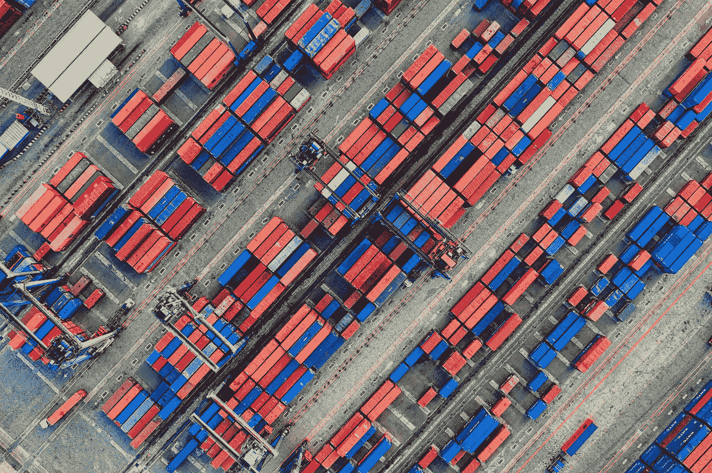
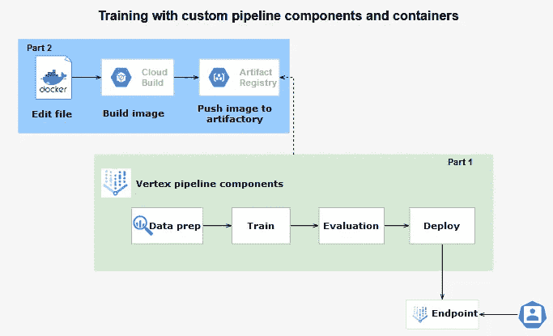
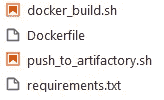
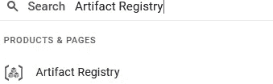
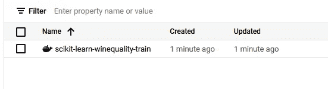

# 使用 Docker 图像为初学者定制顶点 AI 管道[第 2 部分]

> 原文：<https://pub.towardsai.net/devops-7f4c62f43eeb?source=collection_archive---------0----------------------->

## 机器学习

如何在 Vertex AI 上构建自定义 Docker 图像的分步教程



应用容器化。照片由来自 Pexels 的 Tom Fisk 拍摄。

## 动机

在我的[上一篇文章](https://medium.com/mlearning-ai/how-to-set-up-custom-vertex-ai-pipelines-step-by-step-467487f81cad)中，我已经讨论了如何使用 Kubeflow 组件在 Vertex AI 中实现自定义管道的过程。为了简单明了，我们讨论了一个常见的用例，叫做**[***预测葡萄酒质量***](https://www.analyticsvidhya.com/blog/2021/04/wine-quality-prediction-using-machine-learning/) **。****

**在这篇文章中，我将主要讨论 docker 图像的创建。目标是解释如何从头开始配置您的自定义 docker 映像。我们将继续创建 Docker 图像的步骤，然后是如何发布图像，以及如何在管道组件中使用图像。**

## **背景术语**

**在继续讨论之前，让我们澄清几个我们将要使用的术语。**

**那么 docker 是什么？Docker 仅仅是一个开放的容器化平台，它将你的应用程序及其所有依赖项打包在一个容器中。它简化了开发和运行应用程序的过程。它帮助您轻松地从一个环境到另一个环境控制和运行您的应用程序。**

**[**云构建**](https://cloud.google.com/build) 是谷歌官方云平台(GCP)映像构建器。它是一个完全托管的 CI/CD 平台，使您能够自动化您的构建。**

**[**工件注册表**](https://cloud.google.com/artifact-registry) 是一个完全自动化的包管理器，与大多数 CI/CD 工具集成。**

## **架构概述第 2 部分(重点关注蓝盒子)**

**Docker 映像的创建从 Docker 文件的创建开始。在 Dockerfile 准备好之后，我们使用 GCP 云构建来构建调用 docker file 的映像，并随后将其推送到工件注册表。一旦图像在工件注册表上可用，管道组件就可以使用该图像。**

****

**图片由作者提供。**

## **环境设置**

**要求:**

*   **顶点人工智能工作台**
*   **Python 3**
*   **Kubeflow 管道组件**
*   **码头工人**

**要安装 Kubeflow 组件、ai 平台并导入所需的库，请参考我在[上一篇文章](https://medium.com/mlearning-ai/how-to-set-up-custom-vertex-ai-pipelines-step-by-step-467487f81cad)中的环境设置部分。**

## **创建用于培训的 Docker 图像**

## **1.DockerFile 文件**

**在您的工作台上创建一个 *docker-train* 目录来保存 docker 文件和所有需要的脚本。最后，它应该是这样的:**

****

**每个 docker 映像创建都需要一个 docker 文件(一个文本文档),其中包含要构建的指令列表。事实上，在 docker 文件中，每条指令都在前一层之上创建一个新层。**

**重要的是要记住几个重要的说明:**

*   **FROM:定义容器使用的基本图像。**
*   **WORKDIR:指定容器的工作目录。**
*   **复制:将文件/目录从主机复制到 docker 容器。**
*   **RUN:允许在容器中执行命令。**

**DockerFile 总是以 FROM 命令开始，后面通常是一组指令。例如，在我们的例子中，WORKDIR 指定了我们的应用程序将要使用的目录。我们可以使用复制指令将文件从本地文件复制或不复制到 docker 目录。在我们的例子中，我们将本地 requirements.txt 文件复制到 app 目录。我们使用 RUN 指令开始安装 *requirements.txt* 文件中提到的 Python 库。**

**对于我们的例子，我们的 *requirements.txt* 包含 Pandas、NumPy 和 scikit-learn 库。**

```
pandas==1.3.3
numpy==1.19.5
scikit-learn==0.24.2
```

## **2.码头工人建造**

**一旦你的 docker 文件准备好了，我们需要构建它。检查本地 *docker-train* 目录中是否有*docker file 和*requirements . txt。脚本本身包含 GCP 环境的通用参数、映像的名称和构建映像的命令。要在本地生成 docker 映像，您需要通过键入*来构建它。工作台控制台中的/docker_build.sh* 。请注意，为了能够跟踪 GCP 上的图像，我建议用 Project_ID 和地区来标记图像。**

## **3.将图像推送到工件注册表**

**首先，我们需要在工件注册中心为我们的应用程序创建一个存储库。我们必须提到存储库的格式，在我们的例子中是 docker，以及区域。请注意， *gcloud* 需要在 Docker 注册表中注册。因此，我们使用*g cloud auth configure-docker*命令来确保 *gcloud* 拥有正确的凭证。最后，我们使用 *docker-push* 命令将本地 docker 映像推送到工件注册表中创建的存储库中。**

****提醒**使用您的 GCP 项目 id 更改所有文件中的项目 ID。**

**不要忘记去 GCP 工件注册处检查你的图像是否可用。转到 GCP 的搜索选项卡:**

****

**点击工件注册表:**

****

**如果是这样，我们可以使用它作为训练组件中的基础图像，如下所示:**

## **为部署创建 Docker 映像**

**我们可以简单地使用之前创建的 docker 图像。否则，我们必须重复上述步骤，在所有脚本中将图像的名称从 train 修改为 predict(即*IMAGE = sci kit-learn-wine quality-predict:latest)。最后，在 *requirements.txt 文件中添加新的库。*在工件注册中心上有了映像之后，在您的部署组件上添加 URL，并重新运行部署组件和管道。请提醒参考我用过的笔记本的[。](https://github.com/anabild/mlops/blob/main/notebook/ExampleWine.ipynb)***

**要测试实时预测，请列出所有部署的模型。回想一下，每个管道和模型都有时间戳。列出最后部署的模型的端点 id，并根据实例向量进行预测。默认预测支持实例矢量格式:[待预测特征列表]。**

## ****继续****

**我们已经学习了如何在我们的本地工作台顶点 AI 上创建 Docker 图像，以及如何在我们的自定义顶点 AI 管道中使用它。**

**所有资源都可以在 [my GitHub](https://github.com/anabild/mlops) 上找到。在我的下一篇文章中，我将向您展示如何使用 Flask 部署自定义预测服务。**

# **感谢您的阅读！**

**如果你想在收件箱里收到我未来的故事，别忘了订阅。**

***如果您喜欢阅读我的故事，并希望支持我成为一名作家，请考虑注册成为 Medium 会员，并获得数千篇数据工程和数据科学文章。***

**[](https://medium.com/@anna.bildea/membership) [## 用我的推荐链接加入媒体

### 作为一个媒体会员，你的会员费的一部分会给你阅读的作家，你可以完全接触到每一个故事…

medium.com](https://medium.com/@anna.bildea/membership) 

*在*[*LinkedIn*](https://www.linkedin.com/in/ana-bildea-phd-2339b728/)*和* [Twitter](https://twitter.com/AnaBildea) 上找我！**