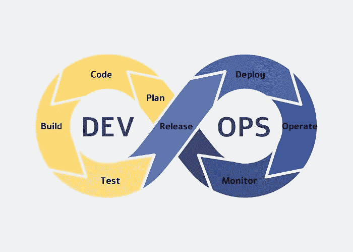
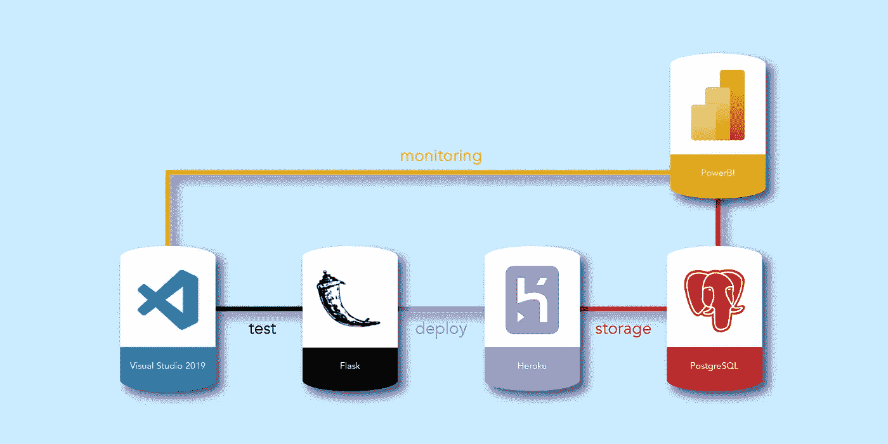
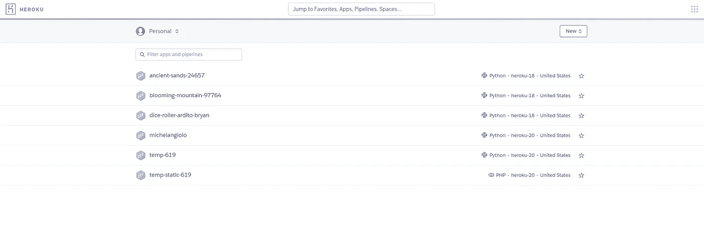
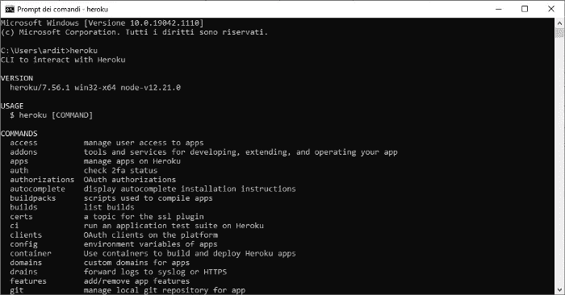
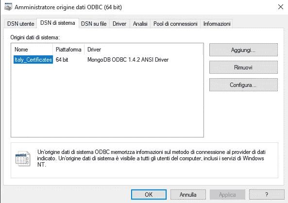
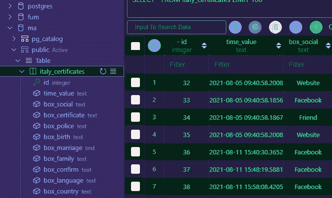

# DevOps:为 Web 应用程序创建管道

> 原文：<https://pub.towardsai.net/devops-creating-a-pipeline-for-a-web-app-830b6d2d4273?source=collection_archive---------2----------------------->

## [DevOps](https://towardsai.net/p/category/devops)

## 如何连接多个软件一起交互，形成一个完整的 DevOps 管道

DevOps 是一个用于软件开发的框架。因为软件是一个通用术语，包含几种类型的应用程序，所以 DevOps 仍然是通用的。Web 应用程序本身可以使用 DevOps 过程作为正确开发的指南。

DevOps 框架可以分为两个主要阶段:

*   发展阶段
*   优化阶段

当项目背后的复杂程度变得如此之大，以至于开始难以管理时，就需要这样一个框架。为了完全控制开发应用程序的最佳方式，DevOps 提出了一套实践，这些实践集中在效率的最大化和应用程序随时间的持续优化上，甚至在它已经在平台上构建和部署之前。

DevOps 框架

## 甚至在开始之前

当我们计划如何构建应用程序的架构时，我们应该意识到管道中每个软件背后的现有协同作用。在我进入开发的第一年之后，我才开始熟悉这个过程。大约 9 个月前，在构建我的第一个 web 应用程序时，我做出了最糟糕的软件和编码选择，但这些选择是值得的，因为它们让我明白了我所犯的[错误，以及未来避免这些错误的最佳方法是什么](/8-months-after-building-my-first-web-app-why-i-regret-using-visual-studio-2019-9392071d982a)。

事实上，我不仅使用过于复杂的 ide 创建了一个简单的 Web 应用程序，而且在数据存储方面也做了一个糟糕的选择，花了我几天时间才解决。事实上，我选择将我的数据保存到一个 MongoDB NoSQL 数据库中，不幸的是，它与 PowerBI 不兼容(用于通过 ODBC 建立连接的工具除了崩溃什么也不做！).

## 从建筑开始

为了遵循 DevOps 过程，我们需要将整个过程分成两个独立的阶段，每个阶段由不同的软件组成。对这个过程至关重要的是一个软件和下一个软件之间的互联性。如果这种连接不复存在，管道就被破坏了，而且不容易恢复，除非我们确切地知道如何干预。

管道的架构

# 发展阶段

开发阶段的第一步是选择合适的工具:我们实际上是在构建应用程序的架构之前就已经在构建了。当然，万一有什么变化，我们可以进行改编。这是一个非常好的实践，它将允许任何处理相同代码的人更好地对我们的项目有一个低分辨率的理解。

## Visual Studio 2019 与 Visual Studio 代码

如果你没有经验，这两者之间的选择总是很难。Visual Studio 2019 背后的美妙之处在于，它是一个端到端的工具，能够在团队中构建可扩展的项目。它被整个企业所使用，是市场上最好的 IDE 之一。从编码的角度来看，它提供了虚拟环境的管理工具，这是开发每个应用程序所必需的，它还提供了一个高级的 git 跟踪系统。作为微软的产品，它也与 Azure 云高度集成，以保证最有效的管道。

那么，如果这个软件像我刚才描述的那样好，为什么我还要考虑其他选择呢？使用 VS2019 有一个问题:它不适合非常小的项目。软件本身必须添加许多用于测试的额外组件，如果您希望创建一个自定义管道，而软件甚至不应该一起工作，这将是一场噩梦。这不是不可能的，但你需要对 VS2019 输出的代码进行的编辑量比其他选择要多得多。

## 烧瓶框架

对于这个项目，我一直使用 Flask，这是一个非常简单的 python 框架，用于管理 Web 应用程序的后端。每次部署代码时，我都必须做额外的工作，这一点也不好玩。我选择的最佳选择是 Visual Studio 代码。这个 IDE 比前面提到的选择要简单得多，考虑到我第一个项目的规模，它应该是理想的。后来我做出了改变，明白了为什么这是一个伟大的决定。

烧瓶框架标志

VS 代码迫使你管理自己的虚拟环境，只有当你知道它们是什么以及如何使用它们时，虚拟环境才是持久的。另一方面，您可以访问由 Microsoft 社区创建的几个附加组件，这些附加组件允许您以多种方式管理其他几个阶段。

例如，我下载了一个插件，每当我想提供一个接口时，它允许我查看我的 PostgreSQL 数据库。这比登录到另一个平台(即使是基于网络的平台)更容易管理，每次都要手动检查数据库，如果你可以从一个界面控制一切的话。

## 赫罗库

Heroku 是市场上最好的平台即服务 PAAS 之一。Heroku 的美妙之处在于，它让你可以免费做这么多事情，而且不限于测试，这对任何想尝试部署已经可以使用的应用程序的人来说都是理想的。这是让 Visual Studio 2019 成为烂配的选择。事实上，对于每一次部署，我都必须手动从代码中删除 VS2019 强制的一些引用，这种手动干预每次都在破坏管道:将不同阶段连接在一起的过程应该自动化。

Heroku 网络界面

VS 代码还允许我直接从终端部署应用程序。通过使用 Heroku CLI，我可以将存储库的内容发送到应用程序所在的个人空间。

Heroku CLI 截图

## 数据库ˌ资料库

数据库的选择是一场噩梦。最初，我甚至不知道如何连接数据库，所以我决定将所有东西都存储到一个 Google Sheet 帐户上。这比预期的问题要大得多，因为这个“解决方案”要求我创建一个 Google 云平台帐户，以获得一个用于连接我的 Google Drive 的 API，然后使用 gspread，一个为 Google Sheets API 提供简化接口的小部件，来连接文件并添加新列。不仅如此，这种存储方法后来还会与我想用来为应用程序创建监控管道的其他工具不兼容。

你第一次接触数据库可能会是一场噩梦，但是一旦处理好了，就正常了。作为一名 python 程序员，有两个主要障碍使得与数据库管理系统的交互很困难:数据以 SQL 格式存储，从 python 执行 SQL 查询很困难，第二个是理解数据库是如何工作的。

在 Google Sheets 之后，我决定使用 NoSQL，特别是 MongoDB，如果你使用 python 或 javascript，这是小菜一碟。然后我意识到有第二个问题:我无法将我的 MongoDB 与市场上最好的可视化软件 PowerBI 连接起来:为什么？ODBC 崩溃的驱动程序和我无法执行连接。

ODBC 崩溃接口

因为第三次通常会成功，所以我决定使用 Oracle Cloud Infrastructure 服务器来托管我的数据库。具体来说，我使用了 PostgreSQL 数据库，连接工作得很好。

在 Visual Studio 代码中看到的数据库屏幕截图

## 以前的数据

我要解决的另一个问题是将我在 Google Sheets 中收集的所有数据迁移到这个存储器中。由于应用程序的基本设置导致数据收集方式不同，我不得不使用机器学习来清理数据集，并将其迁移到 Oracle 云基础架构上托管的数据库。

## PowerBI

作为完成管道的最后一个软件选择，我决定使用 PowerBI，这是市场上最好的可视化软件之一。我已经学习了几个星期的 PowerBi，我不想仅仅为了这个项目而转向 Tableau，这就是为什么我在选择正确的数据库方面如此固执的原因。管道现在已经完成，由于可视化软件，我不仅可以监控应用程序的运行情况，还可以监控我对应用程序所做的任何更改，因为管道完全连接，所有其他工具都将接受这些更改，而无需任何手动干预。

PowerBI 徽标