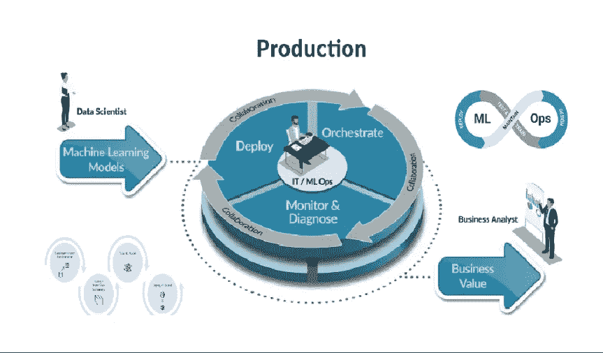

# MLOps:基本标准原则

> 原文：<https://pub.towardsai.net/devops-e2b28176724d?source=collection_archive---------1----------------------->

## [DevOps](https://towardsai.net/p/category/devops)

## 自动化开发阶段的机器学习世界

图片[来源](https://medium.com/analytics-vidhya/mlops-the-epoch-of-productionizing-ml-models-4eec06d93623)

MLOps 是一种文化，具有一套在机器学习世界中定义的原则和指南，以无缝集成/自动化开发阶段和运营阶段。就像一个模型一旦被创建，它就可以被部署。

基本上，通过 MLOps，我们倾向于打破数据工程师、数据科学家、运营团队的孤岛，在单一生态系统上工作。

在 MLOps 中，机器学习、开发和操作这三个阶段是相互联系、相互影响的。

我们如何整合这些阶段，为它定义的原则是什么，它需要什么工具是一个稍后讨论的话题？

简单来说，只要看到机器学习项目的要求和传统方法面临的挑战，我们就可以找到克服它的解决方案，这就是 MLOps 的出现，这并不是任何特定的组织或个人发明的，这是一个渐进的过程。

随着公司开始遇到 ML 项目中的挑战，解决方案开始成为 MLOps 的标准。

现在让我们来讨论一下 ML 项目的所有挑战的所有解决方案。

*   **过渡摩擦:**

为了减少数据科学家笔记本和 ML 工程师代码之间的摩擦，如果我们设置一个协议，使用 jupyter 笔记本模板来定义常见功能，例如连接到数据库和获取数据或在 ML 引擎上运行作业，以便最大限度地减少研究想法和测试之间的差距，会怎么样？这个想法是创建一个双方都能理解的不可知论代码。

除此之外，数据科学家还为 ML 工程师准备文档文件，其中列出了所有的依赖项和其他操作项。ML 工程师将该文件作为参考，并在构建代码时包含所有列出的包和库。

*   **版本控制系统:**

那么，如果我们对代码、数据、环境和工件的版本控制系统进行标准化，并有适当的版本控制，那么实验跟踪将变得非常容易。任何人都可以看到特定的模型版本是用什么版本的数据运行的，使用了什么算法，以及它的准确性如何。

您可以轻松地比较其他模型和数据运行的各种排列和组合的结果。

最重要的是，这将解决再现性的问题。在任何时候，如果有人要求您重新部署模型，您都应该为它保存所有的元数据。我们所需要做的就是选择想要的代码和数据集版本，然后模型就可以被复制了。

当所有其他东西都以版本的形式存在于源代码控制中时，那么即使关键贡献者离开了，新加入的人也可以很容易地在很短的时间内出现在同一页面上。

 [## 面向数据科学的 MLOps 简介

### 持续集成、持续开发和持续测试的一部分

pub.towardsai.net](/introduction-to-mlops-for-data-science-e2ca5a759f68) 

*   **性能:**

性能方面，如果我们开始利用分布式计算和容器化会怎么样。容器化正在成为解决部署 ML 模型时令人头疼的依赖问题的标准解决方案。

Docker engine 等容器技术是虚拟机(VM)的轻量级替代方案，允许将应用程序部署在独立、自包含的环境中，这些环境将完全符合模型的要求。在容器化中，模型的计算资源可以使用多个容器进行弹性伸缩，对于编排容器，我们有一个众所周知的技术 Kubernetes。

*   **自动化:**

下一个原则是自动化，如果我们可以在整个过程中诱导自动化。与其每次都创建一个模型，然后将模型投入生产，不如我们通过包含创建模型所需的所有阶段来为它构建一个 CI/CD 管道，然后将管道本身投入生产。

通过这样做，我们将自动执行完整的 ML 工作流程步骤，无需任何人工干预。在早期，在每个迭代中，所有的步骤都是手工转换的。手动接收、准备、验证、扩展、培训数据，然后手动部署和监控数据。

团队所做的全部工作是创建一个模型，并将该模型投入生产，但另一方面，MLOps 是以管道为中心的，您将一次性工作投入到为所有这些步骤创建管道中，以便每当您想要训练和部署模型时，我们只需进行一些点击，或者如果使用了计划或一些触发器，甚至什么都不用做。

*   **监控:**

在该标准中，我们开始使用强大的创新监控工具(如 Prometheus 和 Grafana)来监控数据、功能、准确性和其他重要事项。

*   **持续训练:**

最后一个原则是持续训练，我们基于一些触发器或定期间隔，使用部署的管道持续地重新训练我们的模型。

**结论:**

本文给出了 mlop 的核心思想，这些是我们在 mlop 中必须遵循的一些基本标准和原则。

我希望你喜欢这篇文章。通过我的 [LinkedIn](https://www.linkedin.com/in/data-scientist-95040a1ab/) 和 [twitter](https://twitter.com/amitprius) 联系我。

# 推荐文章

1.[8 Python 的主动学习见解收集模块](/8-active-learning-insights-of-python-collection-module-6c9e0cc16f6b?source=friends_link&sk=4a5c9f9ad552005636ae720a658281b1)
2。 [NumPy:图像上的线性代数](/numpy-linear-algebra-on-images-ed3180978cdb?source=friends_link&sk=d9afa4a1206971f9b1f64862f6291ac0)3。[Python 中的异常处理概念](/exception-handling-concepts-in-python-4d5116decac3?source=friends_link&sk=a0ed49d9fdeaa67925eac34ecb55ea30)
4。[熊猫:处理分类数据](/pandas-dealing-with-categorical-data-7547305582ff?source=friends_link&sk=11c6809f6623dd4f6dd74d43727297cf)
5。[超参数:机器学习中的 RandomSeachCV 和 GridSearchCV](/hyper-parameters-randomseachcv-and-gridsearchcv-in-machine-learning-b7d091cf56f4?source=friends_link&sk=cab337083fb09601114a6e466ec59689)
6。[用 Python](https://medium.com/towards-artificial-intelligence/fully-explained-linear-regression-with-python-fe2b313f32f3?source=friends_link&sk=53c91a2a51347ec2d93f8222c0e06402)
7 全面讲解了线性回归。[用 Python](https://medium.com/towards-artificial-intelligence/fully-explained-logistic-regression-with-python-f4a16413ddcd?source=friends_link&sk=528181f15a44e48ea38fdd9579241a78)
充分解释了 Logistic 回归 8。[数据分发使用 Numpy 与 Python](/data-distribution-using-numpy-with-python-3b64aae6f9d6?source=friends_link&sk=809e75802cbd25ddceb5f0f6496c9803)
9。[机器学习中的决策树 vs 随机森林](/decision-trees-vs-random-forests-in-machine-learning-be56c093b0f?source=friends_link&sk=91377248a43b62fe7aeb89a69e590860)
10。[用 Python 实现数据预处理的标准化](/standardization-in-data-preprocessing-with-python-96ae89d2f658?source=friends_link&sk=f348435582e8fbb47407e9b359787e41)