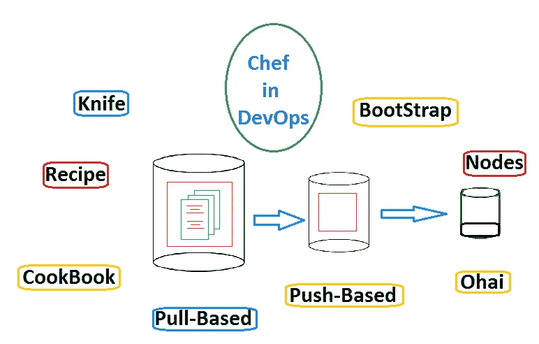
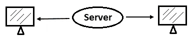
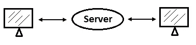
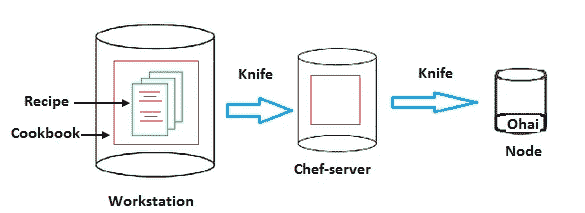
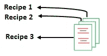
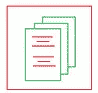
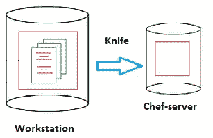
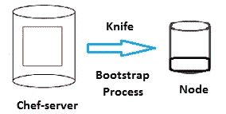
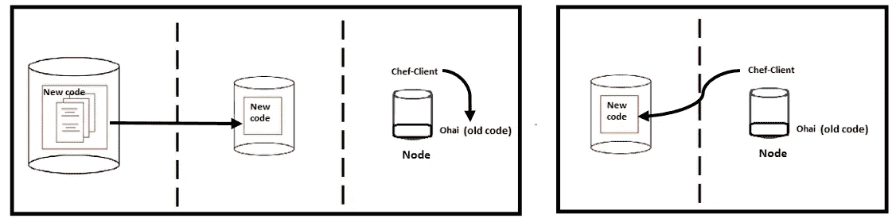

# DevOps:部署中的 Chef 是什么？

> 原文：<https://pub.towardsai.net/devops-fc63a1fb17c6?source=collection_archive---------4----------------------->

## [DevOps](https://towardsai.net/p/category/devops)

DevOps 操作中的配置管理工具



在本文中，我们将研究 DevOps 部署过程中的配置管理工具(CMT)。

> ***需要 CMT 在作战吗？***

假设，我们有一个 IT 小公司，并想开始一项业务，我们需要服务器来运作。一个人可以处理 5-10 台服务器，但是一个拥有 500 或 1000 台服务器的大公司无法处理一个人或一个团队。

因此，该公司雇佣了一名系统管理员，负责更新、保护、安装和管理服务器等所有操作。想象一下，一周后，新项目要求将 250 台服务器从 Windows 升级到 Linux。对于几个人的团队来说，这是一项令人兴奋的任务。

配置管理工具自动执行管理所有更新和安装的任务。

> ***配置管理工具的类型***

```
1\. Push
2\. Pull 
```

## **推送基础**

在基于推的类型中，我们编写代码按照顺序完成所有安装，并将代码交给服务器。然后所有的包或文件将被并行安装在所有的机器上。这种类型也称为基础设施代码(IAC)。

基于推送的一个例子是 Ansible 和 Salt Stack。



## 基于拉动

在基于拉的类型中，服务器获取代码，然后系统需要检查要更新的版本，如果有什么要更新的，那么它将拉安装。

拉式的例子是厨师和木偶



在这里，CHEF 介绍了自动执行基于拉动的任务。

> ***厨师是什么？***

*   Chef 是用 Erlang 和 Ruby 编写的配置工具。
*   它由亚当·雅各布斯于 2009 年创立，名字叫“提线木偶”，后来被命名为“厨师”。
*   2019 年，该公司的产品在 Apache 2.0 许可下开源。
*   在 Chef 的帮助下，代码变成了基础设施，这将是可版本化的、可重复的和可测试的。

> ***配置管理工具的优势***

*   完全自动化
*   增加正常运行时间
*   提高性能
*   确保合规
*   防止错误并降低成本

厨师的过程

chef 的处理器架构有三个主要组件，如下所示:

1.  工作站:它就像一个空间，我们保存我们创建的代码，节点通过它更新自己，代码在这里被称为代码基础结构。
2.  Chef-server:它用于保存食谱，供 chef-client 更新机器。
3.  节点:这些是我们更新或安装操作系统、软件包等的机器或服务器。我们称之为节点是因为我们在 chef-server 中使用了服务器术语。



相关术语:

*   Recipe:这是一个代码表，在其上不同的基础设施作为代码写在工作站中，它被命名为 recipe。



*   食谱:作为代码的基础设施的不同集合，即食谱。



*   刀:把食谱上传到厨师服务器的工具叫做刀。



*   Bootstrap:chef-server 连接到节点的过程称为 bootstrap。



*   大厨超市:不同流程都有现成的代码。
*   chef 也将安装在工作站和节点上。
*   节点:节点由 Ohai 和 chef-client 组成。
*   Ohai:它是一种数据库，存储所有节点的信息和当前配置。
*   Chef-client:它用于通过基于拉的机制更新机器。chef-client 从 ohai 获取机器的更新，然后它将检查 chef-server 是否有任何更新。

假设如果在 cookbook 中有任何新代码被更新并上传到 chef-server，那么 chef-client 会定期搜索并获取机器信息，然后将匹配上传到 chef-server 中的信息，然后 chef-client 会看到新代码并更新机器。



幂等性:chef-client 将只获取新代码，而不是食谱的全部代码，这种不重复的过程称为幂等性。

我希望你喜欢这篇文章。通过我的 [LinkedIn](https://www.linkedin.com/in/data-scientist-95040a1ab/) 和 [twitter](https://twitter.com/amitprius) 联系我。

# 推荐文章

1.[8 Python 的主动学习见解收集模块](/8-active-learning-insights-of-python-collection-module-6c9e0cc16f6b)
2。 [NumPy:图像上的线性代数](/numpy-linear-algebra-on-images-ed3180978cdb?source=friends_link&sk=d9afa4a1206971f9b1f64862f6291ac0)3。[Python 中的异常处理概念](/exception-handling-concepts-in-python-4d5116decac3?source=friends_link&sk=a0ed49d9fdeaa67925eac34ecb55ea30)
4。[熊猫:处理分类数据](/pandas-dealing-with-categorical-data-7547305582ff?source=friends_link&sk=11c6809f6623dd4f6dd74d43727297cf)
5。[超参数:机器学习中的 RandomSeachCV 和 GridSearchCV](/hyper-parameters-randomseachcv-and-gridsearchcv-in-machine-learning-b7d091cf56f4?source=friends_link&sk=cab337083fb09601114a6e466ec59689)
6。[用 Python](https://medium.com/towards-artificial-intelligence/fully-explained-linear-regression-with-python-fe2b313f32f3?source=friends_link&sk=53c91a2a51347ec2d93f8222c0e06402)
7 全面讲解了线性回归。[用 Python](https://medium.com/towards-artificial-intelligence/fully-explained-logistic-regression-with-python-f4a16413ddcd?source=friends_link&sk=528181f15a44e48ea38fdd9579241a78)
充分解释了 Logistic 回归 8。[数据分发使用 Numpy 与 Python](/data-distribution-using-numpy-with-python-3b64aae6f9d6?source=friends_link&sk=809e75802cbd25ddceb5f0f6496c9803)
9。[机器学习中的决策树 vs 随机森林](/decision-trees-vs-random-forests-in-machine-learning-be56c093b0f?source=friends_link&sk=91377248a43b62fe7aeb89a69e590860)
10。[用 Python 实现数据预处理的标准化](/standardization-in-data-preprocessing-with-python-96ae89d2f658?source=friends_link&sk=f348435582e8fbb47407e9b359787e41)