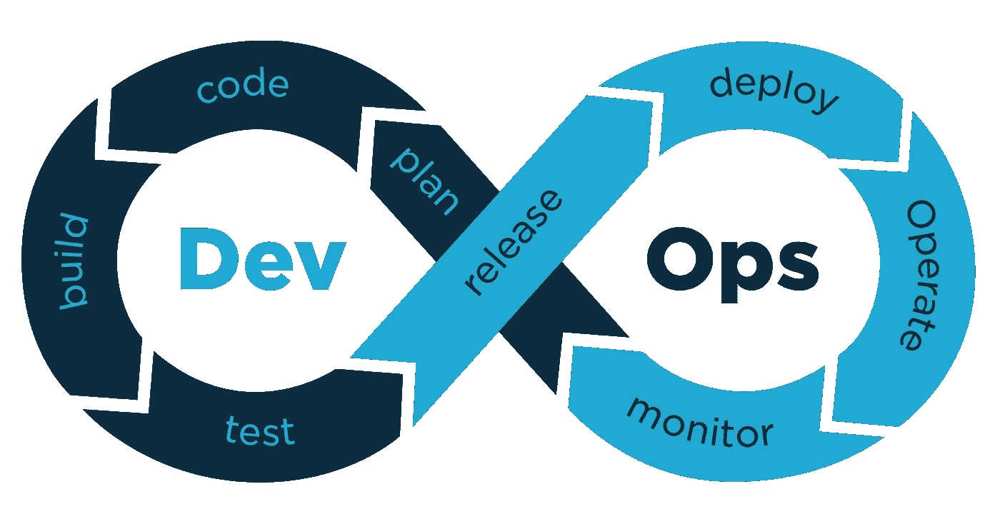
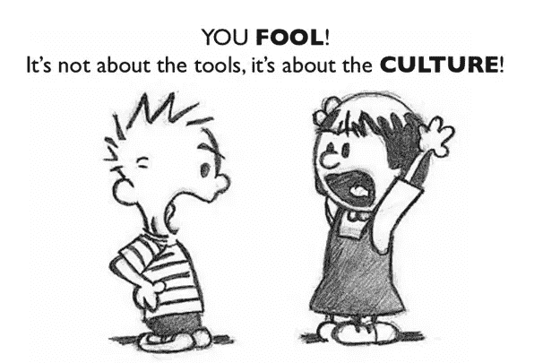
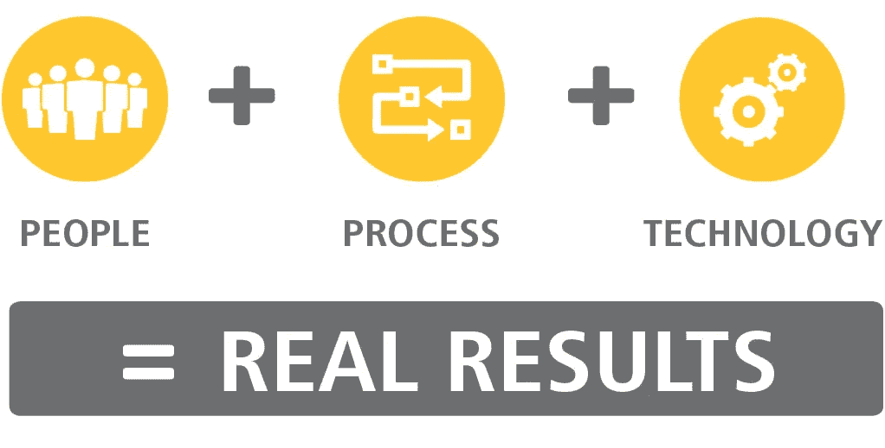

# DevOps 路线图—如何开始！！

> 原文：<https://pub.towardsai.net/devops-roadmap-how-to-get-started-39ce861e15c0?source=collection_archive---------1----------------------->

## [DevOps](https://towardsai.net/p/category/devops)

## 在 DevOps 开始职业生涯需要知道的关键概念

使用 Canva 设计

> 如果疼，就多做几次！

当我第一次开始学习 DevOps 时，我真的对它一无所知，很多问题一直在我脑海中盘旋。DevOps 是一个域吗？还是直接软件？我应该从哪里开始？我在努力实现什么？使用 DevOps 可以解决哪些问题？我的起步路线图是什么？学 it 的前提条件是什么？

从准备一道菜到端给顾客

这是一个很大的困惑，所以我在这里来消除你的困惑，因为我的困惑不再是困惑了。

**D** ev **O** ps 是开发团队(需要速度)和运营团队(需要稳定性)之间的协作。

想象你经营一家餐馆。你想为你的顾客提供最好的服务，一个好的路线图应该是这样的——你要求厨师/厨师设计新的和有创意的食谱来吸引顾客，然后厨师将收集他的要求并制作几道菜，其中最好的将在以后提供给顾客。不止于此！你想从你的顾客那里得到反馈，如果反馈是负面的，你就要对现有的食谱进行必要的修改，并与旧的食谱进行比较。如果它又变好了，你总会想通过添加一些额外的成分和口味，用新的食谱给你的顾客带来惊喜。

DevOps 生命周期

使用上面的类比，让我们开始了解 DevOps。作为一名开发人员，您首先为一个有趣的应用程序设计一个新的蓝图或计划，收集需求，并开发和构建代码。然后根据各种测试用例对应用程序进行测试。如果构建通过了测试阶段，我们发布应用程序，部署它。再说一次，这还没有结束！我们需要通过持续监控来处理事件。这是一个循环，让开发和运营团队一起工作，构建快速稳定的应用程序。

DevOps 是运营和开发工程师在从设计、开发流程到生产支持的整个服务生命周期中通力合作的实践。

> DevOps 不是一个单一的工具，它是一种实践或一套支持协作的原则和价值观。

这是我意识到的

## DevOps 核心价值— CA(L)MS

*   **文化—** 开发团队和运营团队之间保持相互理解。
*   **自动化—** 关于自动化，维护基础设施有时会导致问题，像网飞这样的公司部署他们的代码，维护系统或服务器&快速更新新功能。这个过程是自动化的，以获得预期的结果，减少人为错误，等等。
*   **精益—** 小批量工作、进度限制、反馈循环、可视化归入精益管理。
*   **测量—** 一旦完成，软件部署的成功相对容易测量。然而，作为预测模型的一部分，尝试测量未来的部署当然更具挑战性。
*   **分享—** 分享协作中的想法和问题。这也是 DevOps 的核心。

DevOps 核心价值观

在 DevOps 中，我们更喜欢人而不是过程，而不是工具或技术。这三个原则包括——系统思维(关注我们价值链中整个管道的整体结果)、放大反馈回路、持续实验和学习。

## DevOps 阶段

*   **版本控制—** 大量的开发人员和测试人员操作一个项目，应该有一个平台供他们协作，共享代码，跟踪文件变更。版本控制系统将为我们提供这些特性。 **工具—** Git、BitBucket、Mercurial、Bazaar、SVN 等。
*   **持续集成—** 一种开发实践，开发人员将他们的代码集成到一个共享目录或存储库中，即版本控制系统。它包括从代码提交到将代码构建成可执行格式、进行单元测试、根据自动化测试用例运行应用程序的步骤。如果测试失败，开发人员会得到构建失败的通知，以便他们可以继续工作。
    **工具—** 詹金斯、TeamCity、Bamboo 等。
*   **持续交付—** 有时候我们不想直接部署到生产中，会存储不同版本的软件或工件，这样我们就可以部署我们想要的任何版本的软件。这也使得回滚到有错误的更新版本的先前版本变得容易。一旦构建成功，可执行文件或工件就存储在 Artifactory、Google 的 docker 图像容器注册表等工具的存储库中。
*   **持续部署—** 这是一种在接受测试后自动将应用程序发布到生产环境的策略，即从代码提交到生产环境。
*   **配置管理—** 对于开发人员来说，安装设置服务器所需的所有要求是一项艰巨的任务，他们没有时间参与应用程序。此外，依赖性问题可能是一个大问题。我们在运行什么服务？这些服务处于什么状态？他们是如何达到现在的状态的？变化的目的是什么？*配置管理*帮助我们得到这些答案。
    这是一个将计算机系统、服务器和软件保持在期望的一致状态的过程。开始免费自动配置环境。
    **工具:**厨师、木偶、Ansible 等。

DevOps 充满了挑战和大量的学习，人们经常使用术语“DevOps 困境”。它有很多过程、原则和工具，使得学习 **DevOps** 有点挑战性。但是，通过适当的时间和一步一步的学习，使你对术语的理解更加深刻，你可以找到一个简单的方法来掌握 DevOps。在制作项目时应用一些概念可能会有帮助！

在本文中，我介绍了 DevOps 的一些基本概念。我将很快带着更多关于 DevOps 的先进概念与您见面，并亲自体验。在那之前，注意安全，呆在家里。

如果想联系，**在**[**LinkedIn**](https://www.linkedin.com/in/ritheesh-baradwaj-yellenki-8a6988173/)**上联系我。**