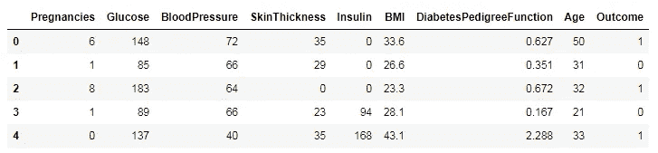
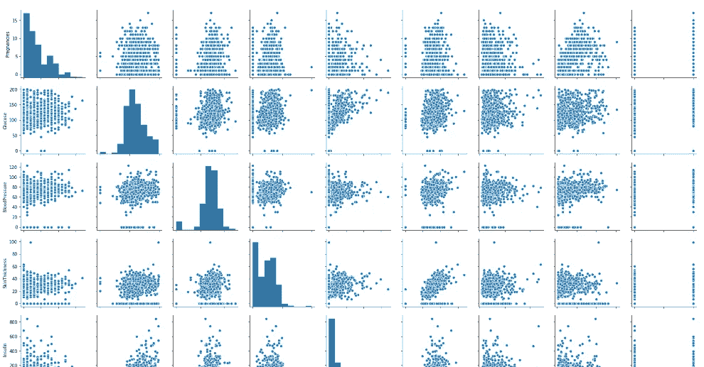
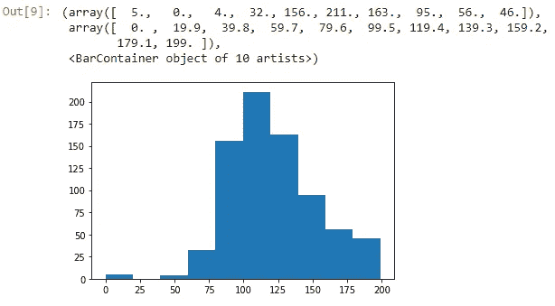
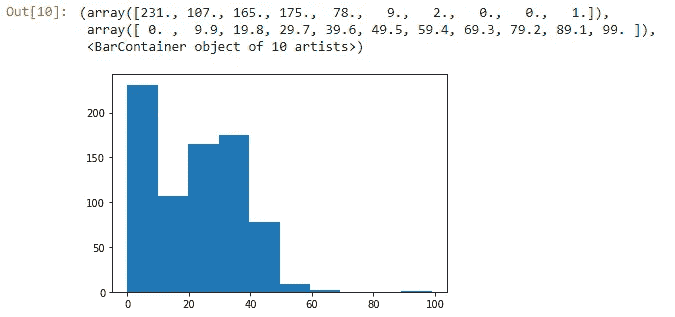
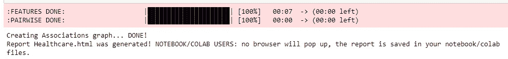
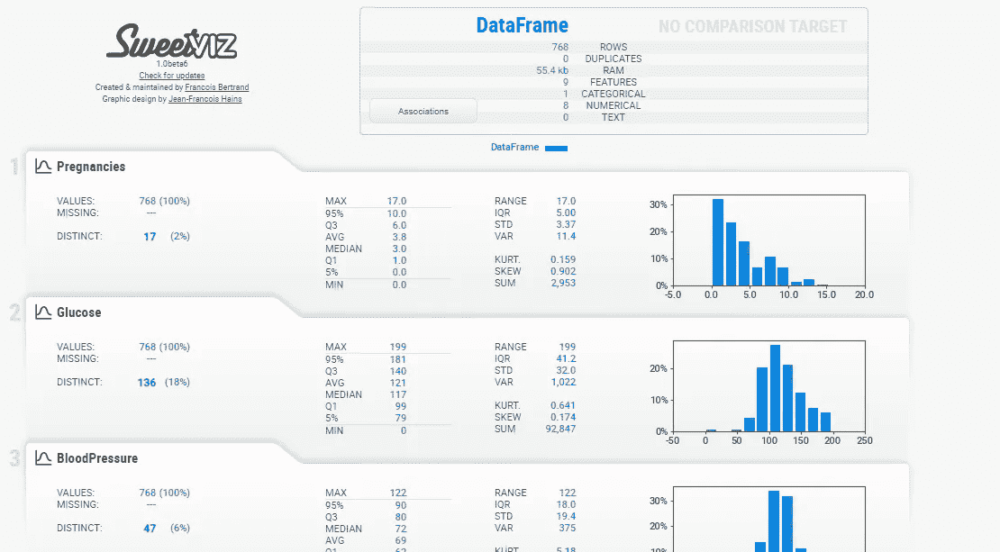
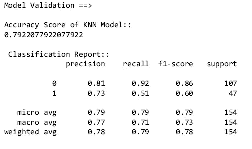
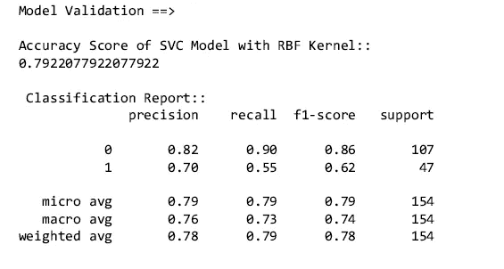
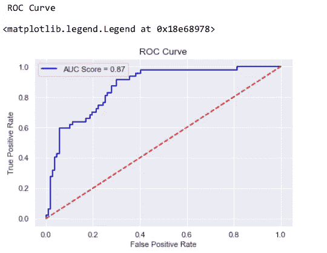

# 糖尿病分类模型有 SVM 模型和 KNN 模型

> 原文：<https://pub.towardsai.net/diabetes-classification-model-with-svm-and-knn-models-3e8570747ef5?source=collection_archive---------0----------------------->

## [深度学习](https://towardsai.net/p/category/machine-learning/deep-learning)

## 预测糖尿病的二元分类


由[在](https://unsplash.com/@hush52?utm_source=medium&utm_medium=referral) [Unsplash](https://unsplash.com?utm_source=medium&utm_medium=referral) 上拍摄的

这篇文章是关于在给定数据的基础上发现一个人是否有糖尿病的预测。我们将使用两种机器学习方法来找到预测的准确性。

## 涵盖的主题:

*   关于数据的介绍
*   使用 matplotlib 和 sweetviz 进行探索性数据分析(EDA)
*   用 SVM 和 KNN 分类器进行预测

## 关于数据的介绍

数据包含 8 个自变量和 1 个因变量。启发制作预测模型，以在更短的时间内减轻工作，并对进一步的药物治疗做出快速预测。

自变量有:**妊娠、葡萄糖、身体质量指数、胰岛素、血压、皮肤厚度、谱系功能、年龄**

因变量:**结果**

[](/data-preprocessing-concepts-with-python-b93c63f14bb6) [## Python 中的数据预处理概念

### 一种为机器学习估值器准备数据的稳健方法

pub.towardsai.net](/data-preprocessing-concepts-with-python-b93c63f14bb6) [](/z-statistics-t-statistics-p-statistics-are-still-confusing-you-87557047e20a) [## Z-统计量，T-统计量，P-统计量还在迷惑你？

### 机器学习统计学中的定义和概念

pub.towardsai.net](/z-statistics-t-statistics-p-statistics-are-still-confusing-you-87557047e20a) 

从[这里](https://www.kaggle.com/uciml/pima-indians-diabetes-database)下载数据。

## 使用 matplotlib 和 sweetviz 进行探索性数据分析(EDA)

我们将使用 jupyter 笔记本来做分析

```
#importing necessary libraries 
import pandas as pd
import numpy as np
import matplotlib.pyplot as plt
%matplotlib inlineimport warnings
warnings.filterwarnings('ignore')
```

现在我们将使用 pandas 读取数据，并查看数据的前五行。

```
df = pd.read_csv('healthcare.csv') 
df.head() 
```



作者的照片

现在我们将使用“dtypes”检查是否有任何对象特征。

```
df.dtypes#output:
Pregnancies                   int64
Glucose                       int64
BloodPressure                 int64
SkinThickness                 int64
Insulin                       int64
BMI                         float64
DiabetesPedigreeFunction    float64
Age                           int64
Outcome                       int64
dtype: object
```

通过 isna()方法检查是否有空值。

```
df.isna().sum()#output:
Pregnancies                 0
Glucose                     0
BloodPressure               0
SkinThickness               0
Insulin                     0
BMI                         0
DiabetesPedigreeFunction    0
Age                         0
Outcome                     0
dtype: int64
```

因此，没有任何空值，现在检查数据中是否有零值。

使用 seaborn 库的通用可视化

```
import seaborn as sns
sns.pairplot(df)
```



散点图可视化。作者的照片

使用 matplotlib 检查要素的直方图，如下所示:

```
plt.hist(df['Glucose'])
```



葡萄糖直方图。作者的照片

皮肤厚度直方图

```
plt.hist(df['SkinThickness'])
```



皮肤厚度直方图。作者的照片

我们可以使用 sweetviz 库进行可视化，如下所示:

```
# importing sweetviz
import sweetviz as sv#analyzing the dataset
health_report = sv.analyze(df)#display the report
health_report.show_html('Healthcare.html')
```



文件以 HTML 格式保存。作者的照片

```
health_report = sv.analyze([df, "df"], target_feat = 'Outcome')
```



使用 sweetviz 库实现可视化。作者的照片

这个库的美妙之处在于它一步就给出了所有列的图表和统计描述。

[](/fully-explained-svm-classification-with-python-eda124997bcd) [## 用 Python 全面解释了 SVM 分类

### 如何用一个真实的例子解决分类问题。

pub.towardsai.net](/fully-explained-svm-classification-with-python-eda124997bcd) 

## 用 SVM 和 KNN 分类器进行预测

本节将介绍两种用于预测糖尿病患者二元分类的机器学习算法。

之前，我们需要做一些数据预处理，以获得良好的准确性。

首先，我们需要将数据分为自变量和因变量。

```
x = df.iloc[:,:-1].values
y = df.iloc[:,-1].values
```

自变量和因变量分为训练集和测试集。

```
#Training set and Test set
from sklearn.model_selection import train_test_split
x_train, x_test, y_train, y_test = train_test_split(x, y, test_size = 0.25, random_state = 0)
```

用形状法检查训练测试集的形状。

```
print(x_train.shape)
print(x_test.shape)
print(y_train.shape)
print(y_test.shape)#output:
(614,8)
(154,8)
(614,)
(154,)
```

现在，我们将进行标准缩放，以使数据具有统一的值。

```
# Feature Scaling
from sklearn.preprocessing import StandardScaler 
scale = StandardScaler()
x_train_std = scale.fit_transform(x_train)
x_test_std = scale.transform(x_test)
```

> ***现在我们将使 KNN 模型具有标准化。***

```
#import knn library
from sklearn.neighbors import KNeighborsClassifier
knn = KNeighborsClassifier(n_neighbors=25)
#fit the model
knn.fit(x_train_std, y_train)#predict the model
knn_pred = knn.predict(x_test_std)
```

在对 KNN 算法建模后，我们将检查准确性并绘制 ROC 图。

```
#import the metric method
from sklearn import metrics
print("Model Validation ==>\n")
print("Accuracy Score of KNN Model::")
print(metrics.accuracy_score(y_test,knn_pred))
print("\n", "Classification Report::")
print(metrics.classification_report(y_test,knn_pred), '\n')
print("\n", "ROC Curve")
knn_prob=knn_model.predict_proba(x_test_std)
knn_prob1=knn_prob[:,1]
fpr,tpr,thresh=metrics.roc_curve(y_test,knn_prob1)
roc_auc_knn=metrics.auc(fpr,tpr)
plt.figure(dpi=80)
plt.title("ROC Curve")
plt.xlabel('False Positive Rate')
plt.ylabel('True Positive Rate')
plt.plot(fpr,tpr,'b', label='AUC Score=%0.2f'%roc_auc_knn)
plt.plot(fpr.tpr, 'r--', color='red')
plt.legend()
```



分类报告和 ROC 曲线。作者的照片

> ***现在我们将使 SVC 模型具有标准化。***

```
#Modeling SVC classifier
from sklearn.svm import SVC
classifier_rbf = SVC(kernel = 'rbf', random_state= 0, probability=True, c=1)classifier_rbf.fit(x_train_std, y_train)#predicting
scv_pred_rbf = classifier_rbf.predict(x_test_std)
```

在对 SVC 算法建模之后，我们将检查准确性并绘制 ROC 图。

```
#import the metric method
from sklearn import metrics
print("Model Validation ==>\n")
print("RBF Kernel Accuracy of SVC Classifier::")
print(metrics.accuracy_score(y_test,svc_pred_rbf))
print("\n", "Classification Report::")
print(metrics.classification_report(y_test,svc_pred_rbf), '\n')
print("\n", "ROC Curve")
svc_prob_rbf=classifier_rbf.predict_proba(x_test_std)
knn_prob_rbf1=svc_prob_rbf[:,1]
fpr,tpr,thresh=metrics.roc_curve(y_test,svc_prob_rbf1)
roc_auc_svc=metrics.auc(fpr,tpr)
plt.figure(dpi=80)
plt.title("ROC Curve")
plt.xlabel('False Positive Rate')
plt.ylabel('True Positive Rate')
plt.plot(fpr,tpr,'b', label='AUC Score=%0.2f'%roc_auc_svc)
plt.plot(fpr.tpr, 'r--', color='red')
plt.legend()
```



分类报告和 ROC 曲线。作者的照片

比较 SVC 优于 KNN，因为 SVC 的 ROC 曲线面积优于 KNN 分类器。

## 结论:

机器学习分类算法易于建模，我们只需改变参数值即可获得良好的准确性。

我希望你喜欢这篇文章。通过我的 [LinkedIn](https://www.linkedin.com/in/data-scientist-95040a1ab/) 和 [twitter](https://twitter.com/amitprius) 联系我。

# 推荐文章

[1。NLP —零到英雄与 Python](https://medium.com/towards-artificial-intelligence/nlp-zero-to-hero-with-python-2df6fcebff6e?sk=2231d868766e96b13d1e9d7db6064df1)
2。 [Python 数据结构数据类型和对象](https://medium.com/towards-artificial-intelligence/python-data-structures-data-types-and-objects-244d0a86c3cf?sk=42f4b462499f3fc3a160b21e2c94dba6)3 .[Python 中的异常处理概念](/exception-handling-concepts-in-python-4d5116decac3?source=friends_link&sk=a0ed49d9fdeaa67925eac34ecb55ea30)
4。[用 Python 进行主成分分析降维](/principal-component-analysis-in-dimensionality-reduction-with-python-1a613006d531?source=friends_link&sk=3ed0671fdc04ba395dd36478bcea8a55)
5。[用 Python 全面讲解 K-means 聚类](https://medium.com/towards-artificial-intelligence/fully-explained-k-means-clustering-with-python-e7caa573176a?source=friends_link&sk=9c5c613ceb10f2d203712634f3b6fb28)
6。[用 Python](https://medium.com/towards-artificial-intelligence/fully-explained-linear-regression-with-python-fe2b313f32f3?source=friends_link&sk=53c91a2a51347ec2d93f8222c0e06402)
7 全面讲解了线性回归。[用 Python](https://medium.com/towards-artificial-intelligence/fully-explained-logistic-regression-with-python-f4a16413ddcd?source=friends_link&sk=528181f15a44e48ea38fdd9579241a78)
充分解释了 Logistic 回归 8。[用 Python 实现时间序列的基础知识](https://medium.com/towards-artificial-intelligence/basic-of-time-series-with-python-a2f7cb451a76?source=friends_link&sk=09d77be2d6b8779973e41ab54ebcf6c5)
9。[与 Python 的数据角力—第一部分](/data-wrangling-with-python-part-1-969e3cc81d69?source=friends_link&sk=9c3649cf20f31a5c9ead51c50c89ba0b)
10。[机器学习中的混淆矩阵](https://medium.com/analytics-vidhya/confusion-matrix-in-machine-learning-91b6e2b3f9af?source=friends_link&sk=11c6531da0bab7b504d518d02746d4cc)