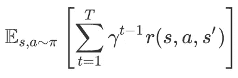
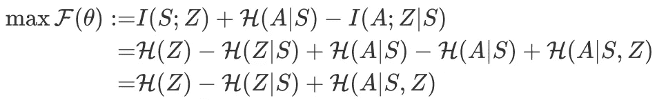
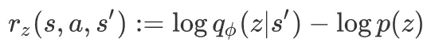
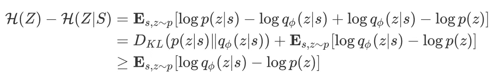
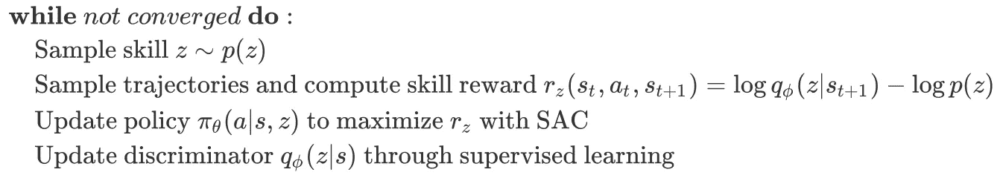
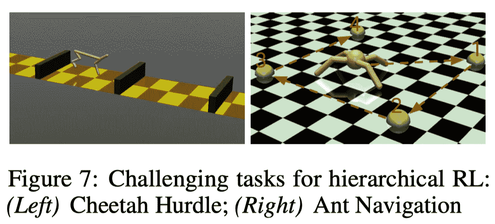
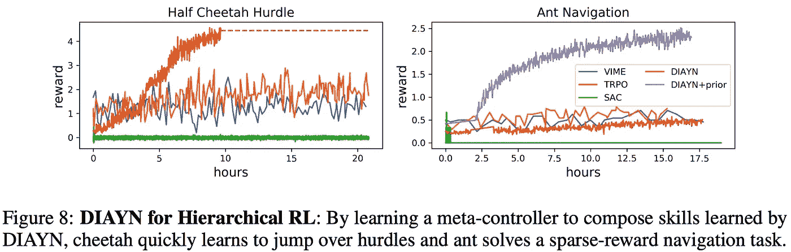

# DIAYN:多样性是你所需要的

> 原文：<https://pub.towardsai.net/diayn-diversity-is-all-you-need-23aaa6532e84?source=collection_archive---------0----------------------->

## 向着 AI 潜入 DIAYN |

## 一种无监督的基于信息的学习不同技能的方法

DIAYN 在没有任何外在奖励信号的情况下学习了不同的技能。来源:https://sites.google.com/view/diayn

# 介绍

我们讨论了一种基于信息的强化学习方法，该方法通过学习不同的技能来探索环境，而无需外部奖励的监督。简而言之，该方法，即 DIAYN(多样性是你所需要的)，通过信息论目标建立技能的多样性，并使用最大熵强化学习(MaxEnt RL)算法(例如，SAC)对其进行优化。尽管它很简单，但这种方法已经被证明能够在各种模拟机器人任务中学习不同的技能，如行走和跳跃。此外，它能够解决许多 RL 基准任务，即使没有收到任何任务奖励。更多有趣的实验结果，请参考他们的[项目网站](https://sites.google.com/view/diayn)。

# 预赛

我们用元组 *(S，A，P，r，γ)* 定义一个马尔可夫决策过程(MDP)，其中 *S* 是状态的集合， *A* 是动作的集合， *P: S × A → S* 是转移函数， *r* 是奖励函数， *γ* 是贴现因子。RL 算法旨在最大化预期奖励的贴现总额，定义如下

在 DIAYN，我们不考虑来自环境的奖励信号。相反，我们根据信息论来定义任务无关的奖励，我们很快就会看到。

# 多样性是你所需要的

在 DIAYN 中，我们将技能定义为以一致的方式改变环境状态的潜在条件政策。数学上，一项技能用条件策略 *p(a|s，z)* 来表示，其中 *z* 是从某个分布 *p(z)* 中采样的潜在变量。该方法主要基于三个想法(对于那些不熟悉互信息概念的人，我建议参考本文的第二部分以获得一些直觉):

1.  为了使技能有用，我们希望技能能够指示代理访问的状态。不同的技能应该访问不同的状态，因此是可以区分的。为了实现这一点，我们最大化互信息 I(S；Z) 状态 *S* 和技能 *Z* 之间。
2.  我们想用状态而不是动作来区分技能，因为不影响环境的动作对于外部观察者来说是不可见的。这是通过最小化互信息*I(A；动作 *A* 和技能 *Z* 之间*给定状态 *S* 。
3.  我们鼓励探索，并通过学习尽可能随机的技能来激励技能尽可能多样化。正如在最大熵强化学习中所做的，这是通过最大化策略熵 *H(A|S)* 来实现的。

如果我们把这三个目标放在一起，我们会得到

我们现在对每一项都有了一些直觉。第一项鼓励我们的先验分布 *p(z)* 具有高熵。对于一组固定的技能，我们将 *p(z)* 设为保证其具有最大熵的[离散均匀分布](https://github.com/ben-eysenbach/sac/blob/2116fc394749ca745f093a36635a9b253da8170d/sac/algos/diayn.py#L92)。最小化第二项表明，应该很容易从当前状态推断技能。第三项表示每个技能应该尽可能随机行动。

我们可以通过一些 MaxEnt RL 方法轻松地最大化第三项(例如，他们的实验中使用的温度为 *0.1* 的 [SAC](https://arxiv.org/abs/1801.01290) )。至于前两项，作者建议将它们合并到一个伪奖励中:

伪奖励

其中，一个已学习的鉴别器 *q_ϕ(z|s)* 用于近似 *p(z|s)* ，这是有效的，因为

请注意，如果 *q_ϕ(z|s) ≥ p(z)* ，奖励函数中的常量 *log p(z)* 有助于鼓励代理保持存活，当代理成功学习技能 *p(a|s，z)* 时，应始终保持该常量。另一方面，移除 *log p(z)* 会导致负回报，这会诱使代理尽快结束剧集。

## 算法

到目前为止，我们已经定义了无监督 MDP，并指定了强化学习方法，因此很容易理解整个算法:

# 将 DIAYN 结合到分层强化学习中

DIAYN 学习的网络可以用来初始化特定任务的代理，这为初始探索提供了一个很好的方法。DIAYN 的另一个有趣的应用是将学到的技能用作分层强化学习(HRL)算法的低级策略。为此，我们进一步学习元控制器，它为接下来的 *k* 步骤选择要执行的技能。元控制器具有与技能相同的观察空间，并以任务报酬最大化为目标。

来源:多样性是你所需要的

作者在两个具有挑战性的模拟机器人环境中对 HRL 算法进行了实验。在猎豹跨栏任务中，代理人会因为跳过障碍而获得奖励，而在蚂蚁导航任务中，代理人必须按照特定的顺序走到一组 5 个路点，在到达每个路点时只能获得少量奖励。下图展示了 DIAYN 如何优于一些最先进的 RL 方法。

来源:多样性是你所需要的

值得注意的是，平原 DIAYN 像其他人一样在蚂蚁导航任务中挣扎。这可以通过在鉴别器中加入一些先验知识来弥补。具体地说，鉴别器取计算代理质心的输入 *f(s)* ，HRL 方法保持不变。“DIAYN+prior”表明对鉴别器的这种简单修改显著提高了性能。

# 参考

[*本杰明·艾森巴赫*](https://openreview.net/profile?email=beysenba%40cs.cmu.edu)*[*阿布舍克·古普塔*](https://openreview.net/profile?email=abhigupta%40berkeley.edu)*[*朱利安·伊巴兹*](https://openreview.net/profile?email=julianibarz%40google.com)*[*谢尔盖·莱文*](https://openreview.net/profile?email=svlevine%40eecs.berkeley.edu) 。多样性是你所需要的:学习没有奖励功能的技能。于 2019 年在 ICLR 展出。***