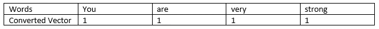
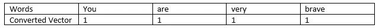
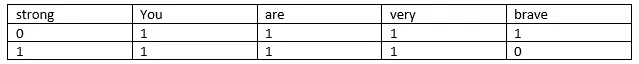
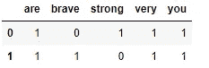
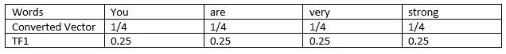
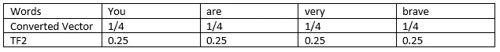
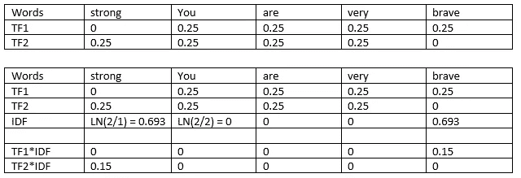
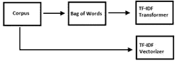
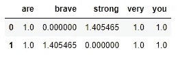

# 使用 Python 的 NLP 中单词包(BOW)和 TF-IDF 的区别

> 原文：<https://pub.towardsai.net/difference-between-bag-of-words-bow-and-tf-idf-in-nlp-with-python-97d3e75a9fd?source=collection_archive---------0----------------------->

## [自然语言处理](https://towardsai.net/p/category/nlp)

## 单词被转换成矢量或数字


[斯文·布兰德斯马](https://unsplash.com/@seffen99?utm_source=medium&utm_medium=referral)在 [Unsplash](https://unsplash.com?utm_source=medium&utm_medium=referral) 上的照片

这两个主题可以用作单词嵌入，其中单词被转换成向量或数字，即稀疏矩阵。稀疏矩阵或稀疏阵列是包含更多数量的 0 和更少数量的 1 的矩阵，即更多数量的 0。

在本文中，我们将研究自然语言处理的两个概念，其中高维的单词被转换为低维的向量或数字，以便于机器学习过程。

*   将单词转换成没有语义信息的数字。
*   TF-IDF:它也将单词转换成带有一些加权信息的数字或向量。

当我们使用机器学习算法时，它们需要输入特定格式的数字，而处理文本有点困难，将文本转换为数字可以挽救生命。

> ***包单词(BOW)或计数矢量器***

它用于从单词/短语中检索向量或数字形式的信息。这在一定程度上解决了自然语言处理中的分类问题。

单词包的工作功能是统计单词在短语中的出现次数，而不考虑语义信息，并且不知道单词在短语或文档中的位置。概念的把握和执行是非常容易的。

示例:

你很强壮。

通过使用一个单词包，它转换成矢量，如下所示:



作者的照片

你很勇敢。

通过使用一个单词包，它转换成矢量，如下所示:



作者的照片

做一袋字模



作者的照片

## **单词包的 Python 示例**

```
#Two sentences to implement BOW
S1="You are very strong"
S2="You are very brave"Corpus= [D1,D2]
Corpus#Output:
['You are very strong', 'You are very brave']#importing the libraries
import pandas as pd
from sklearn.feature_extraction.text import CountVectorizer
```

我们使用一个单词包，即 sklearn 库中的计数矢量器类，来从句子中提取特征。

```
#now creating an object of count vectorizer
cv = CountVectorizer()
```

它被用来计算这个词在句子中出现的频率。

```
#using fit_transform to make the words into sparse array
X = cv.fit_transform(Corpus).toarray()#getting the features names i.e. words of the document of corpus
print(cv.get_feature_names())#output:
['are', 'brave', 'strong', 'very', 'you']#making a dataframe of bag of words
print("BOW Matrix:-")
pd.DataFrame(X, columns=cv.get_feature_names())#output:
BOW Matrix:-
```



作者的照片

在一袋单词中，数字被赋予每个单词，并赋予所有单词以重要性。为了克服这一点，我们使用 TF-IDF 模型。

[](/web-scraping-movie-data-with-beautiful-soup-library-in-python-b51ae9206ea8) [## 用 python 中漂亮的汤库进行电影数据的 Web 抓取

### 从电影网站提取数据

pub.towardsai.net](/web-scraping-movie-data-with-beautiful-soup-library-in-python-b51ae9206ea8) [](https://medium.com/pythoneers/forget-html-and-flask-start-using-streamlit-1b394cfe4595) [## 忘记 HTML 和 Flask，开始使用 Streamlit

### 数据科学和机器学习的 WebApp 框架

medium.com](https://medium.com/pythoneers/forget-html-and-flask-start-using-streamlit-1b394cfe4595) 

> ***词频和逆文档频(TF-IDF)***

在该模型中，通过给予不常用词比常用词更高的重要性来收集一些语义信息。

IDF 一词意味着对文档中的生僻字赋予更高的权重。

```
TF-IDF = TF*IDF
```

示例:

你很强壮。

通过使用一袋单词，它转换成重量，如下所示:



作者的照片

根据句子中总单词的出现次数为单词分配权重。

**句子 2:** 你很勇敢。

通过使用单词包，它转换为如下所示的权重:



作者的照片

做一袋字模



作者的照片

在上面的例子中，不常用词的权重较大，常用词的权重较小。

## **TF-IDF 中的术语**

*   文档频率:文档频率告诉我们一个单词在整个句子集合中出现的频率，这个信息是全局的，不特定于任何一个句子。

DF =包含给定术语的文档数量(D)/语料库中的文档总数(D)

举个例子:我们取上面两个句子，强词出现在一个句子中，两个是语料库中的文档总数。

DF = = 0.5

但是，D 大于 D，在这种情况下，log(d/D)给出一个负值。为了克服这个负值，研究人员颠倒了对数表达式中的比率。因此，log(D/d)被称为逆文档频率。

*   在 IDF 中使用 log 来抑制比率的影响(压缩数值的标度，以便可以容易地比较大数量和小数量)。
*   使用对数函数是因为得分函数是相加的，并且各项是独立的。

TF 中有许多权重方案，如下所示:

*   二进制、原始计数、术语频率、对数归一化等。

IDF 中有许多重量方案，如下所示:

*   一元，逆文档频率(IDF)，IDF-平滑，IDF-最大，概率-IDF

两种类型的 TF-IDF 方法是 TfidfTransformer 和 TfidfVectorizer

1.  TfidfTransformer:它接受一包单词作为输入
2.  tfidf 矢量器

*   它将文档/语料库作为输入
*   它在 sklearn 函数中有更多的选项，如标记化、n-grams、停用词等。



作者的照片

## **TF-IDF 的 Python 例子**

*   使用 TF_IDF 转换器方法

```
#import the method from the sklearn library
from sklearn.feature_extraction.text import TfidfTransformer#create object of TfidfTransformer methos and do fit_transform
cv_tfidf = TfidfTransformer(smooth_idf=True,norm=None)X_tfidf = cv_tfidf.fit_transform(X).toarray()
pd.DataFrame(X_tfidf, columns=cv.get_feature_names())#output:
```



作者的照片

*   使用 TF_IDF 矢量器方法

```
#import the method from the sklearn library
from sklearn.feature_extraction.text import TfidfVectorizer#create object of Tfidf Vectorizer methos and do fit_transform
cv_tfidf = TfidfVectorizer(smooth_idf=False,norm=None)X_tfidf = cv_tfidf.fit_transform(Corpus).toarray()
pd.DataFrame(X_tfidf, columns=cv_tfidf.get_feature_names())#output:
```


作者的照片

> ***结论***

本文简要介绍了词向量的基本模型。

我希望你喜欢这篇文章。通过我的 [LinkedIn](https://www.linkedin.com/in/data-scientist-95040a1ab/) 和 [twitter](https://twitter.com/amitprius) 联系我。

# 推荐文章

```
1\. [NLP — Zero to Hero with Python](https://medium.com/towards-artificial-intelligence/nlp-zero-to-hero-with-python-2df6fcebff6e?sk=2231d868766e96b13d1e9d7db6064df1)
2\. [Python Data Structures Data-types and Objects](https://medium.com/towards-artificial-intelligence/python-data-structures-data-types-and-objects-244d0a86c3cf?sk=42f4b462499f3fc3a160b21e2c94dba6)
3\. [Python: Zero to Hero with Examples](https://medium.com/towards-artificial-intelligence/python-zero-to-hero-with-examples-c7a5dedb968b?source=friends_link&sk=186aff630c2241aca16522241333e3e0)
4\. [Fully Explained SVM Classification with Python](https://medium.com/towards-artificial-intelligence/fully-explained-svm-classification-with-python-eda124997bcd?source=friends_link&sk=da300d557992d67808746ee706269b2f)
5\. [Fully Explained K-means Clustering with Python](https://medium.com/towards-artificial-intelligence/fully-explained-k-means-clustering-with-python-e7caa573176a?source=friends_link&sk=9c5c613ceb10f2d203712634f3b6fb28)
6\. [Fully Explained Linear Regression with Python](https://medium.com/towards-artificial-intelligence/fully-explained-linear-regression-with-python-fe2b313f32f3?source=friends_link&sk=53c91a2a51347ec2d93f8222c0e06402)
7\. [Fully Explained Logistic Regression with Python](https://medium.com/towards-artificial-intelligence/fully-explained-logistic-regression-with-python-f4a16413ddcd?source=friends_link&sk=528181f15a44e48ea38fdd9579241a78)
8\. [Basics of Time Series with Python](https://medium.com/towards-artificial-intelligence/basic-of-time-series-with-python-a2f7cb451a76?source=friends_link&sk=09d77be2d6b8779973e41ab54ebcf6c5)
9\. [NumPy: Zero to Hero with Python](https://medium.com/towards-artificial-intelligence/numpy-zero-to-hero-with-python-d135f57d6082?source=friends_link&sk=45c0921423cdcca2f5772f5a5c1568f1)
10.[Confusion Matrix in Machine Learning](https://medium.com/analytics-vidhya/confusion-matrix-in-machine-learning-91b6e2b3f9af?source=friends_link&sk=11c6531da0bab7b504d518d02746d4cc)
```