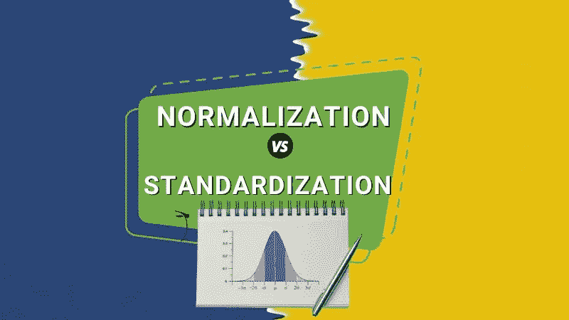
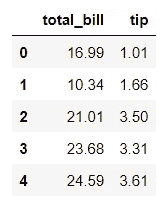
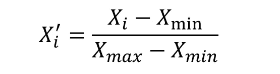
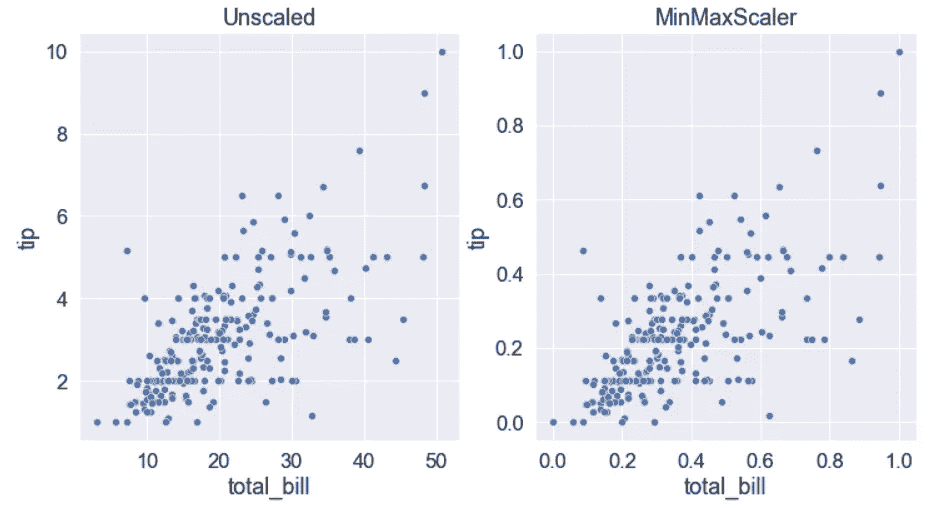
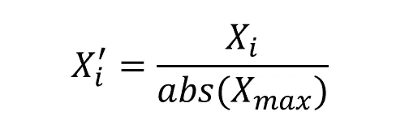
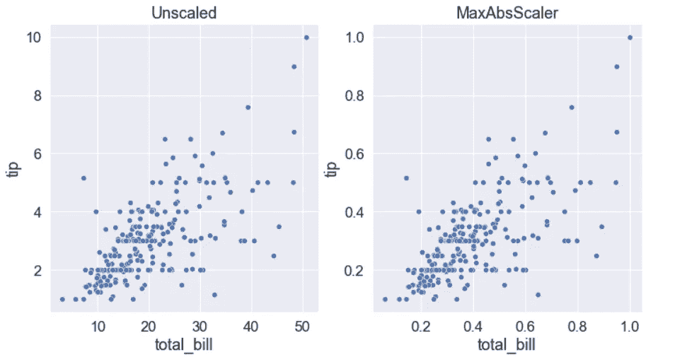
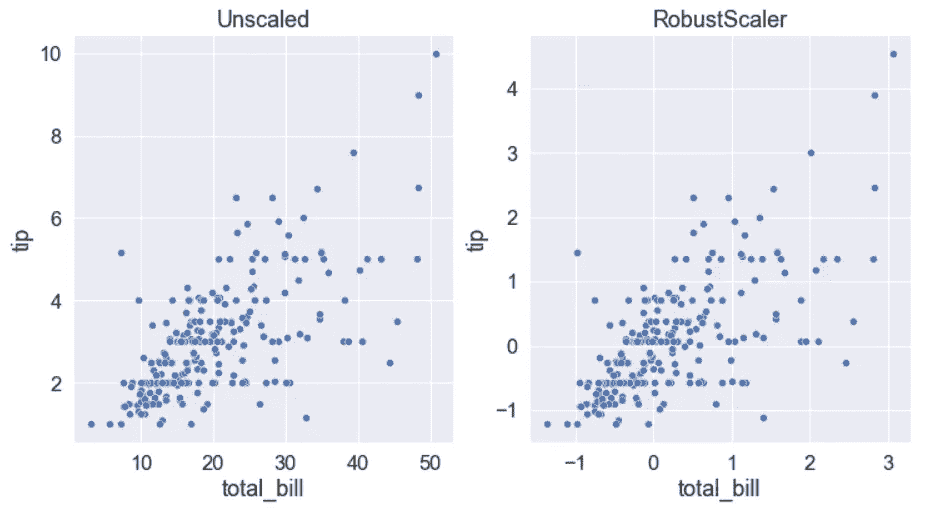
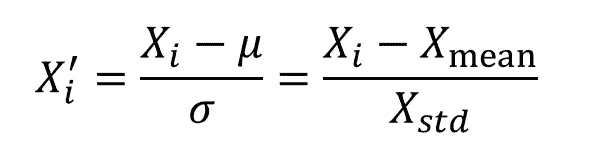
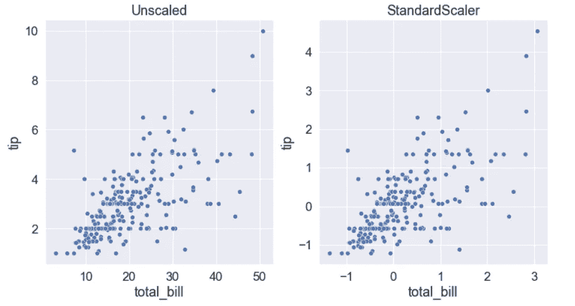
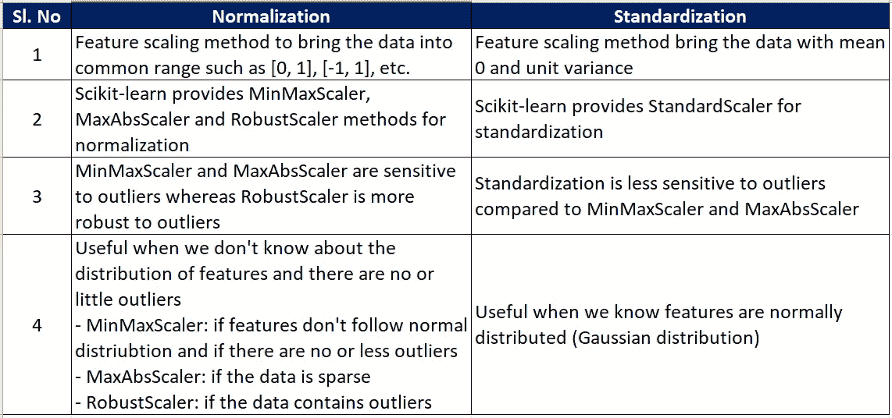

# 规范化和标准化的区别

> 原文：<https://pub.towardsai.net/difference-between-normalization-and-standardization-745030eaf96f?source=collection_archive---------1----------------------->

## 了解规范化和标准化之间的区别，不同的方法，以及最重要的是，何时应该考虑使用规范化或标准化。



**目录**

[简介](#343a)
什么是特征缩放，为什么重要？
[归一化](#e4bf)
∘ [最小最大缩放器](#5da7)
∘ [最大最小缩放器](#b615)
∘ [鲁棒缩放器](#0ae1)
[标准化](#1d89)
∘ [标准缩放器](#cebf)
[概要](#3141)
[参考文献](#059a)

# 介绍

特征缩放是机器学习流水线中的重要步骤之一。用于特征缩放的两种常用技术是**标准化**和**标准化**。但是*规范化和标准化的区别是什么？什么时候应该使用规范化和标准化？*这是刚开始数据科学之旅的人很常见的问题。让我们试着在文章中回答这些问题。

# 什么是特征缩放，为什么它很重要？

特征缩放是一种变换普通范围内数据的方法— [0，1]或[-1，1]或[-2，2]等。如果不对数据应用特征缩放，则机器学习模型对具有大值的特征给予更高的权重，从而导致有偏差的模型。

例如，让我们考虑两个特征——总账单和小费。正如您所看到的，这两个特性在不同的范围内。模型只看数字。它不知道哪个是 total_bill，哪个是 tip。在构建模型时不进行要素缩放，模型将偏向于具有较大值的要素，从而导致模型有偏差。为了缓解这个问题，我们需要对数据使用特征缩放。



来自 Seaborn 库的 tips 数据集的示例

***注*** *:特征缩放并不是所有机器学习算法都必须的。基于距离的算法，如线性回归、逻辑回归、支持向量机、KNN、K-means 等。，梯度下降优化算法最适合特征缩放。但是基于树的模型如 random forest、XGBoost、LightGBM 等。，不受缩放的影响。*

```
import pandas as pd
import seaborn as sns
import matplotlib.pyplot as plt
from sklearn.preprocessing import MinMaxScaler
from sklearn.preprocessing import MaxAbsScaler
from sklearn.preprocessing import RobustScaler
from sklearn.preprocessing import StandardScaler
sns.set(font_scale=1.5)

df = sns.load_dataset('tips')
df = df[['total_bill', 'tip']]
df.head()

fig, axes = plt.subplots(1, 3, figsize=(18, 5))
sns.histplot(data=df, x='total_bill', ax=axes[0])
sns.histplot(data=df, x='tip', ax=axes[1])
sns.scatterplot(data=df, x='total_bill', y='tip', ax=axes[2]);
```

# 正常化

归一化是一种特征缩放技术，用于将数据中的特征带到一个公共范围，比如[0，1]或[-1，0]或[-1，1]。在这一节中，我们将介绍下面讨论的 3 种流行的标准化方法。

## 最小最大缩放器

该方法单独缩放每个特征，使其在范围[0，1]内。每个特征值减去最小值，然后除以最大值和最小值之差。

它使用最小和最大值进行缩放，最小和最大值对异常值都很敏感。因此，MinMaxScaler 方法对异常值也很敏感。注意，MinMaxScaler 不会改变数据的分布。



**Scikit-learn 实现**

可以使用 Sklearn 的 MinMaxScaler，如下图所示。

```
from sklearn.preprocessing import MinMaxScaler

scaler = MinMaxScaler()
minmaxscaler_df = pd.DataFrame(scaler.fit_transform(df), columns=df.columns)
```



**什么时候使用 MinMaxScaler？**

*   当特征的分布未知时(即，如果特征不是正态分布的)，最好使用最小最大缩放器。
*   如果您正在使用的底层机器学习算法不对数据的分布做出任何假设(例如 kNN、神经网络等)，也可以考虑 MinMaxScaler。).
*   仅当要素很少或没有异常值时，才考虑使用 MinMaxScaler。

***注意*** *:默认情况下，MinMaxScaler 在[0，1]范围内缩放数据。但是，您可以根据需要通过设置* `feature_range` *参数来修改此范围。*

## MaxAbsScaler

MaxAbsScaler 是另一种归一化技术，该方法单独缩放每个要素，使其在下面提到的不同情况下处于范围[0，1]或[-1，0]或[-1，1]内。

*   仅正值:[0，1]
*   仅负值:[-1，0]
*   正值和负值:[-1，1]

在这种方法中，每个特征值除以最大绝对值。因为这种方法使用最大值，因此它对异常值也很敏感，如 MinMaxScaler。



**Scikit-learn 实现**

可以使用 Sklearn 的 MaxAbsScaler，如下图。

```
from sklearn.preprocessing import MaxAbsScaler

scaler = MaxAbsScaler()
maxabsscaler_df = pd.DataFrame(scaler.fit_transform(df), columns = df.columns)
```



**什么时候使用 MaxAbsScaler？**

*   如果数据是稀疏的(即大多数值为零)，则必须考虑使用 MaxAbsScaler。事实上，MaxAbsScaler 是专门为稀疏数据设计的。

**—如果数据集很稀疏，为什么要使用 MaxAbsScaler？请阅读本文作者 Christian vers loot*[*此处*](https://github.com/christianversloot/machine-learning-articles/blob/main/feature-scaling-with-python-and-sparse-data.md) *了解。**

## *鲁棒定标器*

*MinMaxScaler 和 MaxAbsScaler 对异常值很敏感。因此，替代方案是鲁棒定标器。RobustScaler 不像 MinMaxScaler 或 MaxAbsScaler 那样使用最小值和最大值，而是使用 IQR，因此它对异常值具有鲁棒性。*

*鲁棒定标器的计算公式如下所示。如您所见，中位数从数据点中移除，并根据 IQR(四分位数间距)进行缩放。计算出的中值和 IQR 被存储起来，以便在测试集的转换过程中使用。每个特征的缩放是独立进行的。*

**

***Scikit-learn 实现***

*您可以使用 Sklearn 的 RobustScaler，如下所示。*

```
*from sklearn.preprocessing import RobustScaler

scaler = RobustScaler()
robustscaler_df = pd.DataFrame(scaler.fit_transform(df), columns = df.columns)*
```

**

***什么时候使用 RobustScaler？***

*   *当数据包含异常值时，最好使用 RobustScaler，因为它对异常值的敏感度低于 MinMaxScaler 和 MaxAbsScaler。*

# *标准化*

*标准化是机器学习中最常用的特征缩放技术。这是因为一些算法假设数据呈正态或接近正态分布。如果特征呈正态分布，则模型表现不佳。StandardScaler 和标准化指的是同一个东西。*

## *标准缩放器*

*此方法移除平均值，并用单位方差(或标准偏差)缩放数据。计算出的平均值和标准偏差被存储起来，以便在测试集的转换过程中使用。数据中每个要素的缩放是独立进行的。*

**

***Scikit-learn 实现***

*可以使用 Sklearn 的 StandardScaler，如下图。*

```
*from sklearn.preprocessing import StandardScaler

scaler = StandardScaler()
standardscaler_df = pd.DataFrame(scaler.fit_transform(df), columns = df.columns)*
```

*StandardScaler 使用均值，均值对异常值很敏感。因此，异常值对标准定标器有影响。*

**

***什么时候使用 StandardScaler？***

*   *如果特性是正态分布的，那么，StandardScaler 将是你的首选。*
*   *如果您使用的底层机器学习算法对数据的正态分布做出假设(例如，线性回归、逻辑回归等)，请考虑使用 StandardScaler。)*
*   *如果数据中有异常值，那么您可以删除这些异常值，并使用 minmax scaler/maxabscaler/standard scaler。*

# *摘要*

*规范化和标准化是两种流行的特征缩放技术。下表总结了这两种方法。*

**

*作者图片*

*但是，请注意，并不是所有算法都必须进行特征缩放。基于树的算法，例如决策树算法、随机森林算法、梯度提升树等。不需要特征缩放。*

# *进一步阅读*

*   *[英特尔发布 OpenVINO Toolkit 简介](/introduction-to-intel-distribution-of-openvino-toolkit-b1ba5b0cf24f)*
*   *[英特尔 oneAPI 人工智能分析工具包简介](https://pythonsimplified.com/introduction-to-intels-oneapi-ai-analytics-toolkit/)*
*   *什么是 Scikit-learn 管道？*
*   *【OneHotEncoder 和 get_dummies 的区别*
*   *[如何在《熊猫》中创造互动情节](https://pythonsimplified.com/how-to-create-interactive-plots-in-pandas/)*

*我希望你喜欢阅读这篇文章。如果你喜欢我的文章并想订阅 Medium，你可以点击这里的[](https://chetanambi.medium.com/membership)**。你的会员费直接支持我和你看的其他作家。你也可以在媒体上看到所有的故事。***

***[](https://chetanambi.medium.com/membership) [## 通过我的推荐链接加入媒体- Chetan Ambi

### 阅读 Chetan Ambi 的每一个故事(以及媒体上成千上万的其他作家)。您的会员费直接支持…

chetanambi.medium.com](https://chetanambi.medium.com/membership)*** 

# ***参考***

***[1].[https://scikit-learn.org/stable/modules/preprocessing.html](https://scikit-learn.org/stable/modules/preprocessing.html)***

***[2].[https://sci kit-learn . org/stable/modules/generated/sk learn . preprocessing . minmax scaler . html](https://scikit-learn.org/stable/modules/generated/sklearn.preprocessing.MinMaxScaler.html)***

***[3].[https://sci kit-learn . org/stable/modules/generated/sk learn . preprocessing . maxabscaler . html](https://scikit-learn.org/stable/modules/generated/sklearn.preprocessing.MaxAbsScaler.html)***

***[4].[https://sci kit-learn . org/stable/modules/generated/sk learn . preprocessing . robust scaler . html](https://scikit-learn.org/stable/modules/generated/sklearn.preprocessing.RobustScaler.html)***