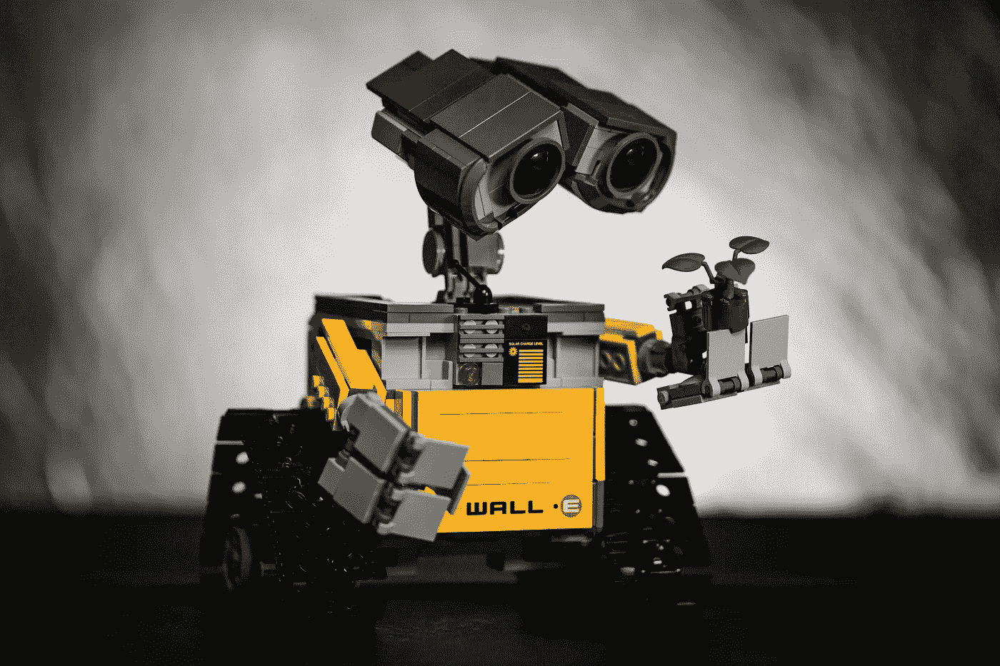
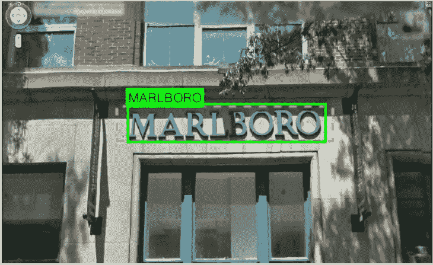
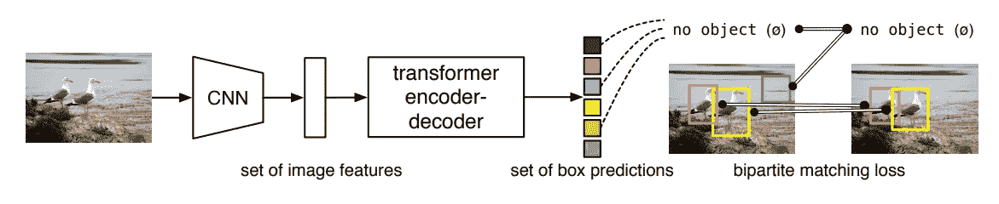

# 从机器学习的角度看自然语言处理和计算机视觉的区别和联系

> 原文：<https://pub.towardsai.net/differences-and-connections-between-natural-language-processing-and-computer-vision-from-a-machine-993a4acf3d97?source=collection_archive---------0----------------------->

## 自然语言处理、计算机视觉、机器学习

我最近从计算机视觉(CV)领域转移到自然语言处理(NLP)领域，发现了一些有趣的观察结果。这两个领域非常不同，但仍有一些共同的联系。开始了。

图片来自 unsplash

# 差异

**1。NLP 是特定于语言的，但 CV 不是。**

不同语言的 NLP 可能会有很大的不同。不同的语言有不同的词汇和语法。不可能训练一个适合所有语言的 ML 模型。

然而，计算机视觉要容易得多。以行人检测为例。在美国和中国拍摄的照片通常没有明显的区别。用在中国拍摄的图像训练的 ML 模型通常在美国拍摄的图像上也工作得很好。

**2。NLP 标注比较难，但是 CV 比较容易。**

由于两个原因，NLP 标记很复杂。

首先，你需要一个特定语言的演讲者来标记特定语言的文本。你不会期望一个说德语的人用中文标注文本。此外，如果语言人口很少，如维吾尔语或丹麦语，找到一个好的发言者为你工作可能已经很难了。更不用说怎么贴标签了。

第二，你需要理解文本，才能贴标签。以情感分析为例。你需要通读文本，理解它，然后决定它是积极的，消极的，还是中性的。如果文字比较长或者需要一些背景知识，做情感分析可能要花一些时间。有时候，你甚至需要语言学家的帮助。

相反，计算机视觉标注就容易多了。首先，这项任务不是针对语言或国家的。例如，用于对象检测或语义分割的标记可以由任何语言使用者来完成。第二，做标注不需要成为专家。一个三年级的小学生甚至可以做物体检测或语义分割的标记。

**3。NLP 很大程度上依赖于规则，而 CV 则不然。**

当我开始进入这个领域时，看到规则在 NLP 中被大量使用，我感到非常惊讶。但是过了一段时间，我明白为什么了。

以命名实体识别为例。您希望预测文本中单词的标签，如 *Loc* (位置)或 *Org* (组织)。你会怎么做？你会用大的训练数据来训练一个 LSTM 网络还是简单地用一些规则来记忆一些单词？对于一些单词，比如 Google、Meta、Berlin 和 Paris，我会创建一些规则来预测 Google 和 Meta 为 Org，Berlin 和 Paris 为 Loc。为这样的单词创建规则比训练一个 ML 模型要容易得多。

然而，在 CV 域中，很少使用规则。人们不指望一个基于规则的系统能够预测 MNIST 的数字，或者从街道图像中检测出行人。ML 模型在 CV 域中占绝对优势。

**4。NLP 数据使用的磁盘空间较少，但 CV 数据占用的磁盘空间较多。**

在 NLP 中，数据是文本。它通常保存在记事本、excel 或数据库中。因为它是文本，所以占用的空间通常是几兆字节，或者最多几千兆字节。

但是，CV 数据通常是 jpg 或 png 图像。它们通常直接保存在文件夹中。如果你有数百万张图片，它很容易占用数十亿字节甚至更多。

# 连接

尽管这两个领域有许多不同之处，但它们确实有许多相似之处。这里我将介绍两种 ML 技术，LSTM 和变形金刚，它们在这两个领域都有应用。

**LSTM**

时间序列问题存在于这两个领域。在自然语言处理中，存在着词性和命名实体识别的问题。在这种问题中，输入文本被逐字读入 ML(例如，LSTM)模型，并且该模型预测每个输入单词的标签。在 CV 中，存在包括场景文本识别的问题，其中给定包含文本的图像，模型预测文本。参见下面的例子。LSTM 模型读入包含文本的包围盒，将包围盒从左到右转换成切片，最后预测输出字母。

参考文献[1]中的图片

**变形金刚**

变换器起源于机器翻译领域，也用于物体检测。DETR [2]是一个基于变压器的对象检测模型。它的好处是，它是无锚的，这意味着我们不需要仔细设计锚的规模和大小。此外，由于它是无锚点的，因此没有非最大抑制作为后处理，这通常需要微调 IOU 阈值和分类分数阈值。下面是 DETR 的工作流程。

DETR 的工作流程[2]

关于 DETR 更详细的解释，请看我之前的帖子。

 [## UP-DETR:用变形金刚进行物体检测的无监督预训练(论文解释)

### CVPR 2021 口头论文

medium.com](https://medium.com/analytics-vidhya/up-detr-unsupervised-pre-training-for-object-detection-with-transformers-paper-explained-84611e27a144) 

## 参考资料:

[1]王凯，鲍里斯·巴本科和瑟奇·贝隆吉，端到端场景文本识别，ICCV，2011。

[2] Nicolas Carion、Francisco Massa、Gabriel Synnaeve、Nicolas Usunier、Alexander 基里洛夫和 Sergey Zagoruyko,《利用变压器进行端到端对象检测》, ECCV，2020 年。