# Python 中 concat()、merge()和 join()的区别

> 原文：<https://pub.towardsai.net/differences-between-concat-merge-and-join-with-python-1a6541abc08d?source=collection_archive---------0----------------------->

## [数据科学](https://towardsai.net/p/category/data-science)

## 在 pandas 中组合数据帧

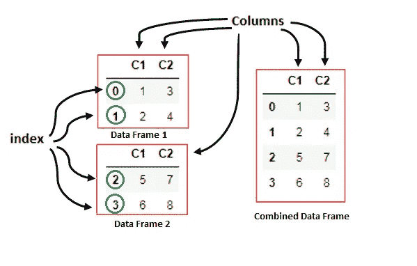

作者的照片

> **简介 **

在本文中，我们将讨论在 pandas 方法的帮助下组合数据帧。有时，当我们在一个大项目中工作，数据来自不同的来源，那么我们需要将这些数据组合成一个数据框架。

在 pandas 中，数据科学人员很少使用方法来使数据框架处于更有价值的状态。

这些方法根据行和列的相加来划分。

方法 **merge()** 和 **join()** 基于 SQL join 方法的公共键和索引工作。

方法 **concat()** 正在对数据帧进行处理，以将它们组合在一起，形成一个结果数据帧。

您可以根据需要阅读这篇关于系列和数据框架的基础文章。

[](/fundamentals-of-series-and-data-frame-in-pandas-with-python-6e0b8a168a0d) [## 用 python 实现熊猫系列和数据框架的基础

### 数据框中常用参数的基础知识

pub.towardsai.net](/fundamentals-of-series-and-data-frame-in-pandas-with-python-6e0b8a168a0d) 

> ***串联方式***

将两个数据帧水平合并成一个。

python 的例子:

```
#import the pandas' library
import pandas as pd
```

为了组合数据帧，我们需要至少两个数据帧。

```
#Data frame 1
df1 = pd.DataFrame({"C1":["1", "2"], 
                    "C2":["3", "4"],}, 
                   index=[0, 1])#Data frame 2
df2 = pd.DataFrame({"C1":["5", "6"], 
                    "C2":["7", "8"],}, 
                   index=[2, 3])#combine these two data frames
data = [df1,df2]
combined_df = pd.concat(data)combined_df
```

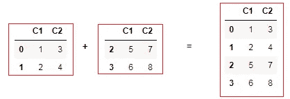

组合数据框。作者的照片

我们知道，当我们水平组合两个数据框时，列是相同的，行索引是增加的。

## **串联的自变量**

1.  **Keys 参数:**它采用 sequence 或 none，键作为分层索引传递到最外层，如下所示:

```
key_data = pd.concat(data, keys=["x", "y"])
key_data
```

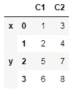

键索引。作者的照片

现在，我们可以用键来访问数据，如示例所示。

```
key_data.loc["y"]
```

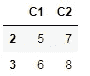

**2。轴:**该参数用于垂直组合数据帧，意味着添加更多列，如下例所示:

```
df3 = pd.DataFrame({"C3":["10", "11"], 
                    "C4":["12", "13"],}, 
                   index=[1,2])
```

这里，我们给出索引(1，2)，但是在“df1”数据帧中，索引是(0，1)。于是，结果得到一个新行，缺失的值用“*”填充。*

```
*axis_data = pd.concat([df1, df3], axis=1)
axis_data*
```

*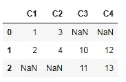*

***3。连接:**在这个参数中有两种类型的连接，即外部连接和内部连接。默认连接为外部连接，内部连接将提供数据框的公共交集，如下所示:*

```
*join_data = pd.concat([df1, df3], axis=1, join="inner")
join_data*
```

*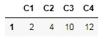*

## ***合并数据帧和序列***

*这是组合系列和数据框的非常有用的方法，如下所示:*

```
*series_data = pd.Series(["21", "22"], name="C5")
combine_series = pd.concat([df1, series_data], axis=1)
combine_series*
```

*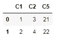**[](/a-walk-to-the-standard-library-of-python-with-examples-c5140a8ef1a7) [## 带示例的 Python 标准库之旅

### python 中提供的一个方便有用的脚本模块

pub.towardsai.net](/a-walk-to-the-standard-library-of-python-with-examples-c5140a8ef1a7) 

> ***合并方法***

这种方法用于连接不同的数据框架，就像结构化查询语言(SQL)中的关系数据库一样。

**以单键数据帧为例。**

上的 ***自变量用于从两个数据帧中获取公共列。***

```
left = pd.DataFrame({"keys":["K0", "K1"],
                     "C1":["1", "2"], 
                     "C2":["3", "4"],})right = pd.DataFrame({"keys":["K0", "K1"],
                      "C3":["10", "11"], 
                      "C4":["12", "13"]})basic_join = pd.merge(left, right, on="keys")
basic_join
```

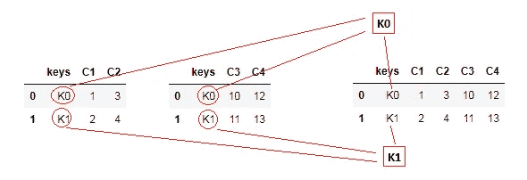

两个数据帧合并操作。作者的照片

**用两个关键数据框举例。**

```
left = pd.DataFrame({"k1": ["A0", "A0", "A1", "A2"],
                     "k2": ["A0", "A1", "A0", "A1"],
                     "A": ["1", "2", "3", "4"],
                     "B": ["5", "6", "7", "8"]})right = pd.DataFrame({"k1": ["A0", "A1", "A1", "A2"],
                      "k2": ["A0", "A0", "A0", "A0"],
                      "C": ["9", "10", "11", "12"],
                      "D": ["13", "14", "15", "16"]})two_key_result = pd.merge(left, right, on=["k1", "k2"])
two_key_result
```

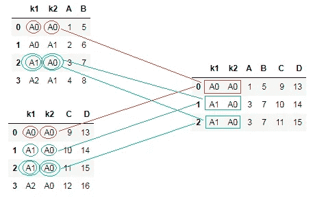

公共键与合并数据框相关联。作者的照片

SQL do 连接，如左连接、右连接、内连接和外连接。这些的例子如下所示:

```
left_result = pd.merge(left, right, how="left", on=["k1", "k2"])right_result = pd.merge(left, right, how="right", on=["k1", "k2"])inner_result = pd.merge(left, right, how="inner", on=["k1", "k2"])outer_result = pd.merge(left, right, how="outer", on=["k1", "k2"])
```

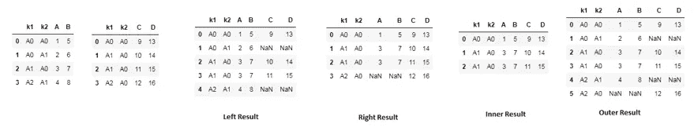

作者的照片

merge 方法包含一个参数，该参数将分类列与结果数据框中的信息相加，如下例所示。

```
data1 = pd.DataFrame({"C1": [4, 6], "col_left": ["a", "b"]})
data2 = pd.DataFrame({"C1": [6, 3, 3], "col_right": [3, 3, 3]})#The indicator argument is "True"
pd.merge(data1, data2, on="C1", how="outer", indicator=True)
```

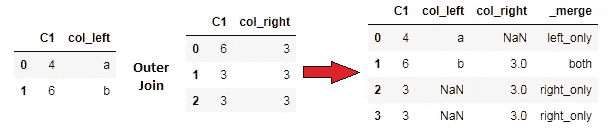

作者的照片

[](/understand-list-as-big-o-and-comprehension-with-python-examples-cbea610c9e43) [## 将 List 理解为 Big O 并理解 Python 示例

### 列表是 python 数据结构的一部分

pub.towardsai.net](/understand-list-as-big-o-and-comprehension-with-python-examples-cbea610c9e43) 

> ***加入方法***

这种方法对于基于左和右数据帧组合两个数据帧也是有用的。

在本例中，左数据优于右数据，如下所示:

```
left = pd.DataFrame({"X1":["1", "2"], 
                     "X2":["3", "4"]}, 
                     index = ["K0", "K1"])right = pd.DataFrame({"X3":["10", "11"], 
                     "X4":["12", "13"]}, 
                     index = ["K0", "K2"])result = left.join(right)
result
```

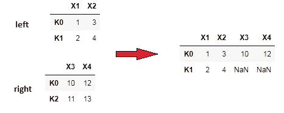

奥托尔的照片

在下面的例子中，右边占优势。

```
result1 = right.join(left)
result1
```

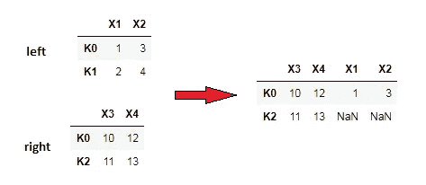

作者的照片

我们还可以根据键和索引连接两个数据框，如下所示:

```
left = pd.DataFrame({"k1": ["A0", "A1", "A0", "A1"],                     
                     "C1": ["1", "2", "3", "4"],
                     "C2": ["5", "6", "7", "8"]})right = pd.DataFrame({"C3": ["10", "11"], "C4": ["12", "13"]}, index=["A0", "K1"])result = left.join(right, on="k1")
result
```

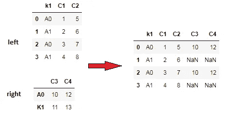

作者的照片

> ***结论:***

本文给出了基于索引、键组合数据帧的基本思想。数据框的组合也适用于多个键和索引，这将在以后的文章中介绍。

我希望你喜欢这篇文章。通过我的 [LinkedIn](https://www.linkedin.com/in/data-scientist-95040a1ab/) 和 [twitter](https://twitter.com/amitprius) 联系我。

# 推荐文章

[1。NLP —零到英雄与 Python](https://medium.com/towards-artificial-intelligence/nlp-zero-to-hero-with-python-2df6fcebff6e?sk=2231d868766e96b13d1e9d7db6064df1)
2。 [Python 数据结构数据类型和对象](https://medium.com/towards-artificial-intelligence/python-data-structures-data-types-and-objects-244d0a86c3cf?sk=42f4b462499f3fc3a160b21e2c94dba6)3 .[Python 中的异常处理概念](/exception-handling-concepts-in-python-4d5116decac3?source=friends_link&sk=a0ed49d9fdeaa67925eac34ecb55ea30)
4。[用 Python 进行主成分分析降维](/principal-component-analysis-in-dimensionality-reduction-with-python-1a613006d531?source=friends_link&sk=3ed0671fdc04ba395dd36478bcea8a55)
5。[用 Python 全面讲解 K-means 聚类](https://medium.com/towards-artificial-intelligence/fully-explained-k-means-clustering-with-python-e7caa573176a?source=friends_link&sk=9c5c613ceb10f2d203712634f3b6fb28)
6。[用 Python](https://medium.com/towards-artificial-intelligence/fully-explained-linear-regression-with-python-fe2b313f32f3?source=friends_link&sk=53c91a2a51347ec2d93f8222c0e06402)
7 全面讲解了线性回归。[用 Python](https://medium.com/towards-artificial-intelligence/fully-explained-logistic-regression-with-python-f4a16413ddcd?source=friends_link&sk=528181f15a44e48ea38fdd9579241a78)
充分解释了 Logistic 回归 8。[用 Python 实现时间序列的基础知识](https://medium.com/towards-artificial-intelligence/basic-of-time-series-with-python-a2f7cb451a76?source=friends_link&sk=09d77be2d6b8779973e41ab54ebcf6c5)
9。[与 Python 的数据角力—第一部分](/data-wrangling-with-python-part-1-969e3cc81d69?source=friends_link&sk=9c3649cf20f31a5c9ead51c50c89ba0b)
10。[机器学习中的混淆矩阵](https://medium.com/analytics-vidhya/confusion-matrix-in-machine-learning-91b6e2b3f9af?source=friends_link&sk=11c6531da0bab7b504d518d02746d4cc)*