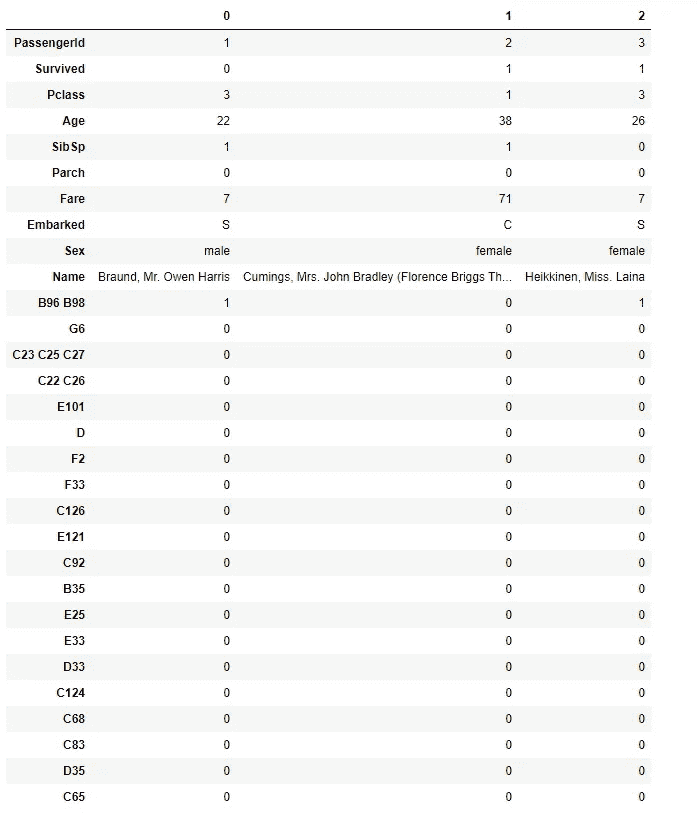
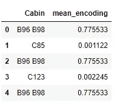
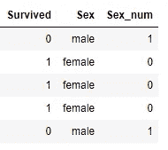

# 处理分类值的不同方法

> 原文：<https://pub.towardsai.net/different-approaches-to-handle-categorical-values-a2e35fbd6128?source=collection_archive---------3----------------------->

## [机器学习](https://towardsai.net/p/category/machine-learning)

## 特征工程第二部分


照片由 [ETA+](https://unsplash.com/@etaplus?utm_source=medium&utm_medium=referral) 在 [Unsplash](https://unsplash.com?utm_source=medium&utm_medium=referral) 上拍摄

机器学习是让计算机自己明确学习的艺术。在 ML 中，我们研究通过经验自动改进的不同类型的算法。在每个机器学习任务中，我们都有一些数据，然后我们应用机器学习算法，并创建一个可以预测新的即将到来的数据的模型。在整个过程中，数据是机器学习模型生命周期中最重要的一部分。数据可以是任何多种形式，并且很有可能我们的数据也没有准备好提供给机器学习算法，为此我们需要执行一些特征工程和数据探索。在我之前的博客中，我解释了处理数据中缺失值的不同方法。

在这篇博客中，我们将看到机器学习中处理分类数据的不同方法。

## 什么是分类数据？

分类数据是一种包含标签值而非数值的变量。这些通常被称为名义。一些例子
-第一、第二、第三
-男性、女性

## 为什么处理？

这是我们脑海中最常见的问题之一，为什么我们需要处理分类值如果机器学习是如此强大，那么我们为什么要在特征工程上花费大量时间。答案很简单，每个机器学习模型都是基于一些需要数字数据来执行任何类型计算的数学模型。

> 我们将使用 Kaggle 上的泰坦尼克号数据集。我们已经对数据进行了预处理，并处理了先前博客[**中的所有空值**](https://medium.com/towards-artificial-intelligence/9-ways-to-handle-missing-values-in-machine-learning-1bbda345699a) **，**，因此我们使用的数据不包含任何空值。
> **代号:** [Github](https://github.com/Abhayparashar31/feature-engineering)

## 编码类型

1.  **名义编码:**当数据没有固有的顺序时
    1.1 一个热编码
    1.2 一个热编码多特征
    1.3 表示编码
2.  **顺序编码:**当数据有一个固有的顺序时
    2.1 标签编码
    2.2 目标导向编码
3.  **计数编码**

# 1.1-一个热编码

在一个热编码中，我们根据它们的类别将所有的数据点转换成 0 和 1。它被用在性、性别、州等栏目中。在 python 中，我们用`pandas.get_dummies()`转换成一键编码
**例子:**

```
**SEX         One Hot Representation** Male            1  1
Female          0  0
Female          0  1
Male            1  0**COUNTRY     One Hot Representation** India          1 0 0 0
USA            0 1 0 0
UK             0 0 1 0
China          0 0 0 1
USA            0 1 0 0
```

**优点** 1)比其他编码技术更快。
2)使数据处理速度非常快。

**缺点** 1)为大量类别增加维度，导致维度诅咒问题。

**代码**

```
**pd.get_dummies(df['Sex']).head()** 
## It will return two columns(female,male)**pd.get_dummies(df['Sex'],drop_first=True).head()**##*It will only return on column(male, which saves us from linear dependency*
```

# 1.2-具有许多分类特征的一个热编码

随着特征数量的增加，列的数量也增加，这导致了维数灾难问题。为了避免这种情况，我们只使用前 10 或前 20 个特性，并对它们应用一次性编码。这种方法用于密码、房间号、船舱号等。

```
**### STEP:1- Find the top 20 most frequent features**

top20=[x for x in df['Cabin'].value_counts().sort_values(ascending=False).head(20).index]
print(top20)**### STEP:2- Use Top 20 and apply on the data**
import numpy as np
for label in top20:
    df[label]=np.where(df['Cabin']==label,1,0)
df = df.drop("Cabin",axis=1)
```



# 1.3-平均编码

在这种类型的编码中，我们用计数的平均值替换所有的分类值。均值编码表示目标变量的概率，取决于特征的每个值。

```
**### STEP:1- Counting Each Feature value respect to length of column** temp=df['Cabin'].value_counts()/len(df['Cabin'])**### STEP:2- Converting all the data into a dict** mean_encoding=temp.to_dict()**### STEP:3- Finding the most common 5 or 10 mean values** from collections import Counter
Counter(mean_encoding).most_common(5)**### STEP:4- Mapping the most common values with the dataframe** df['mean_encoding']=df['Cabin'].map(mean_encoding)
df[['Cabin','mean_encoding']].head()
```



# 2.1-标签编码

在这种类型的编码中，我们根据类别的重要性和权重，给每一类赋予不同的标签。

```
 **Weekday                 Encoding** 0        Sunday                   7
1      Saturday                   6     
2        Friday                   5
3      Thursday                   4   
4     Wednesday                   3
5       Tuesday                   2
6        Monday                   1 
7        Sunday                   7
8      Saturday                   6 
```

为此，我们首先创建一个编码字典，然后使用 map()将字典与数据集进行映射。

```
**### STEP:1- Creating a dictionary of encoding**
dict_map = {'male':1,"female":0}**### STEP:2- Mapping dictionary with the columns** df["Sex_num"] = df['Sex'].map(dict_map)
df.head()
```



# 2.2 目标导向的顺序编码

它几乎与均值编码相同，主要区别在于，我们计算的是相对于目标列的计数。

```
**### STEP:1- Counting Each Feature value respect to the target column** temp=df.groupby(['Cabin'])['Survived'].mean()**### STEP:2- Converting all the data into a dict** encoding=temp.to_dict()**### STEP:3- Finding the most common 5 or 10 mean values** from collections import Counter
Counter(encoding).most_common(10)**### STEP:4- Mapping the most common values with the dataframe** df['encoded_cabin']=df['Cabin'].map(encoding)
df[['Cabin','encoded_cabin']].head()
```

# 3)计数编码

在这种情况下，我们用计数替换分类值。这样做的主要优点是不会产生任何额外的特性，一个主要缺点是，如果频率相同，它将提供相同的权重。

```
**#### STEP:1- Find the count of features** count = df["Cabin"].value_counts().to_dict()**#### STEP:2- Replace Featues with the count** df["cabin_count"]=df["Cabin"].map(count)
df.head()
```

## 关于作者

我是阿沛·帕拉沙尔，一名计算机科学学生，对数据科学和人工智能感兴趣。我写与数据科学、机器学习和人工智能相关的文章。如果你愿意，你可以在 Linkedin 上联系我。

[](https://medium.com/towards-artificial-intelligence/9-ways-to-handle-missing-values-in-machine-learning-1bbda345699a) [## 机器学习中处理缺失值的 9 种方法

### 简单但有效

medium.com](https://medium.com/towards-artificial-intelligence/9-ways-to-handle-missing-values-in-machine-learning-1bbda345699a) [](https://parasharabhay13.medium.com/different-feature-selection-techniques-f47ec43f71b8) [## 不同的特征选择技术

### 查找建模的最佳特征

parasharabhay13.medium.com](https://parasharabhay13.medium.com/different-feature-selection-techniques-f47ec43f71b8) 

【参考文献】https://www.youtube.com/user/krishnaik06
【1】