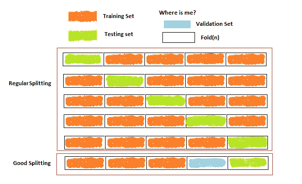

# 使用 Python 的不同数据分割交叉验证策略

> 原文：<https://pub.towardsai.net/different-data-splitting-cross-validation-strategies-with-python-ec7cd93764ac?source=collection_archive---------0----------------------->

## [机器学习](https://towardsai.net/p/category/machine-learning)

## 机器学习中的训练集、验证集和测试集



将数据集拆分为训练集、验证集和测试集。作者的照片

在本文中，我们将介绍均匀分割数据集的交叉验证方法，以获得良好的预测性能。

我们看到我们的数据如何在我们的机器学习算法中分裂成训练集和测试集。但是，如果你曾经试图认为这两套足以建立生产模型。在我看来，我们应该在预测测试集之前包含验证集。这很重要，因为如果模型过度拟合，那么我们可以在验证集检查后调整超参数，并为我们的测试集设置好的参数。

[](/z-statistics-t-statistics-p-statistics-are-still-confusing-you-87557047e20a) [## Z-统计量，T-统计量，P-统计量还在迷惑你？

### 机器学习统计学中的定义和概念

pub.towardsai.net](/z-statistics-t-statistics-p-statistics-are-still-confusing-you-87557047e20a) 

Python 的例子:

```
# Splitting the dataset into the Training set and Test set
from sklearn.model_selection import train_test_split
X_train, X_test, y_train, y_test = train_test_split(X, y, test_size = 0.25, random_state = 0)
```

SVM 的例子

```
from sklearn.svm import SVC
classifier = SVC(kernel = 'linear', random_state= 0, C=1)
classifier.fit(X_train, y_train)
```

学习对人生的成长非常重要，至于算法，如果他们在相同的数据上学习和测试，那就是一个错误。

当我们尝试建立模型时，验证集的作用就出现了，在评估部分，超参数仍然需要尽可能精确，以获得最佳性能。所以，可以有一个 ***的数据泄露*** 的测试集，这个模型不再是一个好的估计器。这个场景的解决方案是在验证集上评估 fit 模型，然后在测试集上进行最终评估。

有三个集合会出现一个问题，即我们的训练数据变得更少，对于我们的模型来说不是一个好的选择。因此，交叉验证出现在图片中，我们不需要单独的验证集。在交叉验证中，训练集被分成小的 ***k 个折叠*** ，训练将发生在 k-1 个折叠上，剩余的用于评估。

从循环中测量平均性能，然后在测试中进行最终评估。

虽然，它需要更多的时间，但非常有用，因为所有的训练数据都用于训练和第一阶段的评估。

使用***cross _ val _ score***测量不同交叉验证分数的示例

```
from sklearn.model_selection import cross_val_score
clf = svm.SVC(kernel='linear', C=1)
scores = cross_val_score(clf, X, y, cv=5)
scores
array([0.94, 0.98, 0.96, 0.98, 1\. ])
```

我们也可以得到分数的平均值

```
scores.mean()#output:
0.97
```

下面是另一个分数计算，通过***shuffles split***方法将数据分为训练集和测试集。

```
import numpy as np
from sklearn.model_selection import ShuffleSplit
X = np.array([[2, 5], [3, 4], [4, 5], [8, 4], [2, 6], [6, 7]])
y = np.array([2, 1, 2, 1, 2, 1])
rs = ShuffleSplit(n_splits=5, test_size=.25, random_state=0)print(rs.get_n_splits(X))
```

这个 rs 变量可以给 ***cross_val_score。***

```
cross_val_score(clf, X, y, cv=rs)
array([0.944, 0.966, 1., 0.977, 1.])
```

不同的交叉验证迭代器如下所示:

*   **K 倍**
*   **重复 K 倍**
*   **漏掉一个(LOO)**
*   **省去 P(LPO)**
*   **分层的 K 形褶皱**

[](/reading-different-data-inputs-in-machine-learning-with-python-ddae1d73c157) [## 使用 Python 读取机器学习中的不同数据输入

### 用 python 读取输入的有用方法

pub.towardsai.net](/reading-different-data-inputs-in-machine-learning-with-python-ddae1d73c157) 

## k 倍

这是一个非常简单的过程，将样本分成 k 个样本。训练在 k-1 个样本上进行，左边的样本用于测试集。

Python 的例子:

```
from sklearn.model_selection import KFoldX = [2,4,6,3]
kf = KFold(n_splits=4)
for train, test in kf.split(X):
    print("%s %s" % (train, test))#output:
[1 2 3] [0]
[0 2 3] [1]
[0 1 3] [2]
[0 1 2] [3]
```

上面的输出显示第 0 个元素用于测试，其余用于训练集。类似地，迭代发生 4 次，并且训练在所有元素上均匀地发生。注意 n_splits 的数量不应该大于 x 中的元素总数。

## 重复 K 倍

该过程用于重复 k-fold n 次，即，在上述示例中，输出显示 4 次迭代，而在该过程中，k-fold 在这 4 次迭代之后再次重复。

Python 的例子:

```
from sklearn.model_selection import RepeatedKFold
X = [2,4,6,3]
rkf = RepeatedKFold(n_splits=2, n_repeats=2)
for train, test in rkf.split(X):
    print("%s %s" % (train, test))#output:
[1 3] [0 2]
[0 2] [1 3]
[0 3] [1 2]
[1 2] [0 3]
```

上面的输出显示，k-fold 的迭代次数是两次，因为 n_splits=2，k-fold 重复了两次，因为 n_repeats=2。

## 漏掉一个(LOO)

这与 k-fold 相同，在 k-fold 中，元素的数量等于拆分的数量。在这个过程中，在每一次迭代中，只有一个测试集在训练集中。不需要指定拆分的数量。

Python 的例子:

```
from sklearn.model_selection import LeaveOneOut
X = [2,4,6,3]
loo = LeaveOneOut()
for train, test in loo.split(X):
    print("%s %s" % (train, test))#output:
[1 2 3] [0]
[0 2 3] [1]
[0 1 3] [2]
[0 1 2] [3]
```

与 k-fold 相比，100 给出了更高方差且在计算上更昂贵。

## 省去 P(LPO)

在这个过程中，分裂发生在训练和测试集中的非重复样本基础上。

Python 中的示例:

```
from sklearn.model_selection import LeavePOut
X = [2,4,6,3]
lpo = LeavePOut(p=2)
for train, test in lpo.split(X):
    print("%s %s" % (train, test))#output:
[2 3] [0 1]
[1 3] [0 2]
[1 2] [0 3]
[0 3] [1 2]
[0 2] [1 3]
[0 1] [2 3]
```

在输出中，训练和测试的组合是不重复的。

## **分层 K 折**

当我们对 k-fold 和 k-fold 进行分层时，分层后的样本在训练集和测试集中保持一致。

Python 的例子:

```
from sklearn.model_selection import StratifiedKFold, KFold
import numpy as np
X, y = np.ones((60, 1)), np.hstack(([0] * 50, [1] * 10))
skf = StratifiedKFold(n_splits=3)
for train, test in skf.split(X, y):
    print('train -  {}   |   test -  {}'.format(np.bincount(y[train]), np.bincount(y[test])))#output:train -  [30  3]   |   test -  [15  2]
train -  [30  3]   |   test -  [15  2]
train -  [30  4]   |   test -  [15  1]
```

箱计数用于计算样本中 1 的数量。

## 结论:

有许多交叉验证技术，各有利弊。本文解释了一些简单易懂的方法，如**分层洗牌拆分、K-fold 分组、留出一个分组、留出 P 个分组、分组洗牌拆分、时间序列拆分。**

[](/custom-statistical-details-of-data-frame-with-python-745d652b363f) [## 用 Python 定制数据框的统计细节

### 数据集中特征的统计分析

pub.towardsai.net](/custom-statistical-details-of-data-frame-with-python-745d652b363f) 

我希望你喜欢这篇文章。通过我的 [LinkedIn](https://www.linkedin.com/in/data-scientist-95040a1ab/) 和 [twitter](https://twitter.com/amitprius) 联系我。

# 推荐文章

[1。NLP —零到英雄与 Python](https://medium.com/towards-artificial-intelligence/nlp-zero-to-hero-with-python-2df6fcebff6e?sk=2231d868766e96b13d1e9d7db6064df1)
2。 [Python 数据结构数据类型和对象](https://medium.com/towards-artificial-intelligence/python-data-structures-data-types-and-objects-244d0a86c3cf?sk=42f4b462499f3fc3a160b21e2c94dba6)3 .[数据预处理概念同 Python](/data-preprocessing-concepts-with-python-b93c63f14bb6?source=friends_link&sk=5cc4ac66c6c02a6f02077fd43df9681a)
4。[用 Python 进行主成分分析降维](/principal-component-analysis-in-dimensionality-reduction-with-python-1a613006d531?source=friends_link&sk=3ed0671fdc04ba395dd36478bcea8a55)
5。[用 Python 全面讲解 K-means 聚类](https://medium.com/towards-artificial-intelligence/fully-explained-k-means-clustering-with-python-e7caa573176a?source=friends_link&sk=9c5c613ceb10f2d203712634f3b6fb28)
6。[用 Python](https://medium.com/towards-artificial-intelligence/fully-explained-linear-regression-with-python-fe2b313f32f3?source=friends_link&sk=53c91a2a51347ec2d93f8222c0e06402)
7 全面讲解了线性回归。[用 Python](https://medium.com/towards-artificial-intelligence/fully-explained-logistic-regression-with-python-f4a16413ddcd?source=friends_link&sk=528181f15a44e48ea38fdd9579241a78)
充分解释了 Logistic 回归 8。[用 Python 中的 Keras 一步一步的基本了解神经网络](/step-by-step-basic-understanding-of-neural-networks-with-keras-in-python-94f4afd026e5?source=friends_link&sk=5530f9bb5374adde2a9e1a83272a9364)
9。[与 Python 的数据角力—第一部分](/data-wrangling-with-python-part-1-969e3cc81d69?source=friends_link&sk=9c3649cf20f31a5c9ead51c50c89ba0b)
10。[机器学习中的混淆矩阵](https://medium.com/analytics-vidhya/confusion-matrix-in-machine-learning-91b6e2b3f9af?source=friends_link&sk=11c6531da0bab7b504d518d02746d4cc)